<div align="center">

# Trading

**Trading 产品目录与实测评估：看实际界面、比较使用结果，再选择值得深入测试的产品。**

[](snapshot.yaml)
[](https://github.com/zinan92/park-operating-system)

</div>

<!-- EVALUATION:START -->
## Full Trading System / Agent · 首轮评测

**首轮试用，非完整功能认证。** 评分为人工的“完整交易产品适配＋本轮已验证可用性”分，不是盈利能力、生产成熟度或 repo-evals 通用分。试用配置与深度不完全一致；未测不等于不支持，几分差距不代表显著优劣。所有产品本轮订单/持仓闭环均未实测通过，该项统一 **0/15**。框架、模型、技能库保留在原样本中；其低分可能源于完整系统定位不匹配，不等于该工具不可用。

采集：2026-09-26 · 14 个产品 · 只覆盖本分组。

[统一评测页与完整图库](evaluations/full-trading-system/2026-09-26/README.md) · [评分依据](evaluations/full-trading-system/2026-09-26/methodology.md)

| 排名 | 产品 · 原仓库 | 分数 | 实际定位 | 本轮结论 | 评测与全部截图 |
|---:|---|---:|---|---|---|
| 1 | [tick-stock-panel](https://github.com/shy3130/tick-stock-panel) | **77/100** | A 股量化工作台 / 完整本地模拟交易系统候选 | 本轮核心任务证据最充分 | [判断与证据](evaluations/full-trading-system/2026-09-26/07-tick-stock-panel/README.md) · [图库](evaluations/full-trading-system/2026-09-26/07-tick-stock-panel/screenshots.md) |
| 2 | [QuantDinger](https://github.com/OpenByteInc/QuantDinger) | **68/100** | 多市场完整交易产品候选 | 策略可创建，回测执行未验 | [判断与证据](evaluations/full-trading-system/2026-09-26/13-quantdinger/README.md) · [图库](evaluations/full-trading-system/2026-09-26/13-quantdinger/screenshots.md) |
| 3 | [Vibe-Trading](https://github.com/HKUDS/Vibe-Trading) | **63/100** | 多市场完整交易 Agent 候选 | 结构完整，核心闭环未验 | [判断与证据](evaluations/full-trading-system/2026-09-26/11-vibe-trading/README.md) · [图库](evaluations/full-trading-system/2026-09-26/11-vibe-trading/screenshots.md) |
| 4 | [go-stock](https://github.com/ArvinLovegood/go-stock) | **61/100** | 桌面股票研究工具 | 核心研究功能可用 | [判断与证据](evaluations/full-trading-system/2026-09-26/01-go-stock/README.md) · [图库](evaluations/full-trading-system/2026-09-26/01-go-stock/screenshots.md) |
| 5 | [KHunter](https://github.com/ling-0729/KHunter) | **57/100** | A 股完整交易系统候选（PTrade） | 真实数据可用，交易闭环未验 | [判断与证据](evaluations/full-trading-system/2026-09-26/04-khunter/README.md) · [图库](evaluations/full-trading-system/2026-09-26/04-khunter/screenshots.md) |
| 6 | [Sequoia-X](https://github.com/sngyai/Sequoia-X) | **54/100** | CLI 选股引擎 / Trading Strategy | 选股任务可用 | [判断与证据](evaluations/full-trading-system/2026-09-26/06-sequoia-x/README.md) · [图库](evaluations/full-trading-system/2026-09-26/06-sequoia-x/screenshots.md) |
| 7 | [TradeGenuis-Options](https://github.com/Theclues/TradeGenuis-Options) | **52/100** | 期权研究工作台 | 部分可用 | [判断与证据](evaluations/full-trading-system/2026-09-26/05-tradegenuis-options/README.md) · [图库](evaluations/full-trading-system/2026-09-26/05-tradegenuis-options/screenshots.md) |
| 8 | [Vibe-Research](https://github.com/simonlin1212/Vibe-Research) | **48/100** | 个人投研 Agent / Equity Research | 界面可用，AI 主路径未验 | [判断与证据](evaluations/full-trading-system/2026-09-26/10-vibe-research/README.md) · [图库](evaluations/full-trading-system/2026-09-26/10-vibe-research/screenshots.md) |
| 9 | [daily_stock_analysis](https://github.com/ZhuLinsen/daily_stock_analysis) | **46/100** | 研究报告与自动推送 / Equity Research | 部分可用 | [判断与证据](evaluations/full-trading-system/2026-09-26/12-daily-stock-analysis/README.md) · [图库](evaluations/full-trading-system/2026-09-26/12-daily-stock-analysis/screenshots.md) |
| 10 | [finance-quant-skills](https://github.com/lzwme/finance-quant-skills) | **37/100** | Knowledge & Collections / Agent Skills | 两项技能已验，其余未验 | [判断与证据](evaluations/full-trading-system/2026-09-26/08-finance-quant-skills/README.md) · [图库](evaluations/full-trading-system/2026-09-26/08-finance-quant-skills/screenshots.md) |
| 11 | [Kronos](https://github.com/shiyu-coder/Kronos) | **36/100** | 金融预测模型 / Trading Strategy 组件 | 模型可跑，日期显示有问题 | [判断与证据](evaluations/full-trading-system/2026-09-26/09-kronos/README.md) · [图库](evaluations/full-trading-system/2026-09-26/09-kronos/screenshots.md) |
| 12 | [TradingAgents](https://github.com/TauricResearch/TradingAgents) | **34/100** | CLI 研究决策 Agent 框架 | 组件可用，完整分析未完成 | [判断与证据](evaluations/full-trading-system/2026-09-26/14-tradingagents/README.md) · [图库](evaluations/full-trading-system/2026-09-26/14-tradingagents/screenshots.md) |
| 13 | [finhack](https://github.com/FinHackCN/finhack) | **30/100** | 量化开发框架 / Trading Infra | 本机关键命令失败 | [判断与证据](evaluations/full-trading-system/2026-09-26/02-finhack/README.md) · [图库](evaluations/full-trading-system/2026-09-26/02-finhack/screenshots.md) |
| 14 | [fomomo](https://github.com/nishuzumi/fomomo) | **23/100** | 群消息代币监测 / 原生范围待核实 | 仅模拟适配页体验 | [判断与证据](evaluations/full-trading-system/2026-09-26/03-fomomo/README.md) · [图库](evaluations/full-trading-system/2026-09-26/03-fomomo/screenshots.md) |

### 每个产品大概长什么样

**1. [tick-stock-panel](evaluations/full-trading-system/2026-09-26/07-tick-stock-panel/README.md) · 77/100** — 本轮首选。数据、选股和回测产出最充分；源码还有模拟订单/撮合/台账，但尚未实测模拟成交。

[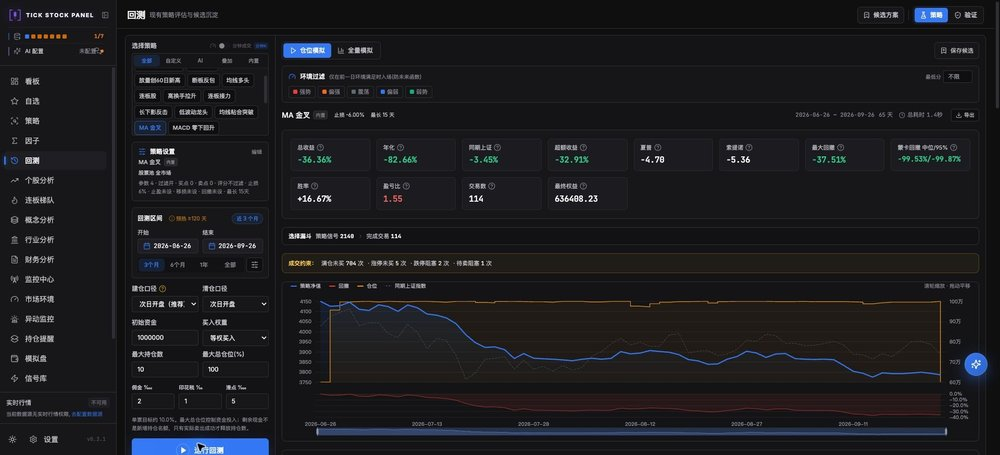](evaluations/full-trading-system/2026-09-26/07-tick-stock-panel/screenshots.md)

**2. [QuantDinger](evaluations/full-trading-system/2026-09-26/13-quantdinger/README.md) · 68/100** — 产品化界面完整，策略代码验证和保存通过；短区间回测受日期选择问题阻挡。

[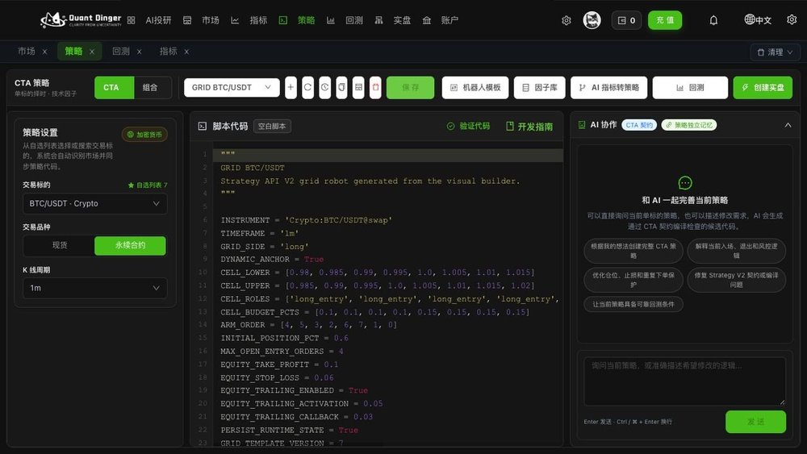](evaluations/full-trading-system/2026-09-26/13-quantdinger/screenshots.md)

**3. [Vibe-Trading](evaluations/full-trading-system/2026-09-26/11-vibe-trading/README.md) · 63/100** — 研究、回测和券商连接覆盖广；本轮缺模型与券商配置，不能把连接器数量当已可用账户。

[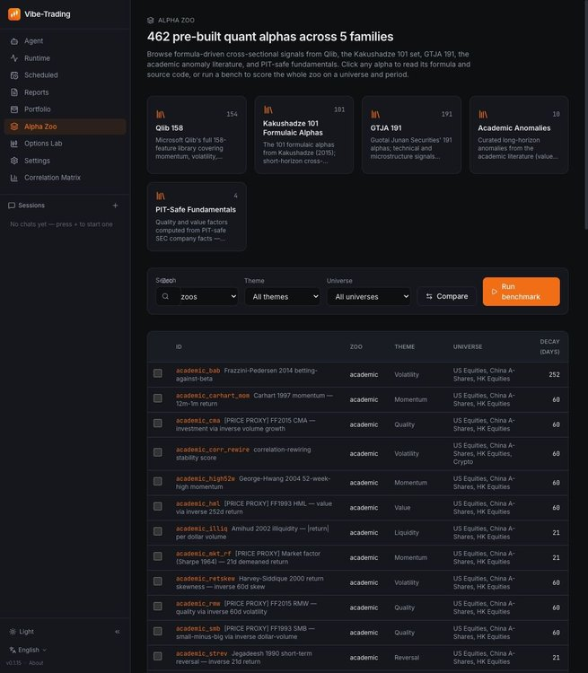](evaluations/full-trading-system/2026-09-26/11-vibe-trading/screenshots.md)

**4. [go-stock](evaluations/full-trading-system/2026-09-26/01-go-stock/README.md) · 61/100** — 桌面成品体验成熟；自选股与日 K 可用，AI Agent 有会员门槛。

[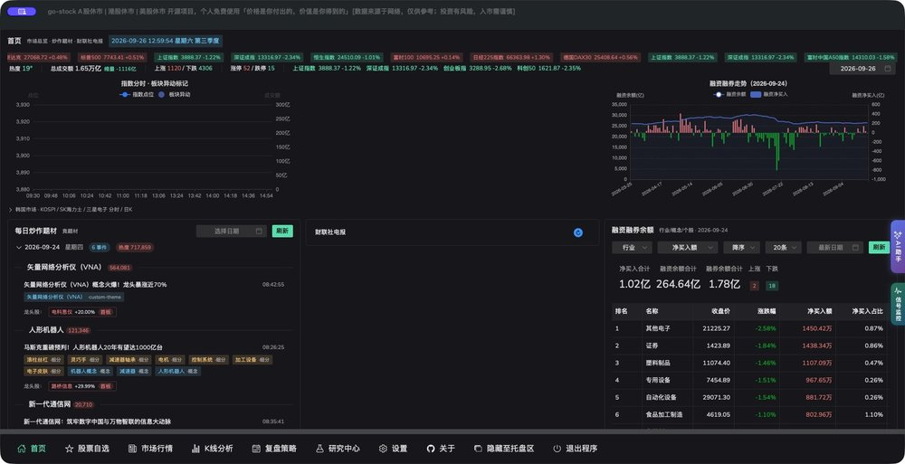](evaluations/full-trading-system/2026-09-26/01-go-stock/screenshots.md)

**5. [KHunter](evaluations/full-trading-system/2026-09-26/04-khunter/README.md) · 57/100** — 有原生 Web、策略、回测和 PTrade 下单/反馈代码；本轮样本较小。

[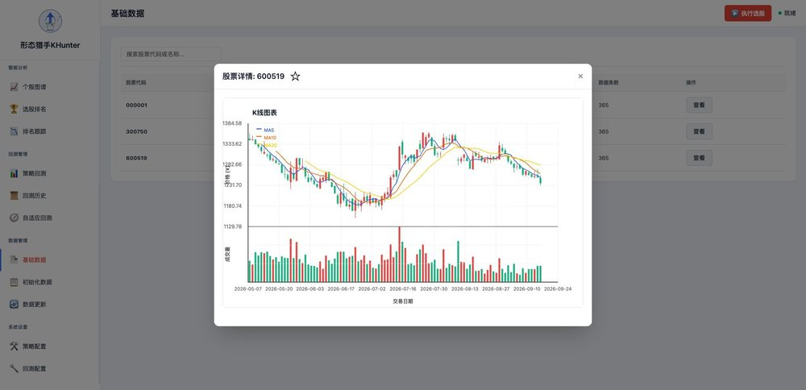](evaluations/full-trading-system/2026-09-26/04-khunter/screenshots.md)

**6. [Sequoia-X](evaluations/full-trading-system/2026-09-26/06-sequoia-x/README.md) · 54/100** — 窄任务结果明确：真实数据与 6 个策略跑通；没有原生 Web UI。

[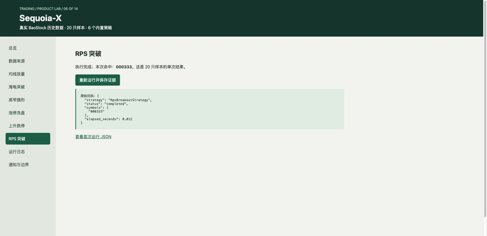](evaluations/full-trading-system/2026-09-26/06-sequoia-x/screenshots.md)

**7. [TradeGenuis-Options](evaluations/full-trading-system/2026-09-26/05-tradegenuis-options/README.md) · 52/100** — 原生 Electron 可浏览研究素材与机会，AI 与知识检索效果尚未验证。

[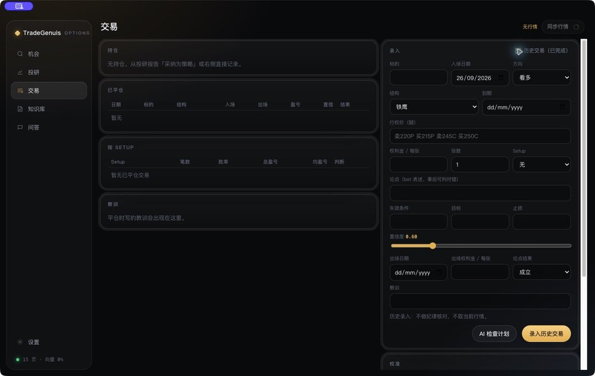](evaluations/full-trading-system/2026-09-26/05-tradegenuis-options/screenshots.md)

**8. [Vibe-Research](evaluations/full-trading-system/2026-09-26/10-vibe-research/README.md) · 48/100** — 研究台页面覆盖广；本轮主要证明界面能运行。

[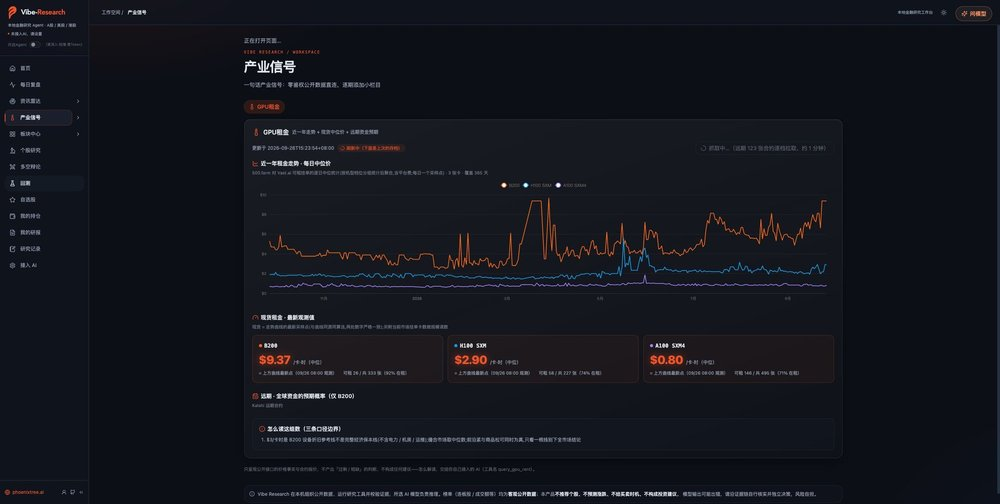](evaluations/full-trading-system/2026-09-26/10-vibe-research/screenshots.md)

**9. [daily_stock_analysis](evaluations/full-trading-system/2026-09-26/12-daily-stock-analysis/README.md) · 46/100** — 数据降级路径有真实结果；核心 AI 报告与推送尚未验证。

[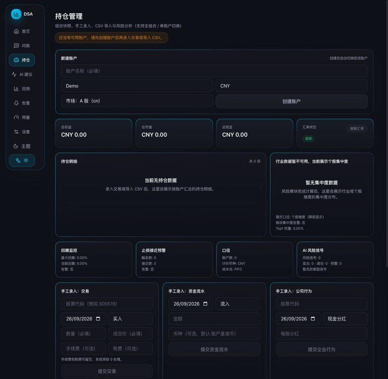](evaluations/full-trading-system/2026-09-26/12-daily-stock-analysis/screenshots.md)

**10. [finance-quant-skills](evaluations/full-trading-system/2026-09-26/08-finance-quant-skills/README.md) · 37/100** — 这是技能集合；低完整系统适配分不表示技能本身不好。

[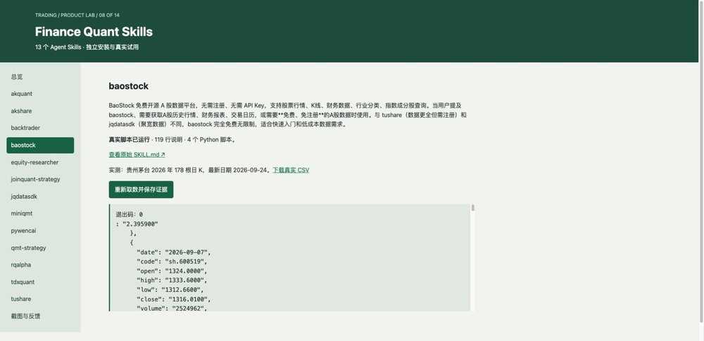](evaluations/full-trading-system/2026-09-26/08-finance-quant-skills/screenshots.md)

**11. [Kronos](evaluations/full-trading-system/2026-09-26/09-kronos/README.md) · 36/100** — 模型推理有结果；它的任务是预测，不是替用户管理订单和账户。

[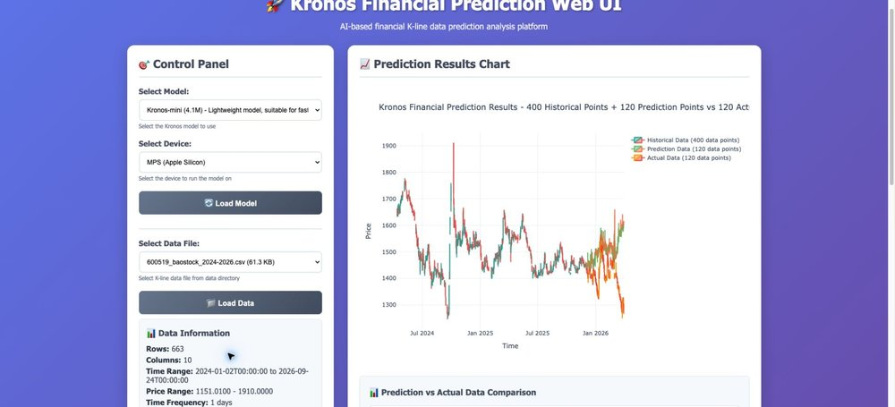](evaluations/full-trading-system/2026-09-26/09-kronos/screenshots.md)

**12. [TradingAgents](evaluations/full-trading-system/2026-09-26/14-tradingagents/README.md) · 34/100** — CLI 和研究图构建通过；本轮未取得最终评级，也没有原生 Web UI。

[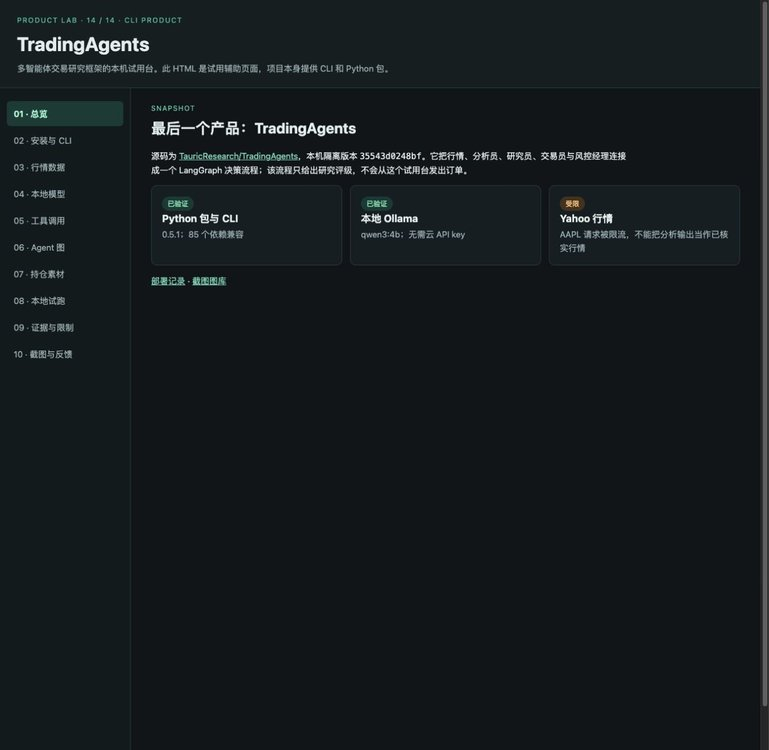](evaluations/full-trading-system/2026-09-26/14-tradingagents/screenshots.md)

**13. [finhack](evaluations/full-trading-system/2026-09-26/02-finhack/README.md) · 30/100** — 覆盖数据、因子、策略与交易接入的框架；本轮未得到回测结果。

[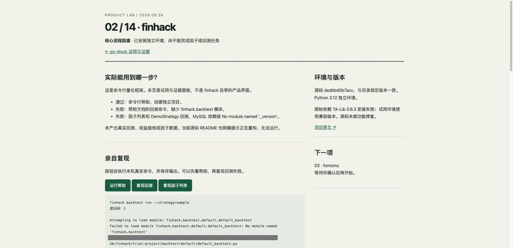](evaluations/full-trading-system/2026-09-26/02-finhack/screenshots.md)

**14. [fomomo](evaluations/full-trading-system/2026-09-26/03-fomomo/README.md) · 23/100** — 本轮看到的是明确标注的模拟群消息与价格适配页，不能据此确认原生产品成熟度。

[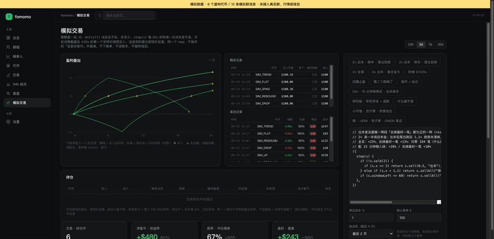](evaluations/full-trading-system/2026-09-26/03-fomomo/screenshots.md)

<!-- EVALUATION:END -->

<!-- EVALUATION:DATA:START -->
## Data · 首轮实测排名

**首轮试用，不是完整功能认证。** 分数衡量这次实际取得的核心结果、数据质量、覆盖、上手与运行表现，不是盈利评级，也不等于生产环境或商业许可验收。不同角色的元数据库、行情 SDK、新闻管线不可仅凭几分之差互换；无 Key、周末、空隔离库造成的未验证能力单独说明。目录原分类和锁定版本保持不变。

**怎么选：** FinanceDatabase 适合查证券代码与分类，不提供价格；AKShare 的已验证历史接口覆盖最广，但必须逐个检查来源时戳；watchlist 是高可靠的静态研究名单；Datafeed 更适合需要标准化多市场 OHLCV 与来源标记的程序。这四项排名靠前的原因不同。`trump-code` 的主要用途是事件信号研究，建议在后续目录整理时移往 Trading Strategy／Event Signals。

采集：2026-09-27 · 14 个项目 · 297 张截图。[统一评测页](evaluations/data/2026-09-27/README.md) · [评分口径](evaluations/data/2026-09-27/methodology.md)。

| 排名 | 产品／原仓库 | 分数 | 本轮实际定位 | 实测结论 | 证据 |
|---:|---|---:|---|---|---|
| 1 | [FinanceDatabase](https://github.com/JerBouma/FinanceDatabase) | **87/100** | 多市场静态证券标识与分类元数据库 | 元数据核心任务最扎实；没有市场价格 | [判断](evaluations/data/2026-09-27/07-financedatabase/README.md) · [截图](evaluations/data/2026-09-27/07-financedatabase/screenshots.md) |
| 2 | [akshare](https://github.com/akfamily/akshare) | **83/100** | A／美股、基金、债券、期货、宏观与新闻 Python 数据接口库 | 广覆盖历史数据强；实时接口须逐个验时效 | [判断](evaluations/data/2026-09-27/14-akshare/README.md) · [截图](evaluations/data/2026-09-27/14-akshare/screenshots.md) |
| 3 | [watchlist](https://github.com/zinan92/watchlist) | **81/100** | 资产、赛道和研究对象的静态 reference registry | 静态名单与引用校验通过；不提供行情 | [判断](evaluations/data/2026-09-27/04-watchlist/README.md) · [截图](evaluations/data/2026-09-27/04-watchlist/screenshots.md) |
| 4 | [datafeed](https://github.com/zinan92/datafeed) | **80/100** | A／美股、加密、商品与美债的标准化 OHLCV API | 多市场 K 线可用；矩阵采集和授权尚未就绪 | [判断](evaluations/data/2026-09-27/10-datafeed/README.md) · [截图](evaluations/data/2026-09-27/10-datafeed/screenshots.md) |
| 5 | [tickflow](https://github.com/tickflow-org/tickflow) | **79/100** | A股／美股／港股历史行情 SDK | 免费历史查询可用；分钟和实时受权限限制 | [判断](evaluations/data/2026-09-27/01-tickflow/README.md) · [截图](evaluations/data/2026-09-27/01-tickflow/screenshots.md) |
| 6 | [tradingview-mcp](https://github.com/atilaahmettaner/tradingview-mcp) | **75/100** | 多市场研究、筛选与技术分析 MCP | 23 个场景有结果，部分源与需 Key 工具失败 | [判断](evaluations/data/2026-09-27/03-tradingview-mcp/README.md) · [截图](evaluations/data/2026-09-27/03-tradingview-mcp/screenshots.md) |
| 7 | [a-stock-data](https://github.com/simonlin1212/a-stock-data) | **70/100** | A 股行情、财务与研究代码 Skill | 腾讯／新浪主路径可用；百度均线 K 返回空 | [判断](evaluations/data/2026-09-27/09-a-stock-data/README.md) · [截图](evaluations/data/2026-09-27/09-a-stock-data/screenshots.md) |
| 8 | [global-stock-data](https://github.com/simonlin1212/global-stock-data) | **67/100** | 美股／港股研究数据与技术指标 Agent Skill | 官方宏观与本地指标可用；期权主卖点未实测 | [判断](evaluations/data/2026-09-27/08-global-stock-data/README.md) · [截图](evaluations/data/2026-09-27/08-global-stock-data/screenshots.md) |
| 9 | [FinanceMCP](https://github.com/guangxiangdebizi/FinanceMCP) | **63/100** | AI Agent 金融数据 MCP 路由 | 加密 K 线与公开新闻可用；A／美股需授权 | [判断](evaluations/data/2026-09-27/02-financemcp/README.md) · [截图](evaluations/data/2026-09-27/02-financemcp/screenshots.md) |
| 10 | [adata](https://github.com/1nchaos/adata) | **58/100** | A 股历史 K 线与盘口多源 Python SDK | 部分 K 线可取；重复调用与实时解析不稳定 | [判断](evaluations/data/2026-09-27/06-adata/README.md) · [截图](evaluations/data/2026-09-27/06-adata/screenshots.md) |
| 11 | [intel](https://github.com/zinan92/intel) | **54/100** | 跨来源新闻采集、搜索和事件研究平台 | 采集与搜索可用；跨源确认尚无通过样本 | [判断](evaluations/data/2026-09-27/12-intel/README.md) · [截图](evaluations/data/2026-09-27/12-intel/screenshots.md) |
| 12 | [quant-data-pipeline](https://github.com/zinan92/quant-data-pipeline) | **52/100** | 多资产行情看板＋感知信号＋本地模拟交易 | 商品／加密与纸盘可用；A 股和稳定性缺口大 | [判断](evaluations/data/2026-09-27/13-quant-data-pipeline/README.md) · [截图](evaluations/data/2026-09-27/13-quant-data-pipeline/screenshots.md) |
| 13 | [Financial-API](https://github.com/HiThink-Tech/Financial-API) | **49/100** | 需授权的官方 A 股数据 API 与本地 CLI | 本地契约可用；在线行情未获授权验证 | [判断](evaluations/data/2026-09-27/05-financial-api/README.md) · [截图](evaluations/data/2026-09-27/05-financial-api/screenshots.md) |
| 14 | [trump-code](https://github.com/sstklen/trump-code) | **42/100** | 政治发言驱动的美股事件信号研究 | 历史命中率可复算；最新帖链路断裂 | [判断](evaluations/data/2026-09-27/11-trump-code/README.md) · [截图](evaluations/data/2026-09-27/11-trump-code/screenshots.md) |

### 每项代表画面

**[FinanceDatabase](evaluations/data/2026-09-27/07-financedatabase/README.md) · 87/100** — 元数据核心任务最扎实；没有市场价格

[](evaluations/data/2026-09-27/07-financedatabase/screenshots.md)

**[akshare](evaluations/data/2026-09-27/14-akshare/README.md) · 83/100** — 广覆盖历史数据强；实时接口须逐个验时效

[](evaluations/data/2026-09-27/14-akshare/screenshots.md)

**[watchlist](evaluations/data/2026-09-27/04-watchlist/README.md) · 81/100** — 静态名单与引用校验通过；不提供行情

[](evaluations/data/2026-09-27/04-watchlist/screenshots.md)

**[datafeed](evaluations/data/2026-09-27/10-datafeed/README.md) · 80/100** — 多市场 K 线可用；矩阵采集和授权尚未就绪

[](evaluations/data/2026-09-27/10-datafeed/screenshots.md)

**[tickflow](evaluations/data/2026-09-27/01-tickflow/README.md) · 79/100** — 免费历史查询可用；分钟和实时受权限限制

[](evaluations/data/2026-09-27/01-tickflow/screenshots.md)

**[tradingview-mcp](evaluations/data/2026-09-27/03-tradingview-mcp/README.md) · 75/100** — 23 个场景有结果，部分源与需 Key 工具失败

[](evaluations/data/2026-09-27/03-tradingview-mcp/screenshots.md)

**[a-stock-data](evaluations/data/2026-09-27/09-a-stock-data/README.md) · 70/100** — 腾讯／新浪主路径可用；百度均线 K 返回空

[](evaluations/data/2026-09-27/09-a-stock-data/screenshots.md)

**[global-stock-data](evaluations/data/2026-09-27/08-global-stock-data/README.md) · 67/100** — 官方宏观与本地指标可用；期权主卖点未实测

[](evaluations/data/2026-09-27/08-global-stock-data/screenshots.md)

**[FinanceMCP](evaluations/data/2026-09-27/02-financemcp/README.md) · 63/100** — 加密 K 线与公开新闻可用；A／美股需授权

[](evaluations/data/2026-09-27/02-financemcp/screenshots.md)

**[adata](evaluations/data/2026-09-27/06-adata/README.md) · 58/100** — 部分 K 线可取；重复调用与实时解析不稳定

[](evaluations/data/2026-09-27/06-adata/screenshots.md)

**[intel](evaluations/data/2026-09-27/12-intel/README.md) · 54/100** — 采集与搜索可用；跨源确认尚无通过样本

[](evaluations/data/2026-09-27/12-intel/screenshots.md)

**[quant-data-pipeline](evaluations/data/2026-09-27/13-quant-data-pipeline/README.md) · 52/100** — 商品／加密与纸盘可用；A 股和稳定性缺口大

[](evaluations/data/2026-09-27/13-quant-data-pipeline/screenshots.md)

**[Financial-API](evaluations/data/2026-09-27/05-financial-api/README.md) · 49/100** — 本地契约可用；在线行情未获授权验证

[](evaluations/data/2026-09-27/05-financial-api/screenshots.md)

**[trump-code](evaluations/data/2026-09-27/11-trump-code/README.md) · 42/100** — 历史命中率可复算；最新帖链路断裂

[](evaluations/data/2026-09-27/11-trump-code/screenshots.md)

<!-- EVALUATION:DATA:END -->


---

```text
in  canonical Park OS snapshot + source provenance + fixed commit locks
out 66-repo Trading catalog, grouped by function and ordered newest-added first

fail snapshot checksum mismatch → stop before publishing
fail missing created_at / starred_at → stop; do not guess ordering
fail unclassified placement → keep needs_review; do not guess
```

Snapshot: `github-universe-2026-09-27-trading-consolidation-01` · canonical source: [Park OS](https://github.com/zinan92/park-operating-system)

## How to read this page

- **Category first** — repos stay in the established functional taxonomy.
- **Newest first** — inside each category, later additions appear first.
- **Added** — Park-owned repos use GitHub `created_at`; external repos use Park's `starred_at`.
- **Lock** — external sources are pinned to commit SHAs, not live branches.

## Browse by function

### Data (14)

| Repo | Capability / description | Source | Added | Lock / flags |
|---|---|---|---|---|
| [tickflow-org/tickflow](https://github.com/tickflow-org/tickflow) · [首轮评测](evaluations/data/2026-09-27/01-tickflow/README.md) | Professional financial data API for China A-shares, US & HK stocks. Python SDK with real-time quotes, K-line data & financial reports. | Starred | `2026-09-18` | `c27f23c50386` |
| [guangxiangdebizi/FinanceMCP](https://github.com/guangxiangdebizi/FinanceMCP) · [首轮评测](evaluations/data/2026-09-27/02-financemcp/README.md) | 这是一个金融领域相关的mcp,本项目通过集成 Tushare API 和 Binance API 为语言模型（如Claude）提供全面的实时金融数据访问能力，支持股票、基金、债券、宏观经济指标、稳定币、虚拟货币等多维度金融数据分析。其中也包含了金融数据查询、财经新闻查询、国家统计局数据查询等 | Starred | `2026-09-13` | `784c6176647a` |
| [atilaahmettaner/tradingview-mcp](https://github.com/atilaahmettaner/tradingview-mcp) · [首轮评测](evaluations/data/2026-09-27/03-tradingview-mcp/README.md) | TradingView MCP server — real-time market data, technical analysis, screeners & backtesting for Claude, ChatGPT, Cursor & any MCP client. Stocks, crypto, forex & futures across global exchanges. Hosted or self-host. | Starred | `2026-09-12` | `a1e54b07e5c2` |
| [zinan92/watchlist](https://github.com/zinan92/watchlist) · [首轮评测](evaluations/data/2026-09-27/04-watchlist/README.md) | Park Exposure Registry — 行情与新闻共用的唯一权威名单：6 条宏观主线 / 24 个中观赛道 / 109 个 target | Owned | `2026-09-03` | `owned source` |
| [HiThink-Tech/Financial-API](https://github.com/HiThink-Tech/Financial-API) · [首轮评测](evaluations/data/2026-09-27/05-financial-api/README.md) | 同花顺官方 A股金融数据服务，提供股票实时行情、历史行情、财务报表、指数、板块、涨停等数据，适用于 AI Agent、量化研究和应用开发，支持 API、MCP、CLI 和 Python。Official Tonghuashun (HiThink) A-share financial data service providing real-time and historical stock market data, financial statements, indices, sectors and limit-up data for AI agents, quantitative research and application development. | Starred | `2026-08-26` | `402574a6221d` · NEEDS_REVIEW |
| [1nchaos/adata](https://github.com/1nchaos/adata) · [首轮评测](evaluations/data/2026-09-27/06-adata/README.md) | 免费开源A股量化交易数据库； 专注A股，专注量化，向阳而生； 开放、纯净、持续、为Ai(爱)发电。为个人量化交易而生，保卫3000点，珍惜底部机会......【股票数据，股票行情数据，股票量化数据，股票交易数据，k线行情数据，股票概念数据，股票数据接口，行情数据接口，量化交易数据】【多数据源融合，动态设置代理，保障数据高可用性】 | Starred | `2026-07-15` | `b14f4e57b217` |
| [JerBouma/FinanceDatabase](https://github.com/JerBouma/FinanceDatabase) · [首轮评测](evaluations/data/2026-09-27/07-financedatabase/README.md) | This is a database of 300.000+ symbols containing Equities, ETFs, Funds, Indices, Currencies, Cryptocurrencies and Money Markets. | Starred | `2026-07-15` | `a174c97d3bba` |
| [simonlin1212/global-stock-data](https://github.com/simonlin1212/global-stock-data) · [首轮评测](evaluations/data/2026-09-27/08-global-stock-data/README.md) | US stock market data for AI coding assistants — zero-auth, official sources. CBOE options with full Greeks + 0DTE flow, FINRA market-wide short volume, SEC EDGAR filing stream, and a free market-wide screener. 13 layers, 30+ endpoints, 11 sources. Every source labeled with its compliance tier. | Starred | `2026-07-09` | `fbf0ae47d64e` |
| [simonlin1212/a-stock-data](https://github.com/simonlin1212/a-stock-data) · [首轮评测](evaluations/data/2026-09-27/09-a-stock-data/README.md) | A股全栈数据工具包 · 十二层架构 · 60端点 · 22数据源 · 零鉴权 \| Full-stack China A-share data toolkit for AI agents — 12 layers, 60 endpoints, 22 sources, zero-auth | Starred | `2026-07-09` | `2012ce7cd0e7` |
| [zinan92/datafeed](https://github.com/zinan92/datafeed) · [首轮评测](evaluations/data/2026-09-27/10-datafeed/README.md) | 行情数据。in ticker+timeframe → out OHLCV candles。A股/美股/加密/商品 | Owned | `2026-03-29` | `owned source` |
| [sstklen/trump-code](https://github.com/sstklen/trump-code) · [首轮评测](evaluations/data/2026-09-27/11-trump-code/README.md) | 🔐 AI decoding Trump's posts × stock market \| AI 解碼川普推文 × 美股 \| AIでトランプ投稿×株式市場を解読 — 31.5M models, 61.3% hit rate, open source | Starred | `2026-03-16` | `296b8e14ee88` |
| [zinan92/intel](https://github.com/zinan92/intel) · [首轮评测](evaluations/data/2026-09-27/12-intel/README.md) | 情报采集。in 10+信息源 → out LLM评分+跨源事件聚类 | Owned + Starred | `2026-02-13` | `owned source` |
| [zinan92/quant-data-pipeline](https://github.com/zinan92/quant-data-pipeline) · [首轮评测](evaluations/data/2026-09-27/13-quant-data-pipeline/README.md) | 多市场量化数据平台 — A股/美股/加密/商品，28组API，感知信号引擎，模拟交易 | Owned + Starred | `2026-02-13` | `owned source` |
| [akfamily/akshare](https://github.com/akfamily/akshare) · [首轮评测](evaluations/data/2026-09-27/14-akshare/README.md) | AKShare is an elegant and simple financial data interface library for Python, built for human beings! 开源财经数据接口库 | Starred | `2025-09-08` | `8e95744b79ae` |

### Equity Research (9)

| Repo | Capability / description | Source | Added | Lock / flags |
|---|---|---|---|---|
| [wshobson/maverick-mcp](https://github.com/wshobson/maverick-mcp) | MaverickMCP - Personal Stock Analysis MCP Server | Starred | `2026-09-13` | `fb55c84c9a9c` |
| [wenyuanw/a-share-heatmap](https://github.com/wenyuanw/a-share-heatmap) | 免费开源的 A股热力图｜A股大盘云图，各板块涨跌一眼可见 | Starred | `2026-08-26` | `c15f94e616cf` · NEEDS_REVIEW |
| [star23/Day1Global-Skills](https://github.com/star23/Day1Global-Skills) | Day1Global Skills Share: US Stock, Macro Market, Crypto | Starred | `2026-07-21` | `562c14b0c0bc` |
| [zinan92/equity-research](https://github.com/zinan92/equity-research) | A股长期投委会 + 证据快照深度研报平台(Park 产品层) | Owned | `2026-07-20` | `owned source` |
| [rollingSirius/equity-research-skill](https://github.com/rollingSirius/equity-research-skill) | Possibly the deepest AI equity-research skill: nine-chapter single-stock deep dives and earnings deep-dives, with scripted DCF/EPV/EVA and reproducible valuation. Covers US, HK and A-shares. Docs in EN and ZH. | Starred | `2026-07-18` | `3d94e64ff53b` |
| [wbh604/UZI-Skill](https://github.com/wbh604/UZI-Skill) | 冰冷的钱就这样流进我温暖的口袋-游资（UZI）Skills — 让我们欢迎，股海贼王！66位投资大佬帮你看盘 · 22维数据 × 180条量化规则 × 17种机构分析方法 · A股/港股/美股 | Starred | `2026-07-09` | `650788c54a9b` |
| [muxuuu/serenity-skill](https://github.com/muxuuu/serenity-skill) | Serenity-inspired Agent Skill for supply-chain bottleneck stock research | Starred | `2026-07-09` | `c2fe93deedfd` |
| [virattt/dexter](https://github.com/virattt/dexter) | An autonomous agent for deep financial research | Starred | `2026-05-09` | `ecaed3011f24` |
| [microsoft/qlib](https://github.com/microsoft/qlib) | Qlib is an AI-oriented Quant investment platform that aims to use AI tech to empower Quant Research, from exploring ideas to implementing productions. Qlib supports diverse ML modeling paradigms, including supervised learning, market dynamics modeling, and RL, and is now equipped with https://github.com/microsoft/RD-Agent to automate R&D process. | Starred | `2025-08-11` | `79633dd9506e` |

### Trading Strategy (9)

| Repo | Capability / description | Source | Added | Lock / flags |
|---|---|---|---|---|
| [fmzquant/strategies](https://github.com/fmzquant/strategies) | quantitative trading with Javascript, Python, C++, PineScript, Blockly, MyLanguage(麦语言) | Starred | `2026-09-24` | `7853bb2bf262` |
| [YoungCan-Wang/WyckoffTradingAgent](https://github.com/YoungCan-Wang/WyckoffTradingAgent) | Open-source Wyckoff trading agent and AI stock screener for volume-price analysis, A-share screening, CLI workflows, and MCP tools.灵感来自秋生trader @Hoyooyoo | Starred | `2026-09-18` | `6bdaf1eb3cff` |
| [nhovongoc0-max/meme-radar](https://github.com/nhovongoc0-max/meme-radar) | Meme雷达开源版：本地只读、多链 Meme 候选扫描与人工复核工具 | Starred | `2026-09-13` | `9c41a444b9bc` |
| [Vespa314/chan.py](https://github.com/Vespa314/chan.py) | 开放式的缠论python实现框架，支持形态学/动力学买卖点分析计算，多级别K线联立，区间套策略，可视化绘图，多种数据接入，策略开发，交易系统对接； | Starred | `2026-09-12` | `429d6ed3043e` |
| [neil-pan-s/one-quant-doc](https://github.com/neil-pan-s/one-quant-doc) | 缠中说禅-缠论技术分析 实时自动笔段画线、中枢标识 递归分析整体走势 作为买卖分析参考 | Starred | `2026-09-12` | `7231f5d5353c` |
| [zinan92/trading-strategy](https://github.com/zinan92/trading-strategy) | Archived 2026-09-27. Moved into zinan92/trading-system (packages/trading-strategy) | Owned | `2026-08-24` | `owned source` · ARCHIVED |
| [zinan92/chancode](https://github.com/zinan92/chancode) | No description | Owned | `2026-05-26` | `owned source` · PRIVATE |
| [waditu/czsc](https://github.com/waditu/czsc) | 缠中说禅技术分析工具；缠论；股票；期货；Quant；量化交易 | Starred | `2025-08-11` | `701e480a5450` |
| [TA-Lib/ta-lib-python](https://github.com/TA-Lib/ta-lib-python) | Python wrapper for TA-Lib (http://ta-lib.org/). | Starred | `2024-04-21` | `fd6089b183fc` |

### Trading Infra (6)

| Repo | Capability / description | Source | Added | Lock / flags |
|---|---|---|---|---|
| [zinan92/standard-broker](https://github.com/zinan92/standard-broker) | Archived 2026-09-27. Moved into zinan92/trading-system (packages/standard-broker) | Owned | `2026-08-21` | `owned source` · PRIVATE · ARCHIVED |
| [nautechsystems/nautilus_trader](https://github.com/nautechsystems/nautilus_trader) | Production-grade Rust-native trading engine with deterministic event-driven architecture | Starred | `2026-07-09` | `23cb3035dff7` |
| [zinan92/trading-system](https://github.com/zinan92/trading-system) | Park 交易平台：trade.park-ai-intel.com/trade 背后的全部代码。GridMind 面板 + 交易台 + broker/strategy/kline 包，Testnet/Paper only | Owned | `2026-07-03` | `owned source` |
| [polakowo/vectorbt](https://github.com/polakowo/vectorbt) | The backtesting engine that gives you an unfair advantage. Run thousands of trading ideas before others finish one. | Starred | `2024-04-21` | `34b6d5935e3e` |
| [ccxt/ccxt](https://github.com/ccxt/ccxt) | A unified trading API with more than 100 crypto exchanges and prediction markets in JavaScript / TypeScript / Python / C# / PHP / Go / Java / Rust | Starred | `2024-04-13` | `c781a2437d88` |
| [Drakkar-Software/OctoBot](https://github.com/Drakkar-Software/OctoBot) | Free open source crypto trading bot to automate AI, Grid, DCA and TradingView strategies on Binance, Hyperliquid and 15+ exchanges, with a simple interface. | Starred | `2024-04-13` | `dc0efc8ec36c` |

### Dashboard (7)

| Repo | Capability / description | Source | Added | Lock / flags |
|---|---|---|---|---|
| [Open-Dev-Society/OpenStock](https://github.com/Open-Dev-Society/OpenStock) | OpenStock is an open-source alternative to expensive market platforms. Track real-time prices, set personalized alerts, and explore detailed company insights — built openly, for everyone, forever free. | Starred | `2026-09-24` | `87df76a2ce58` |
| [zinan92/trading-desk](https://github.com/zinan92/trading-desk) | Archived 2026-09-27. Moved into zinan92/trading-system (apps/trading-desk) | Owned | `2026-09-14` | `owned source` · PRIVATE · ARCHIVED |
| [zinan92/human-kline-review](https://github.com/zinan92/human-kline-review) | Park 人工宏观 K 线复盘与 DeepSeek 汇总：HTML-first，Telegram later | Owned | `2026-08-23` | `owned source` · PRIVATE |
| [deepentropy/tvscreener](https://github.com/deepentropy/tvscreener) | TradingView Screener API - Stock, Crypto, Forex, Bond, Futures, Coin | Starred | `2026-08-10` | `737c9764c1e5` |
| [gloom-sh/gloomberb](https://github.com/gloom-sh/gloomberb) | Finance terminal, in your terminal. | Starred | `2026-07-21` | `4dc1d5cd2714` |
| [zinan92/standard-kline](https://github.com/zinan92/standard-kline) | Archived 2026-09-27. Moved into zinan92/trading-system (packages/standard-kline) | Owned | `2026-07-07` | `owned source` · ARCHIVED |
| [Mathieu2301/TradingView-API](https://github.com/Mathieu2301/TradingView-API) | 📈 Get real-time stocks from TradingView | Starred | `2026-07-02` | `5baea86c8c7e` |

### Full Trading System / Agent (14)

| Repo | Capability / description | Source | Added | Lock / flags |
|---|---|---|---|---|
| [ArvinLovegood/go-stock](https://github.com/ArvinLovegood/go-stock) · [首轮评测](evaluations/full-trading-system/2026-09-26/01-go-stock/README.md) | 🦄🦄🦄AI赋能股票分析：AI加持的股票分析/选股工具。股票行情获取，AI热点资讯分析，AI资金/财务分析，涨跌报警推送。支持A股，港股，美股。支持市场整体/个股情绪分析，AI辅助选股等。数据全部保留在本地。支持DeepSeek，OpenAI， Ollama，LMStudio，AnythingLLM，硅基流动，火山方舟，阿里云百炼等平台或模型。 | Starred | `2026-09-24` | `c26304fafab0` |
| [FinHackCN/finhack](https://github.com/FinHackCN/finhack) · [首轮评测](evaluations/full-trading-system/2026-09-26/02-finhack/README.md) | FinHack®，一个易于拓展的量化金融框架，它在当前版本中集成了数据采集、因子计算、因子挖掘、因子分析、机器学习、策略编写、量化回测、实盘接入等全流程的量化投研工作。 | Starred | `2026-09-18` | `dedbbd0b7acc` |
| [nishuzumi/fomomo](https://github.com/nishuzumi/fomomo) · [首轮评测](evaluations/full-trading-system/2026-09-26/03-fomomo/README.md) | No description | Starred | `2026-09-13` | `a2c6040392e3` · NEEDS_REVIEW |
| [ling-0729/KHunter](https://github.com/ling-0729/KHunter) · [首轮评测](evaluations/full-trading-system/2026-09-26/04-khunter/README.md) | KHunter 是一套开箱即用的A股量化交易系统，集数据管理、策略选股、择时交易、风险控制、回测验证于一体，为个人投资者提供从数据到交易的全流程量化解决方案。 | Starred | `2026-09-10` | `ca93f9e05523` |
| [Theclues/TradeGenuis-Options](https://github.com/Theclues/TradeGenuis-Options) · [首轮评测](evaluations/full-trading-system/2026-09-26/05-tradegenuis-options/README.md) | No description | Starred | `2026-09-07` | `a77d13dae84b` |
| [sngyai/Sequoia-X](https://github.com/sngyai/Sequoia-X) · [首轮评测](evaluations/full-trading-system/2026-09-26/06-sequoia-x/README.md) | A股自动选股系统 — 多种技术形态自动扫描，收盘后自动运行并推送飞书 | Starred | `2026-08-26` | `444c0db69ff3` · NEEDS_REVIEW |
| [shy3130/tick-stock-panel](https://github.com/shy3130/tick-stock-panel) · [首轮评测](evaluations/full-trading-system/2026-09-26/07-tick-stock-panel/README.md) | TSP自托管、零运维的 A 股「选股 + 监控 + 回测」量化工作台 \| LLM能力驱使策略定制+个股分析+复盘 \| 自由接入第三方数据源与个性化扩展数据 \| 个人开源 | Starred | `2026-08-26` | `bfbccf9c414f` · NEEDS_REVIEW |
| [lzwme/finance-quant-skills](https://github.com/lzwme/finance-quant-skills) · [首轮评测](evaluations/full-trading-system/2026-09-26/08-finance-quant-skills/README.md) | 一个面向金融量化交易领域的 Agent Skills 技能维护仓库，主要聚焦A股量化交易。 | Starred | `2026-08-26` | `7af066194d8d` |
| [shiyu-coder/Kronos](https://github.com/shiyu-coder/Kronos) · [首轮评测](evaluations/full-trading-system/2026-09-26/09-kronos/README.md) | Kronos: A Foundation Model for the Language of Financial Markets | Starred | `2026-08-03` | `67b630e67f6a` |
| [simonlin1212/Vibe-Research](https://github.com/simonlin1212/Vibe-Research) · [首轮评测](evaluations/full-trading-system/2026-09-26/10-vibe-research/README.md) | Vibe-Research: Your Personal Trading Research Agent · A股/美股/港股 的个人投研 Agent：每日复盘、资讯雷达、个股数据、板块中心、我的持仓、研究记录、回测。Vibe-Research 把数据和功能配齐，由你自己的 Agent 驱动投资研究。基于开源的 Codex Harness 打造。 | Starred | `2026-08-03` | `34ed58155ca2` |
| [HKUDS/Vibe-Trading](https://github.com/HKUDS/Vibe-Trading) · [首轮评测](evaluations/full-trading-system/2026-09-26/11-vibe-trading/README.md) | "Vibe-Trading: Your Personal Trading Agent" | Starred | `2026-07-21` | `e476b4ce4c3b` |
| [ZhuLinsen/daily_stock_analysis](https://github.com/ZhuLinsen/daily_stock_analysis) · [首轮评测](evaluations/full-trading-system/2026-09-26/12-daily-stock-analysis/README.md) | LLM 驱动的多市场股票智能分析系统：多源行情、实时新闻、决策看板与自动推送，支持零成本定时运行。 LLM-powered multi-market stock analysis system with multi-source market data, real-time news, decision dashboard, automated notifications, and cost-free scheduled runs. | Starred | `2026-06-08` | `1168e316269b` |
| [OpenByteInc/QuantDinger](https://github.com/OpenByteInc/QuantDinger) · [首轮评测](evaluations/full-trading-system/2026-09-26/13-quantdinger/README.md) | Open-source AI Trading OS and commercial-ready multi-tenant SaaS platform — research markets, build Python strategies, backtest, paper/live trade, and monitor crypto, stocks, and forex, with built-in user management, billing, payments, and settlement to launch and operate your own trading service. | Starred | `2026-05-01` | `d8508a85a473` |
| [TauricResearch/TradingAgents](https://github.com/TauricResearch/TradingAgents) · [首轮评测](evaluations/full-trading-system/2026-09-26/14-tradingagents/README.md) | TradingAgents: Multi-Agents LLM Financial Trading Framework | Starred | `2026-02-02` | `be952b8eccb4` |

### Knowledge & Collections (7)

| Repo | Capability / description | Source | Added | Lock / flags |
|---|---|---|---|---|
| [stockServ/chzhshch-108-plus](https://github.com/stockServ/chzhshch-108-plus) | 缠中说禅教你炒股票108课加强版 | Starred | `2026-09-10` | `d2a87d5bd9c8` |
| [wangzhe3224/awesome-systematic-trading](https://github.com/wangzhe3224/awesome-systematic-trading) | A curated list of insanely awesome libraries, packages and resources for systematic trading. Crypto, Stock, Futures, Options, CFDs, FX, and more \| 量化交易 \| 量化投资 | Starred | `2026-08-10` | `424df5f4acc9` |
| [bwjoke/BTC-Trading-Since-2020](https://github.com/bwjoke/BTC-Trading-Since-2020) | Public BTC trading context since 2020. | Starred | `2026-07-05` | `9ff0d562cffd` |
| [RKiding/Awesome-finance-skills](https://github.com/RKiding/Awesome-finance-skills) | A collection of Awesome Finance Agent Skills for free and easy to start \| 一系列开源免费的金融分析Agent Skills | Starred | `2026-04-27` | `853f09b4d0ba` |
| [zinan92/copilot](https://github.com/zinan92/copilot) | 方法论路由。in 信号+上下文 → out 44套方法论匹配分析 | Owned + Starred | `2026-03-18` | `owned source` · PRIVATE |
| [LLMQuant/quant-wiki](https://github.com/LLMQuant/quant-wiki) | We are committed to the open-sourcing quantitative knowledge, aiming to bridge the information gap between the domestic and international quantitative finance industries. 我们致力于量化知识的开源与汉化，打破国内外量化金融行业信息差。 | Starred | `2025-08-11` | `f08b94e13425` |
| [wilsonfreitas/awesome-quant](https://github.com/wilsonfreitas/awesome-quant) | A curated list of insanely awesome libraries, packages and resources for Quants (Quantitative Finance) | Starred | `2024-04-12` | `48e48a76b205` |

## Update contract

This README and the generated data are scoped views. Taxonomy, source state, added-time authority and locks remain in Park OS.

```bash
bash scripts/verify-scoped.sh
```

The catalog is not a production-readiness or execution-authorization claim.
