# OpenStock screenshots

17 张文件，17 个唯一 SHA-256。主要画面来自 README 指向的官方公开部署；仓库提交截图用于确认上游身份。Dashboard 和 SPY 详情页的直接访问均重定向至登录，因此账户内功能未被截图或宣称通过。

- 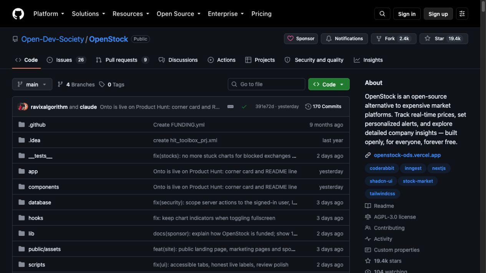 — 00-github-repo.jpg
- 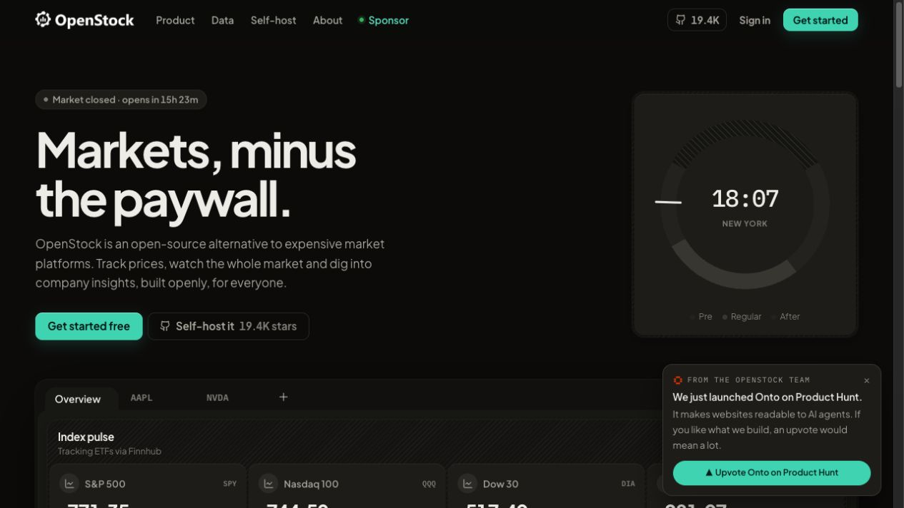 — 01-landing-hero.jpg
- 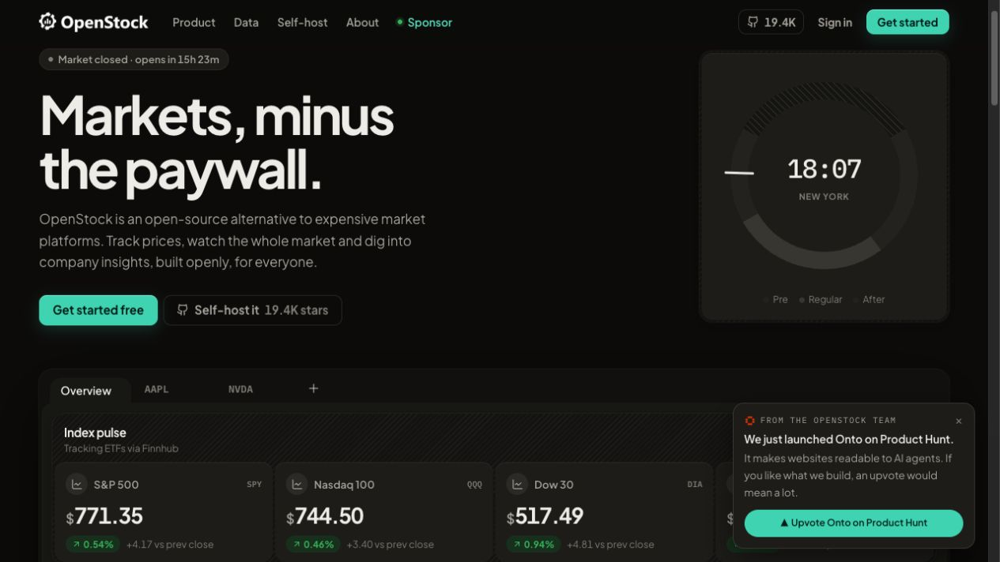 — 02-home-features.jpg
- 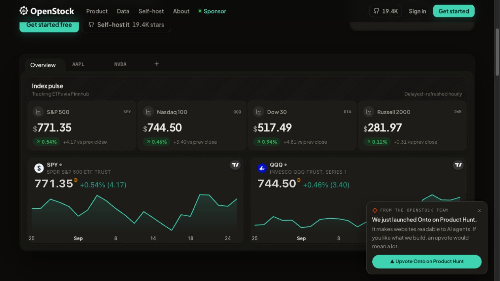 — 03-home-data-tiers.jpg
- 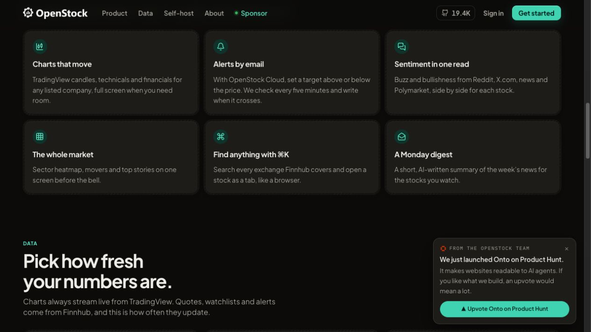 — 04-home-self-host.jpg
- 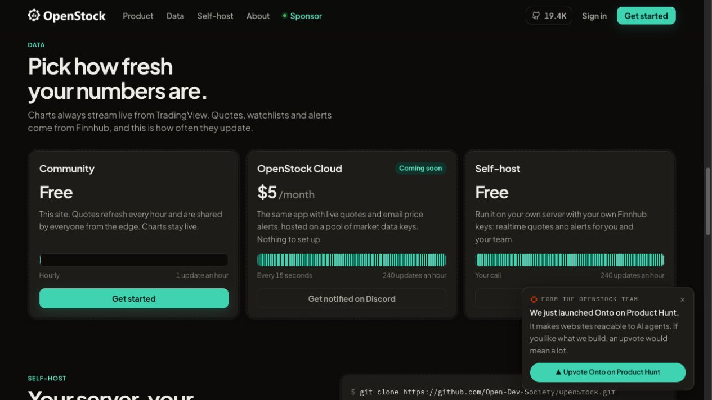 — 05-home-footer.jpg
- 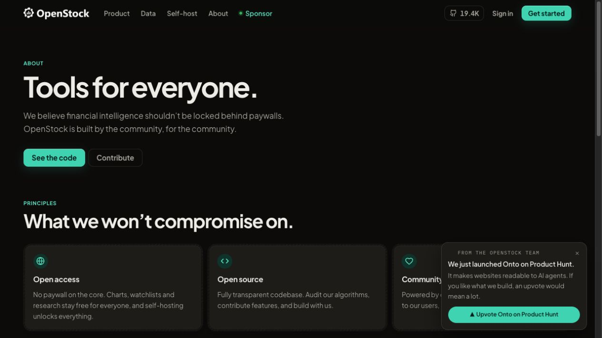 — 06-about.jpg
- 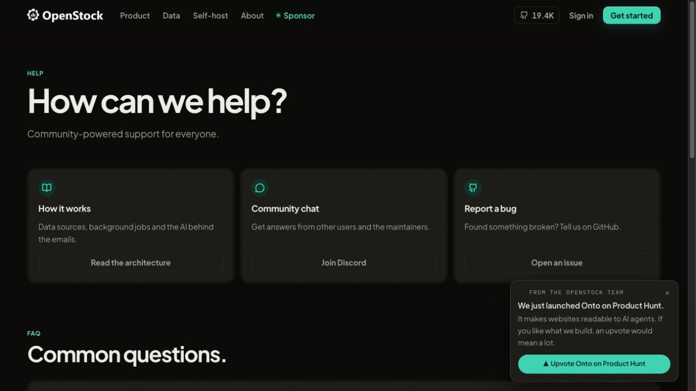 — 07-help.jpg
- 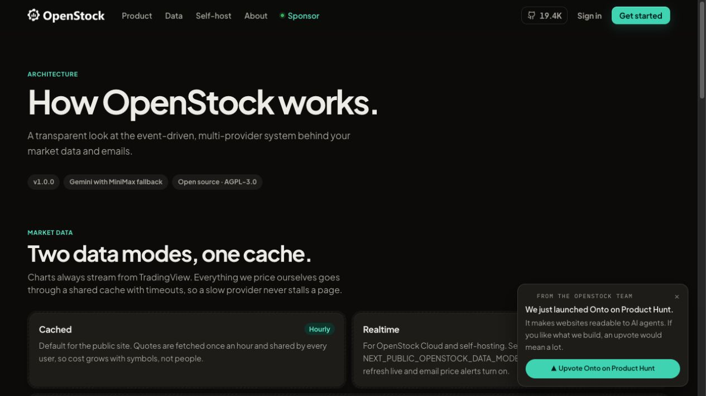 — 08-api-docs.jpg
- 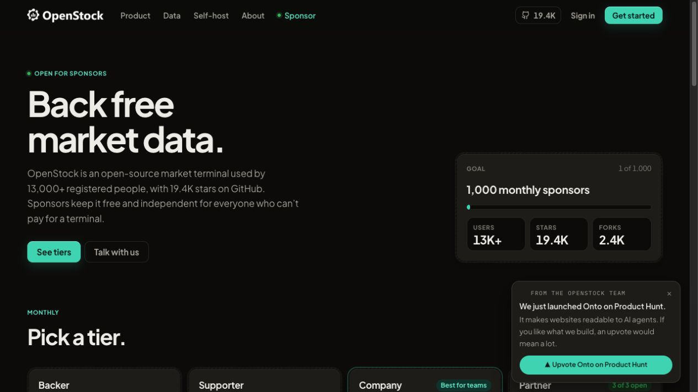 — 09-sponsor.jpg
- 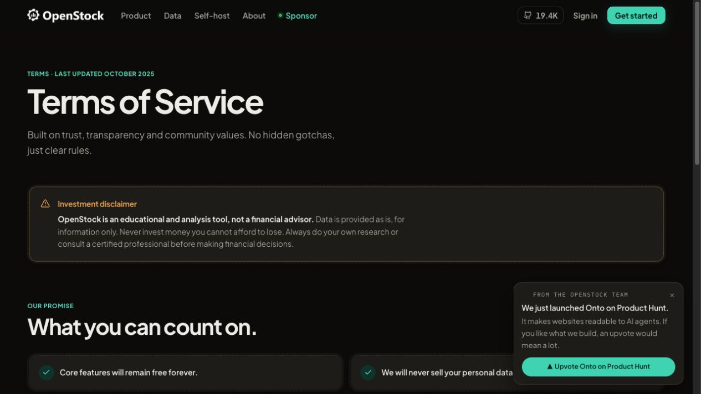 — 10-terms.jpg
- 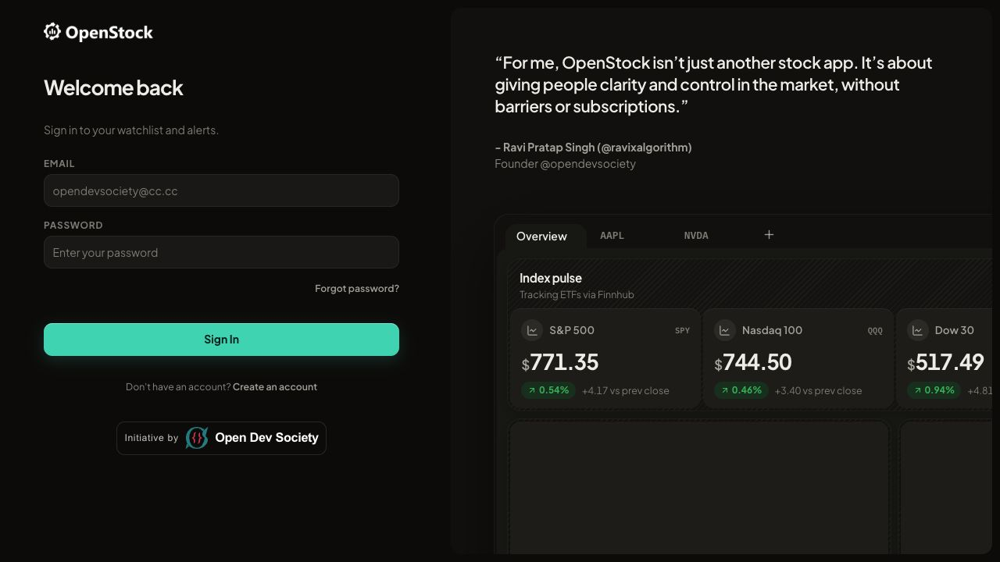 — 11-sign-in.jpg
- 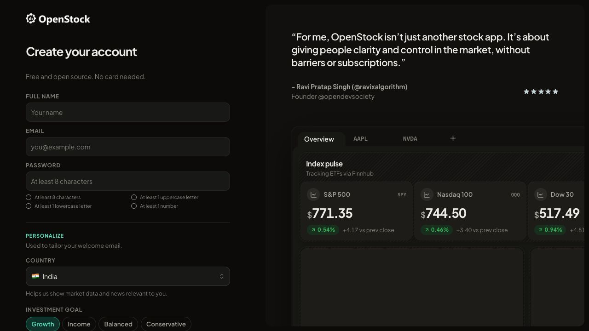 — 12-sign-up.jpg
- 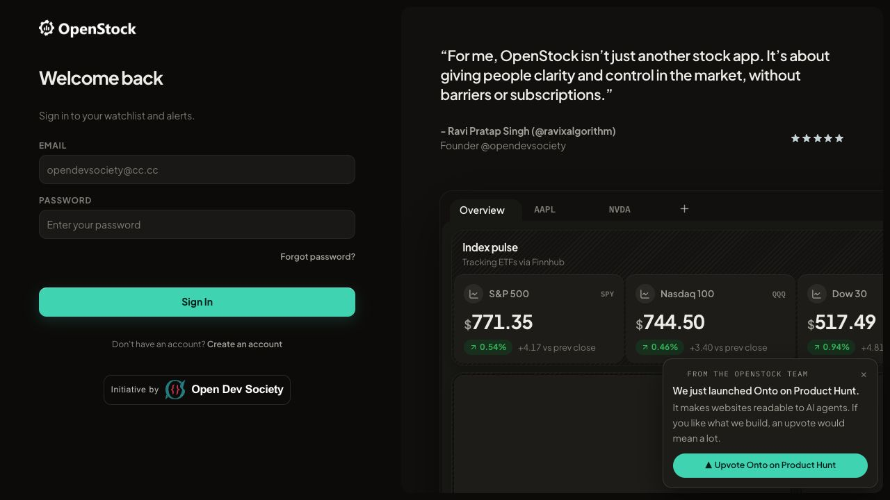 — 13-dashboard-unauthenticated.jpg
- 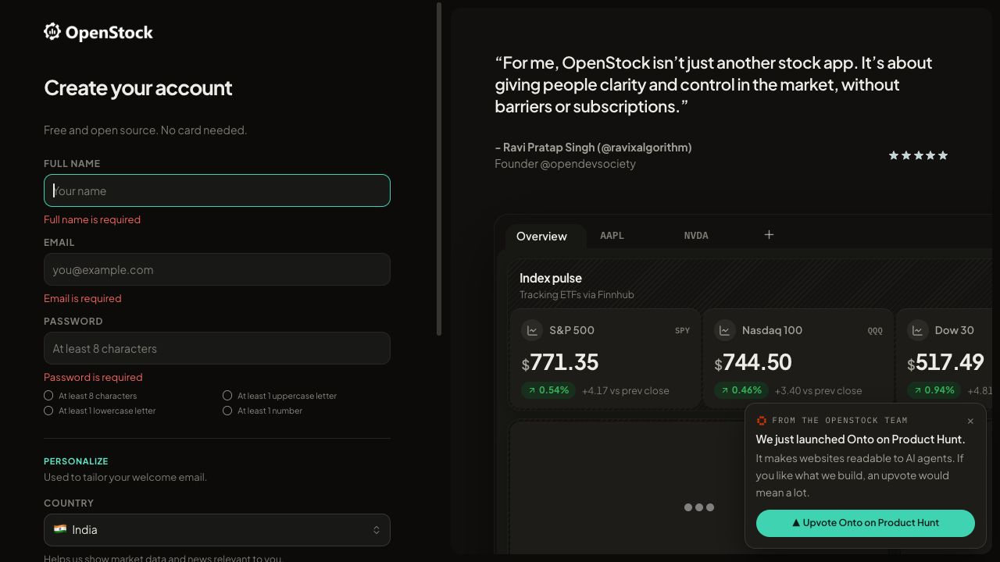 — 15-sign-up-empty-validation.jpg
-  — 16-home-after-reload.jpg
- 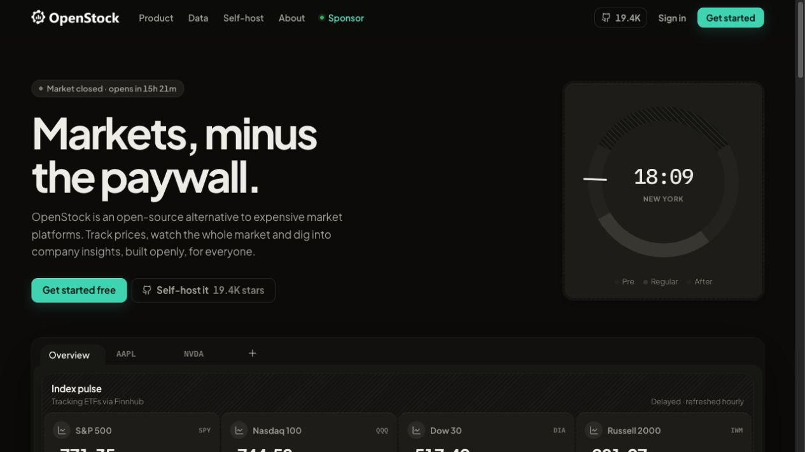 — 17-home-promo-dismissed.jpg
