# Trading Desk screenshots

本 Dashboard 项沿用本轮同一 checkout 的集成试用截图，不重复启动或扩大访问。截图来自隔离本地环境的 GET-only 浏览器检查；空行情 read model 是显式阻断状态。
-  — desk-overview.png
- 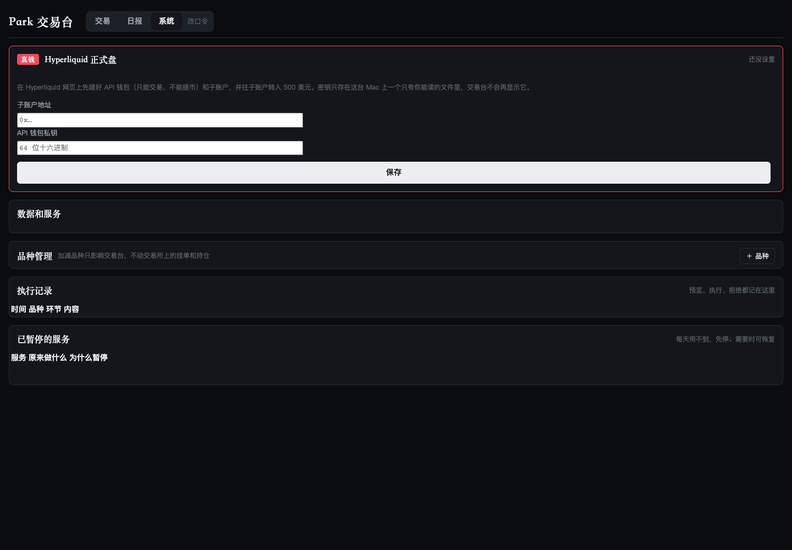 — desk-system.png
- 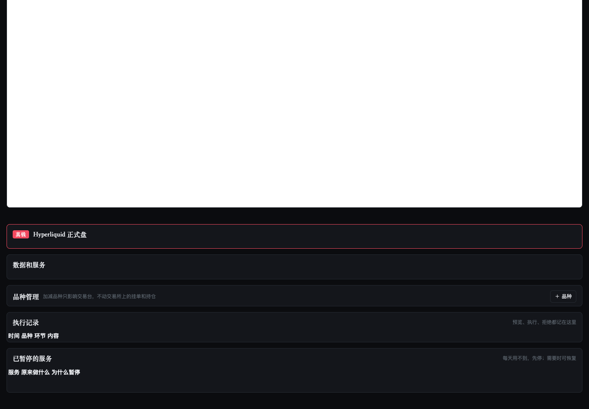 — desk-upper.png
- 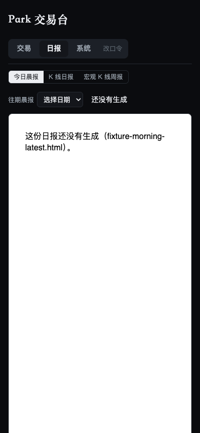 — desk-mobile-390.png
- 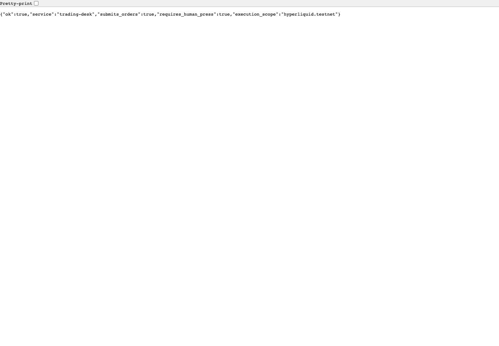 — desk-api-health.png
- 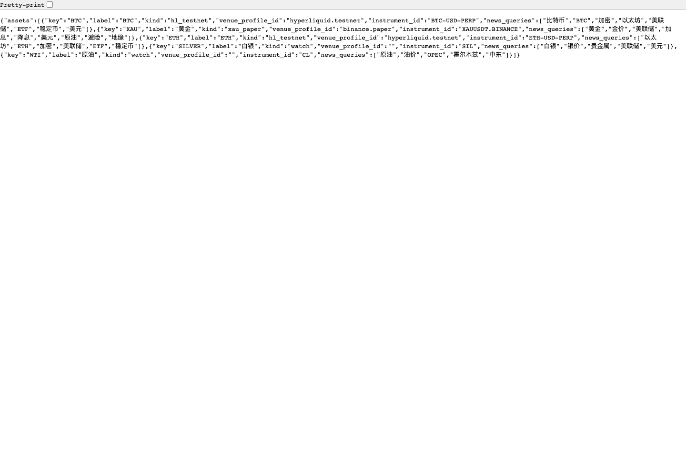 — desk-api-assets.png
-  — integrated-trade-dashboard.png
- 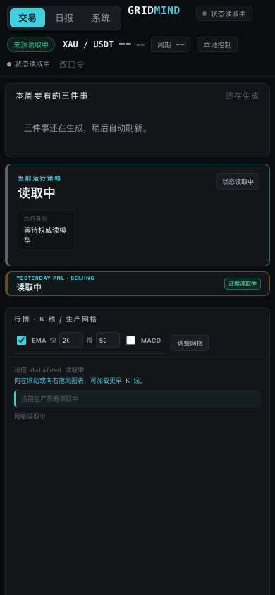 — integrated-trade-mobile.png
- 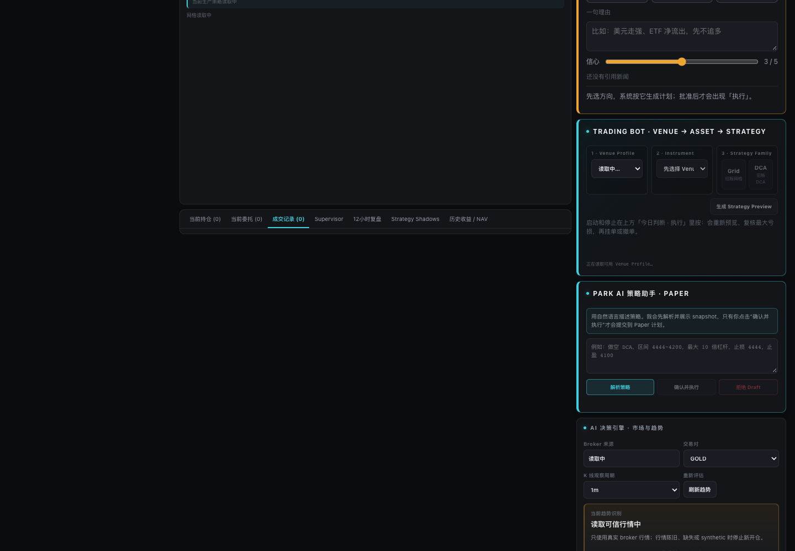 — integrated-trade-section-1.png
- 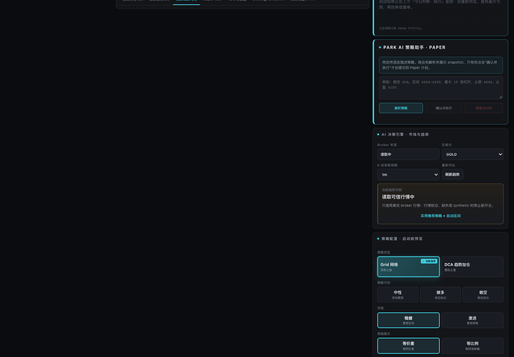 — integrated-trade-section-2.png
- 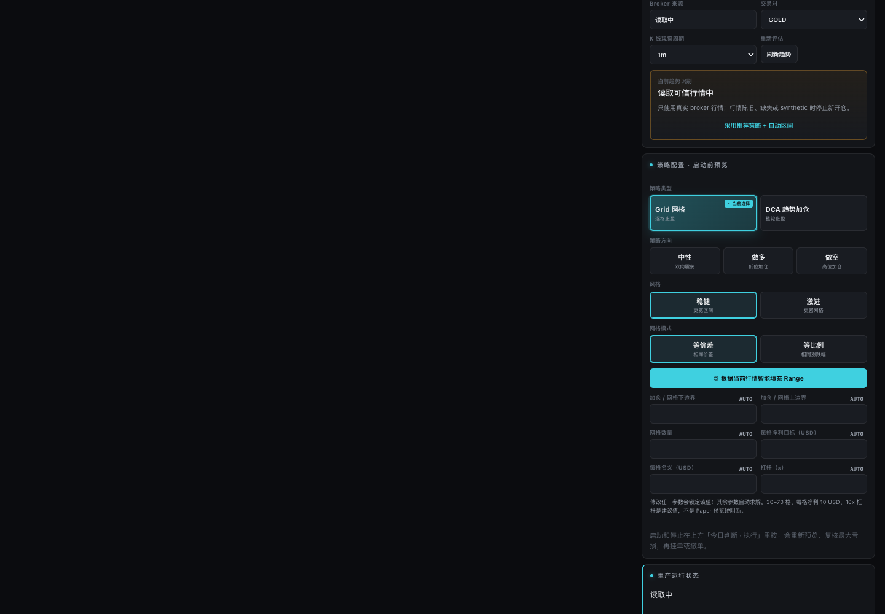 — integrated-trade-section-3.png
- 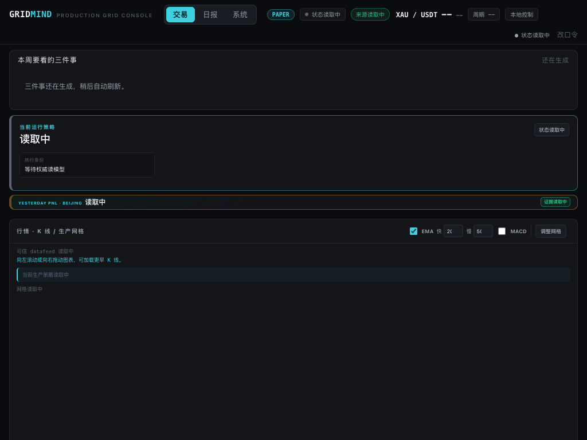 — integrated-trade-tablet.png
-  — trade-fills-read.png
-  — trade-nav-read.png
-  — trade-orders-read.png
- 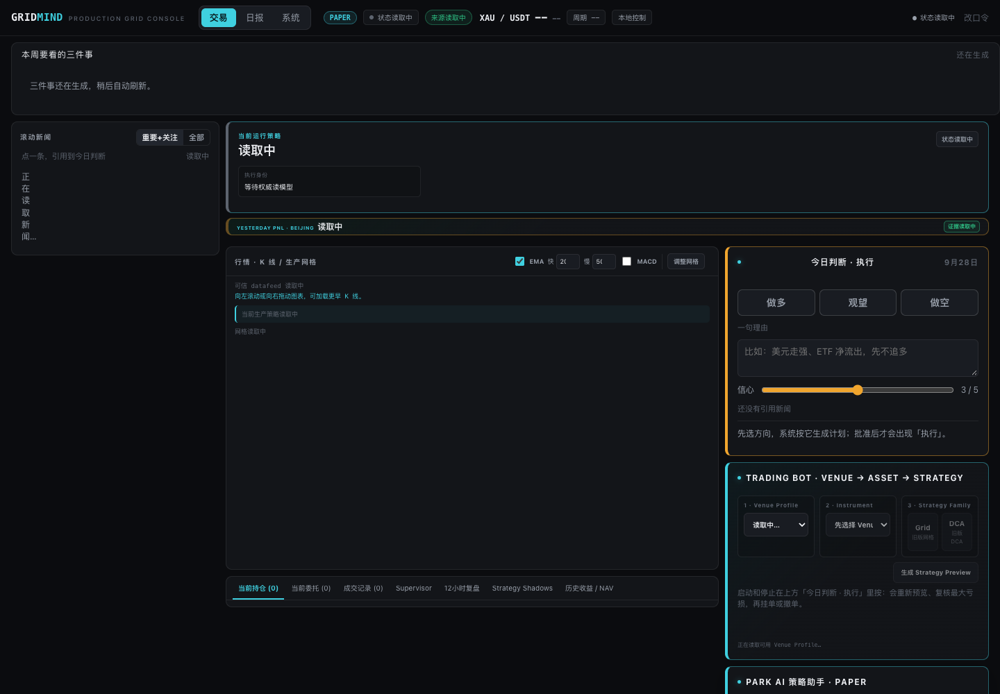 — trade-positions-read.png
- 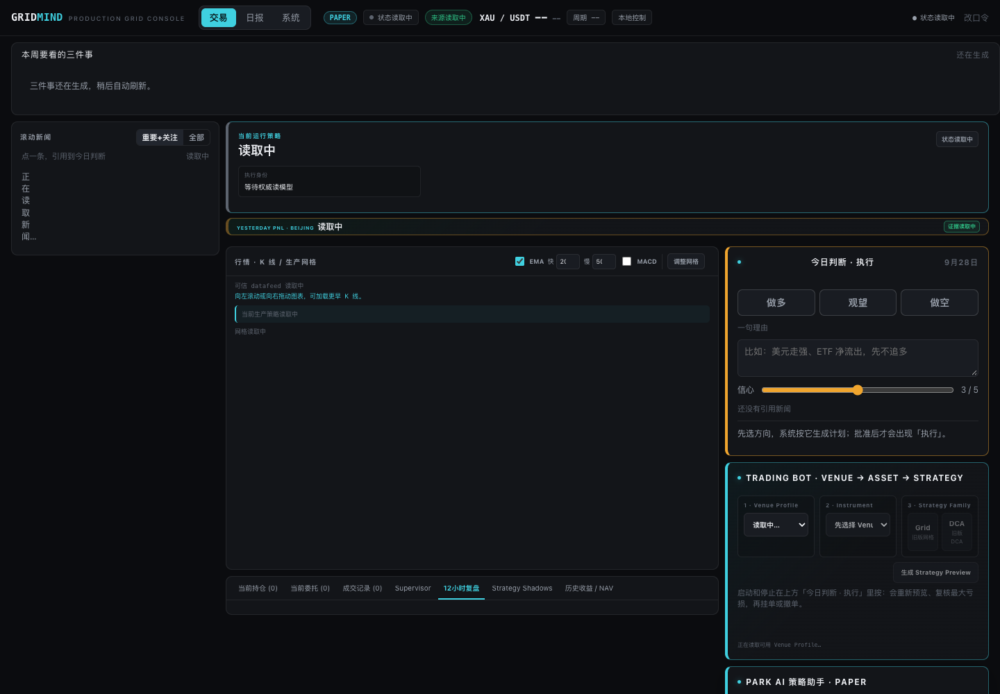 — trade-review-read.png
- 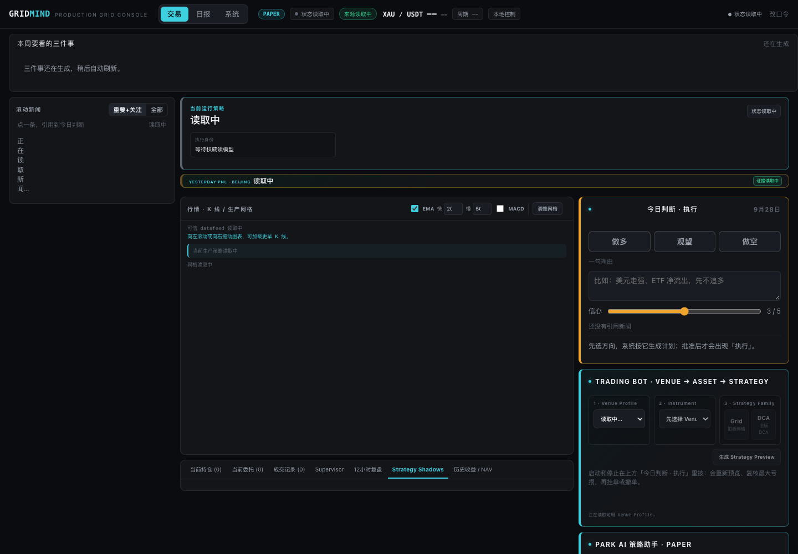 — trade-shadows-read.png
- 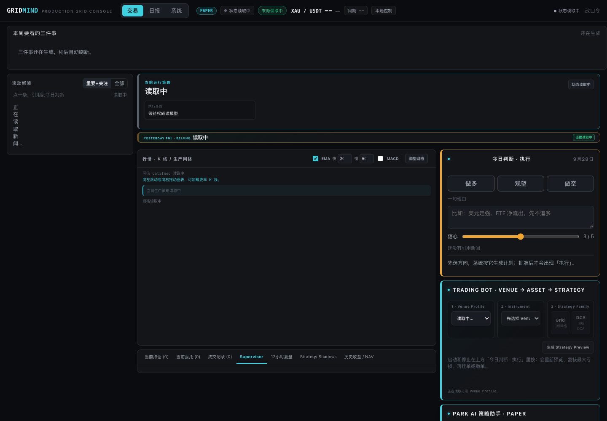 — trade-supervisor-read.png
