# tvscreener screenshots

18 次界面截图，17 张唯一画面。截图来自锁定提交自带的本地静态 Code Generator；它只构造查询代码，不在浏览器里获取行情。
-  — 01-stock-default.jpg
- 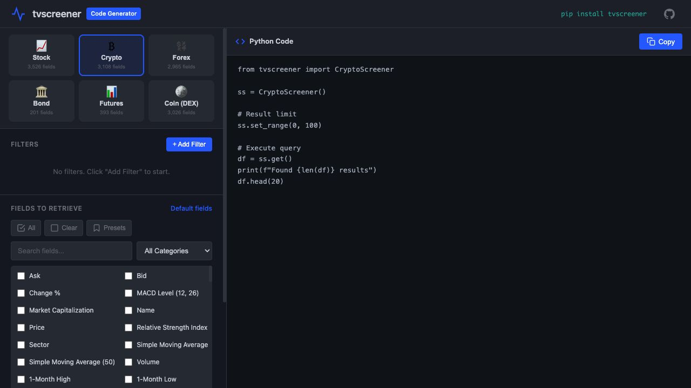 — 02-crypto-screen.jpg
- 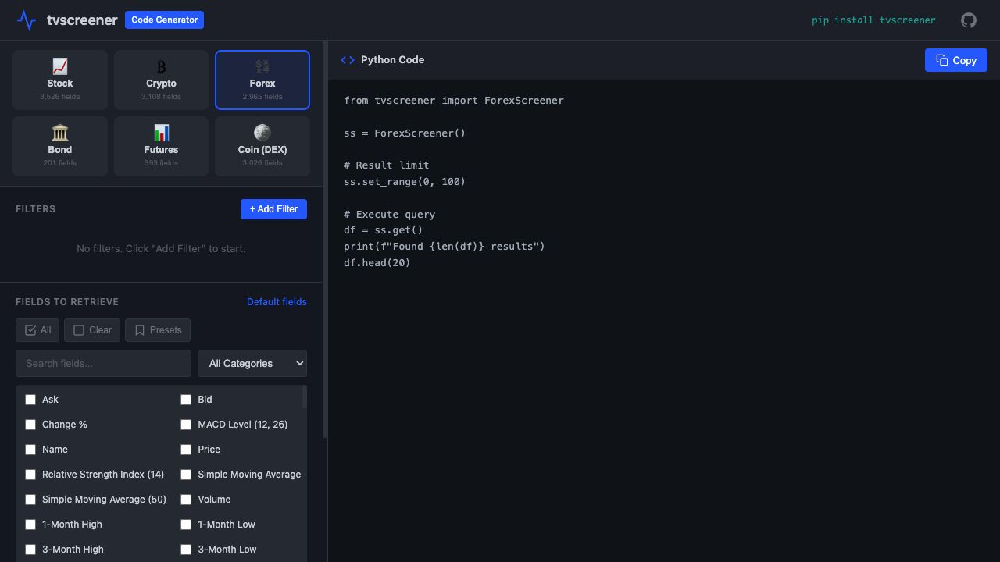 — 02-forex-screen.jpg
- 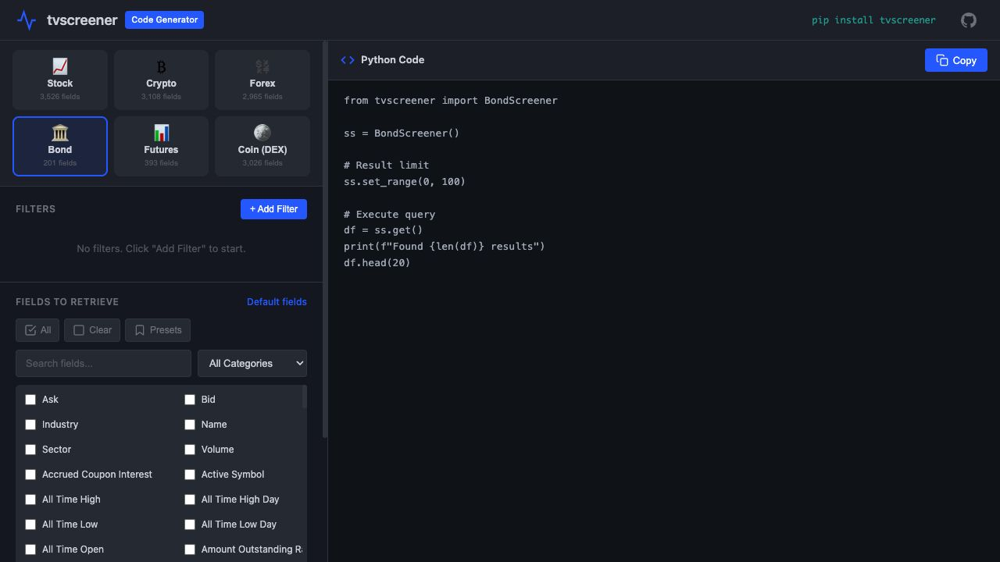 — 02-bond-screen.jpg
- 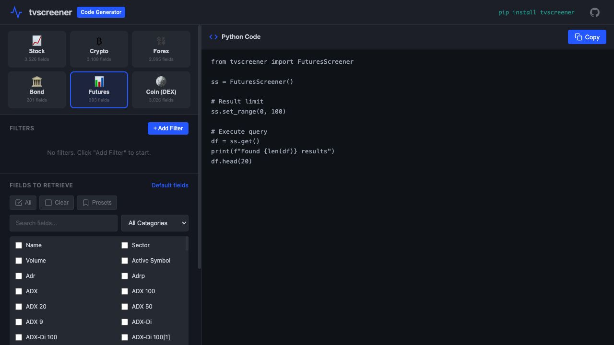 — 02-futures-screen.jpg
- 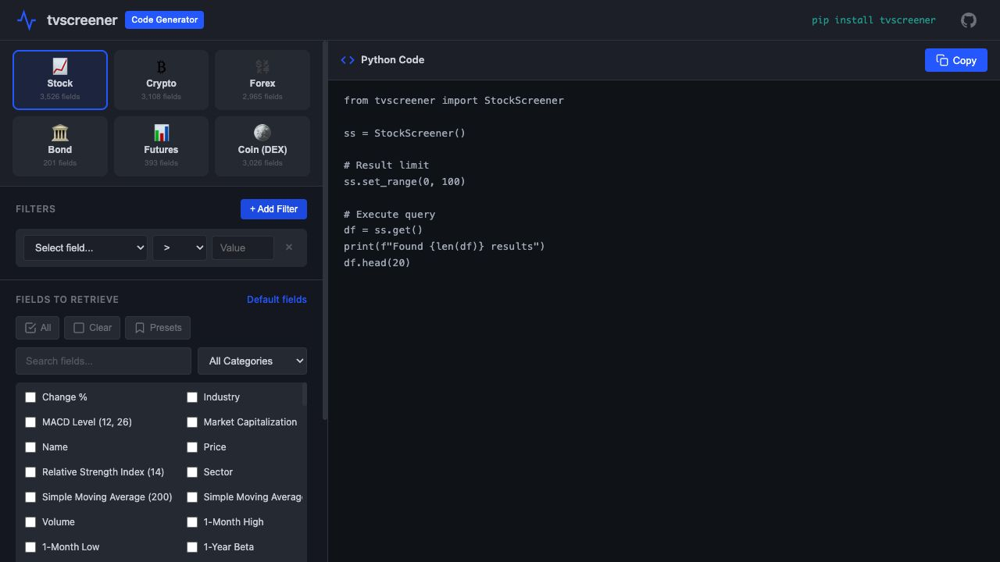 — 07-filter-chooser-open.jpg
- 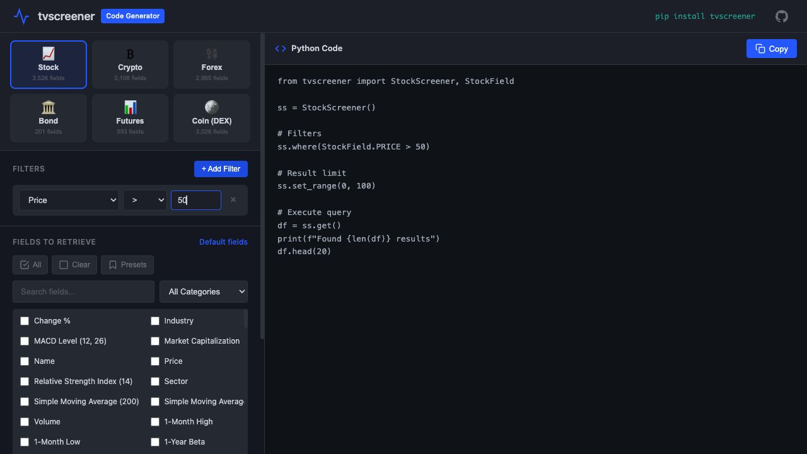 — 08-price-filter-generated.jpg
- 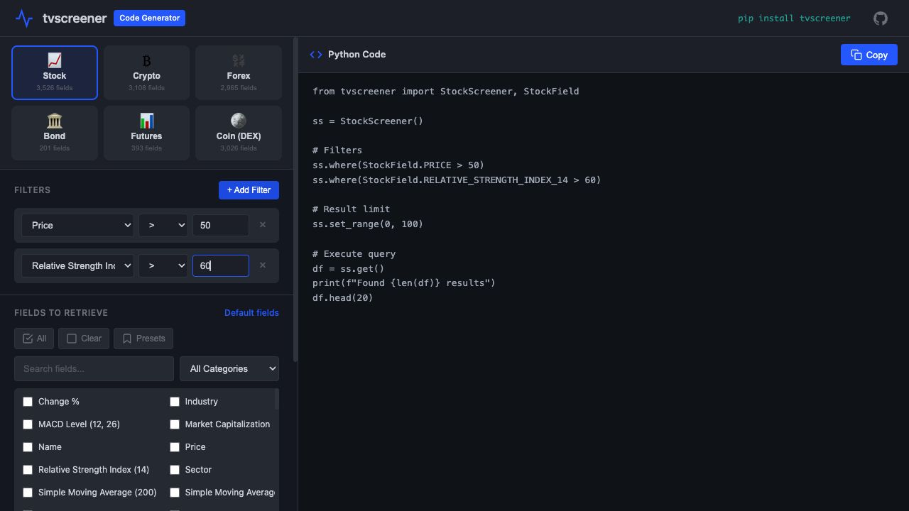 — 09-price-rsi-filters.jpg
- 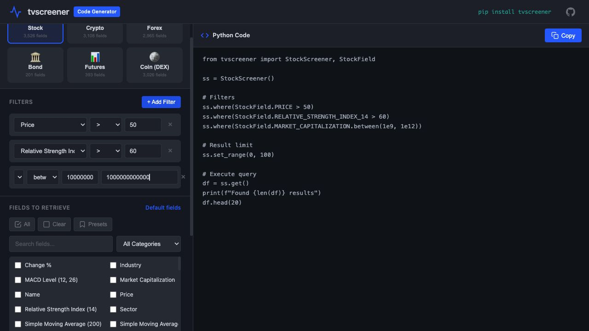 — 10-market-cap-between.jpg
- 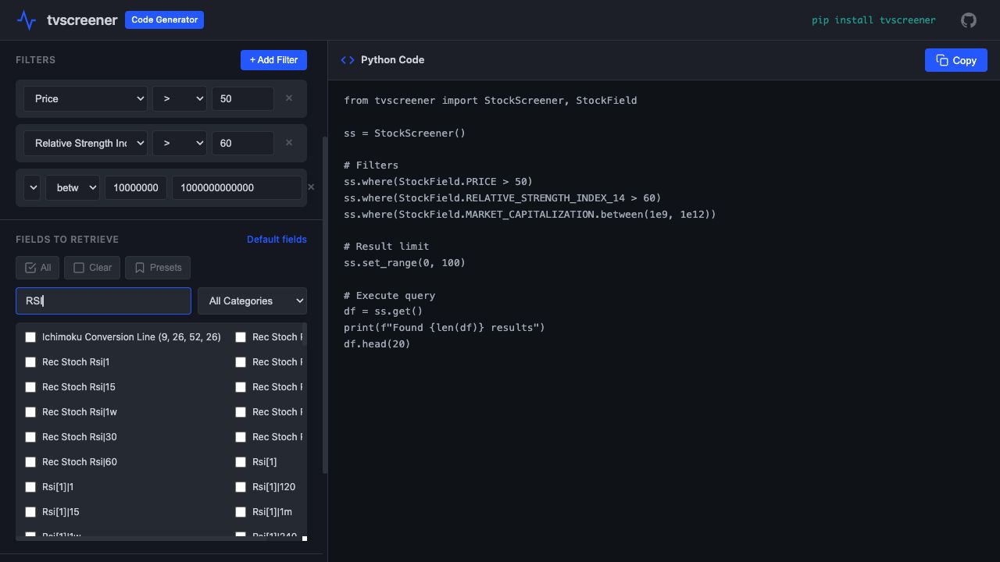 — 11-search-rsi-fields.jpg
- 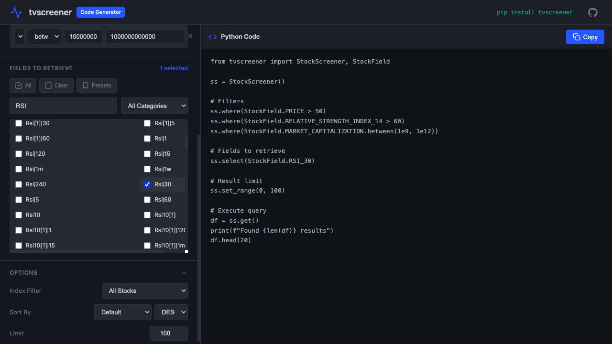 — 12-rsi-field-selected.jpg
- 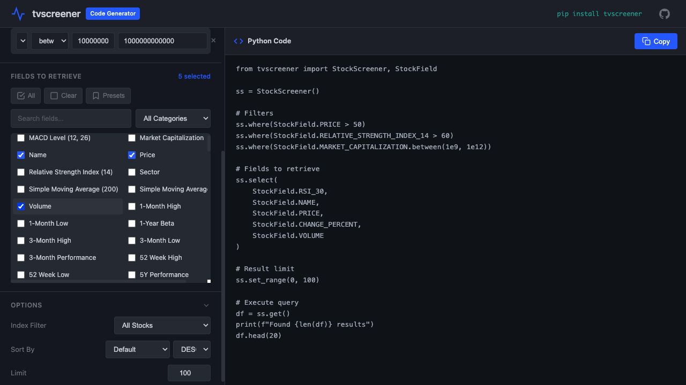 — 13-output-fields-selected.jpg
- 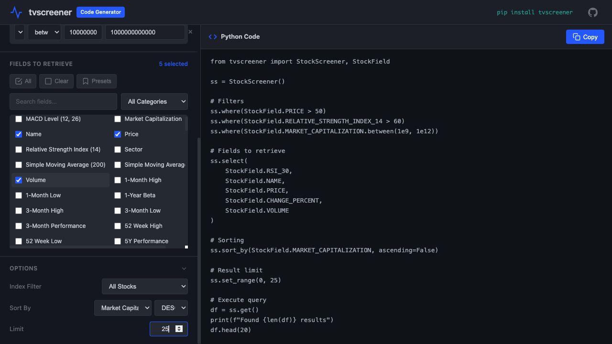 — 14-sp500-sort-limit.jpg
- 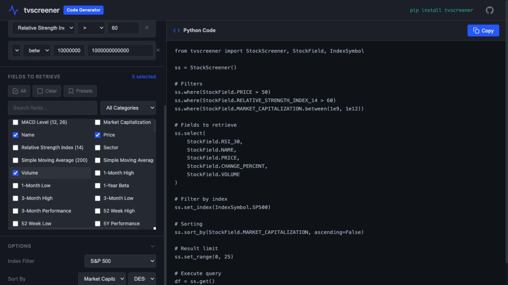 — 15-sp500-index-config.jpg
- 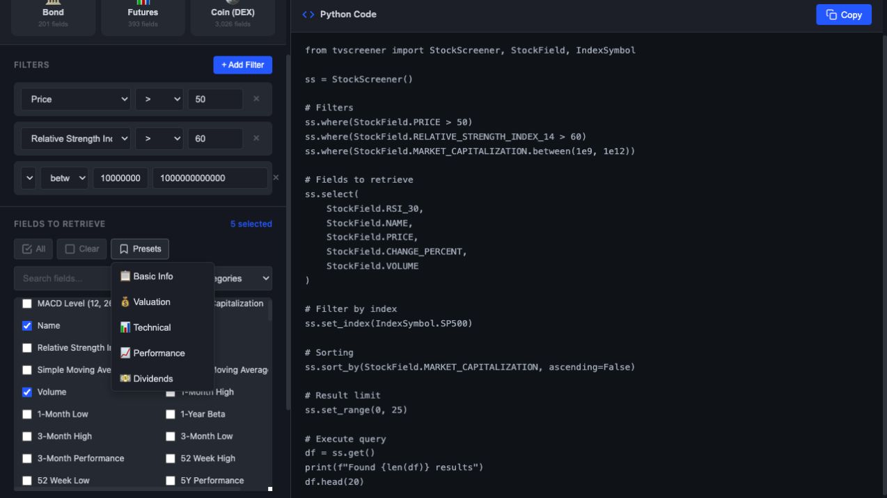 — 16-field-presets-open.jpg
- 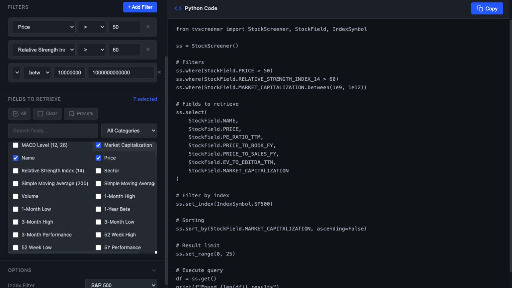 — 17-valuation-preset.jpg
- 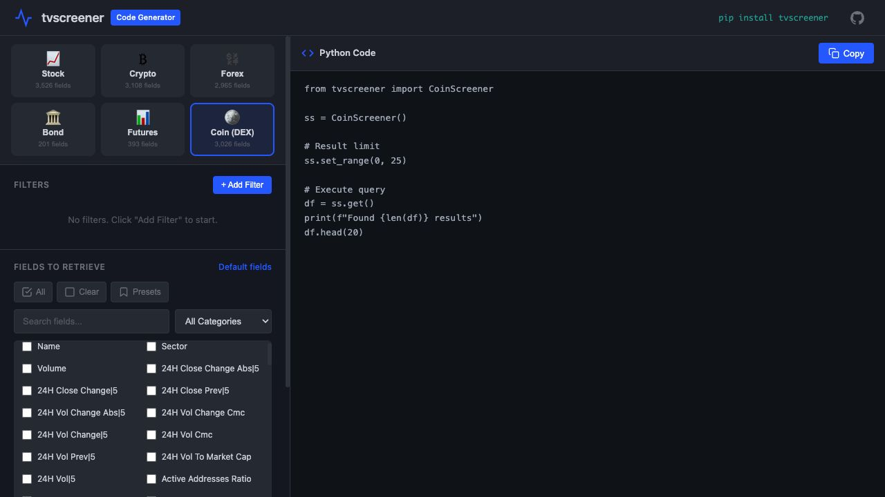 — 18-coin-screener-generated.jpg

另有 1 张重复画面：02-coin-screen.jpg → 02-futures-screen.jpg
