# Gloomberb screenshots

15 张产品 pane 截图，15 个唯一画面。截图由锁定版本自带的 CLI screenshot command 生成，数据使用本轮隔离配置；EVAL 水印标明评测环境。
-  — 01-quote-monitor.png
- 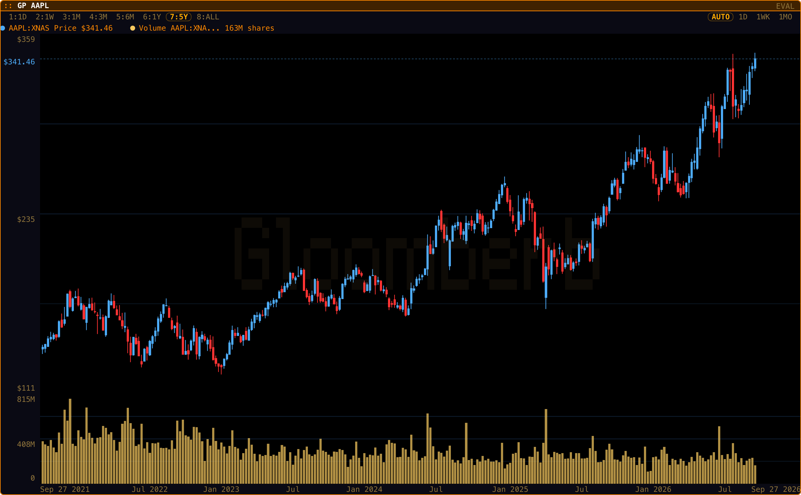 — 02-graph-price-AAPL.png
- 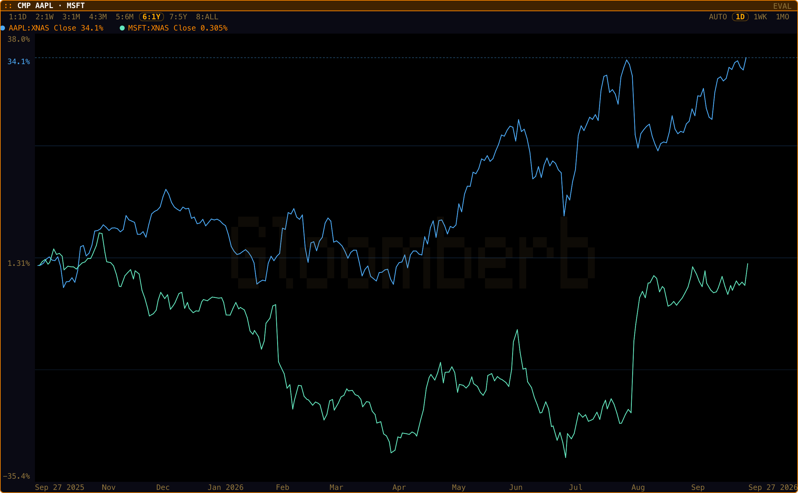 — 03-comparison-chart.png
- 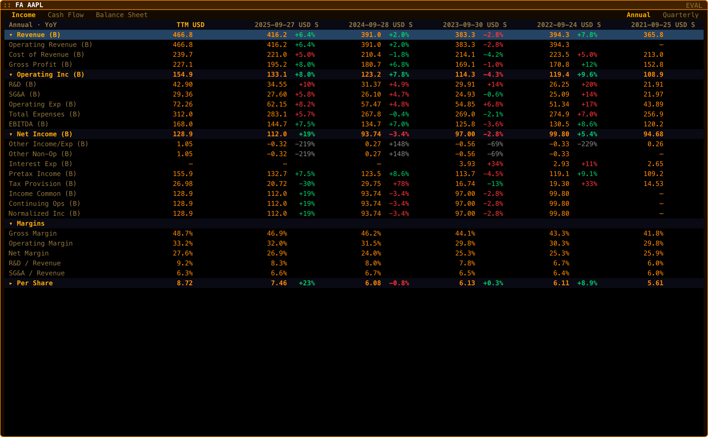 — 04-financial-analysis.png
- 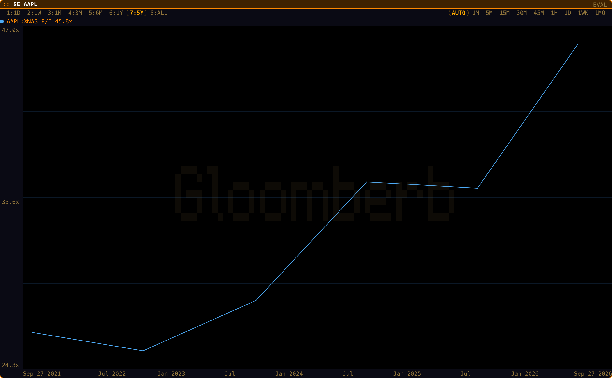 — 05-valuation-graph.png
- 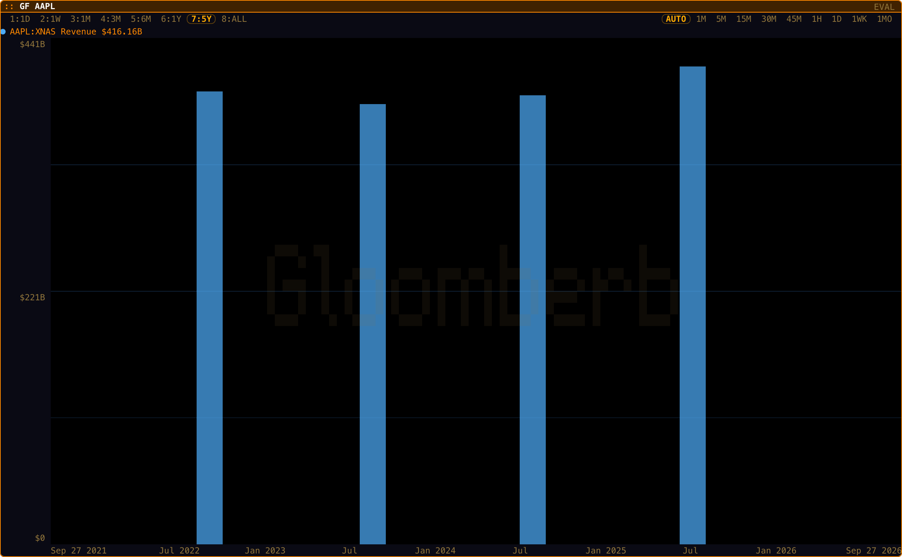 — 06-fundamental-graph.png
- 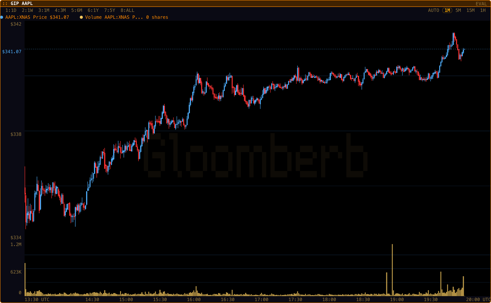 — 07-intraday-price.png
- 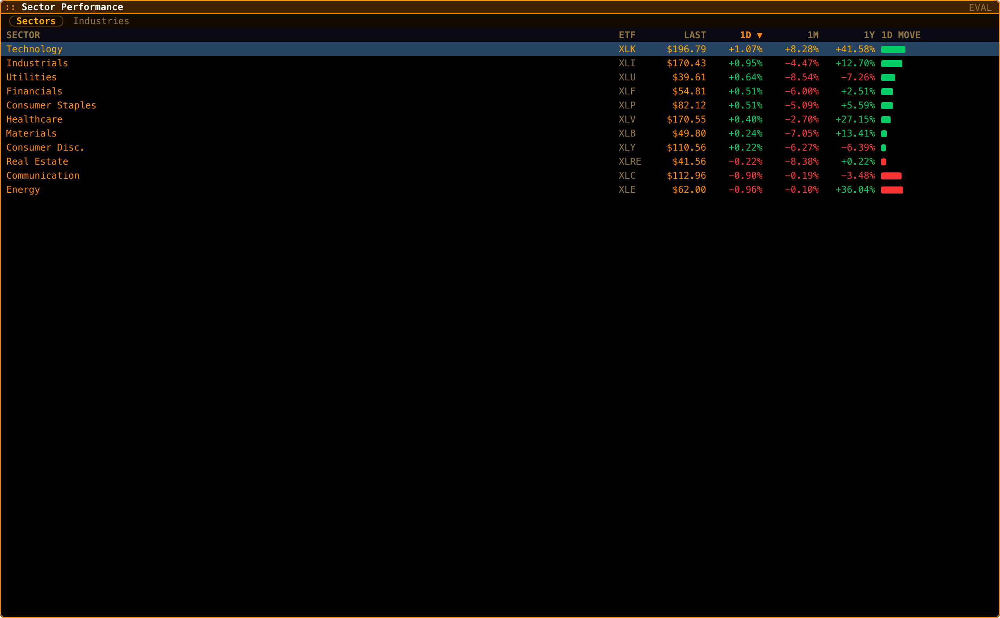 — 08-sector-performance.png
- 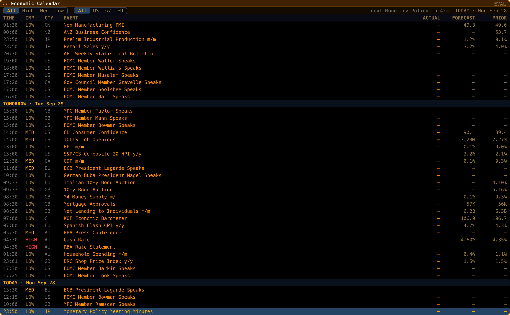 — 09-economic-calendar.png
- 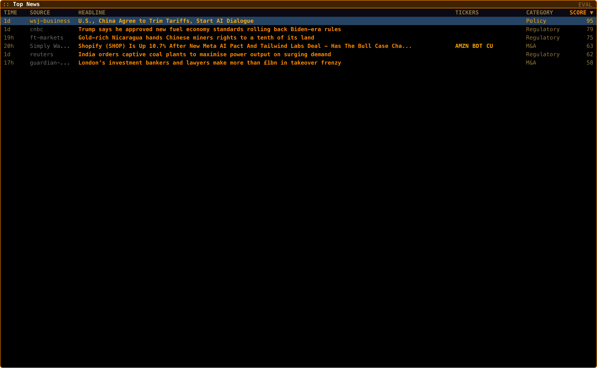 — 10-top-news.png
- 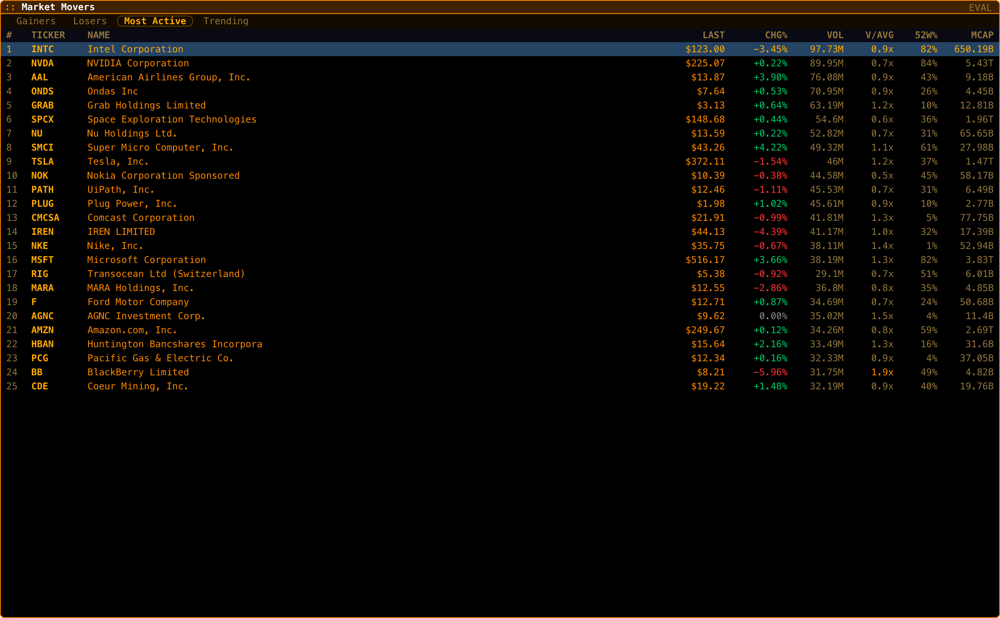 — 11-market-movers.png
- 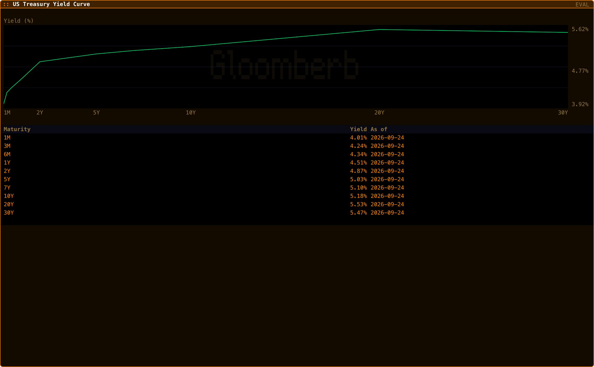 — 12-yield-curve.png
- 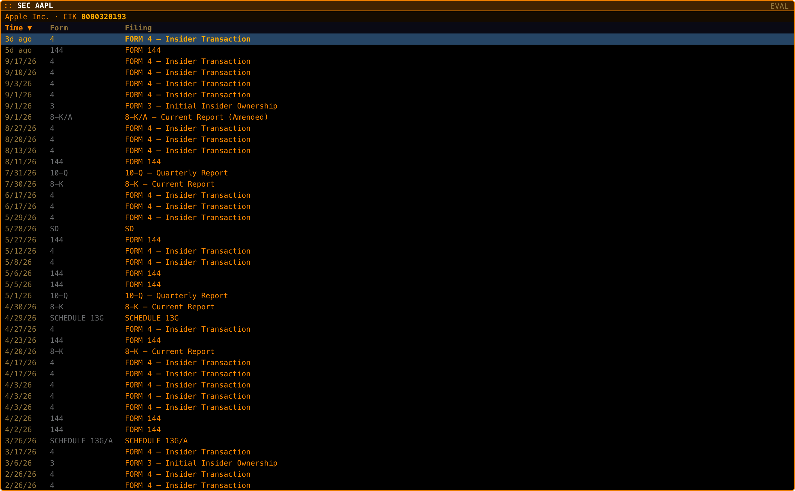 — 13-sec-filings.png
- 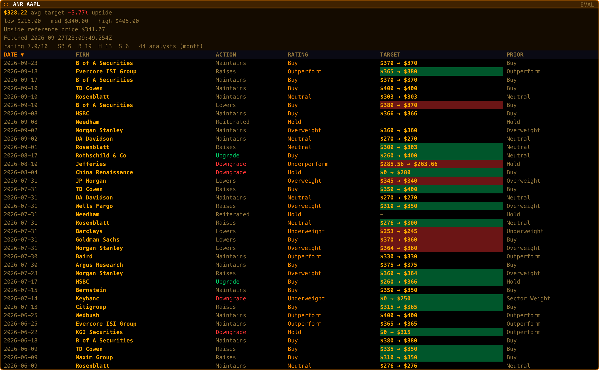 — 14-analyst-research.png
- 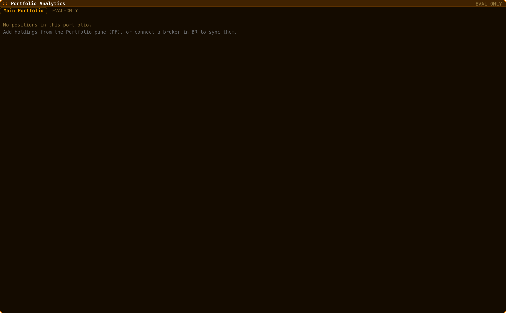 — 15-eval-only-portfolio.png
