# standard-kline screenshots

15 次 harness 截图，其中 14 张是有效产品状态且互不重复；1 张在全局库已加载后才移除，作为无效试验不发布。全部有效图使用隔离 synthetic fixture；没有行情 API。
- 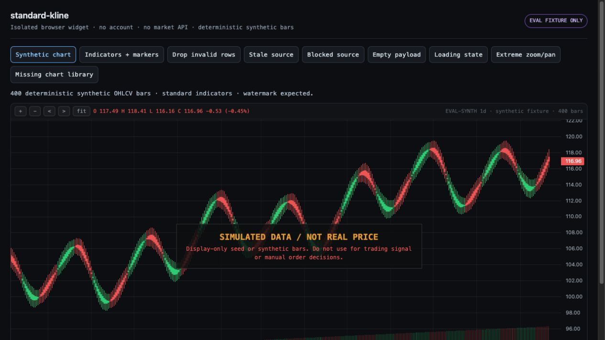 — 01-synthetic-chart.jpg
-  — 02-indicators-markers.jpg
- 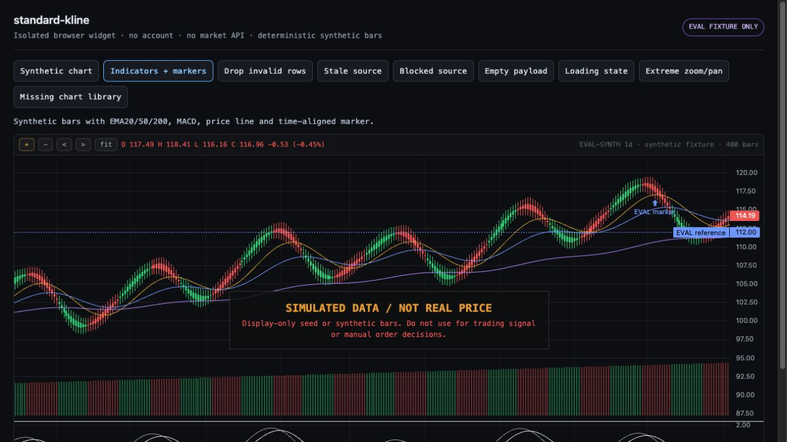 — 03-zoom-in.jpg
- 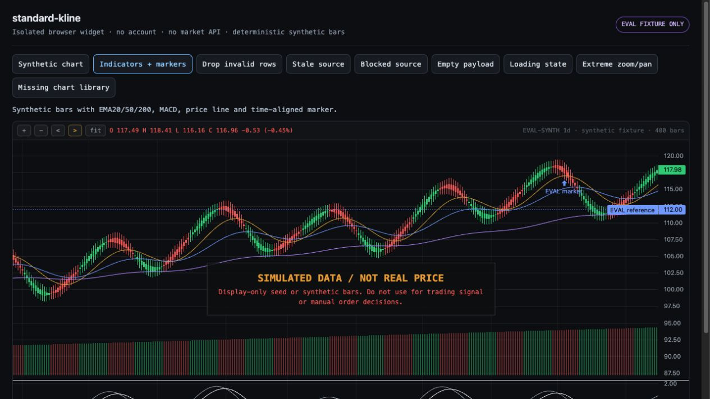 — 04-pan-right.jpg
- 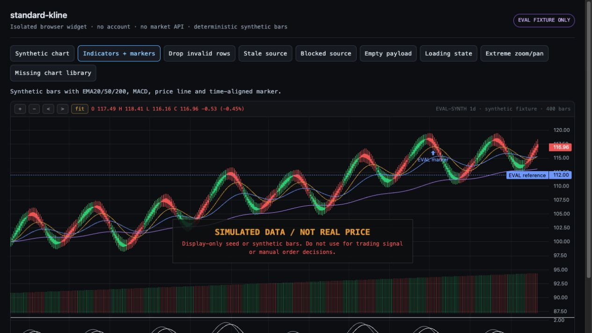 — 05-fit-all-bars.jpg
- 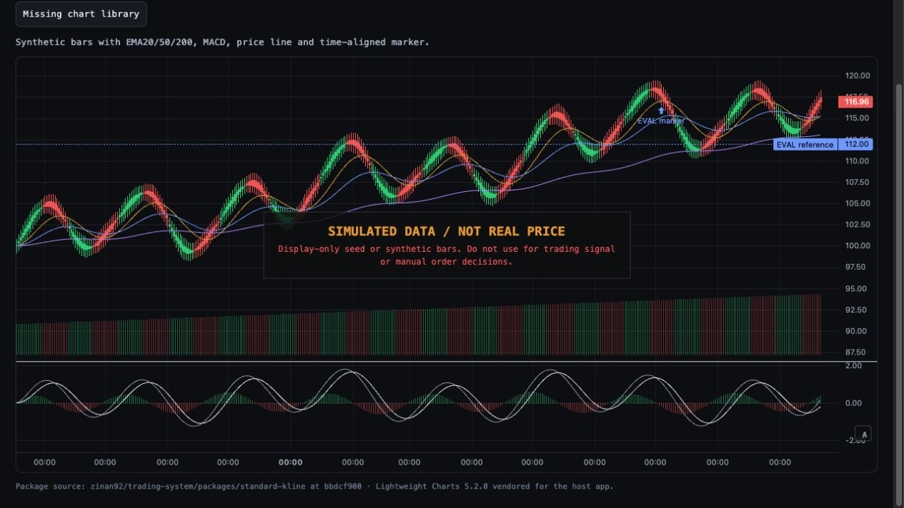 — 06-auto-fit-visible.jpg
- 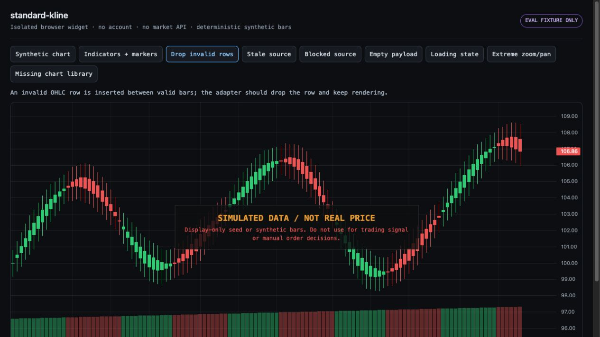 — 07-invalid-ohlc-row-dropped.jpg
- 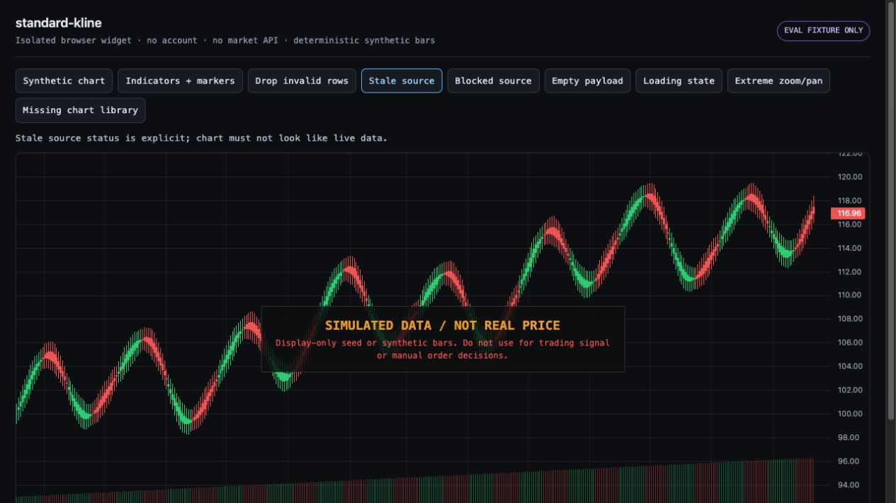 — 08-stale-source.jpg
- 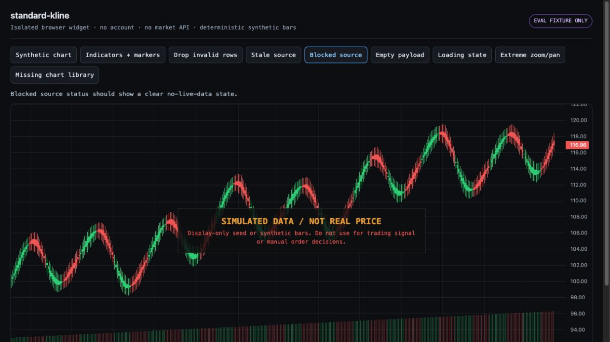 — 09-blocked-source.jpg
- 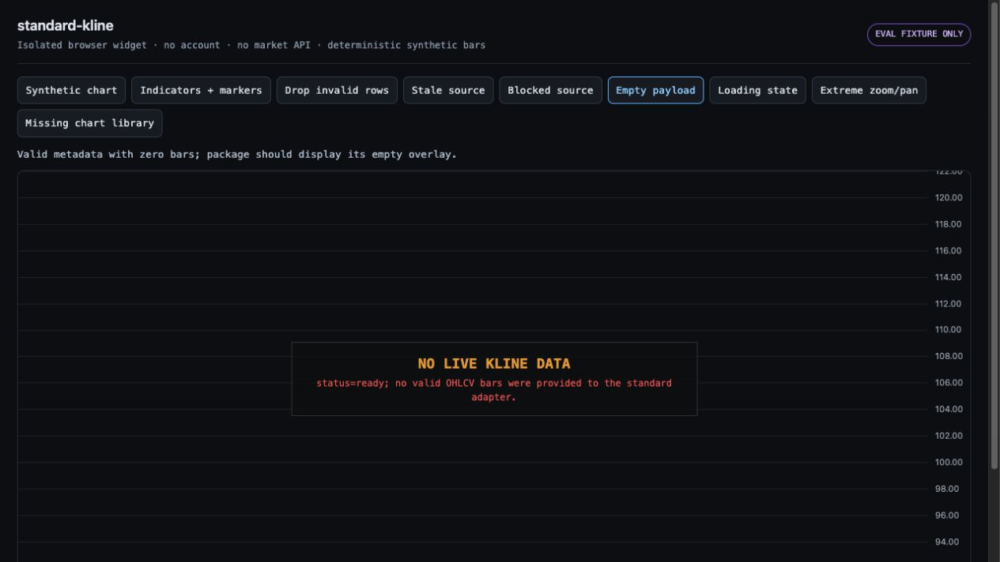 — 10-empty-payload.jpg
- 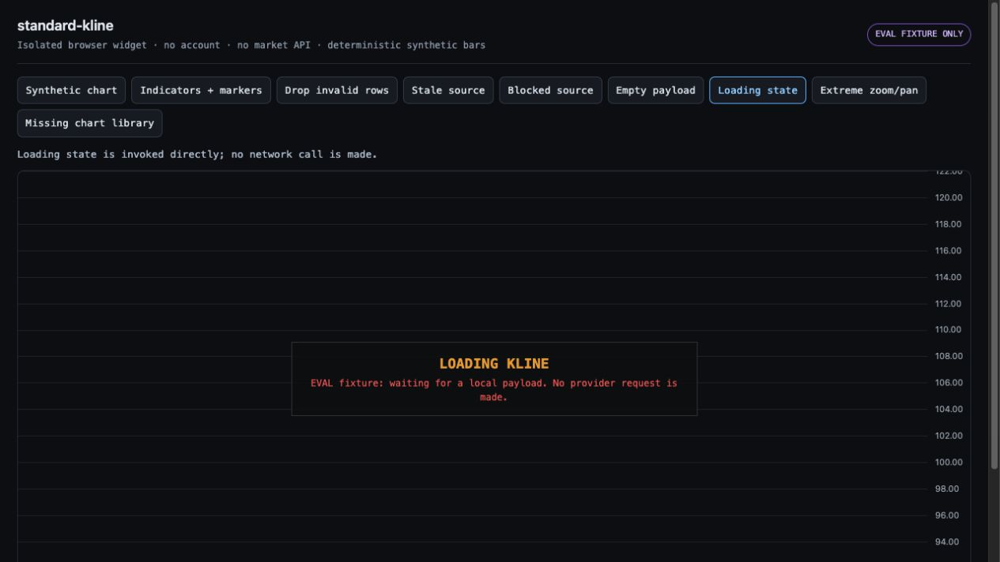 — 11-loading-source.jpg
- 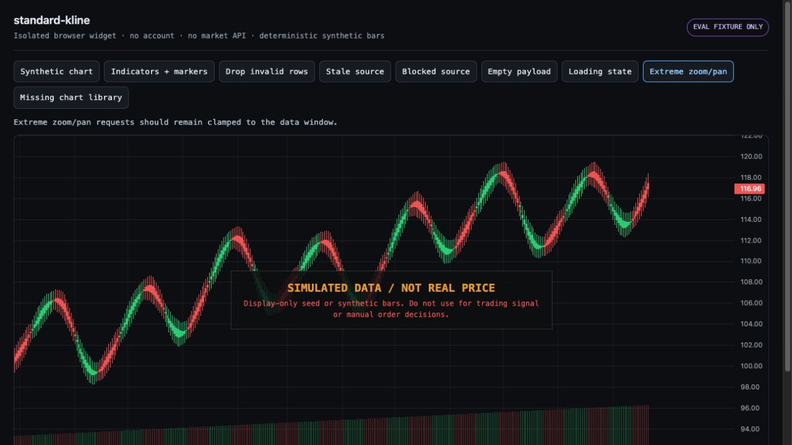 — 13-extreme-range-clamped.jpg
- 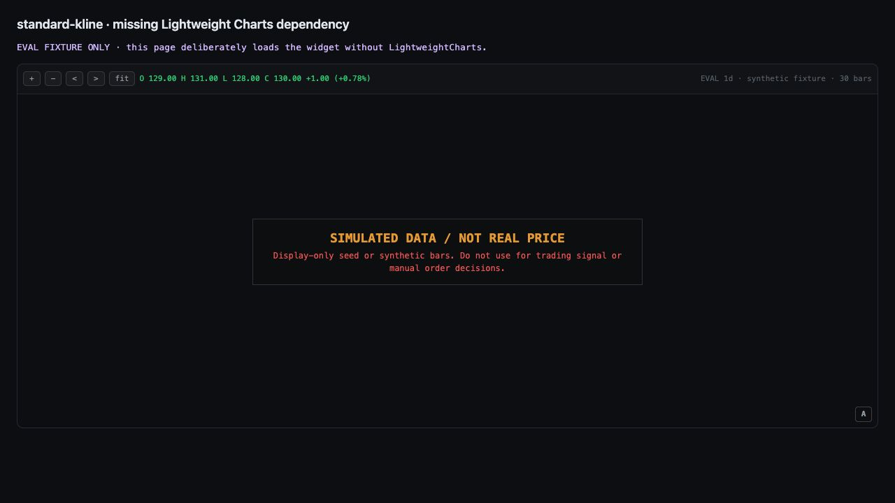 — 14-missing-peer-dependency.jpg
- 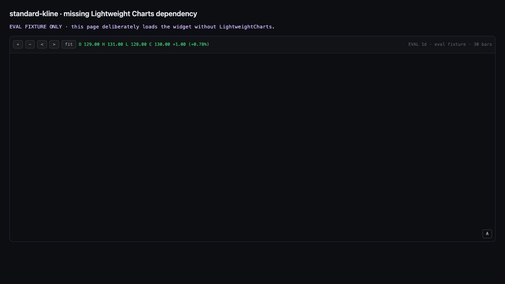 — 15-missing-library-error-state.jpg
