# TradingView-API screenshots

13 张截图、13 个唯一 SHA-256。该库没有原生 Dashboard；截图来自锁定版本的 README、示例、测试和 WebSocket 实现页面，实际数据结果另见 verification.json。
- 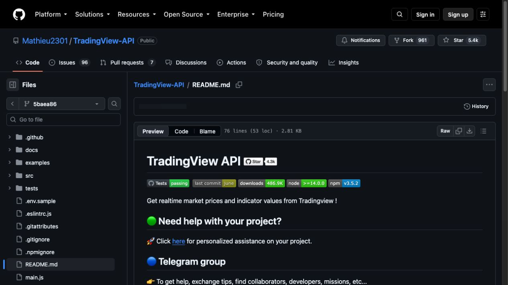 — 01-readme-role-and-limitations.jpg
-  — 02-simple-chart-example.jpg
- 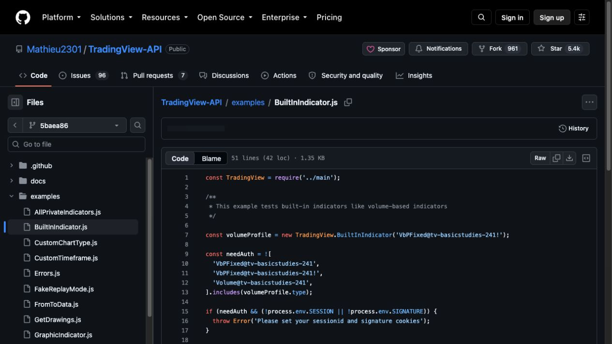 — 03-built-in-indicator-example.jpg
- 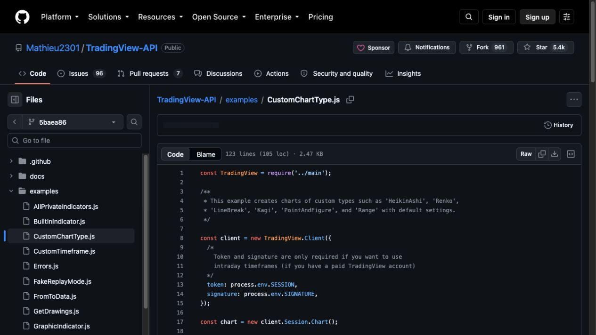 — 04-custom-chart-types.jpg
- 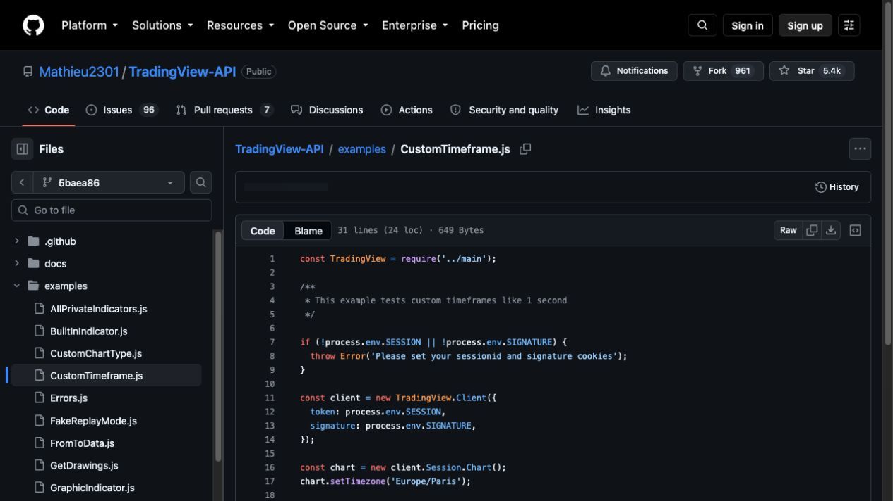 — 05-custom-timeframe.jpg
- 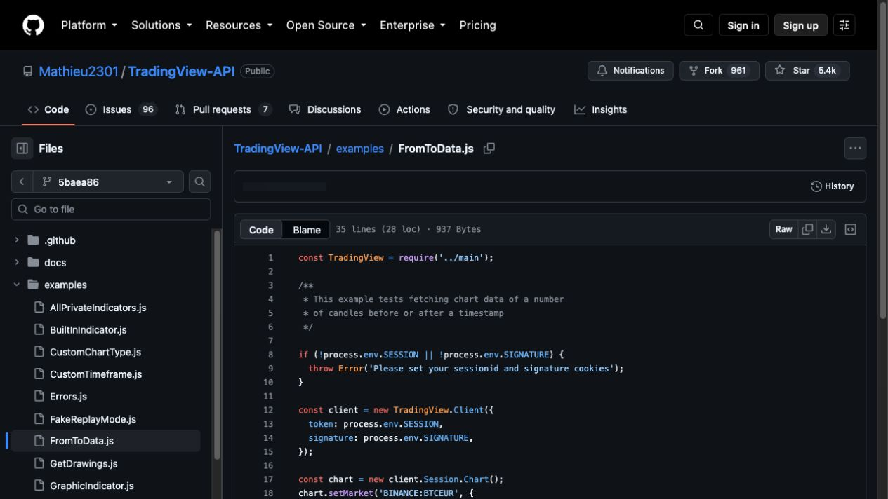 — 06-bounded-history-example.jpg
- 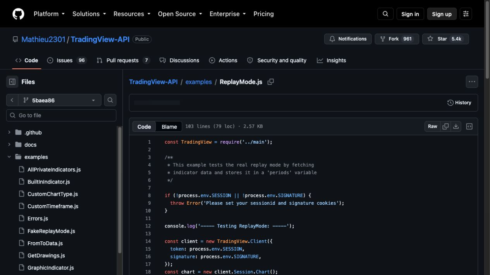 — 07-replay-mode-example.jpg
- 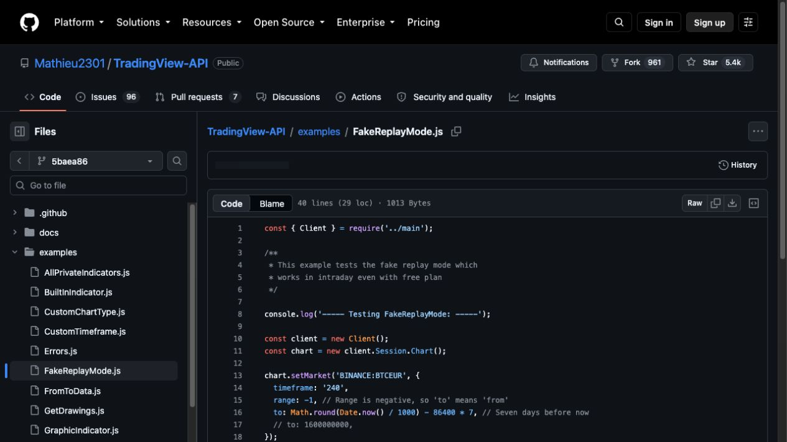 — 08-fake-replay-example.jpg
- 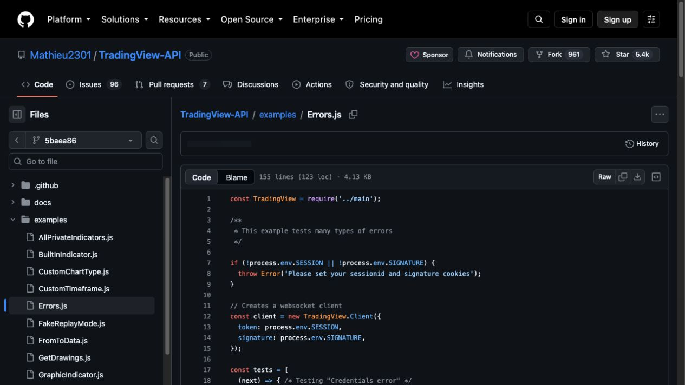 — 09-error-handling-example.jpg
- 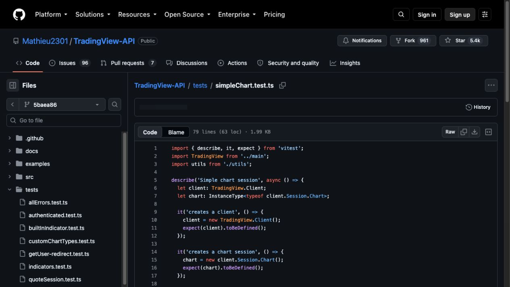 — 10-live-chart-integration-test.jpg
- 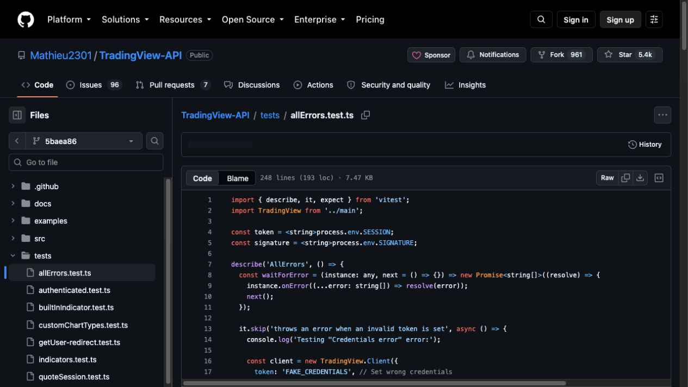 — 11-error-contract-tests.jpg
- 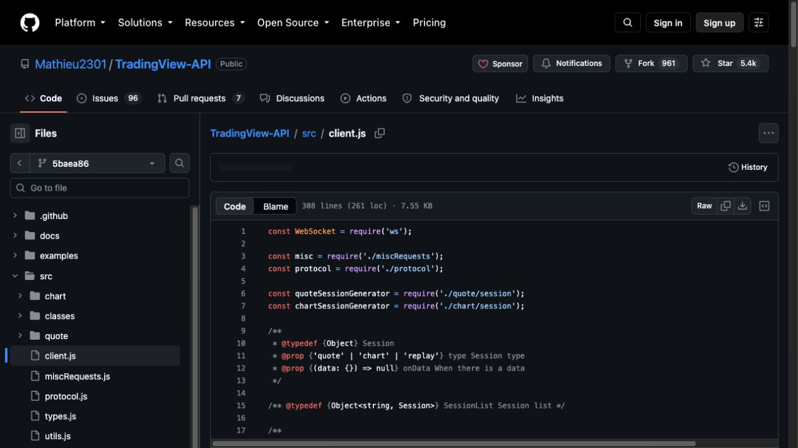 — 12-websocket-client-source.jpg
- 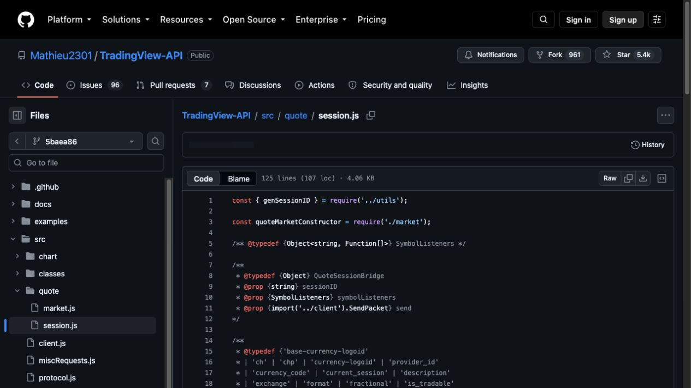 — 13-quote-session-source.jpg
