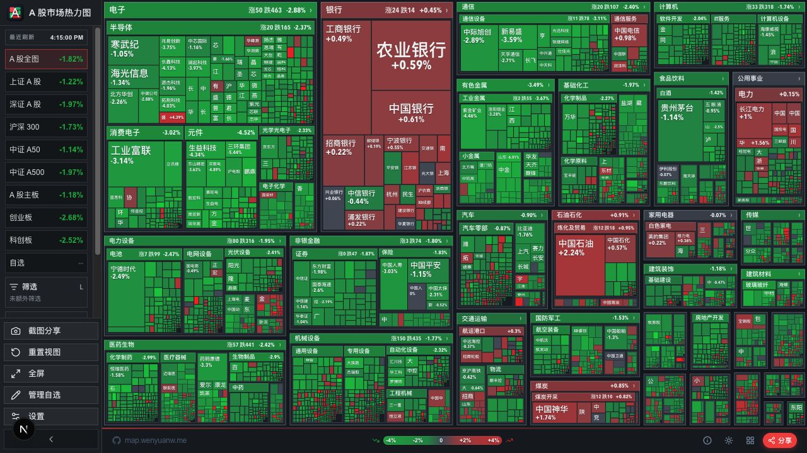
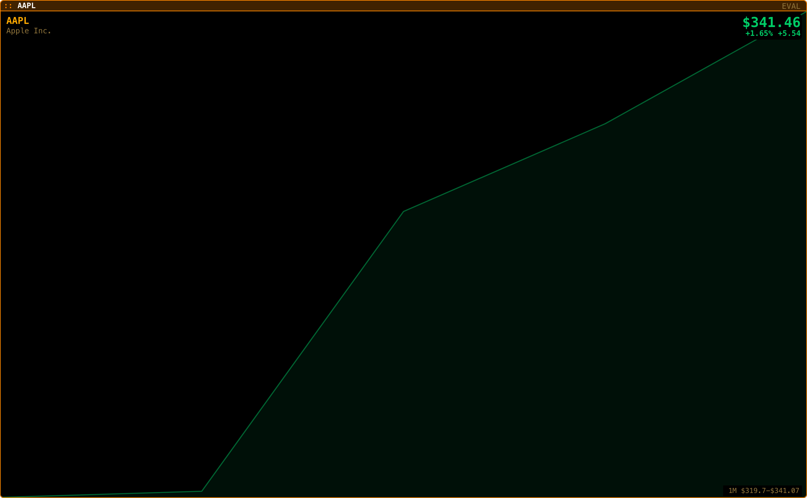
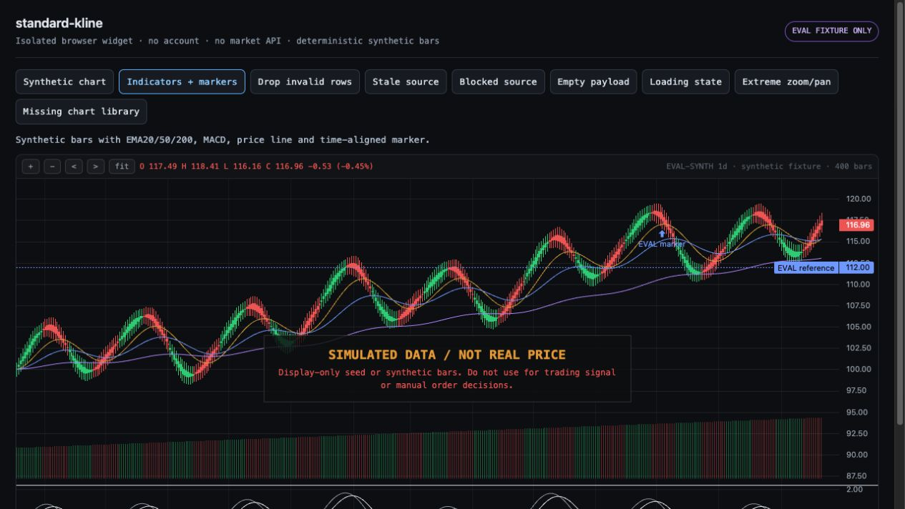
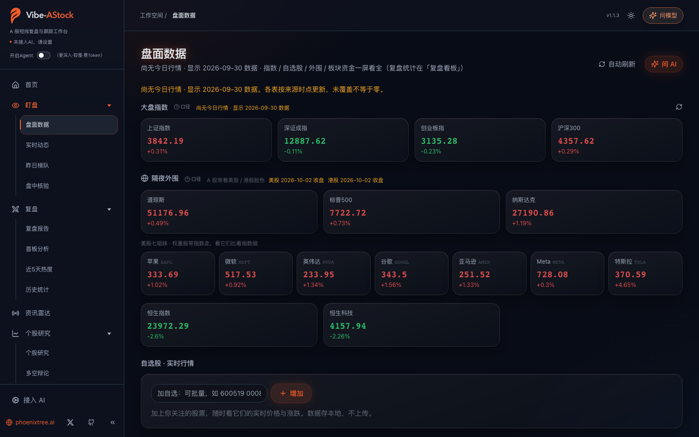
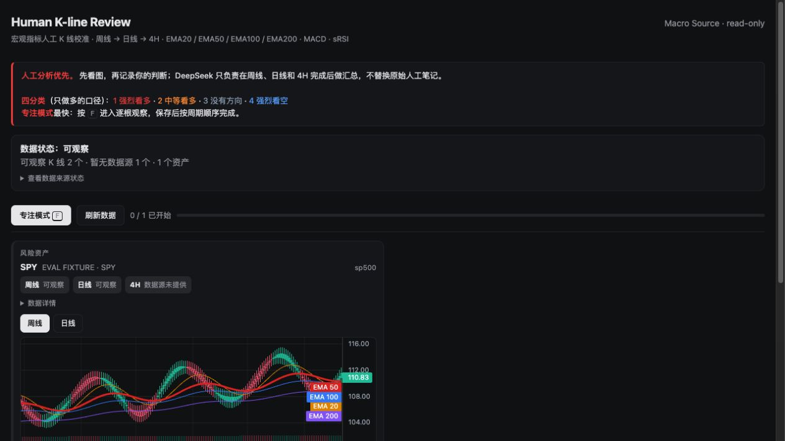
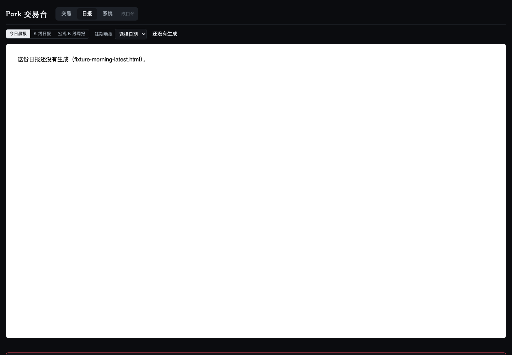

<!-- 本文件由 scripts/render-hub.py 生成，请改 evaluations/assessments/*.json 后重跑 -->
# Dashboard · 评测

**目标：** 人能快速、清晰地找到信息，并在需要时干预。

**环节：** 10 监控与看板

[评测框架](../FRAMEWORK.md) · [Pipeline 总览](../README.md) · [返回目录](../../README.md)

评级：✅ 做到 · 🟡 部分 · ❌ 未做到 · ⬜ 未验证 · — 不适用。分数 = Σ(权重 × 评级值) ÷ Σ适用权重 × 100；已验证 = 做到、部分、未做到三种评级占适用权重的比例。环节：● 实测跑通 · ◐ 源码可见未实测 · ○ 无 · · 不在其角色内；排名表的环节列按 1 获取到 10 看板的顺序排列。

## 评判标准

| 标准 | 权重 | 怎么判 |
|---|---:|---|
| V1 清晰 | 25 | 信息层级明确，首屏就有关键信息，找到目标信息的步骤少。 |
| V2 时效标注 | 20 | 数据日期与延时可见；过期数据不冒充实时。 |
| V3 可操作 | 20 | 筛选、自选、告警、切换周期等操作真实可用。 |
| V4 可接入 | 20 | 能消费我们自己的数据或作为组件嵌入；无登录门槛。 |
| V5 稳定 | 15 | 加载、错误态、跨端表现。 |

## 排名

| 排名 | 产品 | 分数 | 已验证 | 环节 1–10 | 实测 | 卡片 |
|---:|---|---:|---:|---|---|---|
| 1 | [A Share Heatmap](https://github.com/wenyuanw/a-share-heatmap) | **82** | 100% | `●·○······●` | ✅ 隔离运行下全市场 5,917 只股票按 32 个板块成图，九种市场范围、日/周/月/年、板块与涨跌筛选、自选增删、主题与分享预览全部实测可用；行情快照止于 2026-09-24。 | [卡片](README.md#a-share-heatmap) |
| 2 | [Gloomberb](https://github.com/gloom-sh/gloomberb) | **72** | 100% | `●··●·····●` | ✅ 隔离环境无 key 取到 AAPL 延时报价，TUI 可进入主界面，产品自带 shot 命令生成的 15 个研究 pane 中 14 个完整可用；仅 Portfolio Analytics pane 没显示手工建立的 EVAL-ONLY 组合。 | [卡片](README.md#gloomberb) |
| 3 | [standard-kline](https://github.com/zinan92/standard-kline) | **72** | 100% | `···●·····●` | ✅ 21/21 单测通过；隔离浏览器 harness 用 Lightweight Charts 5.2.0 渲染 400 根 synthetic OHLCV、EMA20/50/200、MACD、marker，空、加载、坏行、缺库状态与缩放平移全部按组件声明工作。 | [卡片](README.md#standard-kline) |
| 4 | [Vibe AStock](https://github.com/simonlin1212/vibe-astock) | **72** | 100% | `●◐◐●●●○○○●` | 🟡 不接 AI 时盘面、梯队、个股研究、自选和日线回测引擎都跑通，时效基本标注清楚；但两处把 9 月 30 日数据标成休市日 10 月 3 日，复盘、辩论等深度功能必须接入 AI。 | [卡片](README.md#vibe-astock) |
| 5 | [Human K-line Review](https://github.com/zinan92/human-kline-review) | **65** | 100% | `◐··●·····●` | 🟡 在 400 根 synthetic SPY fixture 上完成周线、日线标注，显式跳过缺失的 4H，确认 Asset Review，用本地 mock 确认汇总后三种导出返回 200；真实 Macro Source 与 DeepSeek 未接，且复现了 autosave/complete 竞态。 | [卡片](README.md#human-kline-review) |
| 6 | [Trading Desk](https://github.com/zinan92/trading-desk) | **40** | 80% | `·········●` | 🟡 /desk、/trade 页面与 health/assets 只读 API 均 HTTP 200，Overview、System、订单、持仓、成交、复盘、Supervisor 面板可浏览；市场 read model 为 blocked、0 bars，看不到任何行情、持仓或订单结果。 | [卡片](README.md#trading-desk) |
| 7 | [OpenStock](https://github.com/Open-Dev-Society/OpenStock) | **30** | 80% | `●········●` | 🟡 公开首页显示 NYSE 市场状态与指数行情预览，数据说明与注册校验可用；/dashboard 与 /stocks/SPY 匿名访问被重定向到登录，追踪、提醒、公司详情三项核心声称本轮都没验到。 | [卡片](README.md#openstock) |

## 分类说明

- **A Share Heatmap** 目录归 Equity Research，按本类标准评测并参与本类排名。
- **tvscreener** 目录归本类，按 Data 标准评测，见 [tvscreener](../data/README.md#tvscreener)。
- **TradingView-API** 目录归本类，按 Data 标准评测，见 [TradingView-API](../data/README.md#tradingview-api)。

## 产品卡片

### 1. A Share Heatmap · 82/100 · 已验证 100%

| 1 获取 | 2 清洗 | 3 存档 | 4 指标 | 5 策略 | 6 回测 | 7 管理 | 8 风控 | 9 执行 | 10 看板 |
| :--: | :--: | :--: | :--: | :--: | :--: | :--: | :--: | :--: | :--: |
| ● | · | ○ | · | · | · | · | · | · | ● |

**声称：** 免费开源的 A 股热力图｜A 股大盘云图，各板块涨跌一眼可见。

**实测：** ✅ 隔离运行下全市场 5,917 只股票按 32 个板块成图，九种市场范围、日/周/月/年、板块与涨跌筛选、自选增删、主题与分享预览全部实测可用；行情快照止于 2026-09-24。

| 标准 | 权重 | 评级 | 证据 |
|---|---:|:--:|---|
| V1 清晰 | 25 | ✅ | 首屏即为全市场热图，5,917 只股票按 32 个板块以颜色与面积呈现；上证、深证、沪深 300、中证 A50、A500、主板、创业板、科创板九种范围一键切换，沪深 300 精确 300 只。 [图1](2026-09-28/08-a-share-heatmap/images/01-01-native-all-day.jpg) [图2](2026-09-28/08-a-share-heatmap/images/04-04-native-hs300-day.jpg) [图3](2026-09-28/08-a-share-heatmap/images/09-09-native-kcb-day.jpg) |
| V2 时效标注 | 20 | ✅ | 页面与 API 显示来源标记 direct 与 updatedAt 2026-09-24 15:30/16:15（中国时区）；休市周末打开时不把快照说成当日行情。 [图1](2026-09-28/08-a-share-heatmap/images/01-01-native-all-day.jpg) [图2](2026-09-28/08-a-share-heatmap/images/13-13-native-turnover-thumbnails.jpg) |
| V3 可操作 | 20 | ✅ | 日/周/月/年切换、电子板块涨跌筛选、+2%~+4% 涨幅筛选、成交额缩略图均生效；搜索贵州茅台命中 600519.SH 加入自选后读到 1237 元、-1.14%，移除后自选归零；主题与分享预览可用。 [图1](2026-09-28/08-a-share-heatmap/images/10-10-native-all-week.jpg) [图2](2026-09-28/08-a-share-heatmap/images/14-14-native-electronics-falling.jpg) [图3](2026-09-28/08-a-share-heatmap/images/16-16-native-all-plus2to4.jpg) [图4](2026-09-28/08-a-share-heatmap/images/17-17-native-watchlist-maotai.jpg) [图5](2026-09-28/08-a-share-heatmap/images/24-24-native-watchlist-removed.jpg) |
| V4 可接入 | 20 | 🟡 | 无登录，pnpm 本地即可跑，原生 HTTP API 与 Site tools（WebMCP）可被外部读写状态；但数据源固定为网站聚合快照，不能换成自有行情。 [图1](2026-09-28/08-a-share-heatmap/images/20-20-native-webmcp-settings.jpg) [图2](2026-09-28/08-a-share-heatmap/images/21-21-native-share-dialog.jpg) |
| V5 稳定 | 15 | 🟡 | 13 个 API 场景通过，非法 period 返回 HTTP 400，柔和与自定义主题切换正常；源不可用时的错误态、移动端与分享图下载未验。 [图1](2026-09-28/08-a-share-heatmap/images/22-22-native-soft-theme.jpg) [图2](2026-09-28/08-a-share-heatmap/images/23-23-native-custom-theme.jpg) |

**适合：** 快速看 A 股全市场与板块宽度、权重结构，并做轻量自选跟踪。  
**不适合：** 个股财务与估值研究、盘中实时监控或非 A 股市场。

**未验证：** A 股开市时段的刷新时效；聚合源的数据许可与再分发边界；分享图片下载到本机；移动端表现与源不可用时的错误态  
**下一步：** 在 A 股开市时段重跑一次，核对 updatedAt 与盘中真实延时。

证据：[24 张截图](2026-09-28/08-a-share-heatmap/screenshots.md) · [实测记录](2026-09-28/08-a-share-heatmap/findings.md) · 实测版本 `6b4b6744ad16` · 目录锁 `c15f94e616cf` · Web 应用 · A股

目录归 **Equity Research**，按 **Dashboard** 标准评测；分类建议不改 canonical 目录。

备注：目录归 Equity Research，锁为 c15f94e6；实测源码 6b4b6744 与目录锁不同。24 张截图从 equity-research/2026-09-28/02-a-share-heatmap（2026-09-27 试用）复用，文件哈希一致，本轮未重新运行产品；以市场宽度与板块看板为核心，建议改归 Dashboard。

### 2. Gloomberb · 72/100 · 已验证 100%

| 1 获取 | 2 清洗 | 3 存档 | 4 指标 | 5 策略 | 6 回测 | 7 管理 | 8 风控 | 9 执行 | 10 看板 |
| :--: | :--: | :--: | :--: | :--: | :--: | :--: | :--: | :--: | :--: |
| ● | · | · | ● | · | · | · | · | · | ● |

**声称：** Finance terminal, in your terminal：在终端里提供多市场金融研究终端。

**实测：** ✅ 隔离环境无 key 取到 AAPL 延时报价，TUI 可进入主界面，产品自带 shot 命令生成的 15 个研究 pane 中 14 个完整可用；仅 Portfolio Analytics pane 没显示手工建立的 EVAL-ONLY 组合。

| 标准 | 权重 | 评级 | 证据 |
|---|---:|:--:|---|
| V1 清晰 | 25 | ✅ | Quote Monitor 首屏即显示 AAPL 10 个主要报价字段与 delayed/CLOSED 状态；Sector Performance 11 个板块、Market Movers 25 行、Yield Curve 10 行各自一屏可读。 [图1](2026-09-28/05-gloomberb/images/01-quote-monitor.png) [图2](2026-09-28/05-gloomberb/images/08-sector-performance.png) [图3](2026-09-28/05-gloomberb/images/11-market-movers.png) |
| V2 时效标注 | 20 | ✅ | AAPL quote 明示 providerId=gloomberb-cloud、dataSource=delayed、sessionDate=2026-09-25、marketState=CLOSED；TUI 页眉同样显示 2026-09-25 的 SPY quote 与 CLOSED。 [图1](2026-09-28/05-gloomberb/images/01-quote-monitor.png) [图2](2026-09-28/05-gloomberb/images/07-intraday-price.png) |
| V3 可操作 | 20 | 🟡 | 15 个 pane 中 14 个按参数（AAPL、AAPL vs MSFT）渲染可用，手工 EVAL-ONLY 组合（10 股 AAPL、成本 300 USD）CLI show 可读；但 Portfolio Analytics pane 仍显示空 Main Portfolio（rowCount=0、usable=false），TUI 内筛选与告警未实操。 [图1](2026-09-28/05-gloomberb/images/03-comparison-chart.png) [图2](2026-09-28/05-gloomberb/images/15-eval-only-portfolio.png) |
| V4 可接入 | 20 | 🟡 | 无 key、无账号即可用 Gloomberb Cloud 延时数据，配置与 SQLite 可通过 ConfigStore 隔离到自定义目录；但没有接入自有行情源的路径，Web 版需要 Gloom Cloud 账号。 [图1](2026-09-28/05-gloomberb/images/01-quote-monitor.png) [图2](2026-09-28/05-gloomberb/images/15-eval-only-portfolio.png) |
| V5 稳定 | 15 | 🟡 | 23 项定向测试通过，Economic Calendar 44 行、Top News 6 行等 14 个 pane 状态为 complete；1 个 pane 空态 unusable，未跑全量测试与发行包构建，错误态与桌面/Web 端未测。 [图1](2026-09-28/05-gloomberb/images/09-economic-calendar.png) [图2](2026-09-28/05-gloomberb/images/15-eval-only-portfolio.png) |

**适合：** 在终端里无 key 快速查看美股延时报价、估值与基本面图、宏观日历、新闻和 SEC 文件。  
**不适合：** 需要 A 股、实时行情、券商持仓同步或嵌入自有数据的场景。

**未验证：** 券商连接、持仓同步与下单；Gloom Cloud 账号登录与 Web、桌面端；AI provider 功能；盘中实时时效与多源原始时间戳；全量测试与发行包构建  
**下一步：** 复验 Portfolio Analytics pane 与 CLI 组合的绑定，确认手工组合能进入 pane 分析。

证据：[15 张截图](2026-09-28/05-gloomberb/screenshots.md) · [实测记录](2026-09-28/05-gloomberb/findings.md) · 实测版本 `4dc1d5cd2714` · 目录锁 `4dc1d5cd2714` · TUI · 美股、宏观、新闻/事件

备注：由 CLI 启动但提供可视研究终端，留在 Dashboard。15 张截图由产品自带 shot 命令在隔离配置（无 HOME、无 key）下生成，EVAL 水印标明评测环境。

### 3. standard-kline · 72/100 · 已验证 100%

| 1 获取 | 2 清洗 | 3 存档 | 4 指标 | 5 策略 | 6 回测 | 7 管理 | 8 风控 | 9 执行 | 10 看板 |
| :--: | :--: | :--: | :--: | :--: | :--: | :--: | :--: | :--: | :--: |
| · | · | · | ● | · | · | · | · | · | ● |

**声称：** 已于 2026-09-27 归档；目录描述为迁入 zinan92/trading-system 的 provider-neutral 浏览器 K 线组件（packages/standard-kline）。

**实测：** ✅ 21/21 单测通过；隔离浏览器 harness 用 Lightweight Charts 5.2.0 渲染 400 根 synthetic OHLCV、EMA20/50/200、MACD、marker，空、加载、坏行、缺库状态与缩放平移全部按组件声明工作。

| 标准 | 权重 | 评级 | 证据 |
|---|---:|:--:|---|
| V1 清晰 | 25 | ✅ | 400 根 synthetic 蜡烛、成交量、EMA20/50/200、MACD、价位线与时间戳 marker 一屏呈现，synthetic 水印与 source 元数据在工具栏可见。 [图1](2026-09-28/06-standard-kline/images/01-synthetic-chart.jpg) [图2](2026-09-28/06-standard-kline/images/02-indicators-markers.jpg) |
| V2 时效标注 | 20 | 🟡 | 工具栏保留 provider/source/quality 元数据并显式标 synthetic，stale 与 blocked 状态有标识；但带 bars 的 stale/blocked payload 仍照常显示图表，只读约束要靠宿主。 [图1](2026-09-28/06-standard-kline/images/08-stale-source.jpg) [图2](2026-09-28/06-standard-kline/images/09-blocked-source.jpg) |
| V3 可操作 | 20 | 🟡 | zoom、pan、fit、auto-fit 可操作，极端范围被夹在数据区间内且无未捕获错误；组件本身没有周期切换、筛选、自选或告警，这些属于宿主。 [图1](2026-09-28/06-standard-kline/images/03-zoom-in.jpg) [图2](2026-09-28/06-standard-kline/images/04-pan-right.jpg) [图3](2026-09-28/06-standard-kline/images/05-fit-all-bars.jpg) [图4](2026-09-28/06-standard-kline/images/13-extreme-range-clamped.jpg) |
| V4 可接入 | 20 | ✅ | 消费统一 OHLCV 加来源元数据的 payload，UMD 与 CommonJS 两种引入，无登录、不依赖任何行情 API；本轮直接用自备 400 根 synthetic 数据渲染，121 行输入中 1 行缺 OHLC 被丢弃、保留 120 根。 [图1](2026-09-28/06-standard-kline/images/01-synthetic-chart.jpg) [图2](2026-09-28/06-standard-kline/images/07-invalid-ohlc-row-dropped.jpg) |
| V5 稳定 | 15 | 🟡 | 21/21 单测通过；空 payload 显示 NO LIVE KLINE DATA、loading 显示 LOADING KLINE、缺 Lightweight Charts 显示 CHART LIBRARY MISSING；但 synthetic 输入时安全水印覆盖缺库诊断，且未测移动端与多浏览器。 [图1](2026-09-28/06-standard-kline/images/10-empty-payload.jpg) [图2](2026-09-28/06-standard-kline/images/11-loading-source.jpg) [图3](2026-09-28/06-standard-kline/images/14-missing-peer-dependency.jpg) [图4](2026-09-28/06-standard-kline/images/15-missing-library-error-state.jpg) |

**适合：** 在自有 Web 看板里嵌入统一 OHLCV 的 K 线、EMA、MACD 图，并带来源与质量标注。  
**不适合：** 当作独立看板使用；它不取行情，没有自选、告警或周期切换。

**未验证：** 真实行情 payload 的渲染；移动端与多浏览器表现；宿主对 stale/blocked 数据的只读约束  
**下一步：** 用 trading-system 的真实 read model payload 渲染一次，确认 stale/blocked 元数据在宿主里如何呈现。

证据：[14 张截图](2026-09-28/06-standard-kline/screenshots.md) · [实测记录](2026-09-28/06-standard-kline/findings.md) · 实测版本 `bbdcf9005cbf` · 目录锁 `owned source` · 前端组件

备注：首轮（Codex）建议把它移到 Trading Infra 作为 chart-rendering package；本框架下图表组件属于环节 10（monitor），因此保留 Dashboard 类、按组件评：V4 可接入是它的强项，V3 只按 synthetic 浏览器场景实际展示的 zoom/pan/fit 计。仓库 2026-09-27 归档并迁入 zinan92/trading-system（packages/standard-kline）。15 次截图中 1 次为无效试验未发布，14 张有效。

### 4. Vibe AStock · 72/100 · 已验证 100%

| 1 获取 | 2 清洗 | 3 存档 | 4 指标 | 5 策略 | 6 回测 | 7 管理 | 8 风控 | 9 执行 | 10 看板 |
| :--: | :--: | :--: | :--: | :--: | :--: | :--: | :--: | :--: | :--: |
| ● | ◐ | ◐ | ● | ● | ● | ○ | ○ | ○ | ● |

**声称：** A 股短线复盘与跟踪工作台：盘面观察、证据复盘、多空辩论、历史回测，本地网页运行，行情与统计不依赖 AI。

**实测：** 🟡 不接 AI 时盘面、梯队、个股研究、自选和日线回测引擎都跑通，时效基本标注清楚；但两处把 9 月 30 日数据标成休市日 10 月 3 日，复盘、辩论等深度功能必须接入 AI。

| 标准 | 权重 | 评级 | 证据 |
|---|---:|:--:|---|
| V1 清晰 | 25 | ✅ | 七个模块按工作流分组；每页顶部先写数据日期和口径，盘面数据一屏放指数、外围、自选与市场宽度，昨日梯队按板数固定分组并标覆盖 56/57。 [图1](2026-10-04/01-vibe-astock/images/03-market-data.png) [图2](2026-10-04/01-vibe-astock/images/06-yesterday-ladder.png) |
| V2 时效标注 | 20 | 🟡 | 多数页面明确写「尚无今日行情 · 显示 2026-09-30 数据」，盘中核验拒绝在 2026-10-04 休市日抓快照；但首板分析和短线情绪把同一组 52 家涨停标为「2026-10-03」，而近 5 天热度把它归在 09-30。 [图1](2026-10-04/01-vibe-astock/images/03-market-data.png) [图2](2026-10-04/01-vibe-astock/images/07-intraday-check.png) [图3](2026-10-04/01-vibe-astock/images/08-first-board-date-label.png) [图4](2026-10-04/01-vibe-astock/images/09-five-day-heat.png) |
| V3 可操作 | 20 | ✅ | 批量加自选 600519、300750 立即出价（1258.62、291.11）；个股研究查询 600519 返回行情、估值、财报和 200 条研报；回测引擎不经 AI 跑完茅台 MA20/MA60 并拒绝三个不成立的请求。 [图1](2026-10-04/01-vibe-astock/images/04-watchlist-added.png) [图2](2026-10-04/01-vibe-astock/images/11-stock-research-600519.png) [图3](2026-10-04/01-vibe-astock/images/19-backtest-engine-run.png) [图4](2026-10-04/01-vibe-astock/images/20-backtest-gate-refusals.png) |
| V4 可接入 | 20 | 🟡 | 本机回环运行、无登录，回测引擎可作为 Python 模块直接调用；但数据源固定为公开接口（腾讯、东财、akshare、baostock），不能接入我们自己的行情，复盘、辩论、资讯要点和回测页面入口都要先接 AI。 [图1](2026-10-04/01-vibe-astock/images/01-ai-gate.png) [图2](2026-10-04/01-vibe-astock/images/13-backtest-page.png) [图3](2026-10-04/01-vibe-astock/images/19-backtest-engine-run.png) |
| V5 稳定 | 15 | 🟡 | setup 体检 8 项通过，pytest 1021 通过 1 失败；历史统计请求 30 天只得到 14 天，16 个交易日取数失败被剔除；首板与热度页需要数十秒才加载完。 [图1](2026-10-04/01-vibe-astock/images/21-setup-and-tests.png) [图2](2026-10-04/01-vibe-astock/images/10-history-stats.png) |

**适合：** 每天收盘后看 A 股短线情绪、昨日梯队和首板，并对单只票快速拉齐行情、估值和研报。  
**不适合：** 需要接自有行情、需要盘中逐笔精度，或不愿把复盘材料交给外部 AI 的场景。

**未验证：** AI 复盘报告与引用校验；多空辩论；资讯雷达的 AI 要点；交易时段内的实时动态与盘中快照；交易日志记账与个人风控统计  
**下一步：** 开市日接入一个自有 API 来源，生成一次完整复盘，核对引用校验和日期标注是否仍把旧数据标成新日期。

证据：[21 张截图](2026-10-04/01-vibe-astock/screenshots.md) · [实测记录](2026-10-04/01-vibe-astock/findings.md) · 实测版本 `bd96df4045e7` · 目录锁 `bd96df4045e7` · Web 应用 · A股、美股、港股、新闻/事件

备注：带一个可独立调用的日线回测引擎（A股、美股、港股；买入持有、均线交叉、RSI），计入费用和市场规则；它不下单，交易日志里的「个人风控」是复盘统计，不拦截订单。

### 5. Human K-line Review · 65/100 · 已验证 100%

| 1 获取 | 2 清洗 | 3 存档 | 4 指标 | 5 策略 | 6 回测 | 7 管理 | 8 风控 | 9 执行 | 10 看板 |
| :--: | :--: | :--: | :--: | :--: | :--: | :--: | :--: | :--: | :--: |
| ◐ | · | · | ● | · | · | · | · | · | ● |

**声称：** Park 人工宏观 K 线复盘与 DeepSeek 汇总：HTML-first，Telegram later。

**实测：** 🟡 在 400 根 synthetic SPY fixture 上完成周线、日线标注，显式跳过缺失的 4H，确认 Asset Review，用本地 mock 确认汇总后三种导出返回 200；真实 Macro Source 与 DeepSeek 未接，且复现了 autosave/complete 竞态。

| 标准 | 权重 | 评级 | 证据 |
|---|---:|:--:|---|
| V1 清晰 | 25 | ✅ | 首屏即显示 400 根 K 线图与可展开的 Macro Source 来源、报告截止与状态；周线→日线→4H→资产确认的复盘顺序由 next_timeframe 明示，一步可达当前周期。 [图1](2026-09-28/03-human-kline-review/images/01-initial-overview.jpg) [图2](2026-09-28/03-human-kline-review/images/02-source-provenance-expanded.jpg) [图3](2026-09-28/03-human-kline-review/images/10-weekly-completed.jpg) |
| V2 时效标注 | 20 | ✅ | 来源面板显示 Macro Source 身份、报告截止与 freshness；4H 在源中不存在时 fail-closed 显示 unavailable 而不冒充；页面全程标明 synthetic fixture 与 EVAL FIXTURE。 [图1](2026-09-28/03-human-kline-review/images/02-source-provenance-expanded.jpg) [图2](2026-09-28/03-human-kline-review/images/14-four-hour-unavailable.jpg) |
| V3 可操作 | 20 | 🟡 | 周线/日线切换、逐根观察、给 2026-08-21 那根 K 线加备注、草稿保存、显式跳过 4H、确认资产复盘均可用；但未确认 synthesis 时 JSON/Markdown/HTML 导出都返回 409 synthesis_unconfirmed，纯人工复盘无法从 UI 导出。 [图1](2026-09-28/03-human-kline-review/images/08-key-candle-marker.jpg) [图2](2026-09-28/03-human-kline-review/images/20-four-hour-skipped.jpg) [图3](2026-09-28/03-human-kline-review/images/25-synthetic-summary-confirmed.jpg) |
| V4 可接入 | 20 | 🟡 | 本地 HTML 工作台无登录，Macro Source 可指向自备数据（本轮 400 根本地 synthetic 文件直接跑通）；但正式启动依赖 Macro Source 契约，导出前的 AI 汇总需要 DeepSeek 凭证。 [图1](2026-09-28/03-human-kline-review/images/01-initial-overview.jpg) [图2](2026-09-28/03-human-kline-review/images/23-summary-entry-mock-enabled.jpg) |
| V5 稳定 | 15 | ❌ | 日线完成约 0.66 秒后 700ms 自动保存追加空 draft，next_timeframe 从 four_hour 退回 daily，进度丢失可复现；Python 57 通过 1 失败（Playwright networkidle 30 秒超时），npm run test:js 7/7 失败。 [图1](2026-09-28/03-human-kline-review/images/13-daily-completed.jpg) [图2](2026-09-28/03-human-kline-review/images/17-daily-autosave-settled.jpg) [图3](2026-09-28/03-human-kline-review/images/18-daily-completed-after-debounce.jpg) |

**适合：** 人工主导、按周线→日线→4H 顺序做宏观 K 线复盘并留存来源与逐根备注。  
**不适合：** 需要实时行情、自动信号，或没有 DeepSeek 时导出报告的场景。

**未验证：** 真实 Macro Source 的数据与时效；真实 DeepSeek 汇总的连通性与质量；运行中部署版本与本地源码的对账（无 Git commit）；Telegram 分发  
**下一步：** 修复 complete() 未取消 700ms 自动保存定时器的竞态，然后接真实 Macro Source 跑一次完整复盘并导出。

证据：[21 张截图](2026-09-28/03-human-kline-review/screenshots.md) · [实测记录](2026-09-28/03-human-kline-review/findings.md) · 实测版本 `无 Git commit` · 目录锁 `owned source` · Web 应用 · 宏观、美股

备注：V5 判 failed 的依据是可复现的进度回退 bug 加 JS 测试套件整体失败；等待自动保存落盘后再点完成可绕过。25 次截图 21 张唯一，全部来自隔离 synthetic fixture 实例（8933 端口），未触碰既有 8932 服务的数据。

### 6. Trading Desk · 40/100 · 已验证 80%

| 1 获取 | 2 清洗 | 3 存档 | 4 指标 | 5 策略 | 6 回测 | 7 管理 | 8 风控 | 9 执行 | 10 看板 |
| :--: | :--: | :--: | :--: | :--: | :--: | :--: | :--: | :--: | :--: |
| · | · | · | · | · | · | · | · | · | ● |

**声称：** 已于 2026-09-27 归档；目录描述为迁入 zinan92/trading-system 的交易台 UI 模块（apps/trading-desk）。

**实测：** 🟡 /desk、/trade 页面与 health/assets 只读 API 均 HTTP 200，Overview、System、订单、持仓、成交、复盘、Supervisor 面板可浏览；市场 read model 为 blocked、0 bars，看不到任何行情、持仓或订单结果。

| 标准 | 权重 | 评级 | 证据 |
|---|---:|:--:|---|
| V1 清晰 | 25 | 🟡 | Overview、System 与订单/持仓/成交/复盘/Supervisor 的导航层级清楚；但 read model 为空时首屏没有任何关键行情或持仓信息。 [图1](2026-09-28/02-trading-desk/images/desk-overview.png) [图2](2026-09-28/02-trading-desk/images/integrated-trade-dashboard.png) [图3](2026-09-28/02-trading-desk/images/trade-nav-read.png) |
| V2 时效标注 | 20 | 🟡 | System 面板把空行情标为 blocked、bar count 0、系统 stopped/fail-closed，没有伪装成模拟行情；但没有真实数据，无法核对数据日期与延时的显示。 [图1](2026-09-28/02-trading-desk/images/desk-system.png) [图2](2026-09-28/02-trading-desk/images/desk-upper.png) |
| V3 可操作 | 20 | ⬜ | 本轮 GET-only，没有点击启动、确认、执行、平仓等写操作；无数据时筛选与切换无从验证。 [图1](2026-09-28/02-trading-desk/images/trade-orders-read.png) [图2](2026-09-28/02-trading-desk/images/trade-positions-read.png) |
| V4 可接入 | 20 | 🟡 | 本地无登录，同源 /trade 集成与 /api/health、/api/assets 契约可见，消费的是宿主自己的 SQLite fixture；但归档仓库不能单独安装运行，必须从 trading-system 宿主启动。 [图1](2026-09-28/02-trading-desk/images/desk-api-health.png) [图2](2026-09-28/02-trading-desk/images/desk-api-assets.png) |
| V5 稳定 | 15 | 🟡 | /desk、/api/health、/api/assets、/trade 均 HTTP 200，390px 手机与平板视图可渲染，空数据以 blocked 状态显示；只验证了 GET-only 空数据路径，没有带数据的加载与错误态。 [图1](2026-09-28/02-trading-desk/images/desk-mobile-390.png) [图2](2026-09-28/02-trading-desk/images/integrated-trade-tablet.png) |

**适合：** 在 trading-system 宿主内查看系统状态与订单、持仓、成交的只读面板。  
**不适合：** 独立部署或脱离 trading-system 使用；没有 trusted feed 时看不到行情。

**未验证：** 接入 trusted market data 后的 K 线与持仓、订单显示；启动、确认、执行、平仓等写操作；归档仓库自身的安装与运行  
**下一步：** 给 trading-system 接一条 trusted paper feed，复验 Desk 的持仓与订单面板是否随 read model 更新。

证据：[19 张截图](2026-09-28/02-trading-desk/screenshots.md) · [实测记录](2026-09-28/02-trading-desk/findings.md) · 实测版本 `bbdcf9005cbf` · 目录锁 `owned source` · Web 应用

备注：仓库 2026-09-27 归档并迁入 zinan92/trading-system（apps/trading-desk）；本卡按其 Dashboard 目录内证据给出完整 V1..V5，19 张截图与 trading-infra/2026-09-28/03-trading-system 同一轮隔离试用复用，未第二次启动系统。首轮建议它跟随宿主归 Full Trading System；本框架下它是宿主的环节 10 模块，canonical 分类由 Park OS 决定，这里不另提改类。

### 7. OpenStock · 30/100 · 已验证 80%

| 1 获取 | 2 清洗 | 3 存档 | 4 指标 | 5 策略 | 6 回测 | 7 管理 | 8 风控 | 9 执行 | 10 看板 |
| :--: | :--: | :--: | :--: | :--: | :--: | :--: | :--: | :--: | :--: |
| ● | · | · | · | · | · | · | · | · | ● |

**声称：** 开源的付费行情平台替代品：追踪实时价格、设置个性化提醒、查看公司详情，永久免费。

**实测：** 🟡 公开首页显示 NYSE 市场状态与指数行情预览，数据说明与注册校验可用；/dashboard 与 /stocks/SPY 匿名访问被重定向到登录，追踪、提醒、公司详情三项核心声称本轮都没验到。

| 标准 | 权重 | 评级 | 证据 |
|---|---:|:--:|---|
| V1 清晰 | 25 | 🟡 | 公开首屏有 NYSE 市场状态、指数行情预览和每小时缓存说明，功能入口一屏可见；但真正的 dashboard 在登录后，匿名首屏本质是营销页。 [图1](2026-09-28/01-openstock/images/01-landing-hero.jpg) [图2](2026-09-28/01-openstock/images/02-home-features.jpg) |
| V2 时效标注 | 20 | 🟡 | 数据层级页明示社区版行情每小时刷新、云版 Coming soon，Architecture 页列出数据模式与缓存；账户内行情卡的时间戳本轮看不到。 [图1](2026-09-28/01-openstock/images/03-home-data-tiers.jpg) [图2](2026-09-28/01-openstock/images/08-api-docs.jpg) |
| V3 可操作 | 20 | ⬜ | watchlist、告警、详情页都在登录后；匿名访问 /dashboard 与 /stocks/SPY 被重定向到 /sign-in，本轮只测到注册空表单的客户端必填提示，没有任何看板操作。 [图1](2026-09-28/01-openstock/images/13-dashboard-unauthenticated.jpg) [图2](2026-09-28/01-openstock/images/15-sign-up-empty-validation.jpg) |
| V4 可接入 | 20 | ❌ | 匿名访问 /dashboard 与 /stocks/SPY 均被重定向到登录；自托管需 MongoDB 与 Finnhub key，lib/better-auth/auth.ts 顶层连库、缺 MONGODB_URI 直接抛错，本地无法进入主屏，也不能接自有行情。 [图1](2026-09-28/01-openstock/images/13-dashboard-unauthenticated.jpg) [图2](2026-09-28/01-openstock/images/04-home-self-host.jpg) |
| V5 稳定 | 15 | 🟡 | npm test 99 通过、4 跳过；公开页面全部可加载，刷新与关闭推广层状态正常；本地服务在 Docker daemon 报 containerd I/O error、无 DB 时阻断，跨端未测。 [图1](2026-09-28/01-openstock/images/16-home-after-reload.jpg) [图2](2026-09-28/01-openstock/images/17-home-promo-dismissed.jpg) |

**适合：** 愿意注册账号、想要免费托管美股行情总览与邮件提醒的个人用户。  
**不适合：** 需要无登录嵌入、接入自有行情或看 A 股的场景。

**未验证：** 登录后的 dashboard、watchlist、告警与 /stocks 详情页；自托管完整启动（缺 MongoDB 与 Finnhub key）；公开部署与目录锁 commit 的对应关系；行情准确性与账户内时效  
**下一步：** 用测试账号登录公开部署，做一次 watchlist 增删和告警创建，并记录行情卡的时间戳。

证据：[17 张截图](2026-09-28/01-openstock/screenshots.md) · [实测记录](2026-09-28/01-openstock/findings.md) · 实测版本 `87df76a2ce58` · 目录锁 `87df76a2ce58` · Web 应用 · 美股

备注：17 张截图中 16 张来自 README 指向的公开部署，其部署 SHA 未能绑定到目录锁 commit，只作可见产品体验证据；源码层只跑了测试套件。

## 原始证据

- [evaluations/dashboard/2026-09-28](../../evaluations/dashboard/2026-09-28/README.md)：该轮的实测记录、截图与首轮人工分，保留供复核。
- [evaluations/dashboard/2026-10-04](../../evaluations/dashboard/2026-10-04/README.md)：该轮的实测记录、截图与首轮人工分，保留供复核。
