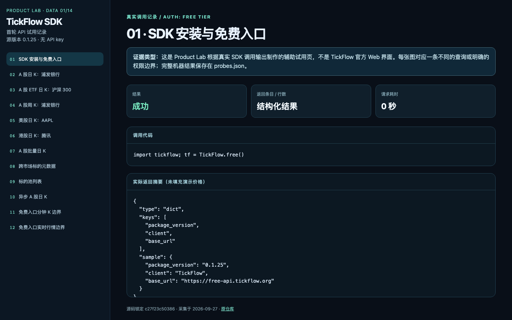
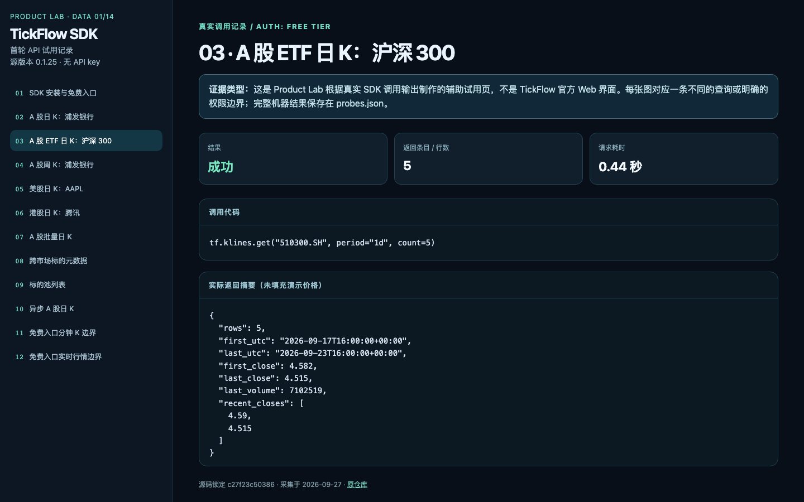
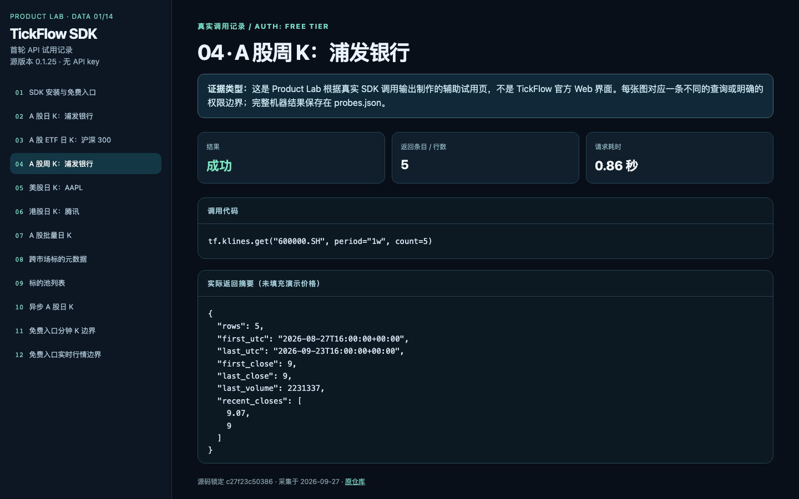
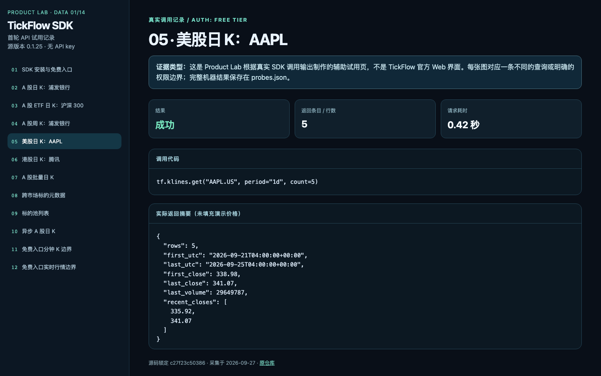
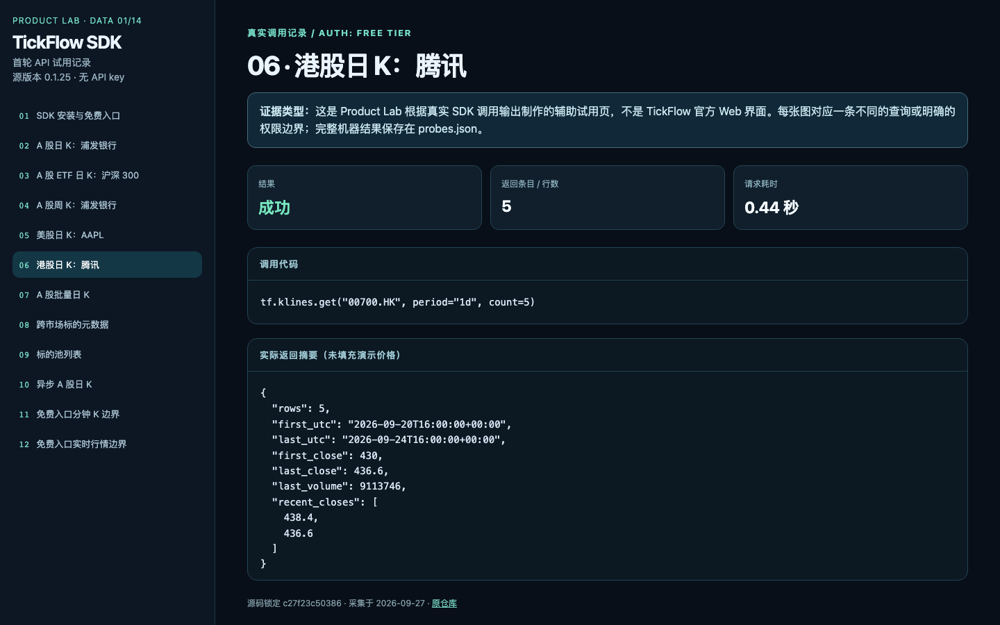
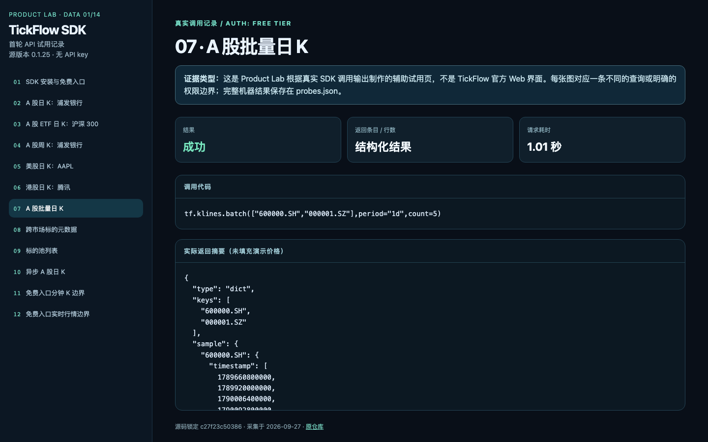
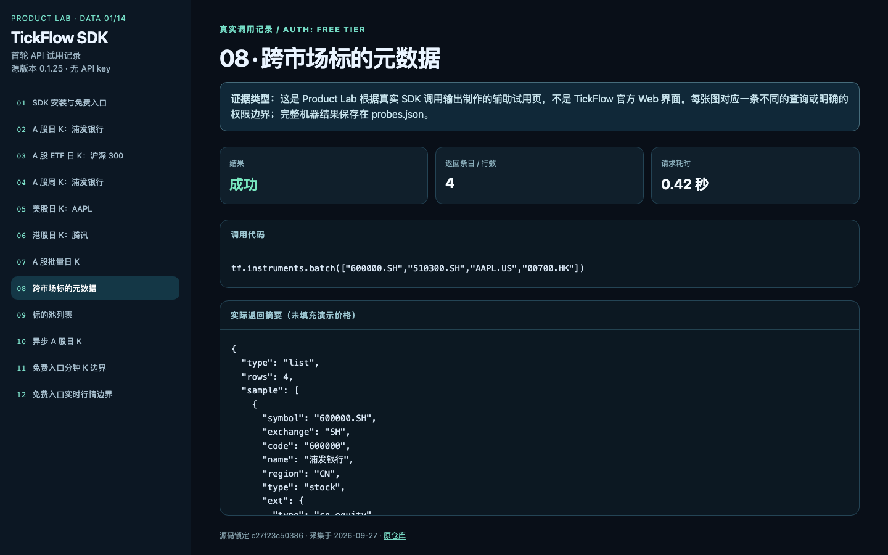
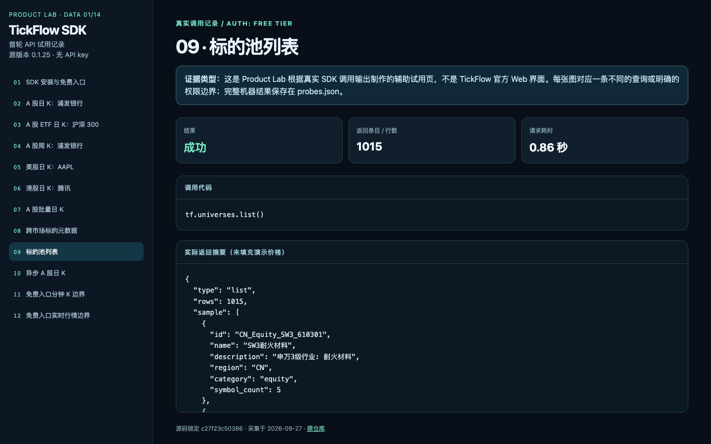
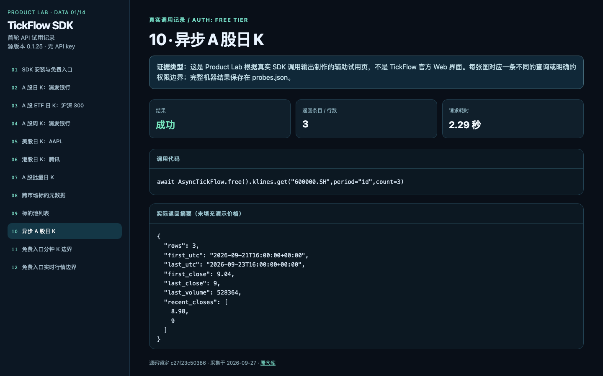
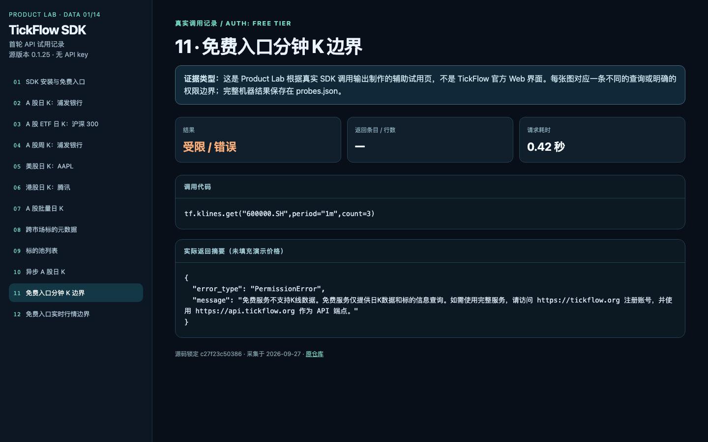

# tickflow · 全部 12 张截图

[评测判断](README.md) · [数据排名](../README.md)

截图采集于 2026-09-27。原生界面与 Product Lab 辅助页逐张标明；后者不属于上游产品 UI。

## 01. 01 tickflow api

来源：**Product Lab 辅助证据页（非上游原生 UI）**。

## 02. 02 tickflow api

来源：**Product Lab 辅助证据页（非上游原生 UI）**。

## 03. 03 tickflow api

来源：**Product Lab 辅助证据页（非上游原生 UI）**。

## 04. 04 tickflow api

来源：**Product Lab 辅助证据页（非上游原生 UI）**。

## 05. 05 tickflow api

来源：**Product Lab 辅助证据页（非上游原生 UI）**。

## 06. 06 tickflow api

来源：**Product Lab 辅助证据页（非上游原生 UI）**。

## 07. 07 tickflow api

来源：**Product Lab 辅助证据页（非上游原生 UI）**。

## 08. 08 tickflow api

来源：**Product Lab 辅助证据页（非上游原生 UI）**。

## 09. 09 tickflow api

来源：**Product Lab 辅助证据页（非上游原生 UI）**。

## 10. 10 tickflow api

来源：**Product Lab 辅助证据页（非上游原生 UI）**。

## 11. 11 tickflow api

来源：**Product Lab 辅助证据页（非上游原生 UI）**。

## 12. 12 tickflow api

来源：**Product Lab 辅助证据页（非上游原生 UI）**。

