# watchlist · 全部 16 张截图

[评测判断](README.md) · [数据排名](../README.md)

截图采集于 2026-09-27。原生界面与 Product Lab 辅助页逐张标明；后者不属于上游产品 UI。

## 01. 01 native tree y0

来源：**原生静态页面**。

## 02. 02 native tree y250

来源：**原生静态页面**。

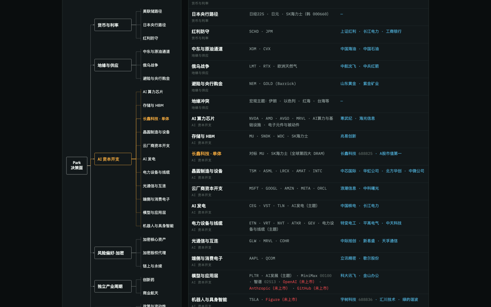

## 03. 03 native tree y500

来源：**原生静态页面**。

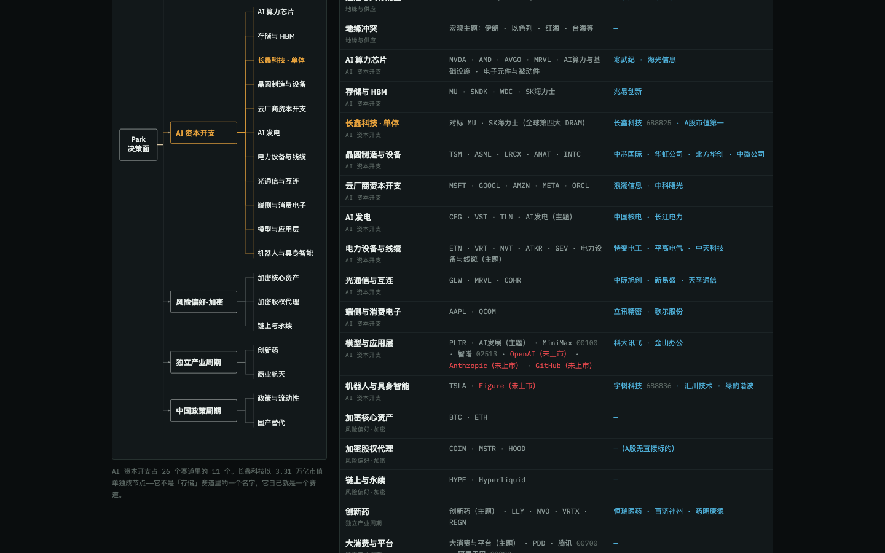

## 04. 04 native tree y750

来源：**原生静态页面**。

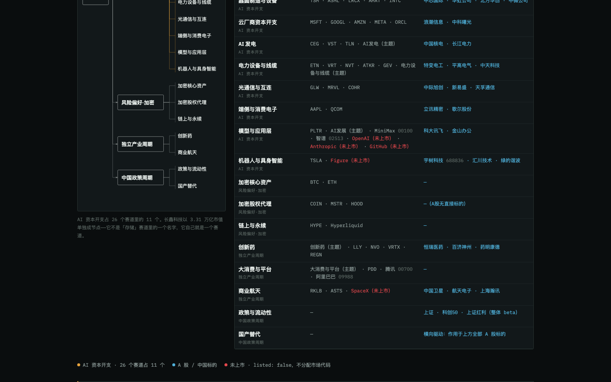

## 05. 05 native tree y1000

来源：**原生静态页面**。

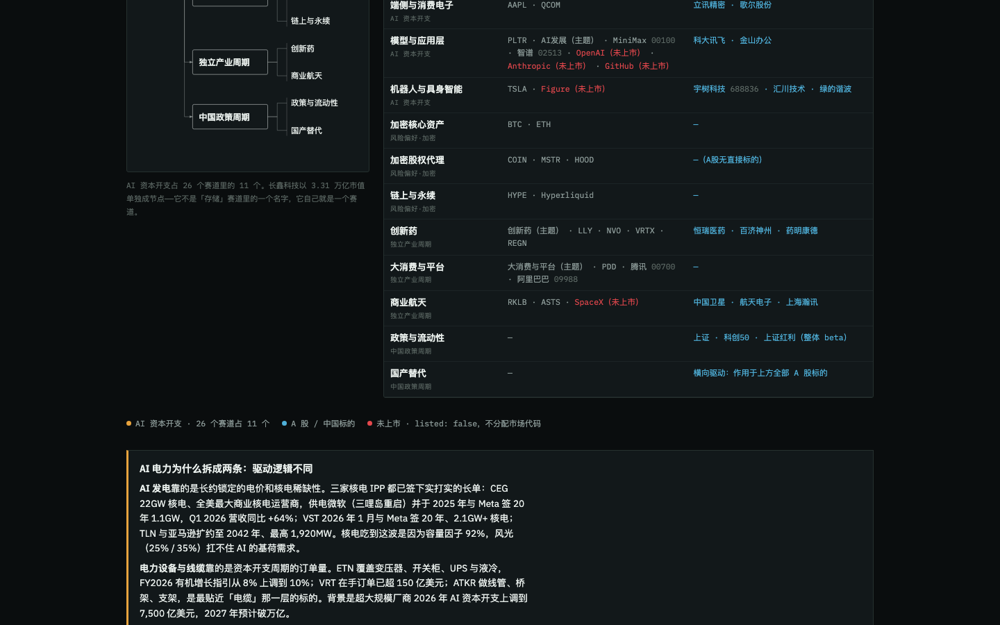

## 06. 06 native tree y1250

来源：**原生静态页面**。

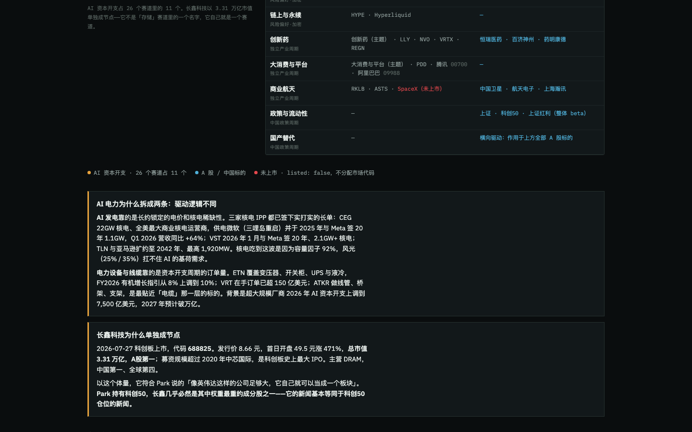

## 07. 07 native tree y1500

来源：**原生静态页面**。

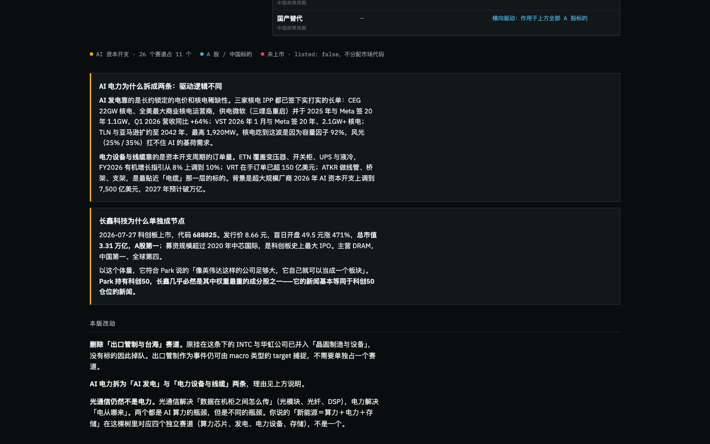

## 08. 08 native tree y1800

来源：**原生静态页面**。

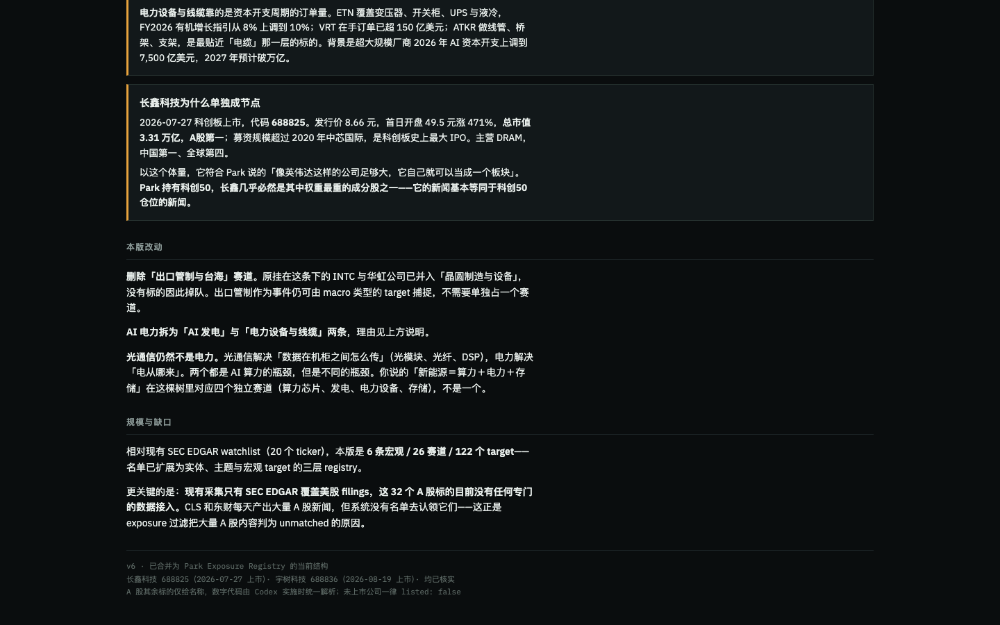

## 09. 09 source check

来源：**Product Lab 辅助证据页（非上游原生 UI）**。

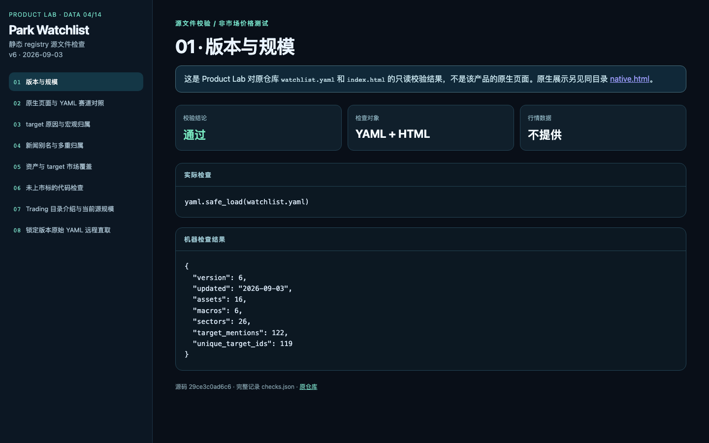

## 10. 10 source check

来源：**Product Lab 辅助证据页（非上游原生 UI）**。

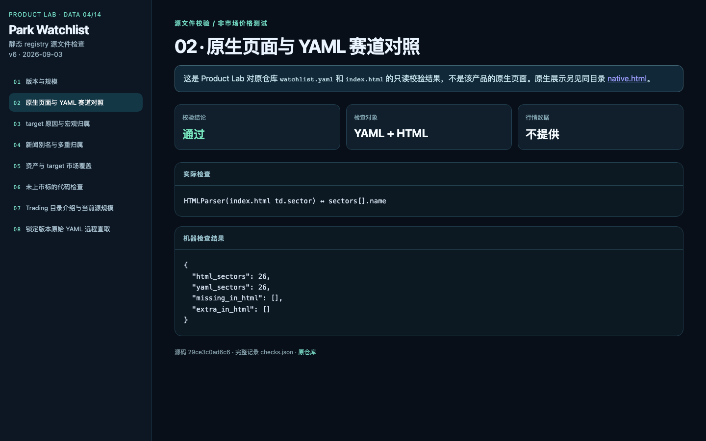

## 11. 11 source check

来源：**Product Lab 辅助证据页（非上游原生 UI）**。

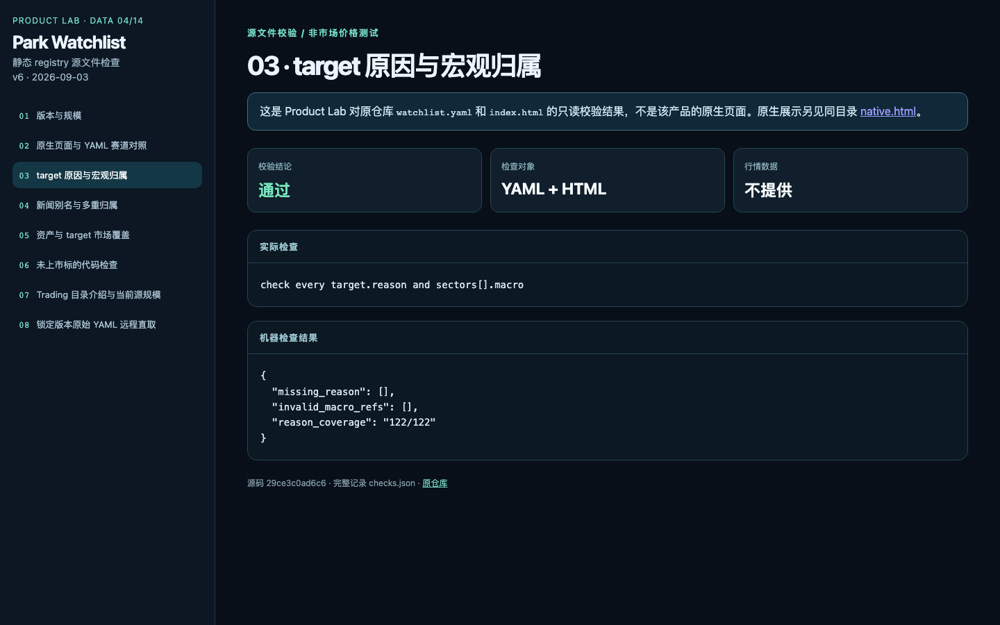

## 12. 12 source check

来源：**Product Lab 辅助证据页（非上游原生 UI）**。

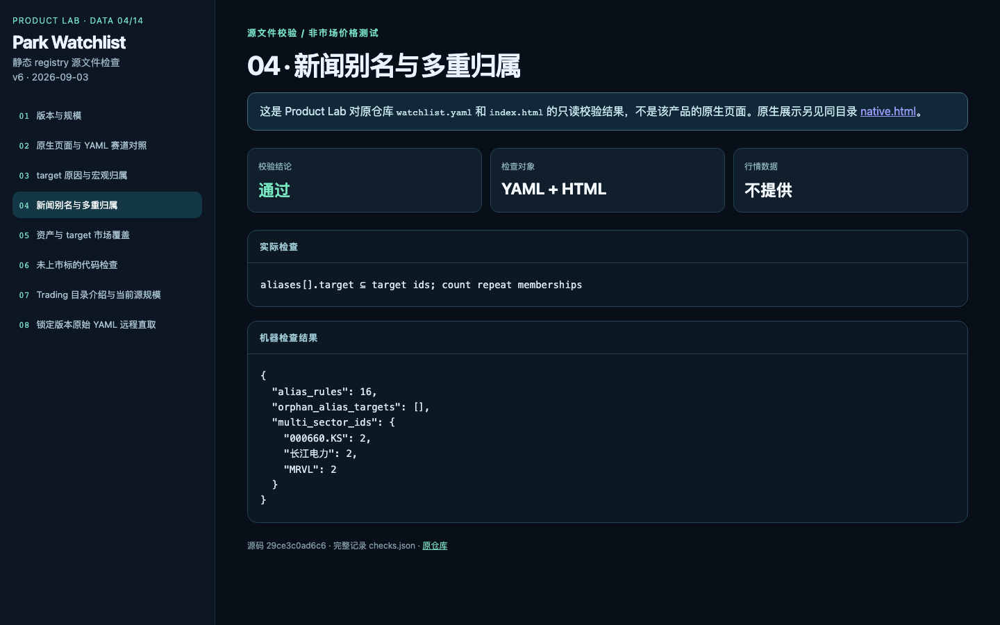

## 13. 13 source check

来源：**Product Lab 辅助证据页（非上游原生 UI）**。

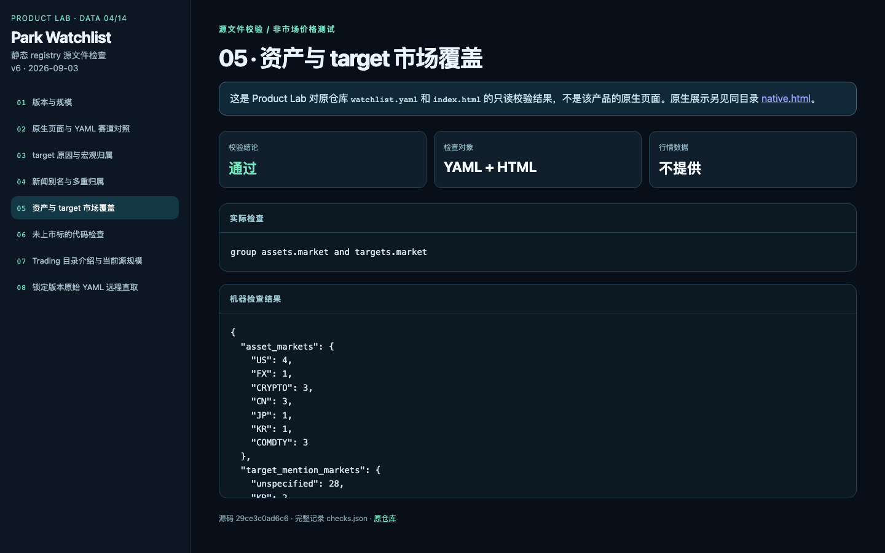

## 14. 14 source check

来源：**Product Lab 辅助证据页（非上游原生 UI）**。

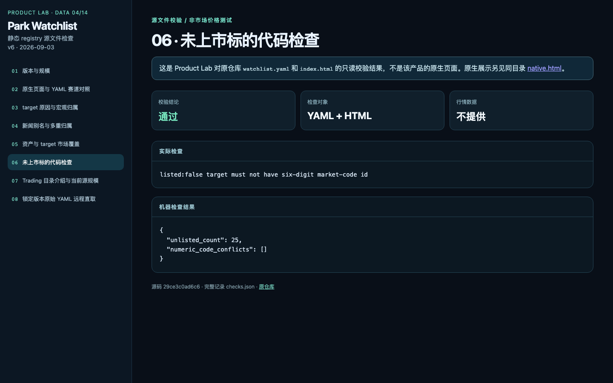

## 15. 15 source check

来源：**Product Lab 辅助证据页（非上游原生 UI）**。

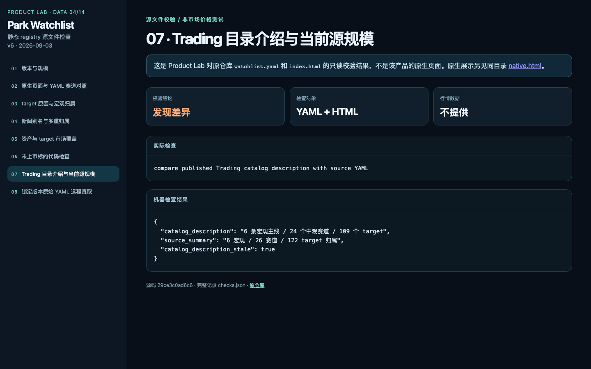

## 16. 16 source check

来源：**Product Lab 辅助证据页（非上游原生 UI）**。

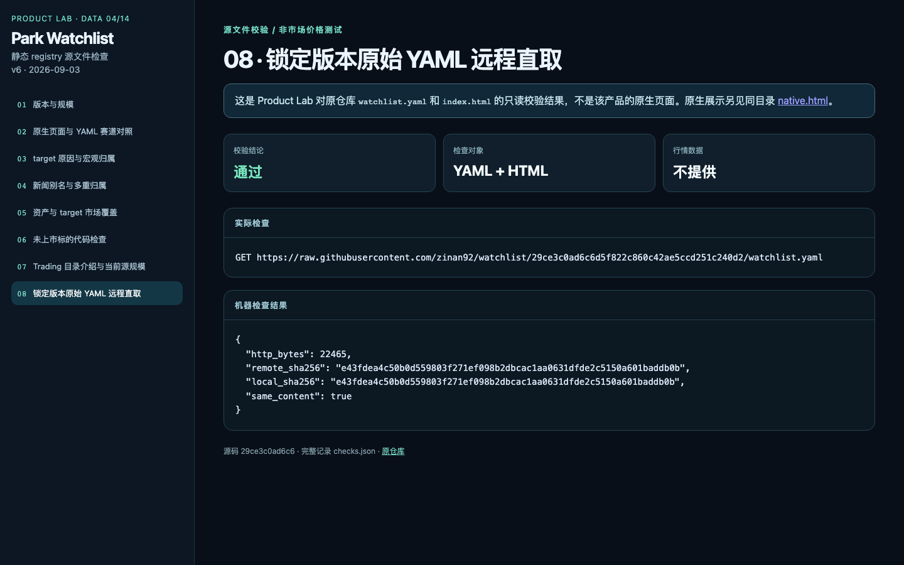
