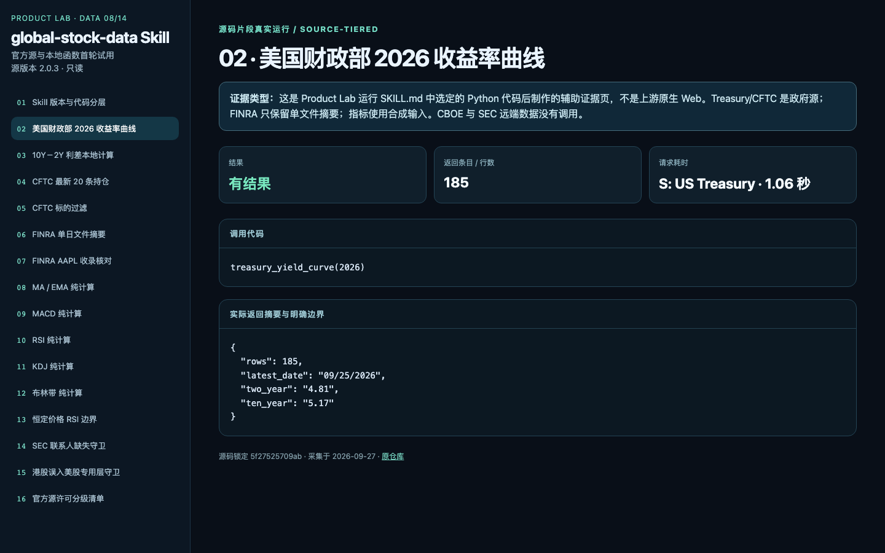

# 8. global-stock-data · 67/100

官方宏观与本地指标可用；期权主卖点未实测

[原仓库](https://github.com/simonlin1212/global-stock-data) · [全部 16 张截图](screenshots.md) · [实测记录](trial-findings.md) · [机器摘要](evidence/probes.json) · [返回排名](../README.md)

**实际定位：** 美股／港股研究数据与技术指标 Agent Skill

**界面来源：** Python Skill；截图为辅助证据页

**首轮试用，不是完整功能认证。** 分数衡量这次实际取得的核心结果、数据质量、覆盖、上手与运行表现，不是盈利评级，也不等于生产环境或商业许可验收。不同角色的元数据库、行情 SDK、新闻管线不可仅凭几分之差互换；无 Key、周末、空隔离库造成的未验证能力单独说明。目录原分类和锁定版本保持不变。

## 评分

| 维度 | 得分 |
|---|---:|
| 核心结果实测 | 22/35 |
| 数据可信度／时效 | 18/25 |
| 覆盖与深度 | 12/15 |
| 上手与复现 | 8/15 |
| 运行稳定性 | 7/10 |
| **合计** | **67/100** |

**判断依据：** 美国财政部、CFTC、FINRA 单日文件及本地指标函数有真实结果；SEC 缺真实 contact、CBOE 路径未调用。真实与合成输入在证据中分开标注。

**下一次最有价值的验证：** 在允许的授权条件下验证 SEC 与 CBOE；给各来源加时戳、许可与复现记录。

## 版本与范围

- 实测日期：2026-09-27
- 实测源码：`5f27525709ab043b91e53d7a420ce6d46e66a0ce`
- 目录锁：`fbf0ae47d64e24fdfce5fbc724b3041adc510739`
- 公开截图：16 张；含空值、失败、辅助页，不代表全部功能通过。
