# global-stock-data · 全部 16 张截图

[评测判断](README.md) · [数据排名](../README.md)

截图采集于 2026-09-27。原生界面与 Product Lab 辅助页逐张标明；后者不属于上游产品 UI。

## 01. 01 global stock data

来源：**Product Lab 辅助证据页（非上游原生 UI）**。

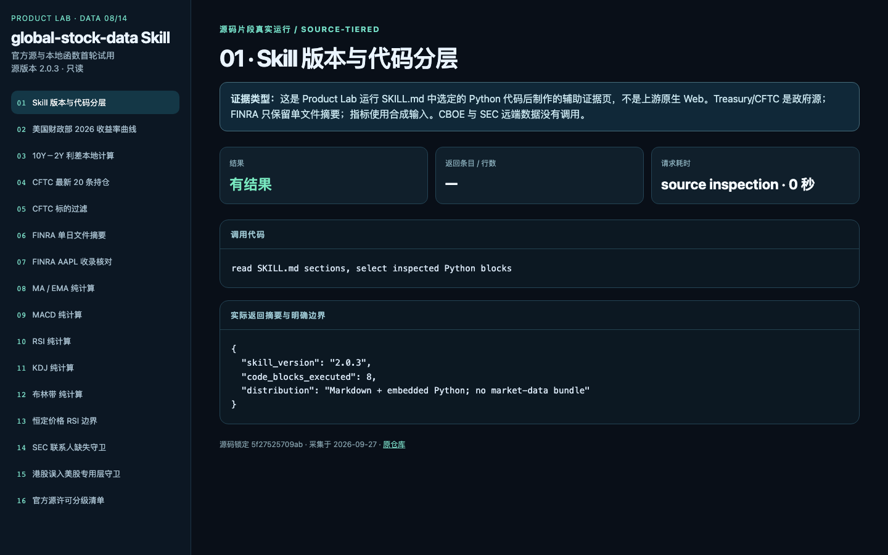

## 02. 02 global stock data

来源：**Product Lab 辅助证据页（非上游原生 UI）**。

## 03. 03 global stock data

来源：**Product Lab 辅助证据页（非上游原生 UI）**。

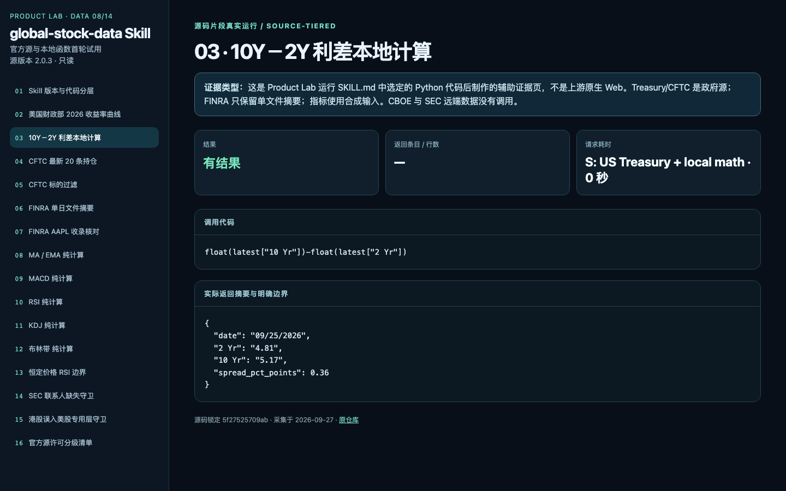

## 04. 04 global stock data

来源：**Product Lab 辅助证据页（非上游原生 UI）**。

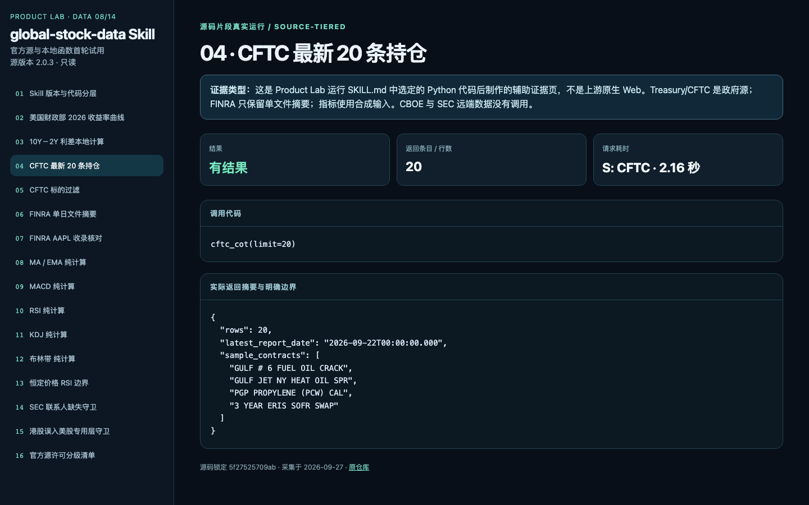

## 05. 05 global stock data

来源：**Product Lab 辅助证据页（非上游原生 UI）**。

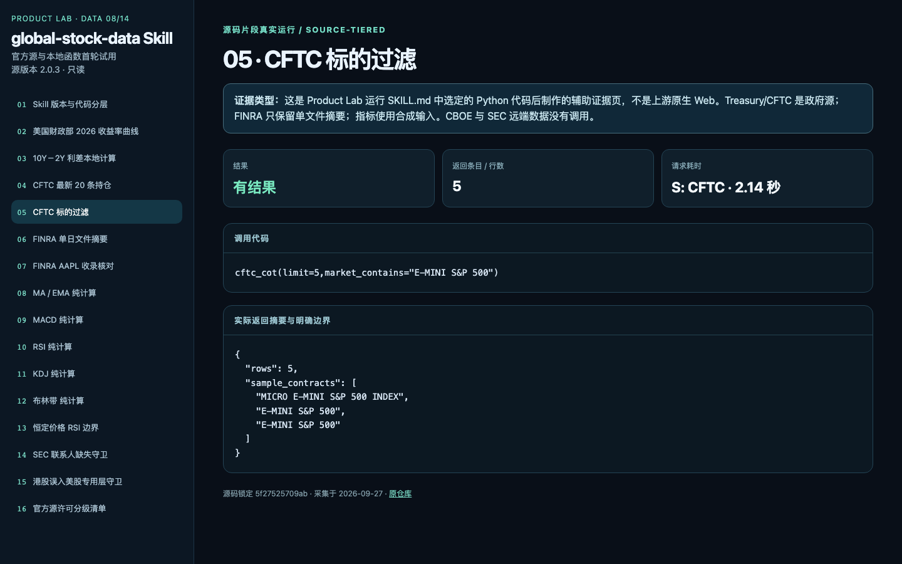

## 06. 06 global stock data

来源：**Product Lab 辅助证据页（非上游原生 UI）**。

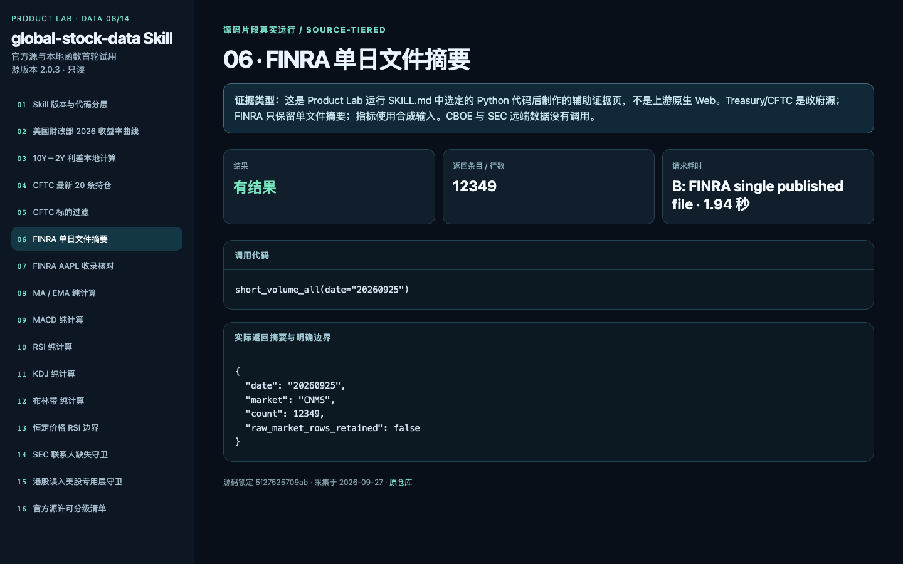

## 07. 07 global stock data

来源：**Product Lab 辅助证据页（非上游原生 UI）**。

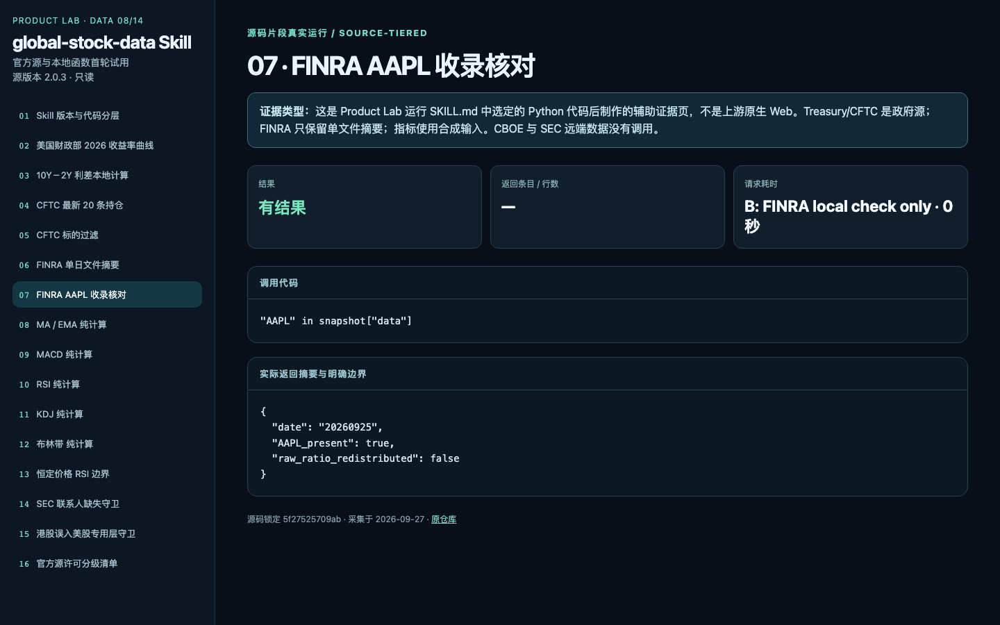

## 08. 08 global stock data

来源：**Product Lab 辅助证据页（非上游原生 UI）**。

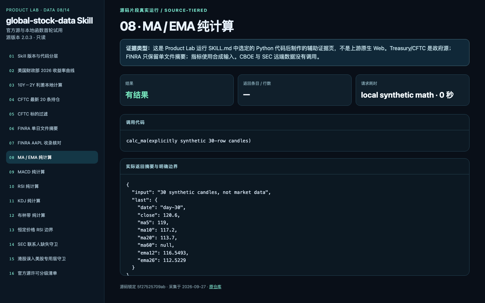

## 09. 09 global stock data

来源：**Product Lab 辅助证据页（非上游原生 UI）**。

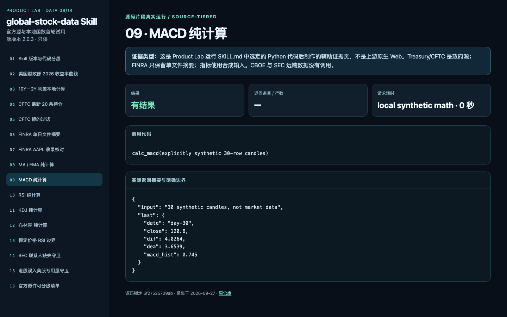

## 10. 10 global stock data

来源：**Product Lab 辅助证据页（非上游原生 UI）**。

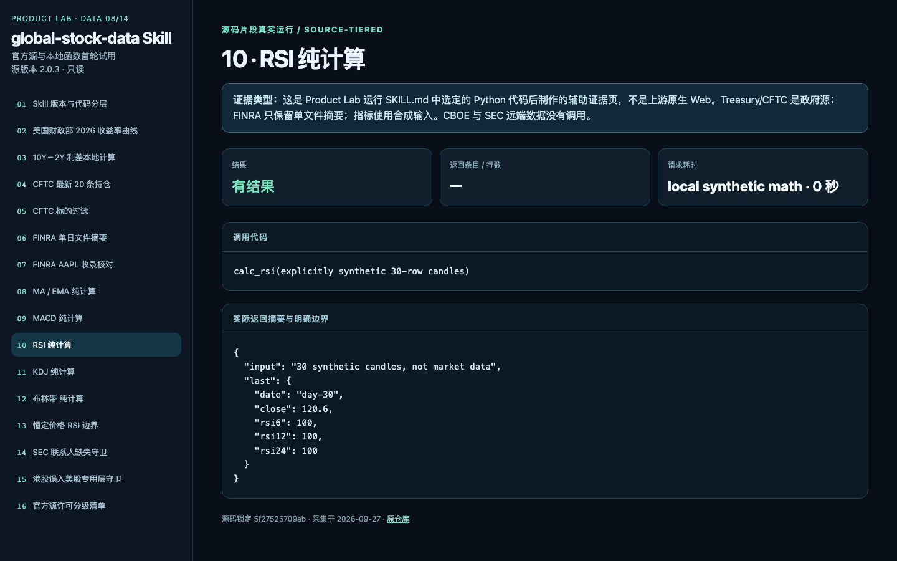

## 11. 11 global stock data

来源：**Product Lab 辅助证据页（非上游原生 UI）**。

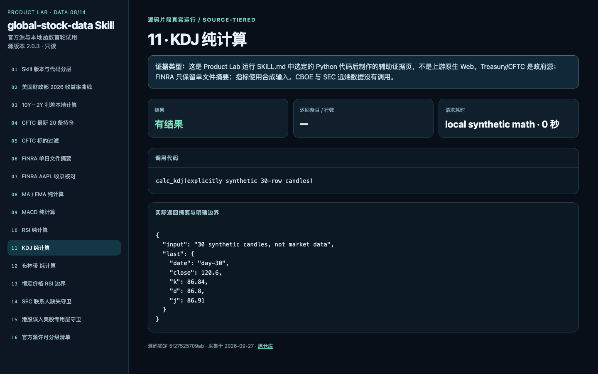

## 12. 12 global stock data

来源：**Product Lab 辅助证据页（非上游原生 UI）**。

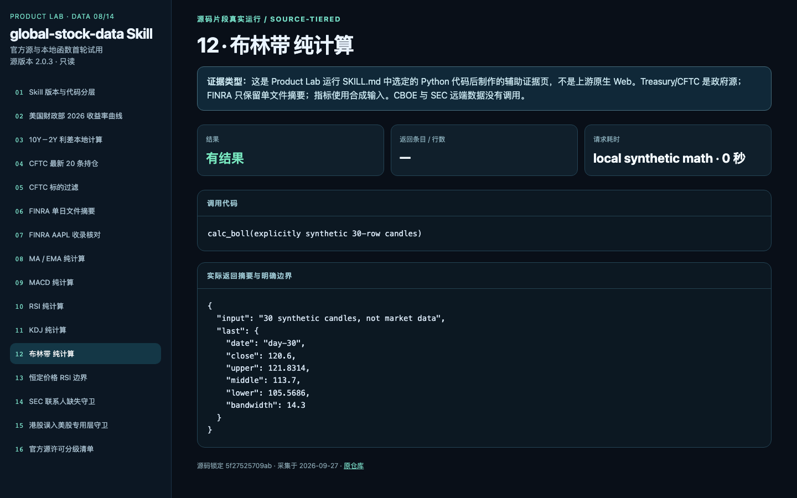

## 13. 13 global stock data

来源：**Product Lab 辅助证据页（非上游原生 UI）**。

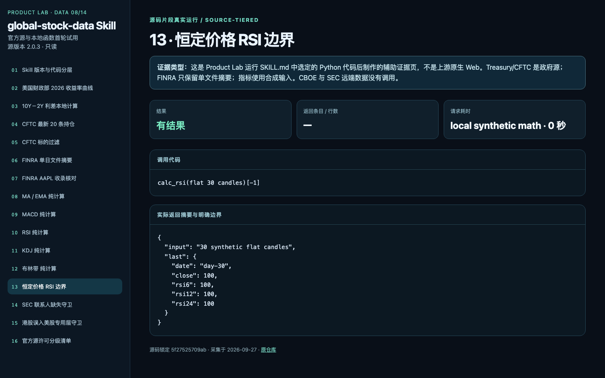

## 14. 14 global stock data

来源：**Product Lab 辅助证据页（非上游原生 UI）**。

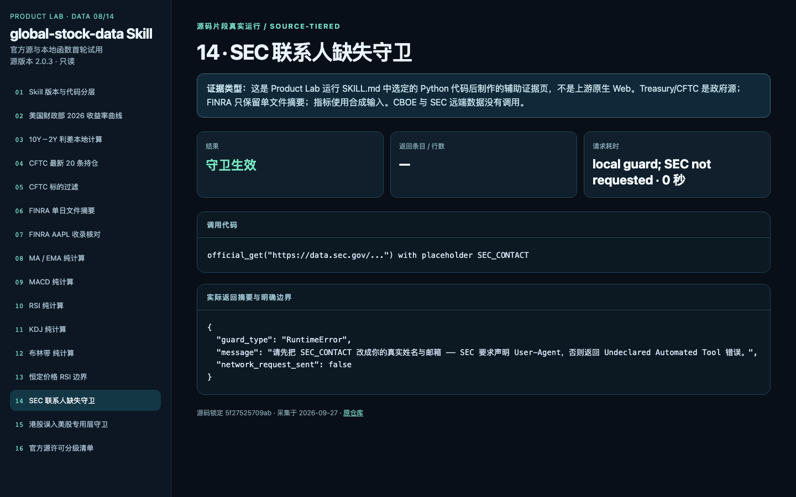

## 15. 15 global stock data

来源：**Product Lab 辅助证据页（非上游原生 UI）**。

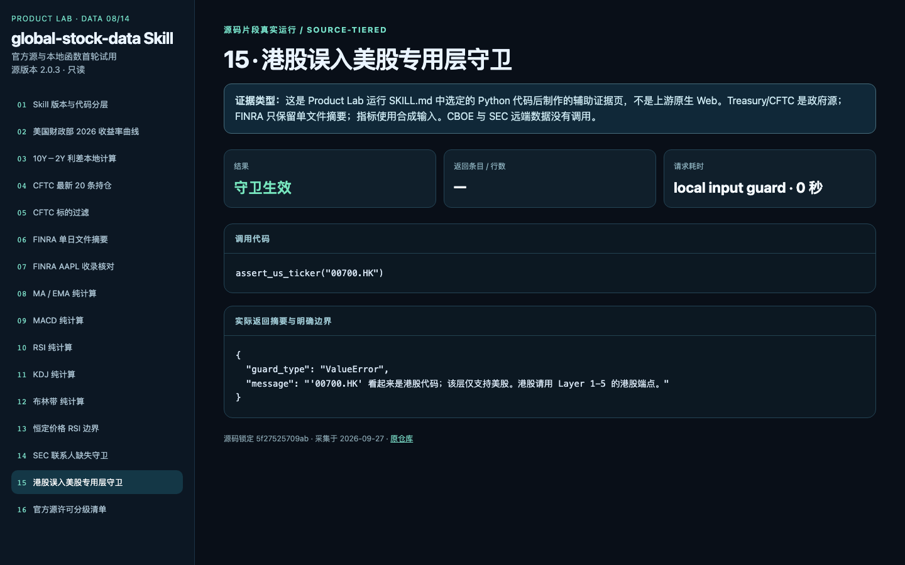

## 16. 16 global stock data

来源：**Product Lab 辅助证据页（非上游原生 UI）**。

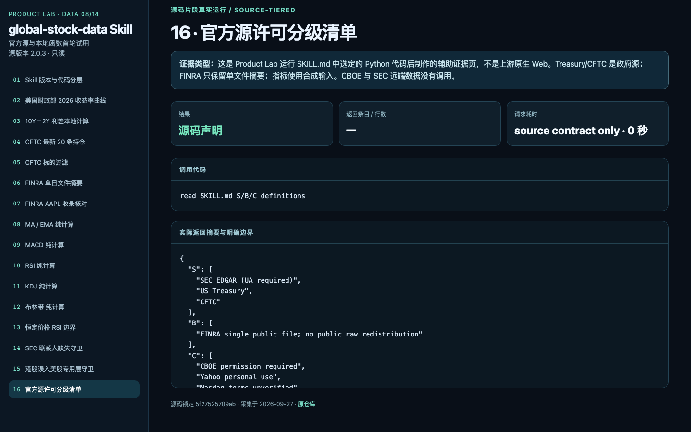
