<!-- 本文件由 scripts/render-hub.py 生成，请改 evaluations/assessments/*.json 后重跑 -->
# Data · 评测

**目标：** 取得正确、及时、完整的交易数据，最好免费，并且下游能直接接入。

**环节：** 1 数据获取、2 清洗与标准化、3 数据存档

[评测框架](../FRAMEWORK.md) · [Pipeline 总览](../README.md) · [返回目录](../../README.md)

评级：✅ 做到 · 🟡 部分 · ❌ 未做到 · ⬜ 未验证 · — 不适用。分数 = Σ(权重 × 评级值) ÷ Σ适用权重 × 100；已验证 = 做到、部分、未做到三种评级占适用权重的比例。环节：● 实测跑通 · ◐ 源码可见未实测 · ○ 无 · · 不在其角色内；排名表的环节列按 1 获取到 10 看板的顺序排列。

## 评判标准

| 标准 | 权重 | 怎么判 |
|---|---:|---|
| D1 正确 | 25 | 与第二来源交叉核对一致（价格、代码、字段）；错误和空值有明确信号，不是静默返回 200 或空表。 |
| D2 及时 | 20 | 声明的时效（实时、延时、日终）与实测一致；时间戳语义清楚，能区分成交时间和取数时间。 |
| D3 完整 | 20 | 市场（A 股、美股、港股、加密、商品）、资产类别、字段、历史深度、缺失率符合声明。 |
| D4 免费可得 | 15 | 无 key 时可用的范围、限流、许可条款；免费层能否支撑日常研究。 |
| D5 可接入 | 20 | 输出是标准形态（OHLCV、DataFrame、稳定 JSON schema）；安装依赖可控；清洗与存档要么内置，要么交给下游时边界清楚。 |

## 排名

**怎么读这个排名：** 前两名 FinanceDatabase 与 watchlist 是参考数据（证券代码、分类、研究名单），不提供价格；它们高分是因为窄声明被完整兑现。要行情数据，看 datafeed（多市场标准化 OHLCV）和 akshare（历史接口覆盖最广，实时须逐个核时效）。

| 排名 | 产品 | 分数 | 已验证 | 环节 1–10 | 实测 | 卡片 |
|---:|---|---:|---:|---|---|---|
| 1 | [FinanceDatabase](https://github.com/JerBouma/FinanceDatabase) | **80** | 100% | `●●●·······` | ✅ 七类本地数据集合计 305,512 行全部可加载，AAPL / 600519.SS / 0700.HK 精确检索正确；BTC-USD 缺失与 .SH 后缀不匹配是接入边界。 | [卡片](README.md#financedatabase) |
| 1 | [watchlist](https://github.com/zinan92/watchlist) | **80** | 100% | `·●●·······` | ✅ YAML 解析与引用校验 7/8 通过：16 资产 / 6 宏观 / 26 赛道 / 119 唯一 target；唯一 finding 是目录摘要（24/109）已过时。 | [卡片](README.md#watchlist) |
| 3 | [datafeed](https://github.com/zinan92/datafeed) | **73** | 100% | `●●◐······●` | ✅ 上证、茅台、AAPL、BTC、美债 10Y、黄金均返回 count=5 的标准蜡烛；健康矩阵 0 单元有数据、ticker 搜索为 0、免费源标 entitlement_unverified。 | [卡片](README.md#datafeed) |
| 4 | [akshare](https://github.com/akfamily/akshare) | **68** | 100% | `●◐○·······` | 🟡 A 股日/分钟、ETF、AAPL、指数、期货、LPR、新闻真实取数至 09-24/25；东财日线 SSL 错误、ETF 现价 502，crypto_js_spot 仍为 2020/2023 旧价，FX 25 行买卖价全为 0。 | [卡片](README.md#akshare) |
| 5 | [tickflow](https://github.com/tickflow-org/tickflow) | **60** | 100% | `●●○·······` | 🟡 免费入口取得 A 股、ETF、美股、港股日/周 K 与标的元数据；分钟线与实时行情被 PermissionError 拒绝，财报未测。 | [卡片](README.md#tickflow) |
| 6 | [a-stock-data](https://github.com/simonlin1212/a-stock-data) | **58** | 100% | `●●○◐······` | 🟡 腾讯/新浪路径真实取得报价、日/周/5 分钟 K、复权因子与财报；百度均线 K 返回空且不报错，87 端点只测样本 16 个。 | [卡片](README.md#a-stock-data) |
| 7 | [adata](https://github.com/1nchaos/adata) | **50** | 100% | `●●○·······` | 🟡 首次取得茅台 18 根日 K / 13 根周 K，补依赖后 ETF、指数分时、盘口有返回；复测茅台日 K 变 0 行、周 K 超时，两只股票现价因腾讯解析条件不匹配返回空表。 | [卡片](README.md#adata) |
| 7 | [FinanceMCP](https://github.com/guangxiangdebizi/FinanceMCP) | **50** | 100% | `●○○●······` | 🟡 无凭证时只公开 4 个工具：Binance 加密日/分钟线与百度新闻有结果；A 股、美股路由返回“没有已配置的数据源”。 | [卡片](README.md#financemcp) |
| 7 | [global-stock-data](https://github.com/simonlin1212/global-stock-data) | **50** | 100% | `●◐○●······` | 🟡 财政部收益率曲线 185 日、CFTC 20 条、FINRA 单日 12,349 符号有真实结果；主卖点 CBOE 期权、SEC EDGAR 与行情报价本轮未调用。 | [卡片](README.md#global-stock-data) |
| 7 | [quant-data-pipeline](https://github.com/zinan92/quant-data-pipeline) | **50** | 100% | `●◐◐◐◐··◐●●` | 🟡 商品 4 品种、加密 15 品种实时与 K 线、美股 5 指数、本地纸盘买卖闭环成功；A 股搜索/行情 500、K 线 404、概念为 0，新闻请求超时后拖垮后端。 | [卡片](README.md#quant-data-pipeline) |
| 11 | [intel](https://github.com/zinan92/intel) | **40** | 100% | `●●●●·····●` | 🟡 隔离实例数分钟采集 4,610 篇、搜索可用、LLM 评分 500 篇；63 个事件 source_count 全为 1，跨源聚类没有通过样本。 | [卡片](README.md#intel) |
| 11 | [tradingview-mcp](https://github.com/atilaahmettaner/tradingview-mcp) | **40** | 80% | `●○○●●●····` | 🟡 39 个工具中 23 个场景有结果：美/A/港股筛选、BTC 技术分析与回测；双标的报价 SSL 失败，新闻/情绪需 Key，周日无法验证实时。 | [卡片](README.md#tradingview-mcp) |
| 13 | [TradingView-API](https://github.com/Mathieu2301/TradingView-API) | **38** | 75% | `●○○◐······` | 🟡 无 SESSION/SIGNATURE 的 SimpleChart 示例加载 BINANCE:BTCEUR 日线，再切换 ETHEUR、15 分钟与 Heikin Ashi 后正常关闭；50 tests passed、16 skipped，私有指标与账户 API 因无 cookie 未测，股票标的也未实取。 | [卡片](README.md#tradingview-api) |
| 14 | [tvscreener](https://github.com/deepentropy/tvscreener) | **28** | 55% | `●◐○·······` | 🟡 无凭证的 S&P 500 公开查询 0.74 秒返回 10 行 DataFrame（含 NASDAQ:NVDA）；其余五类只在本地代码生成器构造了查询，没有实取；Valuation 预设生成了包里不存在的 StockField。 | [卡片](README.md#tvscreener) |

### 证据不足，不排名

| 产品 | 原因 | 卡片 |
|---|---|---|
| [Financial-API](https://github.com/HiThink-Tech/Financial-API) | 已验证 35%，低于 40%：无 API Key：CLI 构建通过、104 项能力契约与本地 DuckDB 可读，但远端市场数据行数为 0，核心用途本轮无法判定。 | [卡片](README.md#financial-api) |

## 分类说明

- **tvscreener** 目录归 Dashboard，按本类标准评测并参与本类排名。
- **TradingView-API** 目录归 Dashboard，按本类标准评测并参与本类排名。
- **trump-code** 目录归本类，按 Trading Strategy 标准评测，见 [trump-code](../trading-strategy/README.md#trump-code)。

## 产品卡片

### 1. FinanceDatabase · 80/100 · 已验证 100%

| 1 获取 | 2 清洗 | 3 存档 | 4 指标 | 5 策略 | 6 回测 | 7 管理 | 8 风控 | 9 执行 | 10 看板 |
| :--: | :--: | :--: | :--: | :--: | :--: | :--: | :--: | :--: | :--: |
| ● | ● | ● | · | · | · | · | · | · | · |

**声称：** 30 万+ 证券符号数据库，覆盖股票、ETF、基金、指数、货币、加密与货币市场；不提供行情。

**实测：** ✅ 七类本地数据集合计 305,512 行全部可加载，AAPL / 600519.SS / 0700.HK 精确检索正确；BTC-USD 缺失与 .SH 后缀不匹配是接入边界。

| 标准 | 权重 | 评级 | 证据 |
|---|---:|:--:|---|
| D1 正确 | 25 | ✅ | 各类行数与 README 一致（Equities 112,707 等）；AAPL、600519.SS、0700.HK 名称/交易所/行业正确；无效国家 Atlantis 抛 ValueError，不静默。 [图1](2026-09-27/07-financedatabase/images/04-financedatabase.png) [图2](2026-09-27/07-financedatabase/images/05-financedatabase.png) [图3](2026-09-27/07-financedatabase/images/06-financedatabase.png) [图4](2026-09-27/07-financedatabase/images/20-financedatabase.png) |
| D2 及时 | 20 | 🟡 | 静态元数据库；默认远端 fd.Equities() 指向可变 main 且不标快照日期，同一代码版本可能取到不同名单；use_local_location=True 或固定 commit 才可复现。 [图1](2026-09-27/07-financedatabase/images/02-financedatabase.png) [图2](2026-09-27/07-financedatabase/images/01-financedatabase.png) |
| D3 完整 | 20 | 🟡 | 七类 305,512 行，上海交易所筛选 1,523、美国 IT 3,297、ETF 股权类 3,535；但 Crypto 3,367 行中 BTC-USD 精确查询为 0，默认 select 排除退市后 112,707 缩为 102,303。 [图1](2026-09-27/07-financedatabase/images/01-financedatabase.png) [图2](2026-09-27/07-financedatabase/images/15-financedatabase.png) [图3](2026-09-27/07-financedatabase/images/03-financedatabase.png) |
| D4 免费可得 | 15 | ✅ | pip 从源码安装、GitHub Raw 远端约 4.96 秒取 112,707 行，无 key。 [图1](2026-09-27/07-financedatabase/images/02-financedatabase.png) [图2](2026-09-27/07-financedatabase/images/01-financedatabase.png) |
| D5 可接入 | 20 | ✅ | select/search 返回 pandas DataFrame，本地或远端均可；符号口径须转换（600519.SS 非 .SH，0700.HK 非 00700.HK），无行情由声明划清。 [图1](2026-09-27/07-financedatabase/images/09-financedatabase.png) [图2](2026-09-27/07-financedatabase/images/08-financedatabase.png) [图3](2026-09-27/07-financedatabase/images/07-financedatabase.png) |

**适合：** 发现“有哪些标的、在哪个市场/行业”的静态符号与分类参考。  
**不适合：** 任何价格、OHLCV 或基本面更新需求。

**未验证：** 全部条目的外部身份核对；近期上市/退市标的的收录时效  
**下一步：** 固定数据快照版本并抽样核对近期上市/退市标的；行情场景需另接价格源。

证据：[20 张截图](2026-09-27/07-financedatabase/screenshots.md) · [实测记录](2026-09-27/07-financedatabase/trial-findings.md) · 实测版本 `d0b95bd51f9c` · 目录锁 `a174c97d3bba` · Python 库 · A股、美股、港股、加密、外汇

备注：实测源码 2.4.0 晚于目录锁。

### 1. watchlist · 80/100 · 已验证 100%

<a href="2026-09-27/04-watchlist/screenshots.md">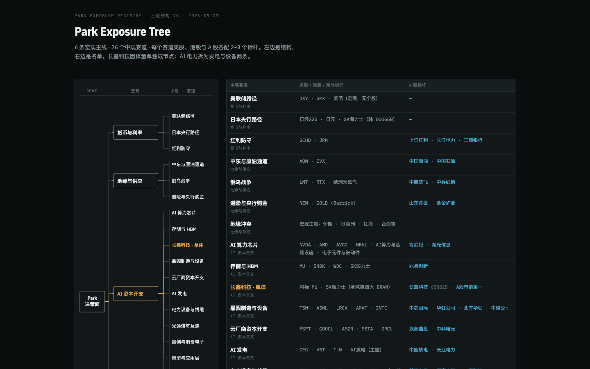</a>

| 1 获取 | 2 清洗 | 3 存档 | 4 指标 | 5 策略 | 6 回测 | 7 管理 | 8 风控 | 9 执行 | 10 看板 |
| :--: | :--: | :--: | :--: | :--: | :--: | :--: | :--: | :--: | :--: |
| · | ● | ● | · | · | · | · | · | · | · |

**声称：** Park Exposure Registry：行情与新闻共用的唯一权威名单，6 条宏观主线 / 24 个中观赛道 / 109 个 target。

**实测：** ✅ YAML 解析与引用校验 7/8 通过：16 资产 / 6 宏观 / 26 赛道 / 119 唯一 target；唯一 finding 是目录摘要（24/109）已过时。

| 标准 | 权重 | 评级 | 证据 |
|---|---:|:--:|---|
| D1 正确 | 25 | ✅ | 原生页 26 个赛道与 YAML 完全一致，122/122 归属有 reason，16 条别名无孤儿引用，25 个未上市标的无代码冲突；688825、688836 上市身份对回上交所公告。 [图1](2026-09-27/04-watchlist/images/10-source-check.png) [图2](2026-09-27/04-watchlist/images/11-source-check.png) [图3](2026-09-27/04-watchlist/images/12-source-check.png) |
| D2 及时 | 20 | ✅ | 静态名单：YAML 明确声明 version 6、updated 2026-09-03；固定 commit 远程直取 22,465 字节 SHA-256 与本地一致，快照可复验。 [图1](2026-09-27/04-watchlist/images/09-source-check.png) [图2](2026-09-27/04-watchlist/images/16-source-check.png) |
| D3 完整 | 20 | 🟡 | 资产覆盖 US 4 / CN 3 / CRYPTO 3 / COMDTY 3 / FX 1 / JP 1 / KR 1，target 归属 US 49 / CN 39 / HK 4 / KR 2；目录摘要仍写 24 赛道 / 109 target，119 个实体的外部事实只抽查 2 个。 [图1](2026-09-27/04-watchlist/images/13-source-check.png) [图2](2026-09-27/04-watchlist/images/15-source-check.png) [图3](2026-09-27/04-watchlist/images/01-native-tree-y0.png) |
| D4 免费可得 | 15 | ✅ | 公开 GitHub 仓库，无 key；固定 commit Raw URL 直取成功。 [图1](2026-09-27/04-watchlist/images/16-source-check.png) |
| D5 可接入 | 20 | 🟡 | 机器可读 YAML，ID、别名、宏观—赛道—对象关系稳定；不含价格由设计决定，但下游行情/新闻系统是否读取同一快照本轮未测，页面无搜索筛选。 [图1](2026-09-27/04-watchlist/images/09-source-check.png) [图2](2026-09-27/04-watchlist/images/01-native-tree-y0.png) |

**适合：** 给行情与新闻系统提供统一的标的、赛道与研究对象名单。  
**不适合：** 任何需要价格、K 线或实时行情的场景。

**未验证：** 下游新闻 triage 与行情服务是否消费同一快照；119 个实体的全部外部事实  
**下一步：** 让 Trading 目录摘要随 registry 版本自动更新，并验证下游系统确实读取同一快照。

证据：[16 张截图](2026-09-27/04-watchlist/screenshots.md) · [实测记录](2026-09-27/04-watchlist/trial-findings.md) · 实测版本 `29ce3c0ad6c6` · 目录锁 `owned source` · 静态数据集 · A股、美股、港股、加密、商品、外汇、宏观

备注：目录描述“24 赛道 / 109 target”与当前源码“26 赛道 / 122 次归属”不一致，属目录摘要过时。

### 3. datafeed · 73/100 · 已验证 100%

| 1 获取 | 2 清洗 | 3 存档 | 4 指标 | 5 策略 | 6 回测 | 7 管理 | 8 风控 | 9 执行 | 10 看板 |
| :--: | :--: | :--: | :--: | :--: | :--: | :--: | :--: | :--: | :--: |
| ● | ● | ◐ | · | · | · | · | · | · | ● |

**声称：** 行情数据：输入 ticker+timeframe → 输出 OHLCV candles；A 股/美股/加密/商品。

**实测：** ✅ 上证、茅台、AAPL、BTC、美债 10Y、黄金均返回 count=5 的标准蜡烛；健康矩阵 0 单元有数据、ticker 搜索为 0、免费源标 entitlement_unverified。

| 标准 | 权重 | 评级 | 证据 |
|---|---:|:--:|---|
| D1 正确 | 25 | ✅ | 茅台 2026-09-24 收 1237.0 与 a-stock-data/adata 腾讯路径一致，10Y 2026-09-25 为 5.17% 与官方财政部 CSV 一致；错误显式：2m 返回 422、非执行场所 400、cache_miss 404、指数元数据 502。 [图1](2026-09-27/10-datafeed/images/08-api-05.png) [图2](2026-09-27/10-datafeed/images/11-api-08.png) [图3](2026-09-27/10-datafeed/images/13-api-10.png) [图4](2026-09-27/10-datafeed/images/14-api-11.png) |
| D2 及时 | 20 | 🟡 | BTC 1 分钟 strict 请求 fresh=true、age_seconds 53.7；A 股/美股返回 age_seconds 但 fresh=None，周日无法验证交易时段实时。 [图1](2026-09-27/10-datafeed/images/21-api-18.png) [图2](2026-09-27/10-datafeed/images/09-api-06.png) [图3](2026-09-27/10-datafeed/images/20-api-17.png) |
| D3 完整 | 20 | 🟡 | 五个资产类（A 股指数/个股、美股、加密、宏观、商品）与 1m–1w 周期通过；yahoo_finance_free 不提供交易时段，/api/tickers 搜索返回 0，港股未测。 [图1](2026-09-27/10-datafeed/images/06-api-03.png) [图2](2026-09-27/10-datafeed/images/10-api-07.png) [图3](2026-09-27/10-datafeed/images/12-api-09.png) [图4](2026-09-27/10-datafeed/images/17-api-14.png) |
| D4 免费可得 | 15 | 🟡 | 自托管无 key；yahoo_finance_free 与 tencent_stock_free 自带 entitlement_unverified 标记，tushare_pro 需 token，许可未核实。 [图1](2026-09-27/10-datafeed/images/08-api-05.png) [图2](2026-09-27/10-datafeed/images/01-native-health-ui.png) |
| D5 可接入 | 20 | ✅ | 统一 kline-candles-v1 JSON（provider、quality_flags、served_from、schema_version），Swagger 文档可开，cache_policy 与 instrument-definition-v1 契约清楚。 [图1](2026-09-27/10-datafeed/images/03-native-api-docs.png) [图2](2026-09-27/10-datafeed/images/07-api-04.png) [图3](2026-09-27/10-datafeed/images/18-api-15.png) |

**适合：** 作为自有系统的多市场标准化 OHLCV 接口层。  
**不适合：** 依赖持久化历史库、健康矩阵或已核实商业许可的场景。

**未验证：** 持久化采集与矩阵回读（隔离库 1,080 单元 0 有数据）；交易时段实时性；各免费来源的许可；港股路径  
**下一步：** 跑持久化采集与矩阵回读，核实各来源许可，并验证交易时段实时性。

证据：[22 张截图](2026-09-27/10-datafeed/screenshots.md) · [实测记录](2026-09-27/10-datafeed/trial-findings.md) · 实测版本 `4a2f0cff3878` · 目录锁 `owned source` · API 服务 · A股、美股、加密、商品、宏观

备注：合并矩阵页因未配置 Watchlist 数据库返回 503；截图 04–22 对应 19 条探针。

### 4. akshare · 68/100 · 已验证 100%

| 1 获取 | 2 清洗 | 3 存档 | 4 指标 | 5 策略 | 6 回测 | 7 管理 | 8 风控 | 9 执行 | 10 看板 |
| :--: | :--: | :--: | :--: | :--: | :--: | :--: | :--: | :--: | :--: |
| ● | ◐ | ○ | · | · | · | · | · | · | · |

**声称：** AKShare：优雅简洁的 Python 开源财经数据接口库，覆盖股票、基金、债券、期货、外汇、宏观与新闻。

**实测：** 🟡 A 股日/分钟、ETF、AAPL、指数、期货、LPR、新闻真实取数至 09-24/25；东财日线 SSL 错误、ETF 现价 502，crypto_js_spot 仍为 2020/2023 旧价，FX 25 行买卖价全为 0。

| 标准 | 权重 | 评级 | 证据 |
|---|---:|:--:|---|
| D1 正确 | 25 | 🟡 | 茅台 1237、上证 3888.374、510300 4.515、AAPL 341.07 与本轮其他产品一致；但 crypto_js_spot 10 行更新时间只有 2020-11-16/2023-10-02 且不告警，fx_spot_quote 25 行 bid/ask 非空数为 0。 [图1](2026-09-27/14-akshare/images/05-AKShare.png) [图2](2026-09-27/14-akshare/images/12-AKShare.png) [图3](2026-09-27/14-akshare/images/19-AKShare.png) [图4](2026-09-27/14-akshare/images/20-AKShare.png) |
| D2 及时 | 20 | 🟡 | 历史路径最后日期 2026-09-24（A 股）/09-25（美股）正确，财联社当日 20 条；“现价”类接口旧价与空值未被标记，rate_interbank 超 18 秒。 [图1](2026-09-27/14-akshare/images/20-AKShare.png) [图2](2026-09-27/14-akshare/images/06-AKShare.png) [图3](2026-09-27/14-akshare/images/17-AKShare.png) |
| D3 完整 | 20 | 🟡 | A 股（茅台 5 分钟 1,970 根）、上证 8,733 根、510300 3,485 根、AAPL 10,040 根、标普 5,722 根、黄金期货、LPR 1,576 行、新闻通过；东财两条路径失败，加密与外汇实际不可用，港股未测。 [图1](2026-09-27/14-akshare/images/10-AKShare.png) [图2](2026-09-27/14-akshare/images/07-AKShare.png) [图3](2026-09-27/14-akshare/images/14-AKShare.png) [图4](2026-09-27/14-akshare/images/15-AKShare.png) |
| D4 免费可得 | 15 | ✅ | 无 key、pip 即用，离线 search()/interface_info() 可发现约 1,102 个接口；本轮 19 个抽样 14 个成功。 [图1](2026-09-27/14-akshare/images/01-AKShare.png) [图2](2026-09-27/14-akshare/images/02-AKShare.png) |
| D5 可接入 | 20 | ✅ | 所有接口返回 pandas DataFrame，接口文档可离线查；同一数据有新浪/东财替代路径，来源切换由调用方处理，边界清楚。 [图1](2026-09-27/14-akshare/images/02-AKShare.png) [图2](2026-09-27/14-akshare/images/03-AKShare.png) [图3](2026-09-27/14-akshare/images/05-AKShare.png) |

**适合：** 开发者做 A 股/美股/ETF/期货/宏观历史数据研究的通用取数库。  
**不适合：** 不加逐源校验就直接当实时报价源，尤其是加密与外汇。

**未验证：** 港股与债券路径；rate_interbank 等超时接口；可转债现价时效；各来源限流  
**下一步：** 给不同来源建立健康与时效性检查；优先避免把 HTTP 成功的旧价、空表当实时数据。

证据：[20 张截图](2026-09-27/14-akshare/screenshots.md) · [实测记录](2026-09-27/14-akshare/trial-findings.md) · 实测版本 `0191689d57c6` · 目录锁 `8e95744b79ae` · Python 库 · A股、美股、港股、加密、商品、外汇、宏观、新闻/事件

备注：约 1,102 个接口只抽样 19 个，不能外推全库通过率；截图 01–19 对应探针，20 为时间与空值复核。实测源码晚于目录锁。

### 5. tickflow · 60/100 · 已验证 100%

<a href="2026-09-27/01-tickflow/screenshots.md">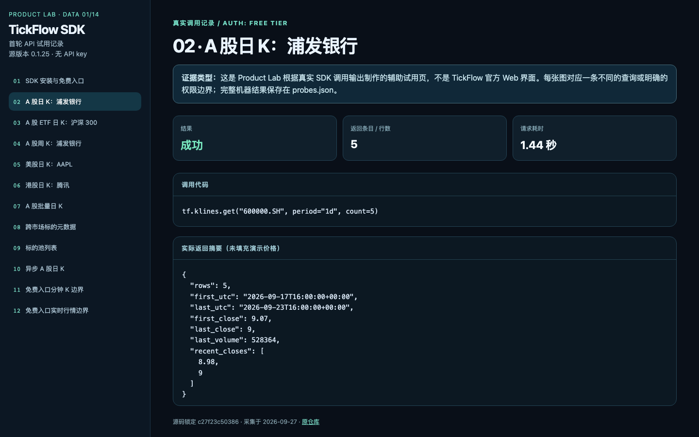</a>

| 1 获取 | 2 清洗 | 3 存档 | 4 指标 | 5 策略 | 6 回测 | 7 管理 | 8 风控 | 9 执行 | 10 看板 |
| :--: | :--: | :--: | :--: | :--: | :--: | :--: | :--: | :--: | :--: |
| ● | ● | ○ | · | · | · | · | · | · | · |

**声称：** 面向 A 股、美股、港股的专业金融数据 API：Python SDK 提供实时行情、K 线与财务报表。

**实测：** 🟡 免费入口取得 A 股、ETF、美股、港股日/周 K 与标的元数据；分钟线与实时行情被 PermissionError 拒绝，财报未测。

| 标准 | 权重 | 评级 | 证据 |
|---|---:|:--:|---|
| D1 正确 | 25 | 🟡 | AAPL 2026-09-25 收盘 341.07 与本轮 datafeed、AKShare 记录一致；A 股/港股未做跨源对账；000001.SZ 批量返回混有 11.3402…长小数与 11.35 整数价，复权口径不明；越权调用抛 PermissionError 而非静默空表。 [图1](2026-09-27/01-tickflow/images/05-tickflow-api.png) [图2](2026-09-27/01-tickflow/images/07-tickflow-api.png) [图3](2026-09-27/01-tickflow/images/12-tickflow-api.png) |
| D2 及时 | 20 | 🟡 | A 股最新 2026-09-24（9 月 25–27 日休市）、美股/港股 2026-09-25，日终时效与声明一致；声称的实时行情在免费入口不可用，周日也无法验证盘中延迟。 [图1](2026-09-27/01-tickflow/images/02-tickflow-api.png) [图2](2026-09-27/01-tickflow/images/06-tickflow-api.png) [图3](2026-09-27/01-tickflow/images/12-tickflow-api.png) |
| D3 完整 | 20 | 🟡 | 四类标的（600000.SH、510300.SH、AAPL.US、00700.HK）日 K 与元数据均有返回，标的池 1015 条；分钟 K 免费不可用，财报路径未测，历史深度只取 5 根。 [图1](2026-09-27/01-tickflow/images/08-tickflow-api.png) [图2](2026-09-27/01-tickflow/images/09-tickflow-api.png) [图3](2026-09-27/01-tickflow/images/11-tickflow-api.png) |
| D4 免费可得 | 15 | 🟡 | TickFlow.free() 无 key 即可取历史日/周 K，10 次调用 0.42–2.29 秒；分钟 K 与实时报价需付费授权，免费额度上限未测。 [图1](2026-09-27/01-tickflow/images/01-tickflow-api.png) [图2](2026-09-27/01-tickflow/images/11-tickflow-api.png) [图3](2026-09-27/01-tickflow/images/12-tickflow-api.png) |
| D5 可接入 | 20 | ✅ | 四个市场返回同一 compact_klines 结构（timestamp/open/high/low/close/volume/amount），pip 安装即用，同步与异步客户端都通；无内置存档，边界清楚。 [图1](2026-09-27/01-tickflow/images/02-tickflow-api.png) [图2](2026-09-27/01-tickflow/images/10-tickflow-api.png) |

**适合：** 跨 A 股/ETF/美股/港股的历史日 K 与标的元数据快速接入。  
**不适合：** 需要免费实时或分钟级行情的场景。

**未验证：** 分钟 K 与实时行情（免费入口 PermissionError）；财务报表路径；复权口径与跨源价格对账；高并发与持续可用性  
**下一步：** 用获授权账户在开市时检验分钟线、实时价格和财报路径。

证据：[12 张截图](2026-09-27/01-tickflow/screenshots.md) · [实测记录](2026-09-27/01-tickflow/trial-findings.md) · 实测版本 `c27f23c50386` · 目录锁 `c27f23c50386` · Python 库 · A股、美股、港股

### 6. a-stock-data · 58/100 · 已验证 100%

<a href="2026-09-27/09-a-stock-data/screenshots.md">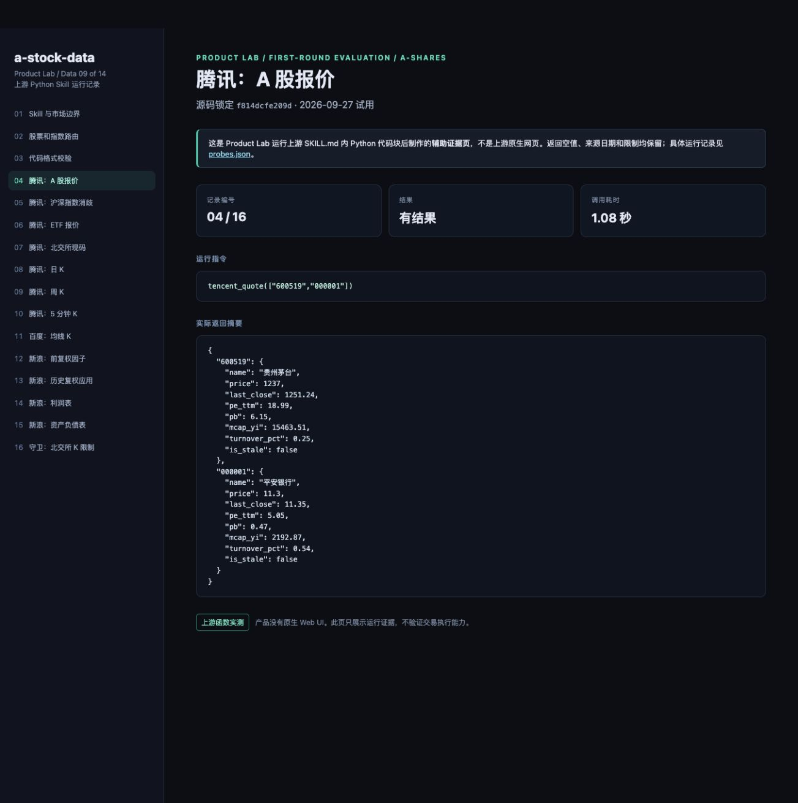</a>

| 1 获取 | 2 清洗 | 3 存档 | 4 指标 | 5 策略 | 6 回测 | 7 管理 | 8 风控 | 9 执行 | 10 看板 |
| :--: | :--: | :--: | :--: | :--: | :--: | :--: | :--: | :--: | :--: |
| ● | ● | ○ | ◐ | · | · | · | · | · | · |

**声称：** A 股全栈数据 Skill：12 层架构 / 60 端点 / 22 数据源，零鉴权（当前源码自述 15 层 / 87 端点）。

**实测：** 🟡 腾讯/新浪路径真实取得报价、日/周/5 分钟 K、复权因子与财报；百度均线 K 返回空且不报错，87 端点只测样本 16 个。

| 标准 | 权重 | 评级 | 证据 |
|---|---:|:--:|---|
| D1 正确 | 25 | 🟡 | 茅台 1237.0、上证 3888.37、510300 4.515 与 adata 独立腾讯报价及 AKShare 一致；norm_ticker 拒绝冲突格式；但百度均线 K 返回 rows=0 而不抛错。 [图1](2026-09-27/09-a-stock-data/images/04-a-stock-data.png) [图2](2026-09-27/09-a-stock-data/images/05-a-stock-data.png) [图3](2026-09-27/09-a-stock-data/images/11-a-stock-data.png) |
| D2 及时 | 20 | 🟡 | 报价附 is_stale=false 与 fetched_at，K 线最后一根 2026-09-24；周日无法证明交易时段实时。 [图1](2026-09-27/09-a-stock-data/images/04-a-stock-data.png) [图2](2026-09-27/09-a-stock-data/images/08-a-stock-data.png) [图3](2026-09-27/09-a-stock-data/images/10-a-stock-data.png) |
| D3 完整 | 20 | 🟡 | 报价、多周期 K、前复权因子 33 条、利润表/资产负债表各 3 期（至 2026-06-30）通过；研报、资金、公告、宏观、期权、可转债层未测，腾讯 K 不支持北交所。 [图1](2026-09-27/09-a-stock-data/images/01-a-stock-data.png) [图2](2026-09-27/09-a-stock-data/images/12-a-stock-data.png) [图3](2026-09-27/09-a-stock-data/images/14-a-stock-data.png) |
| D4 免费可得 | 15 | ✅ | 零鉴权，腾讯/新浪公开接口直取；无账户、无 key。 [图1](2026-09-27/09-a-stock-data/images/02-a-stock-data.png) [图2](2026-09-27/09-a-stock-data/images/04-a-stock-data.png) |
| D5 可接入 | 20 | 🟡 | K 线行带 code/adjust/date/OHLCV/source/source_url/fetched_at；但代码分散在 7,509 行 SKILL.md，须逐块执行，无包也无存档。 [图1](2026-09-27/09-a-stock-data/images/03-a-stock-data.png) [图2](2026-09-27/09-a-stock-data/images/08-a-stock-data.png) [图3](2026-09-27/09-a-stock-data/images/16-a-stock-data.png) |

**适合：** A 股研究员按需复制调用的报价、K 线、复权与财报代码手册。  
**不适合：** 当作一键稳定的数据平台或北交所 K 线来源。

**未验证：** 研报、资金、公告、宏观、期权、可转债等层；北交所盘后包路径；交易时段实时性  
**下一步：** 让百度空响应显式报错，并扩展测试到资金、公告、ETF 期权等未覆盖层。

证据：[16 张截图](2026-09-27/09-a-stock-data/screenshots.md) · [实测记录](2026-09-27/09-a-stock-data/trial-findings.md) · 实测版本 `f814dcfe209d` · 目录锁 `2012ce7cd0e7` · Agent Skill · A股

备注：实测源码 V3.10.0 晚于目录锁。

### 7. adata · 50/100 · 已验证 100%

<a href="2026-09-27/06-adata/screenshots.md">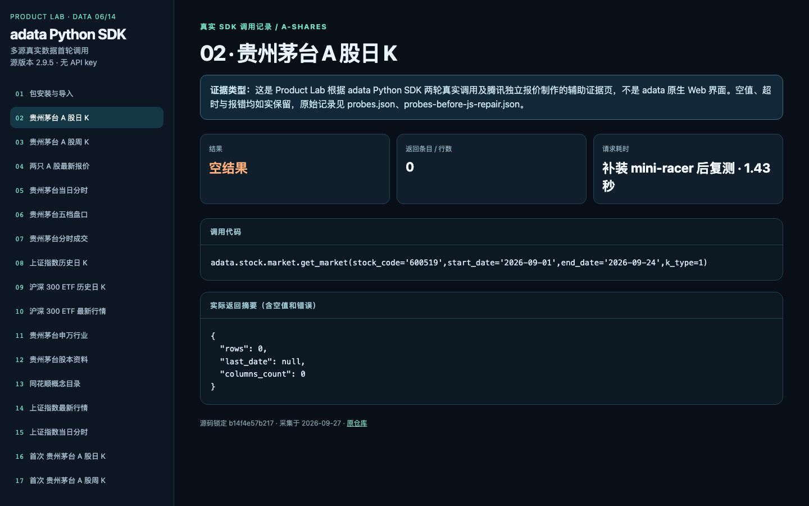</a>

| 1 获取 | 2 清洗 | 3 存档 | 4 指标 | 5 策略 | 6 回测 | 7 管理 | 8 风控 | 9 执行 | 10 看板 |
| :--: | :--: | :--: | :--: | :--: | :--: | :--: | :--: | :--: | :--: |
| ● | ● | ○ | · | · | · | · | · | · | · |

**声称：** 免费开源 A 股量化数据库：多数据源融合、动态代理，提供股票行情、K 线、概念、交易数据等接口。

**实测：** 🟡 首次取得茅台 18 根日 K / 13 根周 K，补依赖后 ETF、指数分时、盘口有返回；复测茅台日 K 变 0 行、周 K 超时，两只股票现价因腾讯解析条件不匹配返回空表。

| 标准 | 权重 | 评级 | 证据 |
|---|---:|:--:|---|
| D1 正确 | 25 | 🟡 | 茅台 1237.00、上证 3888.37、510300 4.515 与独立腾讯报价一致；但 list_market_current 因解析器只接受 11 段而当前报文 12 段静默返回空表，复测茅台日 K 0 行也无异常。 [图1](2026-09-27/06-adata/images/19-adata.png) [图2](2026-09-27/06-adata/images/20-adata.png) [图3](2026-09-27/06-adata/images/04-adata.png) |
| D2 及时 | 20 | 🟡 | 最新日期 2026-09-24 与 9 月 25–27 日休市一致，上证前一交易日分时 241 行；盘中分时与最新报价路径超时或空表，周日无法验证实时。 [图1](2026-09-27/06-adata/images/15-adata.png) [图2](2026-09-27/06-adata/images/16-adata.png) [图3](2026-09-27/06-adata/images/05-adata.png) |
| D3 完整 | 20 | 🟡 | 股票日/周 K、ETF、指数分时、申万行业、股本资料有结果；补依赖后 15 项中 4 空、3 超时、1 错误，概念目录两轮超时。 [图1](2026-09-27/06-adata/images/09-adata.png) [图2](2026-09-27/06-adata/images/11-adata.png) [图3](2026-09-27/06-adata/images/13-adata.png) |
| D4 免费可得 | 15 | 🟡 | 无 key、免费；但重复调用不稳定（茅台日 K 首次 18 行、复测 0 行），第三方源许可未核实。 [图1](2026-09-27/06-adata/images/01-adata.png) [图2](2026-09-27/06-adata/images/16-adata.png) [图3](2026-09-27/06-adata/images/02-adata.png) |
| D5 可接入 | 20 | 🟡 | 返回带 stock_code/trade_date/OHLCV 的 pandas DataFrame；setup.py 装的 py_mini_racer 缺 macOS dylib，须手动补 mini-racer==0.14.1 才能用依赖 JS 的接口。 [图1](2026-09-27/06-adata/images/02-adata.png) [图2](2026-09-27/06-adata/images/18-adata.png) |

**适合：** A 股历史 K 线、ETF、指数与盘口的轻量免费取数。  
**不适合：** 需要稳定重复调用或可靠实时报价的管线。

**未验证：** 盘中实时延迟；多源回退在所有方法上的覆盖；历史复权正确性  
**下一步：** 修复当前腾讯报价格式解析，再连续重复测试股票 K 线与回退路径。

证据：[20 张截图](2026-09-27/06-adata/screenshots.md) · [实测记录](2026-09-27/06-adata/trial-findings.md) · 实测版本 `b14f4e57b217` · 目录锁 `b14f4e57b217` · Python 库 · A股

备注：截图 01–15 为补依赖后复测，16–18 为原始安装首次结果，19–20 为独立交叉核对。

### 7. FinanceMCP · 50/100 · 已验证 100%

<a href="2026-09-27/02-financemcp/screenshots.md">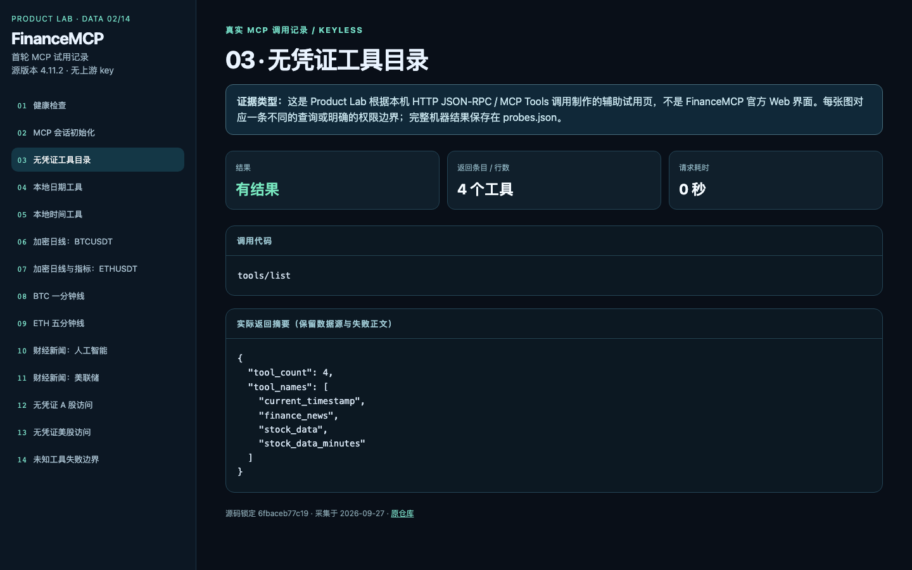</a>

| 1 获取 | 2 清洗 | 3 存档 | 4 指标 | 5 策略 | 6 回测 | 7 管理 | 8 风控 | 9 执行 | 10 看板 |
| :--: | :--: | :--: | :--: | :--: | :--: | :--: | :--: | :--: | :--: |
| ● | ○ | ○ | ● | · | · | · | · | · | · |

**声称：** 集成 Tushare 与 Binance API，为 LLM 提供股票、基金、债券、宏观、加密等实时金融数据与财经新闻的 MCP 服务。

**实测：** 🟡 无凭证时只公开 4 个工具：Binance 加密日/分钟线与百度新闻有结果；A 股、美股路由返回“没有已配置的数据源”。

| 标准 | 权重 | 评级 | 证据 |
|---|---:|:--:|---|
| D1 正确 | 25 | 🟡 | BTCUSDT 2026-09-26 日线收 84433.1、ETHUSDT 附 RSI(14)/MA(5) 均有值，但未与第二来源对账或复算指标；受限的 A 股/美股调用返回 HTTP 200 正文“数据查询失败”，不是 JSON-RPC 错误。 [图1](2026-09-27/02-financemcp/images/06-finance-mcp.png) [图2](2026-09-27/02-financemcp/images/07-finance-mcp.png) [图3](2026-09-27/02-financemcp/images/12-finance-mcp.png) |
| D2 及时 | 20 | 🟡 | BTC 2026-09-26 00:00–00:30 一分钟线 31 条、ETH 五分钟线 25 条，时间戳清楚；只请求了历史区间，实时端与股票时效未测。 [图1](2026-09-27/02-financemcp/images/08-finance-mcp.png) [图2](2026-09-27/02-financemcp/images/09-finance-mcp.png) |
| D3 完整 | 20 | 🟡 | 实测覆盖仅加密（Binance）与公开新闻；声称的股票/基金/债券/宏观依赖 Tushare 凭证，本轮未验证，港股未测。 [图1](2026-09-27/02-financemcp/images/03-finance-mcp.png) [图2](2026-09-27/02-financemcp/images/12-finance-mcp.png) [图3](2026-09-27/02-financemcp/images/13-finance-mcp.png) |
| D4 免费可得 | 15 | 🟡 | 无 key 可用范围为 current_timestamp、finance_news、stock_data、stock_data_minutes 四个工具（加密+新闻）；股票数据需 Tushare 授权。 [图1](2026-09-27/02-financemcp/images/03-finance-mcp.png) [图2](2026-09-27/02-financemcp/images/10-finance-mcp.png) [图3](2026-09-27/02-financemcp/images/13-finance-mcp.png) |
| D5 可接入 | 20 | 🟡 | 标准 Streamable HTTP MCP，npm ci/build 通过；但数据以 Markdown 表格文本返回而非结构化 JSON，npm audit 报 4 项 moderate 生产依赖告警。 [图1](2026-09-27/02-financemcp/images/02-finance-mcp.png) [图2](2026-09-27/02-financemcp/images/07-finance-mcp.png) [图3](2026-09-27/02-financemcp/images/14-finance-mcp.png) |

**适合：** 给 AI Agent 挂一个无需凭证的加密 K 线与公开新闻 MCP 入口。  
**不适合：** 需要结构化 OHLCV 或无 Tushare 凭证下的 A 股/美股数据。

**未验证：** Tushare/Qveris/Twingly 授权后的 A 股、美股、基金、债券、宏观路径；港股；公网托管 /mcp 入口（官方已暂停）；指标数值正确性  
**下一步：** 补齐可授权的数据源后逐工具核查股票数据，并让失败状态能被 MCP 客户端直接辨认。

证据：[14 张截图](2026-09-27/02-financemcp/screenshots.md) · [实测记录](2026-09-27/02-financemcp/trial-findings.md) · 实测版本 `6fbaceb77c19` · 目录锁 `784c6176647a` · MCP 服务 · A股、美股、加密、宏观、新闻/事件

备注：实测源码 4.11.2 晚于目录锁；结论只绑定实测版本。

### 7. global-stock-data · 50/100 · 已验证 100%

| 1 获取 | 2 清洗 | 3 存档 | 4 指标 | 5 策略 | 6 回测 | 7 管理 | 8 风控 | 9 执行 | 10 看板 |
| :--: | :--: | :--: | :--: | :--: | :--: | :--: | :--: | :--: | :--: |
| ● | ◐ | ○ | ● | · | · | · | · | · | · |

**声称：** 面向 AI 编程助手的美股数据 Skill：零鉴权官方来源，CBOE 期权 Greeks 与 0DTE 流、FINRA 空头成交、SEC EDGAR 申报流与免费全市场筛选器，13 层 30+ 端点。

**实测：** 🟡 财政部收益率曲线 185 日、CFTC 20 条、FINRA 单日 12,349 符号有真实结果；主卖点 CBOE 期权、SEC EDGAR 与行情报价本轮未调用。

| 标准 | 权重 | 评级 | 证据 |
|---|---:|:--:|---|
| D1 正确 | 25 | 🟡 | 10Y 2026-09-25 为 5.17% 与 datafeed 的财政部 CSV 一致（同一官方源）；RSI 对完全平盘 30 根合成 K 返回 100，边界处理缺失；SEC 缺联系人时在请求前明确抛错。 [图1](2026-09-27/08-global-stock-data/images/02-global-stock-data.png) [图2](2026-09-27/08-global-stock-data/images/13-global-stock-data.png) [图3](2026-09-27/08-global-stock-data/images/14-global-stock-data.png) |
| D2 及时 | 20 | 🟡 | 财政部最新 2026-09-25、CFTC 报告日 2026-09-22、FINRA 2026-09-25 单日文件，日频/周频语义清楚；行情报价端点未测。 [图1](2026-09-27/08-global-stock-data/images/02-global-stock-data.png) [图2](2026-09-27/08-global-stock-data/images/04-global-stock-data.png) [图3](2026-09-27/08-global-stock-data/images/06-global-stock-data.png) |
| D3 完整 | 20 | 🟡 | 实测 3 个官方源与 6 个本地指标函数；CBOE 期权、SEC 基本面、Nasdaq 财报日历、Yahoo/新浪/腾讯行情等声称层未验证。 [图1](2026-09-27/08-global-stock-data/images/01-global-stock-data.png) [图2](2026-09-27/08-global-stock-data/images/16-global-stock-data.png) [图3](2026-09-27/08-global-stock-data/images/07-global-stock-data.png) |
| D4 免费可得 | 15 | 🟡 | 财政部/CFTC/FINRA 无 key 直取；SEC 须声明真实联系人 UA，FINRA 被作者标为受限源，S/B/C 分级来自作者文档而非独立核实。 [图1](2026-09-27/08-global-stock-data/images/14-global-stock-data.png) [图2](2026-09-27/08-global-stock-data/images/16-global-stock-data.png) |
| D5 可接入 | 20 | 🟡 | 代码嵌在 SKILL.md 中，仅需 requests；返回 dict/list 而非统一 DataFrame，无包、无存档，需复制代码块执行。 [图1](2026-09-27/08-global-stock-data/images/01-global-stock-data.png) [图2](2026-09-27/08-global-stock-data/images/08-global-stock-data.png) |

**适合：** 在 Agent 里快速取美国财政部、CFTC、FINRA 等官方宏观与监管数据。  
**不适合：** 依赖 CBOE 期权链或 SEC 基本面的场景，在未验证前不宜接入。

**未验证：** SEC EDGAR 远端层（缺真实联系人）；CBOE 期权全链与 Greeks；Nasdaq 财报日历；Yahoo/新浪/腾讯行情报价；指标数学口径基准  
**下一步：** 在允许的授权条件下验证 SEC 与 CBOE；给各来源加时戳、许可与复现记录。

证据：[16 张截图](2026-09-27/08-global-stock-data/screenshots.md) · [实测记录](2026-09-27/08-global-stock-data/trial-findings.md) · 实测版本 `5f27525709ab` · 目录锁 `fbf0ae47d64e` · Agent Skill · 美股、港股、宏观

备注：指标函数只在 30 根合成 K 上烟测；实测源码 2.0.3 晚于目录锁。

### 7. quant-data-pipeline · 50/100 · 已验证 100%

<a href="2026-09-27/13-quant-data-pipeline/screenshots.md">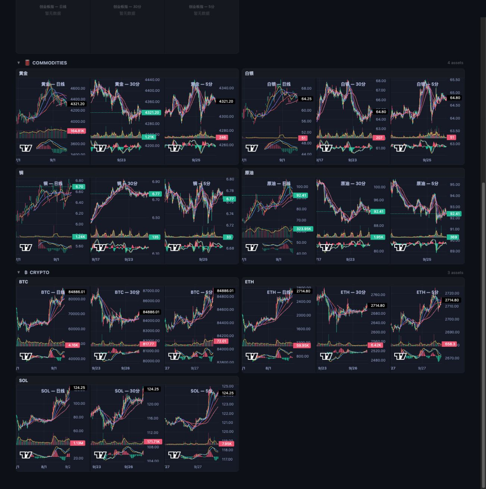</a>

| 1 获取 | 2 清洗 | 3 存档 | 4 指标 | 5 策略 | 6 回测 | 7 管理 | 8 风控 | 9 执行 | 10 看板 |
| :--: | :--: | :--: | :--: | :--: | :--: | :--: | :--: | :--: | :--: |
| ● | ◐ | ◐ | ◐ | ◐ | · | · | ◐ | ● | ● |

**声称：** 多市场量化数据平台：A 股/美股/加密/商品，28 组 API，感知信号引擎，模拟交易。

**实测：** 🟡 商品 4 品种、加密 15 品种实时与 K 线、美股 5 指数、本地纸盘买卖闭环成功；A 股搜索/行情 500、K 线 404、概念为 0，新闻请求超时后拖垮后端。

| 标准 | 权重 | 评级 | 证据 |
|---|---:|:--:|---|
| D1 正确 | 25 | 🟡 | 上证 3888.37 与腾讯独立来源一致，黄金 4321.2 与 datafeed GC=F 收盘一致；但 /api/symbols/search 返回 HTTP 500，/api/index/quote 报 DATABASE_ERROR 而 realtime 入口 200，概念返回 200 且 total=0。 [图1](2026-09-27/13-quant-data-pipeline/images/25-evidence-04.png) [图2](2026-09-27/13-quant-data-pipeline/images/29-evidence-08.png) [图3](2026-09-27/13-quant-data-pipeline/images/23-evidence-02.png) [图4](2026-09-27/13-quant-data-pipeline/images/24-evidence-03.png) |
| D2 及时 | 20 | 🟡 | 加密 WebSocket last_update 2026-09-27T09:52:25Z、is_stale=false，商品 09:52:24 UTC；A 股指数 realtime 只给 17:52:13 无日期，A 股 K 线不可用。 [图1](2026-09-27/13-quant-data-pipeline/images/31-evidence-10.png) [图2](2026-09-27/13-quant-data-pipeline/images/29-evidence-08.png) [图3](2026-09-27/13-quant-data-pipeline/images/25-evidence-04.png) |
| D3 完整 | 20 | 🟡 | 商品、加密、美股指数、黄金日 K 10 根、BTC 小时 K 10 根、funding 6 条通过；A 股指数 K 404、茅台 K 404、概念 0，Dashboard 提示 9 张图表失败。 [图1](2026-09-27/13-quant-data-pipeline/images/26-evidence-05.png) [图2](2026-09-27/13-quant-data-pipeline/images/27-evidence-06.png) [图3](2026-09-27/13-quant-data-pipeline/images/34-evidence-13.png) [图4](2026-09-27/13-quant-data-pipeline/images/13-dashboard-section.png) |
| D4 免费可得 | 15 | 🟡 | 自托管，Yahoo/Binance 路径无 key；A 股历史需 TuShare token，本轮未配置。 [图1](2026-09-27/13-quant-data-pipeline/images/22-evidence-01.png) [图2](2026-09-27/13-quant-data-pipeline/images/03-native-health-loaded.png) |
| D5 可接入 | 20 | 🟡 | REST JSON 与 React 前端可用，纸盘买 100 股/卖出回读正确；但 /api/news/latest 25 秒超时后 perception、纸盘读取连续超时直至连接被拒，K 线存储 0 条、整体 unhealthy。 [图1](2026-09-27/13-quant-data-pipeline/images/35-evidence-14.png) [图2](2026-09-27/13-quant-data-pipeline/images/41-evidence-20.png) [图3](2026-09-27/13-quant-data-pipeline/images/42-evidence-21.png) [图4](2026-09-27/13-quant-data-pipeline/images/20-native-paper-roundtrip.png) |

**适合：** 商品、加密与美股指数的看板展示和本地纸盘练习。  
**不适合：** A 股历史数据、概念板块或需要单进程稳定响应的服务。

**未验证：** TuShare 授权后的 A 股历史与概念；感知信号引擎（请求超时）；新闻链路  
**下一步：** 先隔离新闻源阻塞，再恢复 A 股搜索、历史 K 线和健康判断；模拟交易保持纸盘标识。

证据：[39 张截图](2026-09-27/13-quant-data-pipeline/screenshots.md) · [实测记录](2026-09-27/13-quant-data-pipeline/trial-findings.md) · 实测版本 `d306095de3c2` · 目录锁 `owned source` · Web 应用 · A股、美股、加密、商品

备注：纸盘买卖闭环（¥1,000 万起，1% 仓位被拒、2% 买入 100 股 @1237、同价卖出归零）为本地模拟，无真实券商；execute 记 run 仅指 paper。截图 22–41 对应 20 条探针，42 为纸盘闭环。

### 11. intel · 40/100 · 已验证 100%

<a href="2026-09-27/12-intel/screenshots.md">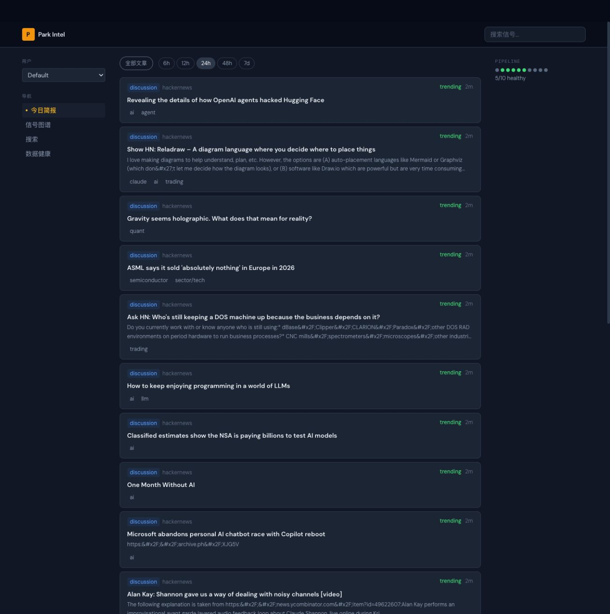</a>

| 1 获取 | 2 清洗 | 3 存档 | 4 指标 | 5 策略 | 6 回测 | 7 管理 | 8 风控 | 9 执行 | 10 看板 |
| :--: | :--: | :--: | :--: | :--: | :--: | :--: | :--: | :--: | :--: |
| ● | ● | ● | ● | · | · | · | · | · | ● |

**声称：** 情报采集：输入 10+ 信息源 → 输出 LLM 评分 + 跨源事件聚类。

**实测：** 🟡 隔离实例数分钟采集 4,610 篇、搜索可用、LLM 评分 500 篇；63 个事件 source_count 全为 1，跨源聚类没有通过样本。

| 标准 | 权重 | 评级 | 证据 |
|---|---:|:--:|---|
| D1 正确 | 25 | 🟡 | SQLite 实际 4,610 行，健康页却报 total_articles_24h 196,908（按 source type 重复累加）；2 行发布时间在未来、243 行缺发布时间；事件 scorecard total_events_with_data=0。 [图1](2026-09-27/12-intel/images/14-evidence-01.png) [图2](2026-09-27/12-intel/images/15-evidence-02.png) [图3](2026-09-27/12-intel/images/26-evidence-13.png) |
| D2 及时 | 20 | ❌ | 4,610 行中按 published_at 算近 24 小时仅 174 行，3,621 行超过 7 天；一条 2007-08-12 的 Google News 于 2026-09-27 入库，前端卡片以 collected_at 显示“几分钟前”，旧闻冒充新讯。 [图1](2026-09-27/12-intel/images/26-evidence-13.png) [图2](2026-09-27/12-intel/images/16-evidence-03.png) [图3](2026-09-27/12-intel/images/09-native-feed-all.png) |
| D3 完整 | 20 | 🟡 | 来源 RSS 3,755 / Google News 629 / Yahoo 68 / GitHub 66 / HN 43 / Reddit 25 / 网站监控 24，81 个注册源 71 ok；实时 lane 0 条，最新 brief 为 None。 [图1](2026-09-27/12-intel/images/24-evidence-11.png) [图2](2026-09-27/12-intel/images/11-native-health-populated.png) [图3](2026-09-27/12-intel/images/21-evidence-08.png) |
| D4 免费可得 | 15 | 🟡 | 自托管、采集无需 key；LLM 评分依赖 codex-cli/deepseek provider，本轮 fallback_reason=DeepSeekError。 [图1](2026-09-27/12-intel/images/14-evidence-01.png) [图2](2026-09-27/12-intel/images/04-native-health.png) |
| D5 可接入 | 20 | 🟡 | REST JSON 条目含 published_at/collected_at/relevance_score/narrative_tags，SQLite 可直读；但事件聚合 degraded（usable 39/580，two_source_events=0），下游拿不到跨源确认信号。 [图1](2026-09-27/12-intel/images/19-evidence-06.png) [图2](2026-09-27/12-intel/images/25-evidence-12.png) [图3](2026-09-27/12-intel/images/12-native-search-openai.png) |

**适合：** 自托管的多源新闻采集、检索与主题标签。  
**不适合：** 需要按发布时间判断新鲜度或依赖跨源确认事件的信号场景。

**未验证：** 实时 lane（opt-in 未启用）；推送脚本；LLM 评分对 4,110 篇未评分文章的完成率  
**下一步：** 修复发布时间过滤和来源级计数，取得至少一个可复查的双源事件。

证据：[23 张截图](2026-09-27/12-intel/screenshots.md) · [实测记录](2026-09-27/12-intel/trial-findings.md) · 实测版本 `54bd1b3f8bc0` · 目录锁 `owned source` · Web 应用 · 新闻/事件

备注：事件聚类记入 indicator 环节；截图 14–25 对应 12 条探针，26 为数据库时间审计。

### 11. tradingview-mcp · 40/100 · 已验证 80%

<a href="2026-09-27/03-tradingview-mcp/screenshots.md">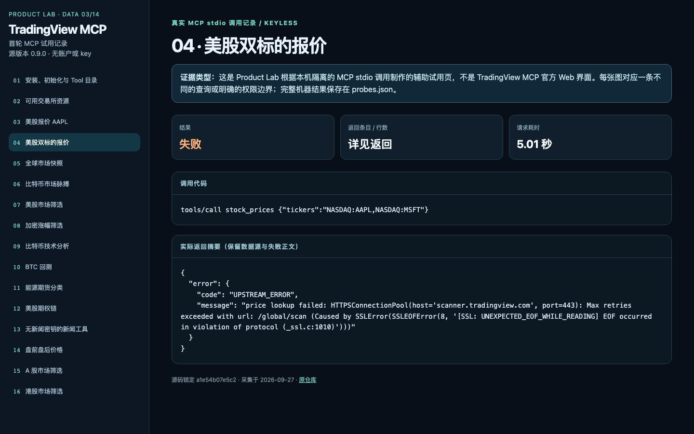</a>

| 1 获取 | 2 清洗 | 3 存档 | 4 指标 | 5 策略 | 6 回测 | 7 管理 | 8 风控 | 9 执行 | 10 看板 |
| :--: | :--: | :--: | :--: | :--: | :--: | :--: | :--: | :--: | :--: |
| ● | ○ | ○ | ● | ● | ● | · | · | · | · |

**声称：** TradingView MCP 服务：为任意 MCP 客户端提供全球交易所股票、加密、外汇、期货的实时行情、技术分析、筛选器与回测。

**实测：** 🟡 39 个工具中 23 个场景有结果：美/A/港股筛选、BTC 技术分析与回测；双标的报价 SSL 失败，新闻/情绪需 Key，周日无法验证实时。

| 标准 | 权重 | 评级 | 证据 |
|---|---:|:--:|---|
| D1 正确 | 25 | 🟡 | AAPL 报价 341.07（previous_close 335.92）与本轮 datafeed/AKShare 的 09-25 收盘一致；超低价币涨幅榜 close 显示 0.0 而指标非零；失败路径给出明确 UPSTREAM_ERROR/配置错误。 [图1](2026-09-27/03-tradingview-mcp/images/03-tradingview-mcp.png) [图2](2026-09-27/03-tradingview-mcp/images/04-tradingview-mcp.png) [图3](2026-09-27/03-tradingview-mcp/images/08-tradingview-mcp.png) |
| D2 及时 | 20 | ⬜ | 周日测试，美股报价为 2026-09-25 上一时段快照（regular 20:00 UTC、post_market 23:59 UTC 有标注）；声称的实时延迟无法在休市时验证。 [图1](2026-09-27/03-tradingview-mcp/images/03-tradingview-mcp.png) [图2](2026-09-27/03-tradingview-mcp/images/14-tradingview-mcp.png) |
| D3 完整 | 20 | 🟡 | 美股筛选 5,199 候选、A 股与港股各返回 5 行、加密/能源期货/AAPL 期权链均有结构化结果；外汇未测，新闻与情绪两工具因无 Key 失败。 [图1](2026-09-27/03-tradingview-mcp/images/07-tradingview-mcp.png) [图2](2026-09-27/03-tradingview-mcp/images/15-tradingview-mcp.png) [图3](2026-09-27/03-tradingview-mcp/images/16-tradingview-mcp.png) [图4](2026-09-27/03-tradingview-mcp/images/12-tradingview-mcp.png) |
| D4 免费可得 | 15 | 🟡 | 无 TradingView 账号、无 API key 完成 23/26 场景；新闻/情绪需 MARKETAUX_API_TOKEN，抓取 TradingView scanner 的许可与限流未核实。 [图1](2026-09-27/03-tradingview-mcp/images/01-tradingview-mcp.png) [图2](2026-09-27/03-tradingview-mcp/images/13-tradingview-mcp.png) [图3](2026-09-27/03-tradingview-mcp/images/26-tradingview-mcp.png) |
| D5 可接入 | 20 | 🟡 | pip 安装、stdio MCP 初始化通过，返回结构化 JSON；但不是 OHLCV 序列接口，成功请求中位 1.27 秒、全球快照最慢 20.3 秒。 [图1](2026-09-27/03-tradingview-mcp/images/01-tradingview-mcp.png) [图2](2026-09-27/03-tradingview-mcp/images/05-tradingview-mcp.png) [图3](2026-09-27/03-tradingview-mcp/images/10-tradingview-mcp.png) |

**适合：** 让 Agent 做多市场筛选、技术指标与快速策略回测的研究工具。  
**不适合：** 作为纯行情数据源或验证盘中实时延迟。

**未验证：** 开市时段实时延迟；外汇路由；MARKETAUX 新闻与情绪工具；付费托管与 MCP Apps 图表；多周期分析各周期原始 K 线是否正确  
**下一步：** 开市时复核行情时延，并以同一标的对比跨来源筛选与回测结果。

证据：[26 张截图](2026-09-27/03-tradingview-mcp/screenshots.md) · [实测记录](2026-09-27/03-tradingview-mcp/trial-findings.md) · 实测版本 `a1e54b07e5c2` · 目录锁 `a1e54b07e5c2` · MCP 服务 · 美股、A股、港股、加密、商品、外汇

备注：回测 BTC RSI 三个月 93 根 0 笔成交，只证明流程能结束；README 写 37 个工具，实测 39 个。

### 13. TradingView-API · 38/100 · 已验证 75%

<a href="../dashboard/2026-09-28/07-tradingview-api/screenshots.md">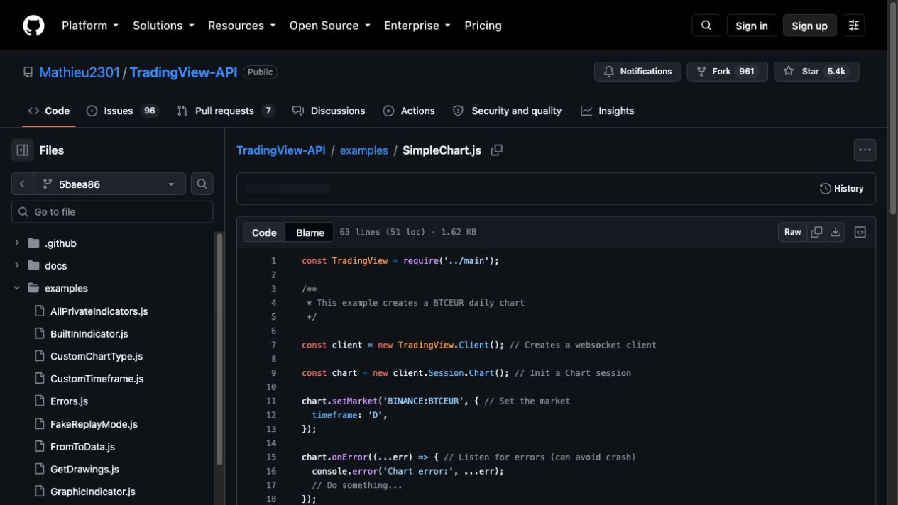</a>

| 1 获取 | 2 清洗 | 3 存档 | 4 指标 | 5 策略 | 6 回测 | 7 管理 | 8 风控 | 9 执行 | 10 看板 |
| :--: | :--: | :--: | :--: | :--: | :--: | :--: | :--: | :--: | :--: |
| ● | ○ | ○ | ◐ | · | · | · | · | · | · |

**声称：** 从 TradingView 获取实时行情：非官方 Node WebSocket 客户端，封装 chart/quote session、指标与回放。

**实测：** 🟡 无 SESSION/SIGNATURE 的 SimpleChart 示例加载 BINANCE:BTCEUR 日线，再切换 ETHEUR、15 分钟与 Heikin Ashi 后正常关闭；50 tests passed、16 skipped，私有指标与账户 API 因无 cookie 未测，股票标的也未实取。

| 标准 | 权重 | 评级 | 证据 |
|---|---:|:--:|---|
| D1 正确 | 25 | ⬜ | 原始价格只留在试用目录的 simplechart.log，没有复制进证据包，也未与第二来源交叉核对；错误契约只在单测层通过。 [图1](../dashboard/2026-09-28/07-tradingview-api/images/11-error-contract-tests.jpg) |
| D2 及时 | 20 | 🟡 | 公开 WebSocket 会话持续推送，日线切 15 分钟即时生效，25 秒后按时关闭；但没有独立核验时间戳语义，也没有记录成交时间与取数时间之差。 [图1](../dashboard/2026-09-28/07-tradingview-api/images/10-live-chart-integration-test.jpg) [图2](../dashboard/2026-09-28/07-tradingview-api/images/02-simple-chart-example.jpg) |
| D3 完整 | 20 | 🟡 | 图表、quote、内置指标、回放、区间历史、search 与 quote session API 面广；本轮只实取一个公开加密市场，股票、外汇与私有指标未测。 [图1](../dashboard/2026-09-28/07-tradingview-api/images/04-custom-chart-types.jpg) [图2](../dashboard/2026-09-28/07-tradingview-api/images/07-replay-mode-example.jpg) [图3](../dashboard/2026-09-28/07-tradingview-api/images/13-quote-session-source.jpg) |
| D4 免费可得 | 15 | 🟡 | 无 SESSION/SIGNATURE 即可加载公开图表并切换周期与图型；但自定义周期、区间历史与私有指标需登录 cookie（16 项测试因此跳过），且 README 自称非官方、无 SLA。 [图1](../dashboard/2026-09-28/07-tradingview-api/images/01-readme-role-and-limitations.jpg) [图2](../dashboard/2026-09-28/07-tradingview-api/images/05-custom-timeframe.jpg) [图3](../dashboard/2026-09-28/07-tradingview-api/images/06-bounded-history-example.jpg) |
| D5 可接入 | 20 | 🟡 | npm ci 装 326 包后示例直接可跑，错误处理与 client 清理有示例；输出是库自有的事件式 JSON，不是 OHLCV 表或 DataFrame，清洗与存档全部交给下游。 [图1](../dashboard/2026-09-28/07-tradingview-api/images/09-error-handling-example.jpg) [图2](../dashboard/2026-09-28/07-tradingview-api/images/12-websocket-client-source.jpg) |

**适合：** 在 Node 里免 key 订阅 TradingView 公开图表与报价的 WebSocket 数据流做原型。  
**不适合：** 当作看板界面，或作为需要授权、SLA 与私有指标的正式数据源。

**未验证：** 价格与第二来源交叉核对；股票与外汇标的实取；私有、邀请制指标与账户 API（需 SESSION/SIGNATURE）；长时间连接稳定性与非官方接口的持续可用  
**下一步：** 用一个美股标的实取日线并与第二来源核对收盘价。

证据：[13 张截图](../dashboard/2026-09-28/07-tradingview-api/screenshots.md) · [实测记录](../dashboard/2026-09-28/07-tradingview-api/findings.md) · 实测版本 `5baea86c8c7e` · 目录锁 `5baea86c8c7e` · JavaScript 库 · 美股、加密、外汇

目录归 **Dashboard**，按 **Data** 标准评测；分类建议不改 canonical 目录。

备注：没有原生 UI，13 张截图均为锁定版本的 README、示例、测试与 WebSocket 源码页；运行结果见 verification.json。目录归 Dashboard，本卡按 Data 标准 D1..D5 评，建议改归 Data。

### 14. tvscreener · 28/100 · 已验证 55%

<a href="../dashboard/2026-09-28/04-tvscreener/screenshots.md">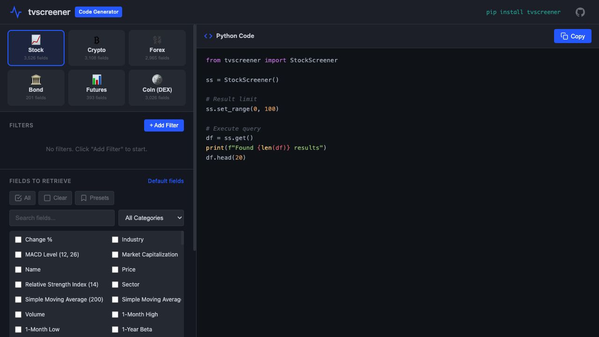</a>

| 1 获取 | 2 清洗 | 3 存档 | 4 指标 | 5 策略 | 6 回测 | 7 管理 | 8 风控 | 9 执行 | 10 看板 |
| :--: | :--: | :--: | :--: | :--: | :--: | :--: | :--: | :--: | :--: |
| ● | ◐ | ○ | · | · | · | · | · | · | · |

**声称：** TradingView Screener API：股票、加密、外汇、债券、期货、Coin 六类筛选器的 Python 客户端。

**实测：** 🟡 无凭证的 S&P 500 公开查询 0.74 秒返回 10 行 DataFrame（含 NASDAQ:NVDA）；其余五类只在本地代码生成器构造了查询，没有实取；Valuation 预设生成了包里不存在的 StockField。

| 标准 | 权重 | 评级 | 证据 |
|---|---:|:--:|---|
| D1 正确 | 25 | ⬜ | 10 行结果的价格未与第二来源交叉核对；唯一明确的错误信号是 Valuation 预设触发的 AttributeError，发生在请求之前，不能说明服务端错误与空值如何呈现。 [图1](../dashboard/2026-09-28/04-tvscreener/images/17-valuation-preset.jpg) |
| D2 及时 | 20 | ⬜ | 只做了一次休市外查询，返回列虽含 Update Mode，但没有记录其取值，也没有记录成交时间与取数时间之差，未测刷新时效。 |
| D3 完整 | 20 | 🟡 | 代码生成器可切换 Stock、Crypto、Forex、Bond、Futures、Coin (DEX) 六类并生成有效查询配置；只有美股 stock 一类实际取到数据，其余五类未实取。 [图1](../dashboard/2026-09-28/04-tvscreener/images/02-crypto-screen.jpg) [图2](../dashboard/2026-09-28/04-tvscreener/images/02-forex-screen.jpg) [图3](../dashboard/2026-09-28/04-tvscreener/images/18-coin-screener-generated.jpg) |
| D4 免费可得 | 15 | 🟡 | 无 API key、无账号即完成一次 S&P 500 公开查询，pip 安装 0.4.1 与 uv pip check 通过；限流与 TradingView 对非官方 screener 端点的使用条款未核。 [图1](../dashboard/2026-09-28/04-tvscreener/images/15-sp500-index-config.jpg) [图2](../dashboard/2026-09-28/04-tvscreener/images/08-price-filter-generated.jpg) |
| D5 可接入 | 20 | 🟡 | 输出为 pandas DataFrame，六列 Symbol、Name、Price、Change %、Volume、Update Mode；但 Valuation 预设生成的 StockField.EV_TO_EBITDA_TTM 在已安装包中不存在，照抄生成代码即 AttributeError。 [图1](../dashboard/2026-09-28/04-tvscreener/images/13-output-fields-selected.jpg) [图2](../dashboard/2026-09-28/04-tvscreener/images/17-valuation-preset.jpg) |

**适合：** 用 Python 快速拉 TradingView 公开筛选结果做粗筛（美股已验）。  
**不适合：** 当作看板使用，或作为需要授权、稳定 SLA 的正式数据源。

**未验证：** 价格与第二来源交叉核对；加密、外汇、债券、期货、Coin 五类实取；限流与 TradingView 使用条款；盘中刷新时效  
**下一步：** 对同一批 S&P 500 标的用第二来源核对价格，并实取一次加密与外汇筛选。

证据：[17 张截图](../dashboard/2026-09-28/04-tvscreener/screenshots.md) · [实测记录](../dashboard/2026-09-28/04-tvscreener/findings.md) · 实测版本 `737c9764c1e5` · 目录锁 `737c9764c1e5` · Python 库 · 美股、加密、外汇、商品

目录归 **Dashboard**，按 **Data** 标准评测；分类建议不改 canonical 目录。

备注：目录归 Dashboard，但主体是 Python 数据客户端，17 张截图全部来自仓库自带的本地静态 Code Generator，不含行情画面；本卡按 Data 标准 D1..D5 评，建议改归 Data。离线单测 129 通过。

### Financial-API · 10/100 · 已验证 35%

<a href="2026-09-27/05-financial-api/screenshots.md">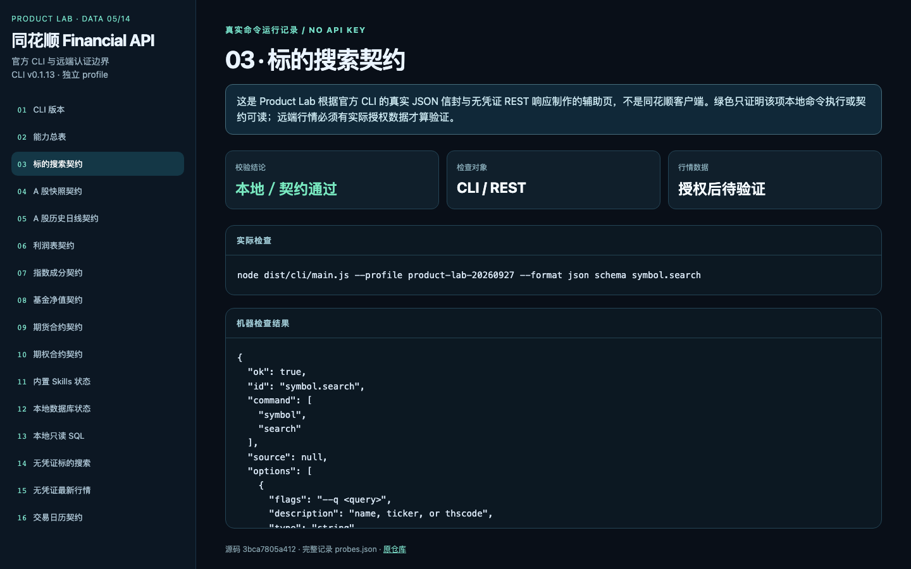</a>

| 1 获取 | 2 清洗 | 3 存档 | 4 指标 | 5 策略 | 6 回测 | 7 管理 | 8 风控 | 9 执行 | 10 看板 |
| :--: | :--: | :--: | :--: | :--: | :--: | :--: | :--: | :--: | :--: |
| ◐ | ◐ | ◐ | · | · | · | · | · | · | · |

**声称：** 同花顺官方 A 股金融数据服务：实时行情、历史行情、财报、指数、板块、涨停等，支持 API、MCP、CLI 与 Python。

**实测：** ⬜ 无 API Key：CLI 构建通过、104 项能力契约与本地 DuckDB 可读，但远端市场数据行数为 0，核心用途本轮无法判定。

| 标准 | 权重 | 评级 | 证据 |
|---|---:|:--:|---|
| D1 正确 | 25 | ⬜ | 无 Key 未取得任何远端数据；错误信封清楚：REST 返回 HTTP 200 + code 2003 + data=null，CLI 退出码 3 AUTH_API_KEY_MISSING。 [图1](2026-09-27/05-financial-api/images/14-financial-api.png) [图2](2026-09-27/05-financial-api/images/15-financial-api.png) [图3](2026-09-27/05-financial-api/images/23-financial-api.png) |
| D2 及时 | 20 | ⬜ | 无 Key，实时与历史行情均未返回数据，时效无法验证。 [图1](2026-09-27/05-financial-api/images/15-financial-api.png) [图2](2026-09-27/05-financial-api/images/23-financial-api.png) |
| D3 完整 | 20 | ⬜ | capabilities 列出 104 项（88 远端 / 16 本地）与 13 个业务契约，README 明确不含分钟 K、tick、Level-2、美股、港股；实际远端行数 0。 [图1](2026-09-27/05-financial-api/images/02-financial-api.png) [图2](2026-09-27/05-financial-api/images/03-financial-api.png) [图3](2026-09-27/05-financial-api/images/04-financial-api.png) |
| D4 免费可得 | 15 | ❌ | 无 Key 时远端标的搜索与最新行情全部拒绝，免费可用范围仅本地契约、Skills 状态与空 DuckDB；免费额度与许可条款未知。 [图1](2026-09-27/05-financial-api/images/14-financial-api.png) [图2](2026-09-27/05-financial-api/images/23-financial-api.png) |
| D5 可接入 | 20 | 🟡 | CLI 返回统一 ok/error JSON 信封与错误码，13 个 schema 可读，本地 DuckDB SELECT 1 与表元数据通过；真实数据形态与存档流程未验证。 [图1](2026-09-27/05-financial-api/images/01-financial-api.png) [图2](2026-09-27/05-financial-api/images/04-financial-api.png) [图3](2026-09-27/05-financial-api/images/13-financial-api.png) |

**适合：** 已持有同花顺 API Key、需要官方 A 股多域数据与本地 DuckDB 工具链的团队。  
**不适合：** 无 Key 的免费研究，或需要分钟/tick/美股/港股行情。

**未验证：** A 股实时行情、日线、财务、指数、板块、基金、期货期权的在线返回；托管 MCP 与 Python 远端 toolkit；限流与免费额度  
**下一步：** 使用明确授权的测试 Key 核查实时、历史、财务和批量取数，并复测错误码。

证据：[23 张截图](2026-09-27/05-financial-api/screenshots.md) · [实测记录](2026-09-27/05-financial-api/trial-findings.md) · 实测版本 `3bca7805a412` · 目录锁 `402574a6221d` · CLI · A股

备注：已验证比例低，应列入“证据不足”区；分数不是对官方服务质量的定论。实测源码晚于目录锁。

## 原始证据

- [evaluations/dashboard/2026-09-28](../../evaluations/dashboard/2026-09-28/README.md)：该轮的实测记录、截图与首轮人工分，保留供复核。
- [evaluations/data/2026-09-27](../../evaluations/data/2026-09-27/README.md)：该轮的实测记录、截图与首轮人工分，保留供复核。
