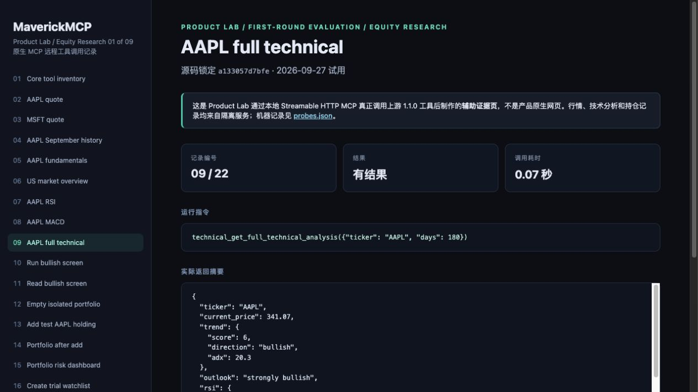
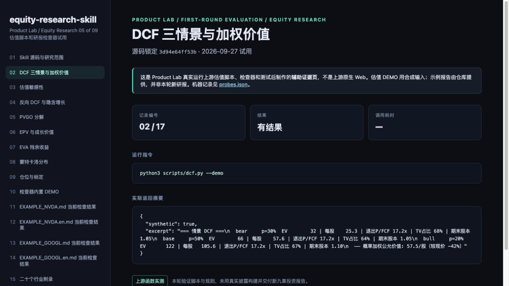
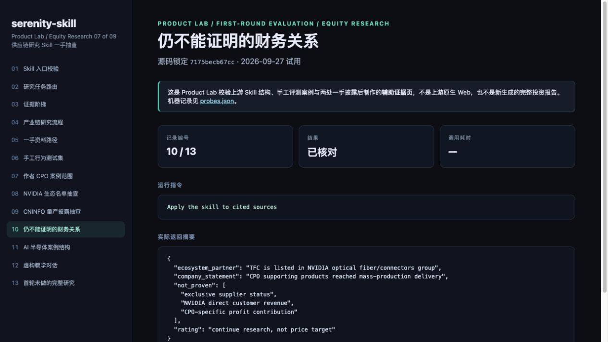
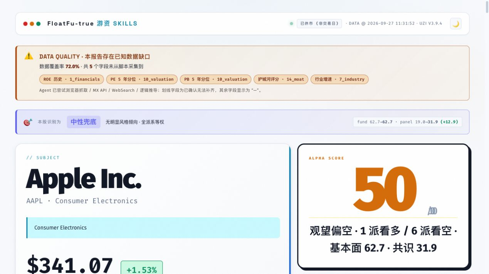
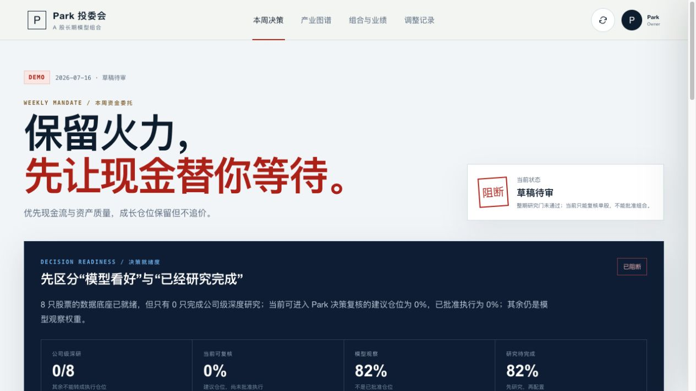

<!-- 本文件由 scripts/render-hub.py 生成，请改 evaluations/assessments/*.json 后重跑 -->
# Equity Research · 评测

**目标：** 为买卖决策提供可核验、可复现的研判，而不是一段无法追溯的文字。

**环节：** 4 指标与特征、5 策略与信号

[评测框架](../FRAMEWORK.md) · [Pipeline 总览](../README.md) · [返回目录](../../README.md)

评级：✅ 做到 · 🟡 部分 · ❌ 未做到 · ⬜ 未验证 · — 不适用。分数 = Σ(权重 × 评级值) ÷ Σ适用权重 × 100；已验证 = 做到、部分、未做到三种评级占适用权重的比例。环节：● 实测跑通 · ◐ 源码可见未实测 · ○ 无 · · 不在其角色内；排名表的环节列按 1 获取到 10 看板的顺序排列。

## 评判标准

| 标准 | 权重 | 怎么判 |
|---|---:|---|
| R1 输入可靠 | 20 | 数据来源清楚、时效有标注；不把取数时间冒充交易时间。 |
| R2 方法可复现 | 25 | 估值、筛选、评级是规则、模板或脚本，同输入得到同输出；纯 LLM 自由发挥记部分。 |
| R3 输出可核验 | 25 | 报告中的数字能对回原始数据；发现的不一致有记录。 |
| R4 覆盖 | 15 | 市场与研究类型（个股、行业、主题、宏观）符合声明。 |
| R5 可接入 | 15 | 结论结构化、能被策略或人快速消费；安装与凭证门槛可控。 |

## 排名

| 排名 | 产品 | 分数 | 已验证 | 环节 1–10 | 实测 | 卡片 |
|---:|---|---:|---:|---|---|---|
| 1 | [Maverick MCP](https://github.com/wshobson/maverick-mcp) | **83** | 100% | `●○◐●●◐····` | 🟡 Core 1.1.0 的 37 个工具真实可用，AAPL 行情/技术/筛选与本地组合、自选、日志闭环跑通；深度研究与回测扩展未装，quote 的 timestamp 是取数时刻而非成交时间。 | [卡片](README.md#maverick-mcp) |
| 2 | [Equity Research Skill](https://github.com/rollingSirius/equity-research-skill) | **60** | 80% | `○··●●○····` | 🟡 估值脚本与检查器可跑（DCF demo 57.5/股、检查器测试 7/7），但本轮未生成新的真实九章研报，作者 NVDA 示例被仓库自身检查器判 1 个 P1。 | [卡片](README.md#equity-research-skill) |
| 3 | [Serenity Skill](https://github.com/muxuuu/serenity-skill) | **50** | 100% | `○··○◐○····` | 🟡 validate_skill.py 返回 OK，8 个参考文档、3 篇示例、6 个手工用例可用，作者 CPO 案例的两处一手来源抽查成立；但本轮未让宿主 Agent 从零完成新主题研究。 | [卡片](README.md#serenity-skill) |
| 4 | [UZI Skill](https://github.com/wbh604/UZI-Skill) | **45** | 100% | `●◐◐●●○····` | 🟡 AAPL lite 真实生成 720KB 自包含 HTML 报告、分享卡与战报，覆盖率 72%；但币种、ROE 与来源叙述有可复验矛盾，critical_missing=true 时仍给精确价位，结论不能按已核验使用。 | [卡片](README.md#uzi-skill) |
| 5 | [Equity Research](https://github.com/zinan92/equity-research) | **38** | 100% | `○·◐◐◐○◐◐·●` | ❌ fresh clone 只有 DEMO 结构：/api/health 报 data_mode=DEMO、report_count=0，/api/committee 为 0/8 深研、0% 可执行，本轮未产出任何真实研报；门禁按设计拒绝伪造，但组合页仍显示 +4.6% 收益。 | [卡片](README.md#equity-research) |

### 证据不足，不排名

| 产品 | 原因 | 卡片 |
|---|---|---|
| [Dexter](https://github.com/virattt/dexter) | 按要求跳过：按要求本轮跳过，未部署或运行。 | [卡片](README.md#dexter) |

## 分类说明

- **A Share Heatmap** 目录归本类，按 Dashboard 标准评测，见 [A Share Heatmap](../dashboard/README.md#a-share-heatmap)。
- **Day1Global Skills** 目录归本类，建议归 Knowledge & Collections，不评分；实测记录见 [Day1Global Skills](2026-09-28/03-day1global-skills/findings.md)。
- **Qlib** 目录归本类，按 Trading Strategy 标准评测，见 [Qlib](../trading-strategy/README.md#qlib)。

## 产品卡片

### 1. Maverick MCP · 83/100 · 已验证 100%

| 1 获取 | 2 清洗 | 3 存档 | 4 指标 | 5 策略 | 6 回测 | 7 管理 | 8 风控 | 9 执行 | 10 看板 |
| :--: | :--: | :--: | :--: | :--: | :--: | :--: | :--: | :--: | :--: |
| ● | ○ | ◐ | ● | ● | ◐ | · | · | · | · |

**声称：** 个人股票分析 MCP 服务器：行情、基本面、技术分析、筛选、组合与研究日志，供任意 MCP 客户端调用。

**实测：** 🟡 Core 1.1.0 的 37 个工具真实可用，AAPL 行情/技术/筛选与本地组合、自选、日志闭环跑通；深度研究与回测扩展未装，quote 的 timestamp 是取数时刻而非成交时间。

| 标准 | 权重 | 评级 | 证据 |
|---|---:|:--:|---|
| R1 输入可靠 | 20 | 🟡 | 数据源为 yfinance 标准代码，但周日 get_quote(AAPL) 回传 timestamp=2026-09-27T10:37Z，价格 341.07 实为 2026-09-25 收盘；date_analyzed=2026-09-27 也是计算日期。 [图1](2026-09-28/01-maverick-mcp/images/02-02-maverick-mcp.jpg) [图2](2026-09-28/01-maverick-mcp/images/04-04-maverick-mcp.jpg) [图3](2026-09-28/01-maverick-mcp/images/11-11-maverick-mcp.jpg) |
| R2 方法可复现 | 25 | ✅ | RSI 65.71、MACD 6.23/5.43、完整技术分析和 bullish screen 均为确定性代码工具，不经 LLM；同一 AAPL 输入在 22 个场景里数字一致。 [图1](2026-09-28/01-maverick-mcp/images/07-07-maverick-mcp.jpg) [图2](2026-09-28/01-maverick-mcp/images/08-08-maverick-mcp.jpg) [图3](2026-09-28/01-maverick-mcp/images/10-10-maverick-mcp.jpg) |
| R3 输出可核验 | 25 | ✅ | AAPL 341.07 与 Data 类 AKShare/datafeed 样本一致，600519.SS 1237.0 与热力图 1237 元一致；组合成本 682.14 = 2 × 341.07 可对回。 [图1](2026-09-28/01-maverick-mcp/images/02-02-maverick-mcp.jpg) [图2](2026-09-28/01-maverick-mcp/images/21-21-maverick-mcp.jpg) [图3](2026-09-28/01-maverick-mcp/images/15-15-maverick-mcp.jpg) |
| R4 覆盖 | 15 | 🟡 | 美股、A 股（600519.SS）、港股（0700.HK）报价可取，但 A/HK 只验了 quote；筛选只覆盖已查询的 1 只股票；12 回测工具与 3 深度研究工具未注册。 [图1](2026-09-28/01-maverick-mcp/images/21-21-maverick-mcp.jpg) [图2](2026-09-28/01-maverick-mcp/images/22-22-maverick-mcp.jpg) [图3](2026-09-28/01-maverick-mcp/images/01-01-maverick-mcp.jpg) |
| R5 可接入 | 15 | ✅ | uv sync --no-dev 后以 Streamable HTTP 起在本机端口，无需 LLM 或 Exa key；返回全部为稳定 JSON（quote、technical、watchlist brief），可直接被策略或人消费。 [图1](2026-09-28/01-maverick-mcp/images/01-01-maverick-mcp.jpg) [图2](2026-09-28/01-maverick-mcp/images/18-18-maverick-mcp.jpg) [图3](2026-09-28/01-maverick-mcp/images/09-09-maverick-mcp.jpg) |

**适合：** 让 MCP 客户端按需取美股/A股/港股行情、技术指标，并在本地记录自选、组合和研究日志。  
**不适合：** 需要实时成交时间戳、全市场扫描或自动生成深度研报的场景。

**未验证：** [research] extras 的 3 个深度研究工具（需 LLM/Exa key）；[backtesting] extras 的 12 个回测工具；开市时段报价实时性；A 股/港股基本面与技术分析精度；多标的全市场筛选  
**下一步：** 安装 [backtesting] 与 [research] extras，并在开市时段核对 get_quote 的 timestamp 语义。

证据：[22 张截图](2026-09-28/01-maverick-mcp/screenshots.md) · [实测记录](2026-09-28/01-maverick-mcp/findings.md) · 实测版本 `a133057d7bfe` · 目录锁 `fb55c84c9a9c` · MCP 服务 · 美股、A股、港股

备注：portfolio_get_risk_dashboard 返回 VaR 22.44/31.73，属组合分析而非下单前风控，故 risk 环节记 na；组合/自选/日志是本地研究记录，不是券商账户。

### 2. Equity Research Skill · 60/100 · 已验证 80%

| 1 获取 | 2 清洗 | 3 存档 | 4 指标 | 5 策略 | 6 回测 | 7 管理 | 8 风控 | 9 执行 | 10 看板 |
| :--: | :--: | :--: | :--: | :--: | :--: | :--: | :--: | :--: | :--: |
| ○ | · | · | ● | ● | ○ | · | · | · | · |

**声称：** 九章个股深研与财报深研 Agent Skill，附脚本化 DCF/EPV/EVA 与可复算估值，覆盖美、港、A 股。

**实测：** 🟡 估值脚本与检查器可跑（DCF demo 57.5/股、检查器测试 7/7），但本轮未生成新的真实九章研报，作者 NVDA 示例被仓库自身检查器判 1 个 P1。

| 标准 | 权重 | 评级 | 证据 |
|---|---:|:--:|---|
| R1 输入可靠 | 20 | ⬜ | 本轮未联网采集任何真实披露，dcf.py --demo 输入为合成数据（synthetic=true），示例目录也无估值假设 JSON 或财务 CSV，无法验证来源与时效标注。 [图1](2026-09-28/05-equity-research-skill/images/17-17-equity-research-skill.jpg) |
| R2 方法可复现 | 25 | ✅ | dcf.py --demo 一次跑出三情景概率加权 57.5/股、WACC×g 敏感性、反向 DCF、PVGO、EPV 61.67、EVA、2,000 次蒙特卡洛与仓位标定，全部为脚本，同输入同输出。 [图1](2026-09-28/05-equity-research-skill/images/02-02-equity-research-skill.jpg) [图2](2026-09-28/05-equity-research-skill/images/08-08-equity-research-skill.jpg) [图3](2026-09-28/05-equity-research-skill/images/09-09-equity-research-skill.jpg) |
| R3 输出可核验 | 25 | 🟡 | check_research_output.py --demo 返回未发现可复算异常，但作者 NVDA 中/英示例分别报 1 P1 + 7 P2 与 1 P1 + 8 P2，且示例无配套假设 JSON/财务 CSV，无法独立复算目标价。 [图1](2026-09-28/05-equity-research-skill/images/10-10-equity-research-skill.jpg) [图2](2026-09-28/05-equity-research-skill/images/11-11-equity-research-skill.jpg) [图3](2026-09-28/05-equity-research-skill/images/12-12-equity-research-skill.jpg) |
| R4 覆盖 | 15 | 🟡 | SKILL.md 声明 US/HK/A 三市场、九章全研与财报深研两种模式，附 20 个行业附录、11 个参考文档；但本轮没有任一市场的真实公司研报验证。 [图1](2026-09-28/05-equity-research-skill/images/01-01-equity-research-skill.jpg) [图2](2026-09-28/05-equity-research-skill/images/15-15-equity-research-skill.jpg) |
| R5 可接入 | 15 | ✅ | 纯本地 Python 脚本无需凭证；检查器 --json 输出 exit_code/issue_count/codes，pytest 7/7 通过 0.01s，结论可被人或流水线直接消费。 [图1](2026-09-28/05-equity-research-skill/images/16-16-equity-research-skill.jpg) [图2](2026-09-28/05-equity-research-skill/images/13-13-equity-research-skill.jpg) |

**适合：** 已有财务数据的分析师或 Agent 做可复算的估值与研报合规自检。  
**不适合：** 期望零配置自动取得最新财报并产出可信的完整九章研报。

**未验证：** 真实公司九章研报端到端生成；联网采集披露与财务对账；PDF 输出；港股/A 股实例；示例与当前检查器规则的漂移原因  
**下一步：** 用一家真实公司（如 NVDA 最新季报）跑完整九章并让其通过当前检查器。

证据：[17 张截图](2026-09-28/05-equity-research-skill/screenshots.md) · [实测记录](2026-09-28/05-equity-research-skill/findings.md) · 实测版本 `3d94e64ff53b` · 目录锁 `3d94e64ff53b` · Agent Skill · 美股、港股、A股

### 3. Serenity Skill · 50/100 · 已验证 100%

| 1 获取 | 2 清洗 | 3 存档 | 4 指标 | 5 策略 | 6 回测 | 7 管理 | 8 风控 | 9 执行 | 10 看板 |
| :--: | :--: | :--: | :--: | :--: | :--: | :--: | :--: | :--: | :--: |
| ○ | · | · | ○ | ◐ | ○ | · | · | · | · |

**声称：** Serenity 风格的科技/先进制造供应链瓶颈选股研究 Skill，优先 A 股，要求一手来源并区分商业阶段。

**实测：** 🟡 validate_skill.py 返回 OK，8 个参考文档、3 篇示例、6 个手工用例可用，作者 CPO 案例的两处一手来源抽查成立；但本轮未让宿主 Agent 从零完成新主题研究。

| 标准 | 权重 | 评级 | 证据 |
|---|---:|:--:|---|
| R1 输入可靠 | 20 | 🟡 | 作者案例标 research_date 2026-09-14，引用的 NVIDIA 技术博客（HTTP 200，含 TFC Communication）与巨潮 2026-08-19 投资者活动 PDF 均可打开；但取数完全依赖宿主 Agent，AI 半导体示例自注估值日期不统一。 [图1](2026-09-28/07-serenity-skill/images/08-08-serenity-skill.jpg) [图2](2026-09-28/07-serenity-skill/images/09-09-serenity-skill.jpg) [图3](2026-09-28/07-serenity-skill/images/11-11-serenity-skill.jpg) |
| R2 方法可复现 | 25 | 🟡 | 方法是文档化流程：证据阶梯（开发/送样/验证/量产/订单/确认收入）与 6 步研究流程、6 个手工用例，由 LLM 执行而非脚本；validate_skill.py 只校验 Skill 头部结构。 [图1](2026-09-28/07-serenity-skill/images/03-03-serenity-skill.jpg) [图2](2026-09-28/07-serenity-skill/images/04-04-serenity-skill.jpg) [图3](2026-09-28/07-serenity-skill/images/06-06-serenity-skill.jpg) |
| R3 输出可核验 | 25 | 🟡 | CPO 案例两处引用与原文一致（NVIDIA 博客列出 TFC，巨潮 PDF 第 3 页有量产交付陈述），案例也明确不证明独家供货或 NVIDIA 直接收入；但未逐页核财报数字，无脚本复算。 [图1](2026-09-28/07-serenity-skill/images/08-08-serenity-skill.jpg) [图2](2026-09-28/07-serenity-skill/images/09-09-serenity-skill.jpg) [图3](2026-09-28/07-serenity-skill/images/10-10-serenity-skill.jpg) |
| R4 覆盖 | 15 | 🟡 | 声称 A 股科技/先进制造供应链主题；示例覆盖 CPO 与 AI 半导体（5 家/3 优先），但本轮无新主题从零扫描，第三篇教学对话为虚构。 [图1](2026-09-28/07-serenity-skill/images/07-07-serenity-skill.jpg) [图2](2026-09-28/07-serenity-skill/images/11-11-serenity-skill.jpg) [图3](2026-09-28/07-serenity-skill/images/12-12-serenity-skill.jpg) |
| R5 可接入 | 15 | 🟡 | SKILL.md 75 行加 8 个参考文档，无凭证、无原生运行时，结论为 Markdown 与'continue research, not price target'评级；需宿主 Agent 自带联网与公告工具，输出非结构化。 [图1](2026-09-28/07-serenity-skill/images/01-01-serenity-skill.jpg) [图2](2026-09-28/07-serenity-skill/images/05-05-serenity-skill.jpg) [图3](2026-09-28/07-serenity-skill/images/13-13-serenity-skill.jpg) |

**适合：** 让宿主 Agent 做 A 股供应链主题研究时守住'生态伙伴≠客户、量产≠收入'的证据边界。  
**不适合：** 需要自动取数、量化打分或价格目标的个股研究。

**未验证：** 宿主 Agent 对一个新主题的端到端研究；示例中的财报数字与 2026-09-14 后的新公告；引用质量在新研究中的持续性  
**下一步：** 让宿主 Agent 对一个新的 A 股主题跑完整流程并逐条核对引用。

证据：[13 张截图](2026-09-28/07-serenity-skill/screenshots.md) · [实测记录](2026-09-28/07-serenity-skill/findings.md) · 实测版本 `7175becb67cc` · 目录锁 `c2fe93deedfd` · Agent Skill · A股

备注：实测源码 7175becb 与目录锁 c2fe93de 不一致，需下轮对齐。

### 4. UZI Skill · 45/100 · 已验证 100%

| 1 获取 | 2 清洗 | 3 存档 | 4 指标 | 5 策略 | 6 回测 | 7 管理 | 8 风控 | 9 执行 | 10 看板 |
| :--: | :--: | :--: | :--: | :--: | :--: | :--: | :--: | :--: | :--: |
| ● | ◐ | ◐ | ● | ● | ○ | · | · | · | · |

**声称：** 66 位投资大佬 × 22 维数据 × 180 条量化规则 × 17 种机构分析方法，为 A/港/美股生成个股分析报告与分享图。

**实测：** 🟡 AAPL lite 真实生成 720KB 自包含 HTML 报告、分享卡与战报，覆盖率 72%；但币种、ROE 与来源叙述有可复验矛盾，critical_missing=true 时仍给精确价位，结论不能按已核验使用。

| 标准 | 权重 | 评级 | 证据 |
|---|---:|:--:|---|
| R1 输入可靠 | 20 | 🟡 | 页面标注已休市、DATA @ 2026-09-27 11:31:52，各维度标数据来源；但报告称 Agent 已尝试浏览器抓取/MX API/WebSearch，同次日志却是 Playwright skip、MX_APIKEY 未设、ddgs 预算 0。 [图1](2026-09-28/06-uzi-skill/images/46-44-quality-03.jpg) [图2](2026-09-28/06-uzi-skill/images/40-38-native-dark-theme.jpg) [图3](2026-09-28/06-uzi-skill/images/03-01-native-report-top.jpg) |
| R2 方法可复现 | 25 | 🟡 | lite 档评分与流派打分为脚本规则（0.65×实力均值 + 0.35×投票共识，agent_reviewed=false）；但 6 个定性维度兜底失败，dim 20/21/22 初次 AttributeError 后仍写出模型结果。 [图1](2026-09-28/06-uzi-skill/images/07-05-native-report-scroll.jpg) [图2](2026-09-28/06-uzi-skill/images/44-42-quality-01.jpg) [图3](2026-09-28/06-uzi-skill/images/46-44-quality-03.jpg) |
| R3 输出可核验 | 25 | ❌ | 网页现价 $341.07，机构摘要却写目标价 ¥272.86 / 现价 ¥341.07；原始维度 roe=148.8%，摘要称最新 ROE 0.0%；_data_gaps.json critical_missing=true 仍输出精确买入/止损/目标价。 [图1](2026-09-28/06-uzi-skill/images/47-45-quality-04.jpg) [图2](2026-09-28/06-uzi-skill/images/48-46-quality-05.jpg) [图3](2026-09-28/06-uzi-skill/images/37-35-native-report-scroll.jpg) [图4](2026-09-28/06-uzi-skill/images/49-47-quality-06.jpg) |
| R4 覆盖 | 15 | 🟡 | 声称 A/港/美三市场与 66 位评委，本轮只跑 AAPL lite；22 维结构齐全但 5 个关键字段缺失（ROE 历史、估值分位、护城河等），deep 档 agent role-play 未跑。 [图1](2026-09-28/06-uzi-skill/images/44-42-quality-01.jpg) [图2](2026-09-28/06-uzi-skill/images/45-43-quality-02.jpg) [图3](2026-09-28/06-uzi-skill/images/29-27-native-report-scroll.jpg) |
| R5 可接入 | 15 | ✅ | 隔离 Python 环境一条命令 AAPL --depth lite --no-browser，约 97 秒 exit 0，无需 key；产出自包含 HTML、PNG 分享卡/战报与 raw_data.json、synthesis.json 缓存。 [图1](2026-09-28/06-uzi-skill/images/44-42-quality-01.jpg) [图2](2026-09-28/06-uzi-skill/images/01-share-card.png) [图3](2026-09-28/06-uzi-skill/images/02-war-report.png) |

**适合：** 快速生成一份结构丰富、可分享的个股多流派观点网页，作为讨论起点。  
**不适合：** 直接采用报告中的精确入场/止损/目标价，或跨市场的币种与 ROE 数字。

**未验证：** deep 档 66 位评委 agent 介入；A 股/港股标的；配置 MX_APIKEY 后的完整覆盖；同输入重复运行的一致性  
**下一步：** 修复币种/ROE 映射与来源文案后，用一只 A 股跑 medium/deep 并与 raw_data.json 对账。

证据：[49 张截图](2026-09-28/06-uzi-skill/screenshots.md) · [实测记录](2026-09-28/06-uzi-skill/findings.md) · 实测版本 `650788c54a9b` · 目录锁 `650788c54a9b` · CLI · A股、港股、美股

备注：同时可作 Agent Skill 使用；CLI 自报 v3.9.4。暗色主题下白底卡片文字对比度不足。

### 5. Equity Research · 38/100 · 已验证 100%

| 1 获取 | 2 清洗 | 3 存档 | 4 指标 | 5 策略 | 6 回测 | 7 管理 | 8 风控 | 9 执行 | 10 看板 |
| :--: | :--: | :--: | :--: | :--: | :--: | :--: | :--: | :--: | :--: |
| ○ | · | ◐ | ◐ | ◐ | ○ | ◐ | ◐ | · | ● |

**声称：** A 股长期投委会与证据快照深度研报平台：模型观察、研究门、人工审批到正式发布。

**实测：** ❌ fresh clone 只有 DEMO 结构：/api/health 报 data_mode=DEMO、report_count=0，/api/committee 为 0/8 深研、0% 可执行，本轮未产出任何真实研报；门禁按设计拒绝伪造，但组合页仍显示 +4.6% 收益。

| 标准 | 权重 | 评级 | 证据 |
|---|---:|:--:|---|
| R1 输入可靠 | 20 | 🟡 | 数据回执明确标 DEMO、截止 2026-07-16、快照 snap_demo_20260717_v1、质量降级；但数据源运行状态为 Missing evidence，没有任何真实数据源凭证。 [图1](2026-09-28/04-equity-research/images/04-04-native-decision-scroll.jpg) [图2](2026-09-28/04-equity-research/images/20-24-api-02.jpg) [图3](2026-09-28/04-equity-research/images/22-26-api-04.jpg) |
| R2 方法可复现 | 25 | 🟡 | 研究门、质量门与 FACT/INFERENCE/RISK 分列是规则化的（portfolio-rules-v0.1-demo），门禁在 API 与 UI 上一致执行；但深研生成流程本轮无法触发，无法验证同输入同输出。 [图1](2026-09-28/04-equity-research/images/11-15-native-maotai-research-status.jpg) [图2](2026-09-28/04-equity-research/images/10-14-native-maotai-detail-evidence.jpg) [图3](2026-09-28/04-equity-research/images/23-27-api-05.jpg) |
| R3 输出可核验 | 25 | ❌ | 组合与业绩页显示 +4.6% / +2.5% 且无 DEMO 标记，而同一 /api/dashboard 报 publication.status=draft、quality degraded，副标题却写不展示伪历史收益；茅台 API 暴露 reference_price=1488 而 UI 显示 Missing。 [图1](2026-09-28/04-equity-research/images/06-10-native-portfolio-performance.jpg) [图2](2026-09-28/04-equity-research/images/20-24-api-02.jpg) [图3](2026-09-28/04-equity-research/images/22-26-api-04.jpg) |
| R4 覆盖 | 15 | 🟡 | 8 只 A 股（招商银行到传音控股）DEMO 卡片可浏览，三情景与风险结构齐全；但 0/8 公司级深研，产业图谱报快照暂不可用，发布包 404。 [图1](2026-09-28/04-equity-research/images/02-02-native-decision-scroll.jpg) [图2](2026-09-28/04-equity-research/images/05-09-native-industry-map.jpg) [图3](2026-09-28/04-equity-research/images/27-31-api-09.jpg) |
| R5 可接入 | 15 | 🟡 | 本地一条命令起服务，HTTP JSON API 结构化，未知股票与缺失发布包正确 404；但真实数据库、批准正文与发布包不随 Git 分发，需私域授权才能拿到可消费结论。 [图1](2026-09-28/04-equity-research/images/19-23-api-01.jpg) [图2](2026-09-28/04-equity-research/images/28-32-api-10.jpg) [图3](2026-09-28/04-equity-research/images/09-13-native-maotai-detail-top.jpg) |

**适合：** 审视研究门禁、审批与发布分层的产品结构和 UI 原型。  
**不适合：** 在 fresh clone 上期望得到真实 A 股深研报告或可执行仓位。

**未验证：** 授权真实快照下从输入股票到 30–50 页研报与发布包的完整流程；README 提到的历史 live proof（5 deep + 3 baseline）；私域会员与真实刷新/发布动作  
**下一步：** 在明确授权的真实快照上走通一只股票到发布包，同时给 DEMO 业绩曲线加上明确标记或隐藏。

证据：[29 张截图](2026-09-28/04-equity-research/screenshots.md) · [实测记录](2026-09-28/04-equity-research/findings.md) · 实测版本 `62ecceecd2dd` · 目录锁 `owned source` · Web 应用 · A股

备注：Park 自有产品。delivered 记 failed 是针对本轮 fresh clone 未产出任何研报这一事实；门禁本身 fail-closed 行为正确。

### Dexter · 0/100 · 已验证 0%

| 1 获取 | 2 清洗 | 3 存档 | 4 指标 | 5 策略 | 6 回测 | 7 管理 | 8 风控 | 9 执行 | 10 看板 |
| :--: | :--: | :--: | :--: | :--: | :--: | :--: | :--: | :--: | :--: |
| · | · | · | · | · | · | · | · | · | · |

**声称：** 自主深度金融研究 Agent。

**实测：** ⬜ 按要求本轮跳过，未部署或运行。

| 标准 | 权重 | 评级 | 证据 |
|---|---:|:--:|---|
| R1 输入可靠 | 20 | ⬜ | 按要求本轮跳过 |
| R2 方法可复现 | 25 | ⬜ | 按要求本轮跳过 |
| R3 输出可核验 | 25 | ⬜ | 按要求本轮跳过 |
| R4 覆盖 | 15 | ⬜ | 按要求本轮跳过 |
| R5 可接入 | 15 | ⬜ | 按要求本轮跳过 |

**适合：**   
**不适合：** 

**未验证：** 全部：本轮未部署、未运行  
**下一步：** 若纳入下一轮，先确认所需 LLM 与金融数据凭证再部署。

证据：目录锁 `ecaed3011f24` · CLI · 美股

备注：按 Park 要求本轮跳过

## 原始证据

- [evaluations/equity-research/2026-09-28](../../evaluations/equity-research/2026-09-28/README.md)：该轮的实测记录、截图与首轮人工分，保留供复核。
