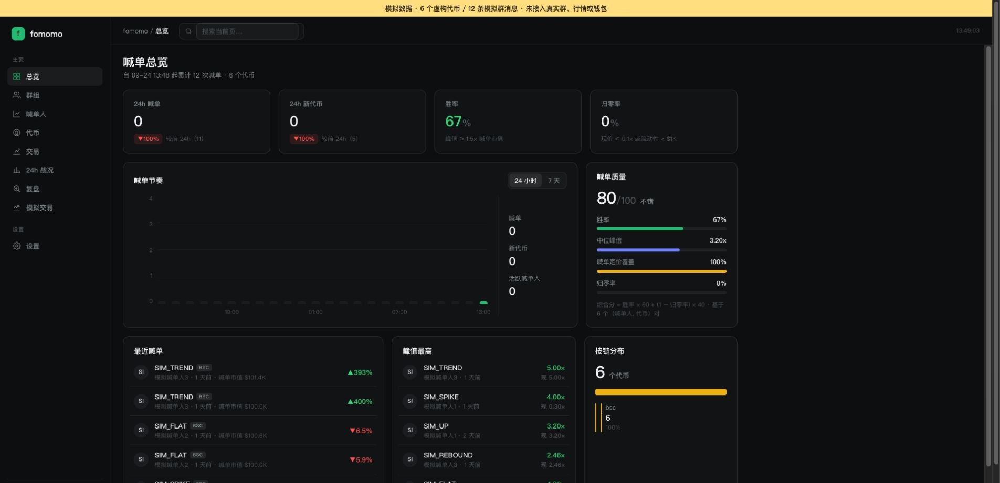
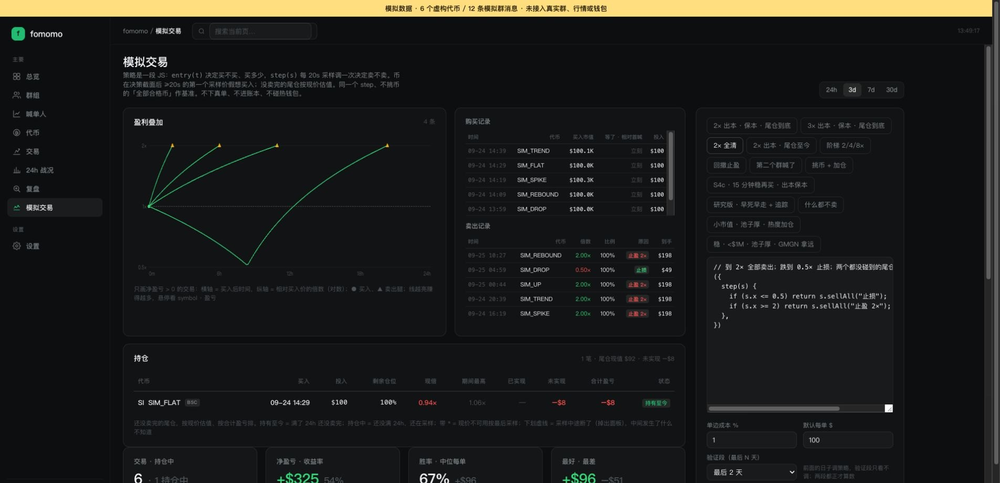
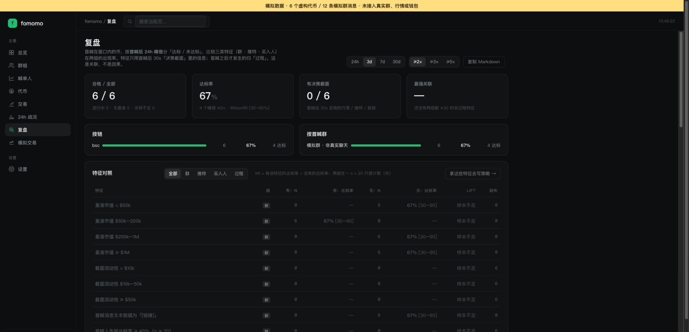
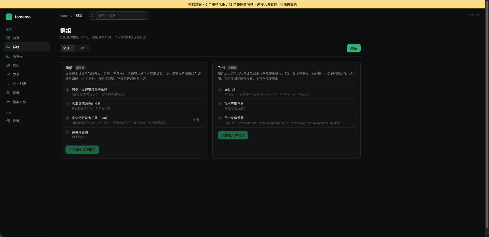
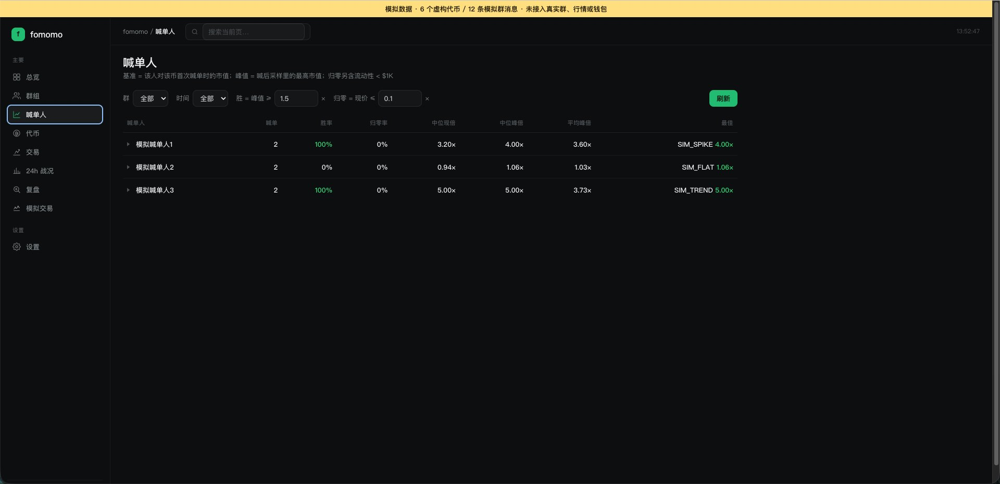
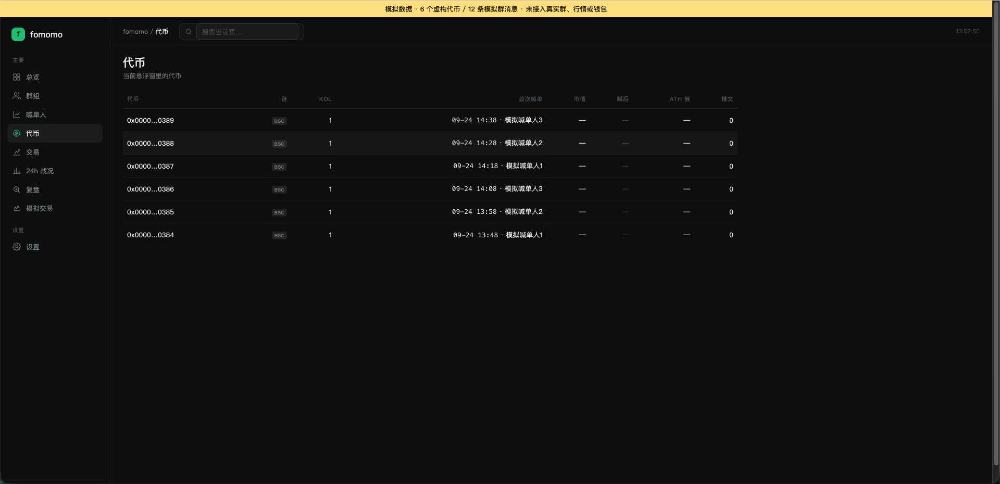
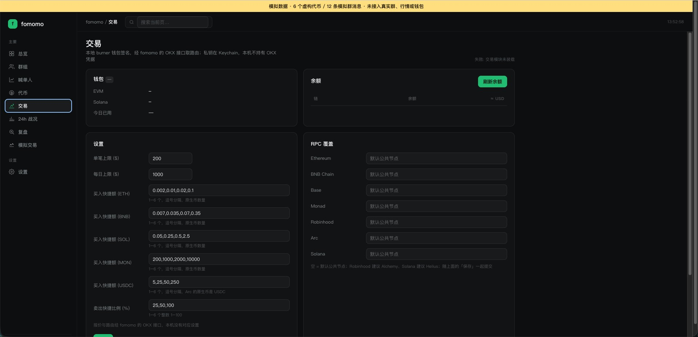
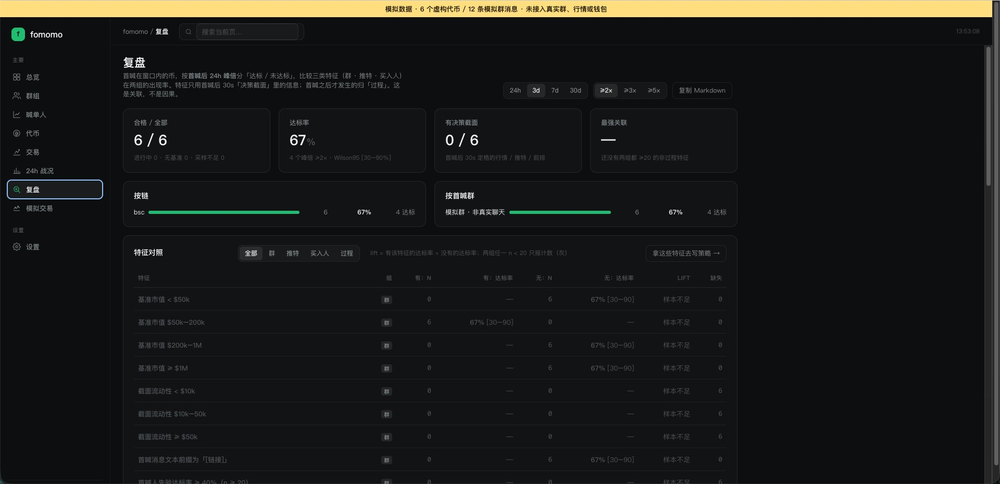
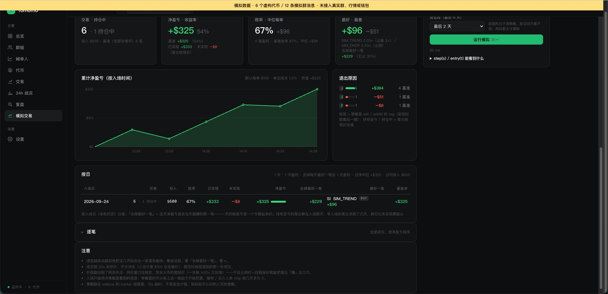

# fomomo · 完整公开图库

[评测判断](README.md) · [总排名](../README.md)

采集于 2026-09-26，共 10 张经去重/公开处理的图片。界面可见不等于功能通过。全部为模拟消息与价格；未接钱包。

## 01. 采集画面 03-001 · 01-overview

来源：**模拟数据适配页（不代表原生完整功能）**。画面仅记录当时状态；空白、加载、未配置或错误界面不作为功能成功证明。

## 02. 采集画面 03-002 · 02-default-simulation

来源：**模拟数据适配页（不代表原生完整功能）**。画面仅记录当时状态；空白、加载、未配置或错误界面不作为功能成功证明。

## 03. 采集画面 03-003 · 03-two-times-exit

来源：**模拟数据适配页（不代表原生完整功能）**。画面仅记录当时状态；空白、加载、未配置或错误界面不作为功能成功证明。

## 04. 采集画面 03-004 · 04-review

来源：**模拟数据适配页（不代表原生完整功能）**。画面仅记录当时状态；空白、加载、未配置或错误界面不作为功能成功证明。

## 05. 手动试用画面 03-005

来源：**用户手动截图 · 模拟数据适配页（不代表原生完整功能）**。画面仅记录当时状态；空白、加载、未配置或错误界面不作为功能成功证明。已裁去浏览器标签、聊天侧栏或无关桌面。

## 06. 手动试用画面 03-007

来源：**用户手动截图 · 模拟数据适配页（不代表原生完整功能）**。画面仅记录当时状态；空白、加载、未配置或错误界面不作为功能成功证明。已裁去浏览器标签、聊天侧栏或无关桌面。

## 07. 手动试用画面 03-009

来源：**用户手动截图 · 模拟数据适配页（不代表原生完整功能）**。画面仅记录当时状态；空白、加载、未配置或错误界面不作为功能成功证明。已裁去浏览器标签、聊天侧栏或无关桌面。

## 08. 手动试用画面 03-011

来源：**用户手动截图 · 模拟数据适配页（不代表原生完整功能）**。画面仅记录当时状态；空白、加载、未配置或错误界面不作为功能成功证明。已裁去浏览器标签、聊天侧栏或无关桌面。

## 09. 手动试用画面 03-013

来源：**用户手动截图 · 模拟数据适配页（不代表原生完整功能）**。画面仅记录当时状态；空白、加载、未配置或错误界面不作为功能成功证明。已裁去浏览器标签、聊天侧栏或无关桌面。

## 10. 手动试用画面 03-015

来源：**用户手动截图 · 模拟数据适配页（不代表原生完整功能）**。画面仅记录当时状态；空白、加载、未配置或错误界面不作为功能成功证明。已裁去浏览器标签、聊天侧栏或无关桌面。

