# KHunter · 完整公开图库

[评测判断](README.md) · [总排名](../README.md)

采集于 2026-09-26，共 23 张经去重/公开处理的图片。界面可见不等于功能通过。真实 BaoStock / 腾讯数据；PTrade 和自动调度关闭。

## 01. 采集画面 04-001 · 01-stocks

来源：**原生产品界面**。画面仅记录当时状态；空白、加载、未配置或错误界面不作为功能成功证明。

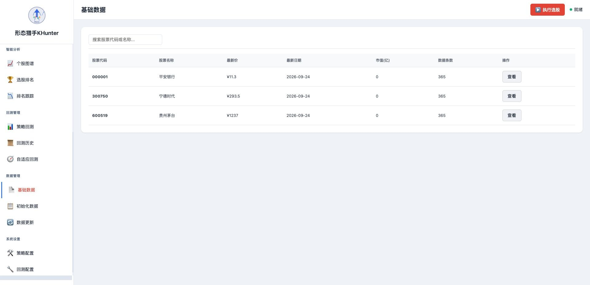

## 02. 采集画面 04-002 · 02-kline

来源：**原生产品界面**。画面仅记录当时状态；空白、加载、未配置或错误界面不作为功能成功证明。

## 03. 采集画面 04-003 · 03-selection-zero

来源：**原生产品界面**。画面仅记录当时状态；空白、加载、未配置或错误界面不作为功能成功证明。

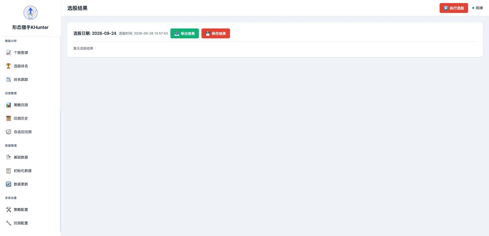

## 04. 采集画面 04-004 · 04-backtest-result

来源：**原生产品界面**。画面仅记录当时状态；空白、加载、未配置或错误界面不作为功能成功证明。

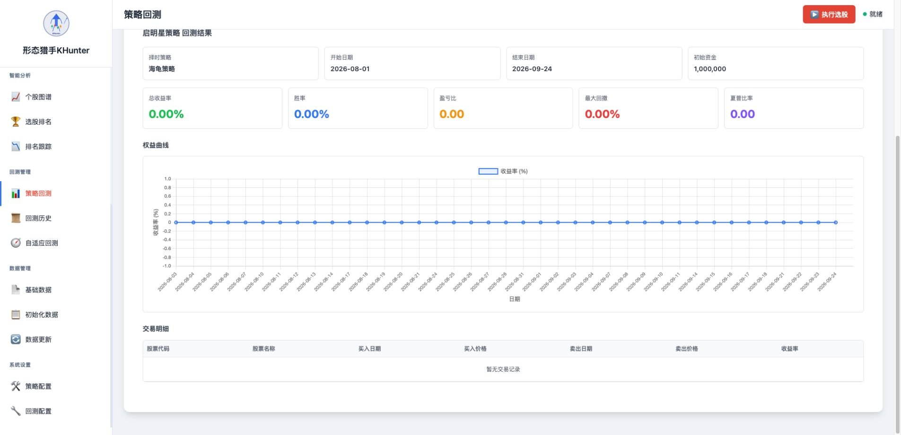

## 05. 采集画面 04-005 · 01-市场速览

来源：**原生产品界面**。画面仅记录当时状态；空白、加载、未配置或错误界面不作为功能成功证明。

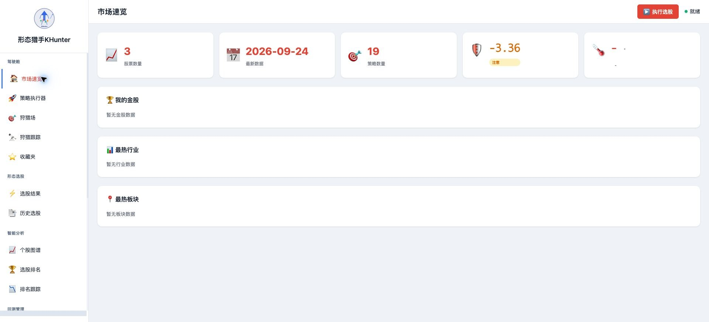

## 06. 采集画面 04-006 · 02-策略执行器

来源：**原生产品界面**。画面仅记录当时状态；空白、加载、未配置或错误界面不作为功能成功证明。

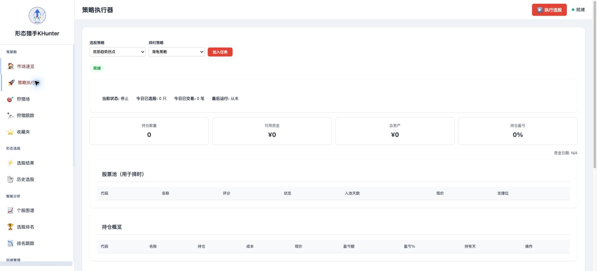

## 07. 采集画面 04-007 · 03-狩猎场

来源：**原生产品界面**。画面仅记录当时状态；空白、加载、未配置或错误界面不作为功能成功证明。

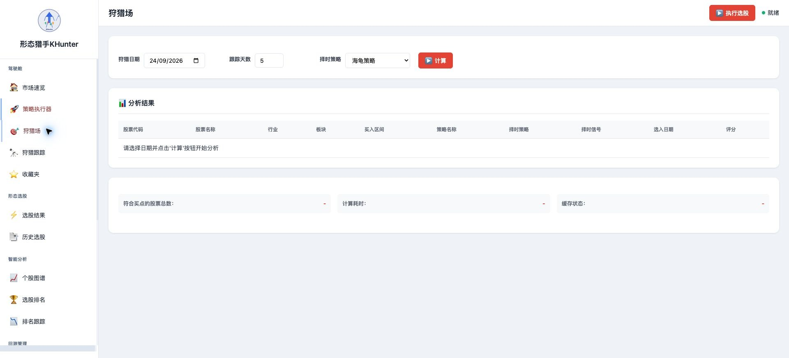

## 08. 采集画面 04-008 · 04-狩猎跟踪

来源：**原生产品界面**。画面仅记录当时状态；空白、加载、未配置或错误界面不作为功能成功证明。

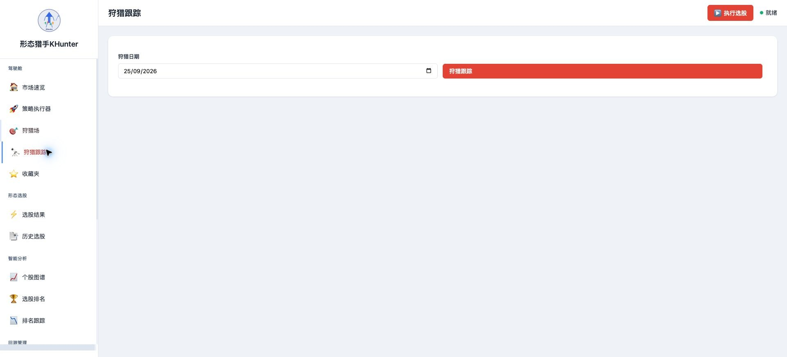

## 09. 采集画面 04-009 · 05-收藏夹

来源：**原生产品界面**。画面仅记录当时状态；空白、加载、未配置或错误界面不作为功能成功证明。

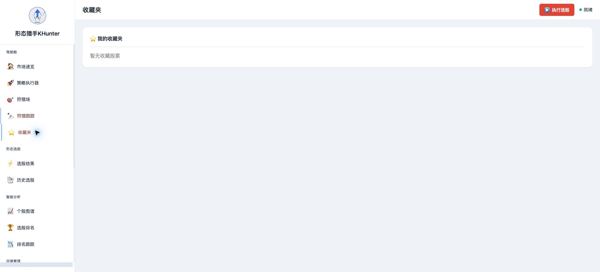

## 10. 采集画面 04-010 · 06-选股结果

来源：**原生产品界面**。画面仅记录当时状态；空白、加载、未配置或错误界面不作为功能成功证明。

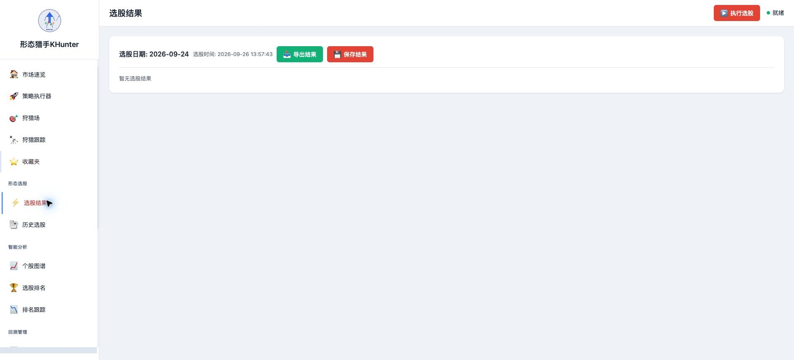

## 11. 采集画面 04-011 · 07-历史选股

来源：**原生产品界面**。画面仅记录当时状态；空白、加载、未配置或错误界面不作为功能成功证明。

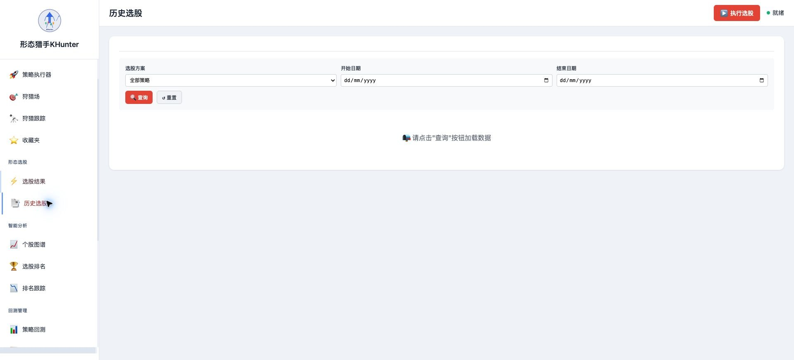

## 12. 采集画面 04-012 · 08-个股图谱

来源：**原生产品界面**。画面仅记录当时状态；空白、加载、未配置或错误界面不作为功能成功证明。

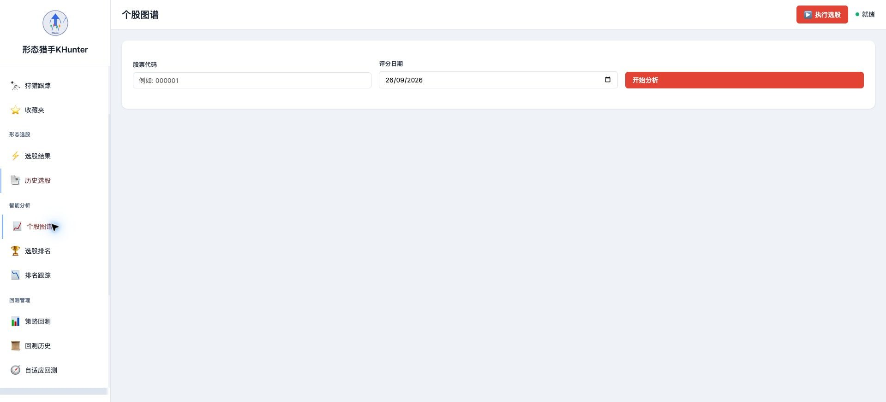

## 13. 采集画面 04-013 · 09-选股排名

来源：**原生产品界面**。画面仅记录当时状态；空白、加载、未配置或错误界面不作为功能成功证明。

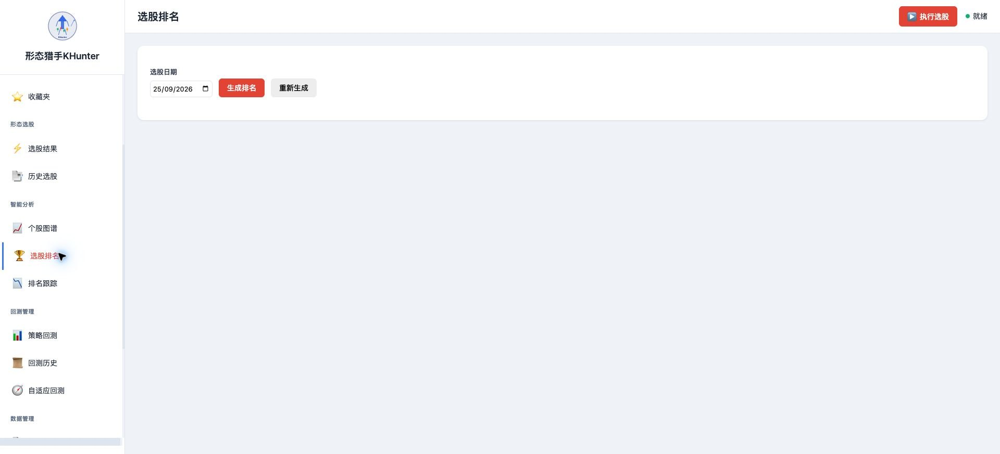

## 14. 采集画面 04-014 · 10-排名跟踪

来源：**原生产品界面**。画面仅记录当时状态；空白、加载、未配置或错误界面不作为功能成功证明。

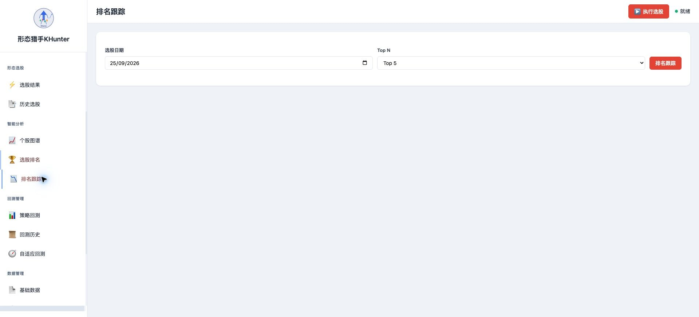

## 15. 采集画面 04-015 · 11-策略回测

来源：**原生产品界面**。画面仅记录当时状态；空白、加载、未配置或错误界面不作为功能成功证明。

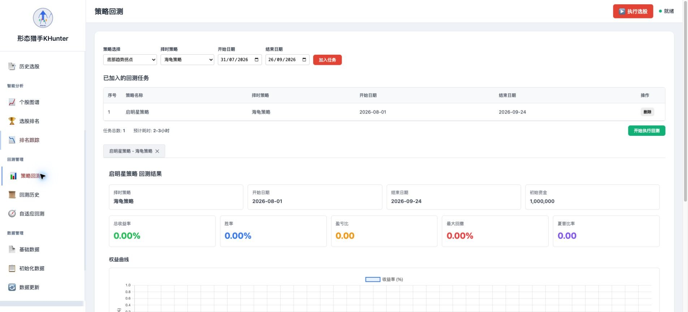

## 16. 采集画面 04-016 · 12-回测历史

来源：**原生产品界面**。画面仅记录当时状态；空白、加载、未配置或错误界面不作为功能成功证明。

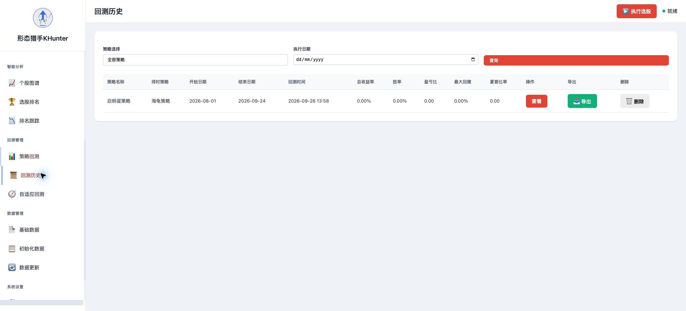

## 17. 采集画面 04-017 · 13-自适应回测

来源：**原生产品界面**。画面仅记录当时状态；空白、加载、未配置或错误界面不作为功能成功证明。

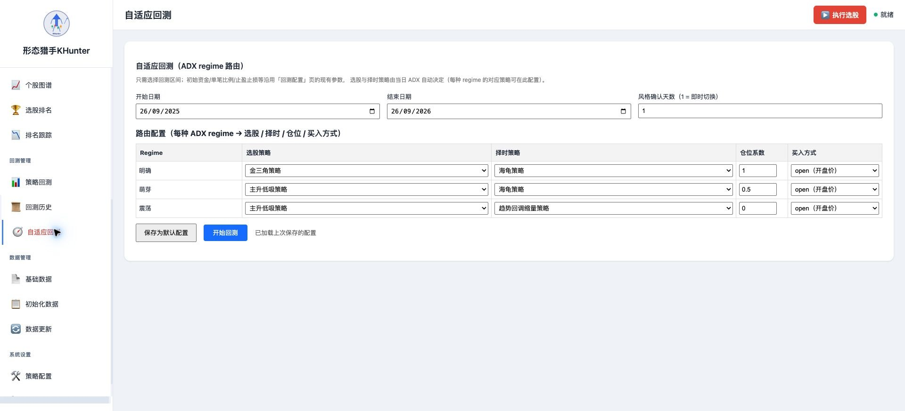

## 18. 采集画面 04-018 · 14-基础数据

来源：**原生产品界面**。画面仅记录当时状态；空白、加载、未配置或错误界面不作为功能成功证明。

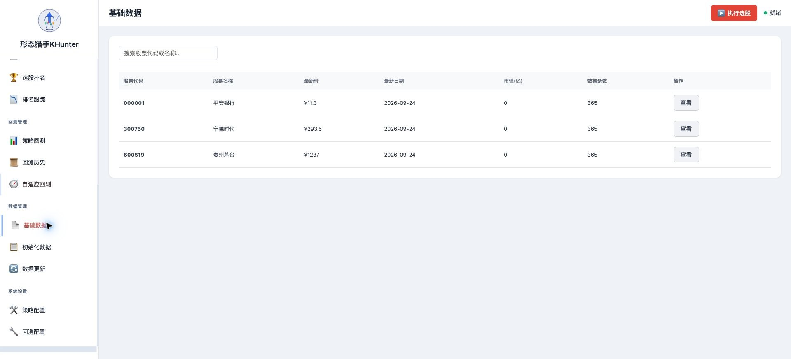

## 19. 采集画面 04-019 · 15-初始化数据

来源：**原生产品界面**。画面仅记录当时状态；空白、加载、未配置或错误界面不作为功能成功证明。

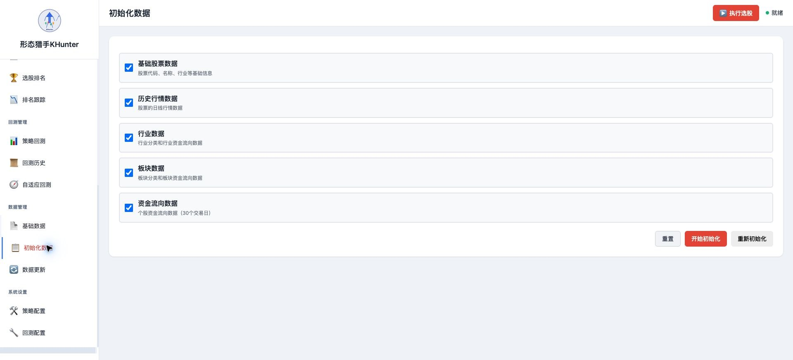

## 20. 采集画面 04-020 · 16-数据更新

来源：**原生产品界面**。画面仅记录当时状态；空白、加载、未配置或错误界面不作为功能成功证明。

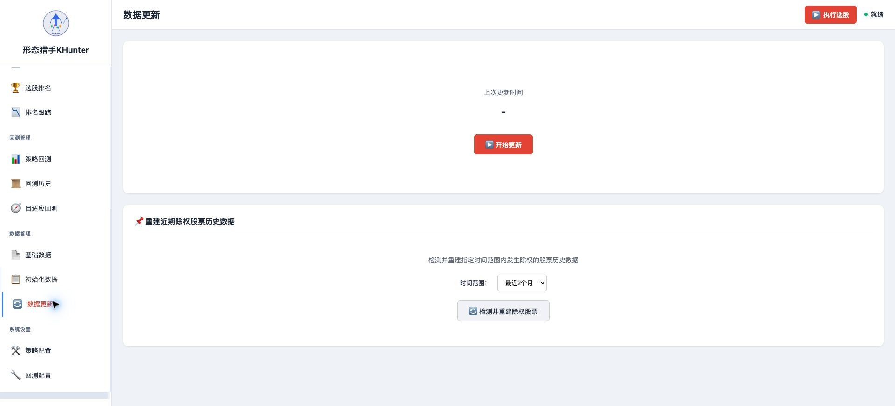

## 21. 采集画面 04-021 · 17-策略配置

来源：**原生产品界面**。画面仅记录当时状态；空白、加载、未配置或错误界面不作为功能成功证明。

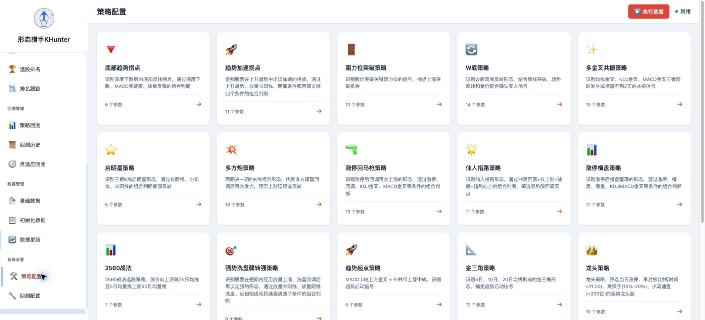

## 22. 采集画面 04-022 · 18-回测配置

来源：**原生产品界面**。画面仅记录当时状态；空白、加载、未配置或错误界面不作为功能成功证明。

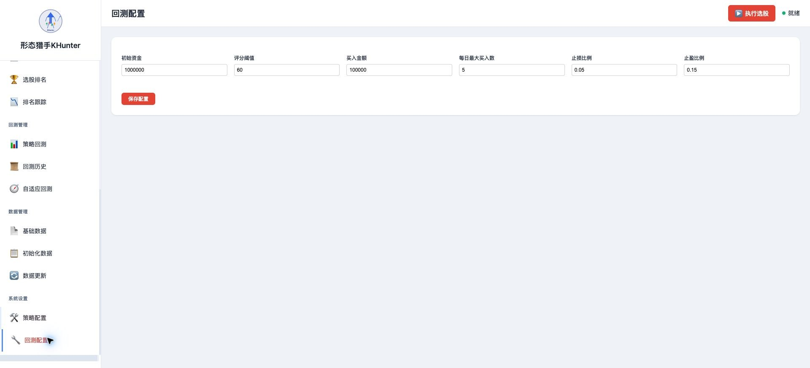

## 23. 手动试用画面 05-016

来源：**用户手动截图 · 原生产品界面**。画面仅记录当时状态；空白、加载、未配置或错误界面不作为功能成功证明。原档案误放在 TradeGenuis，按可见 KHunter 标识更正归属。已裁去浏览器标签、聊天侧栏或无关桌面。

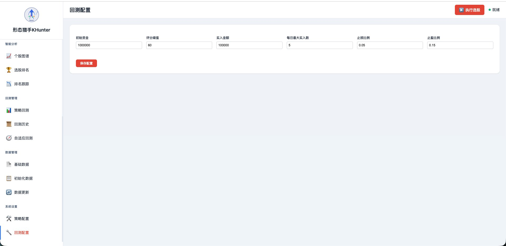
