# TradeGenuis-Options · 完整公开图库

[评测判断](README.md) · [总排名](../README.md)

采集于 2026-09-26，共 17 张经去重/公开处理的图片。界面可见不等于功能通过。导入试用素材；没有配置 AI key/embedding。

## 01. 采集画面 05-001 · 01-机会-首次同步

来源：**原生产品界面**。画面仅记录当时状态；空白、加载、未配置或错误界面不作为功能成功证明。公开版遮盖了本机路径或联系标识；原文件哈希在清单中保留。

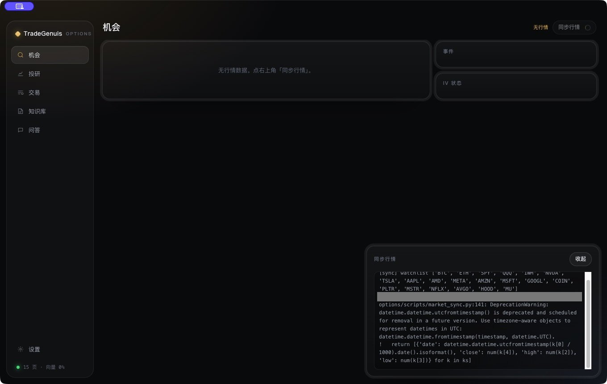

## 02. 采集画面 05-002 · 02-投研-入口

来源：**原生产品界面**。画面仅记录当时状态；空白、加载、未配置或错误界面不作为功能成功证明。

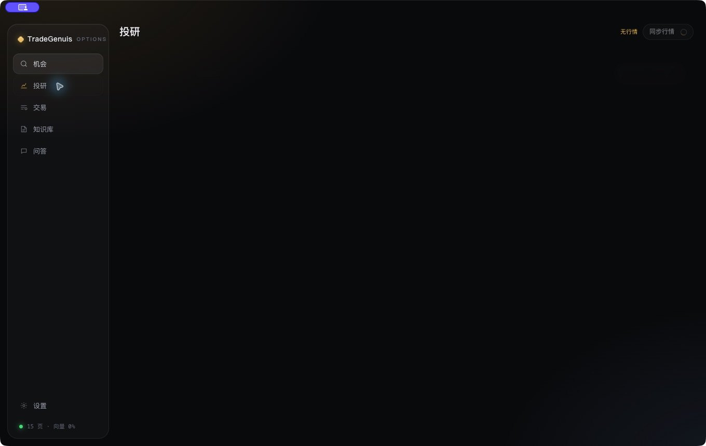

## 03. 采集画面 05-003 · 03-交易-总览

来源：**原生产品界面**。画面仅记录当时状态；空白、加载、未配置或错误界面不作为功能成功证明。

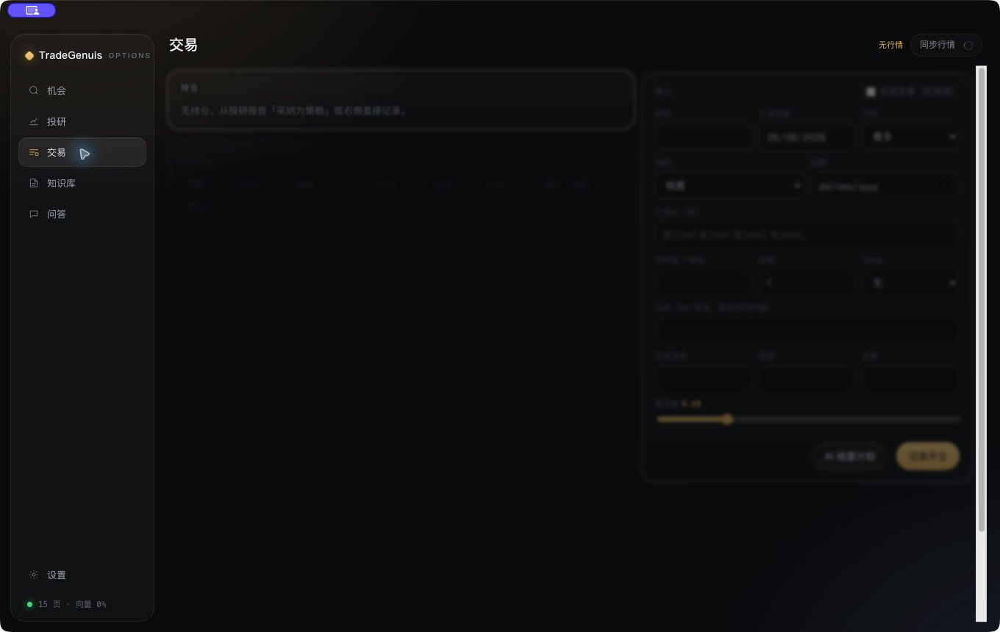

## 04. 采集画面 05-004 · 04-交易-历史交易表单

来源：**原生产品界面**。画面仅记录当时状态；空白、加载、未配置或错误界面不作为功能成功证明。

## 05. 采集画面 05-005 · 05-知识库-列表

来源：**原生产品界面**。画面仅记录当时状态；空白、加载、未配置或错误界面不作为功能成功证明。

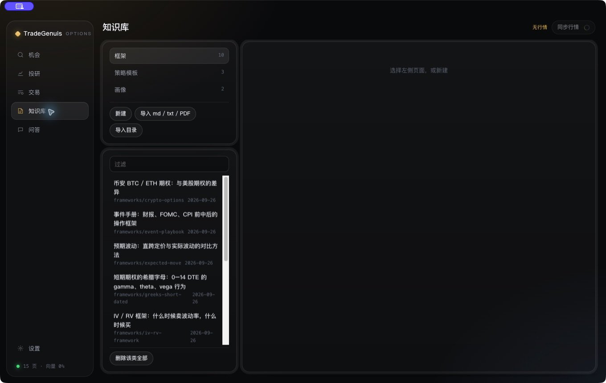

## 06. 采集画面 05-006 · 06-知识库-IV框架详情

来源：**原生产品界面**。画面仅记录当时状态；空白、加载、未配置或错误界面不作为功能成功证明。

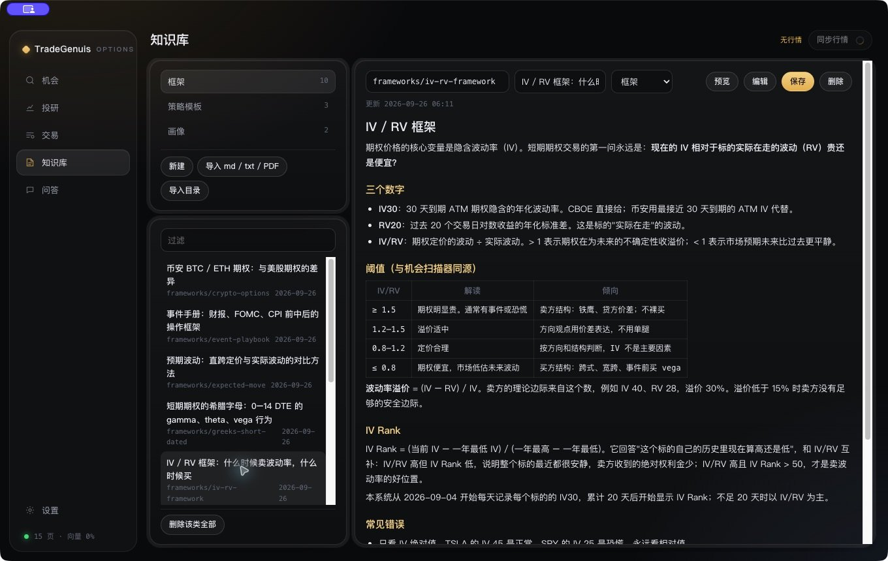

## 07. 采集画面 05-007 · 07-知识库-Markdown编辑

来源：**原生产品界面**。画面仅记录当时状态；空白、加载、未配置或错误界面不作为功能成功证明。

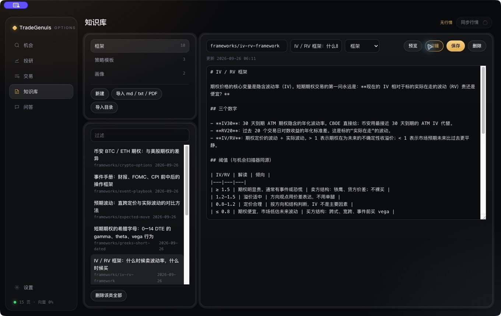

## 08. 采集画面 05-008 · 08-知识库-策略模板

来源：**原生产品界面**。画面仅记录当时状态；空白、加载、未配置或错误界面不作为功能成功证明。

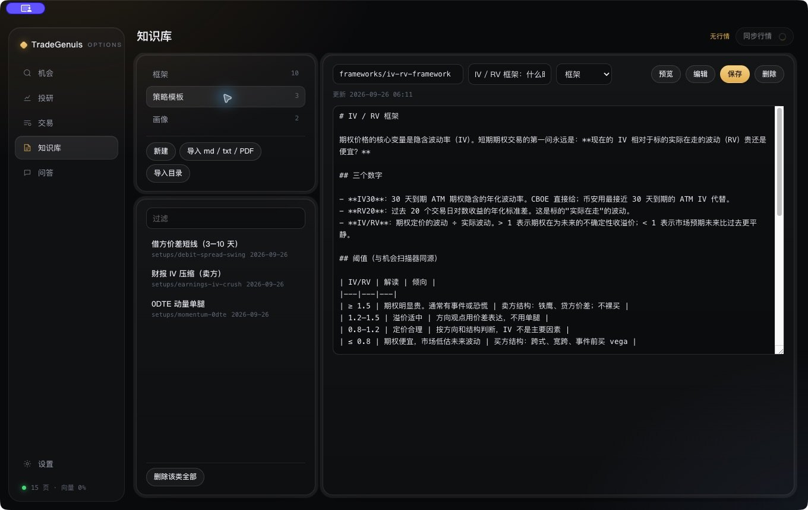

## 09. 采集画面 05-009 · 09-知识库-财报策略详情

来源：**原生产品界面**。画面仅记录当时状态；空白、加载、未配置或错误界面不作为功能成功证明。

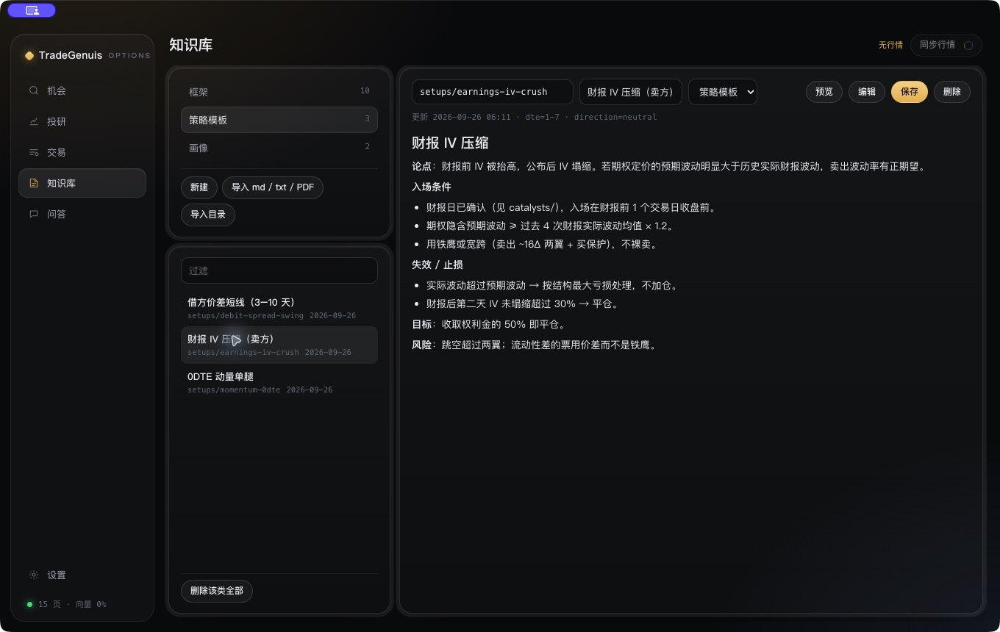

## 10. 采集画面 05-010 · 10-知识库-画像列表

来源：**原生产品界面**。画面仅记录当时状态；空白、加载、未配置或错误界面不作为功能成功证明。

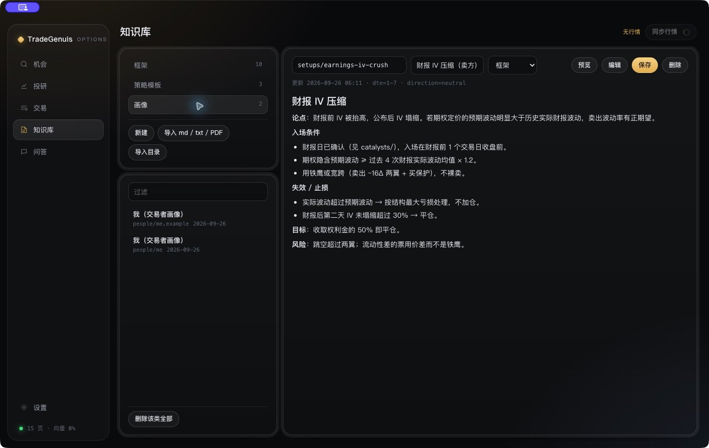

## 11. 采集画面 05-011 · 11-问答-入口

来源：**原生产品界面**。画面仅记录当时状态；空白、加载、未配置或错误界面不作为功能成功证明。

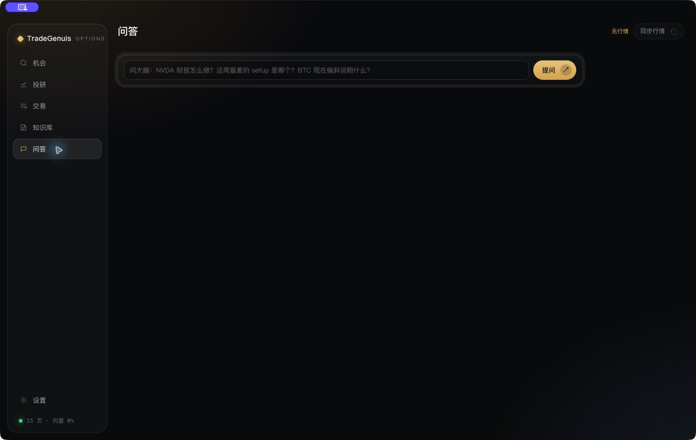

## 12. 采集画面 05-012 · 12-设置-依赖状态

来源：**原生产品界面**。画面仅记录当时状态；空白、加载、未配置或错误界面不作为功能成功证明。本机路径已遮盖。

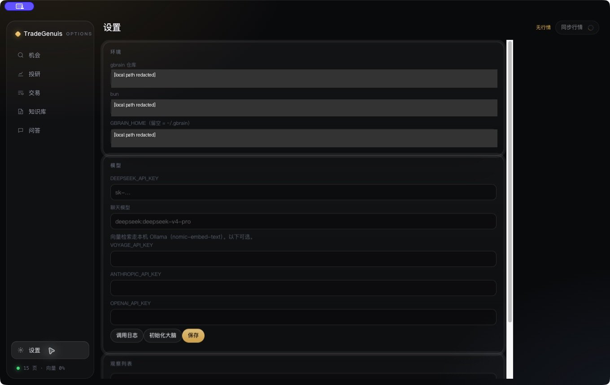

## 13. 采集画面 05-013 · 13-知识库-新建笔记

来源：**原生产品界面**。画面仅记录当时状态；空白、加载、未配置或错误界面不作为功能成功证明。

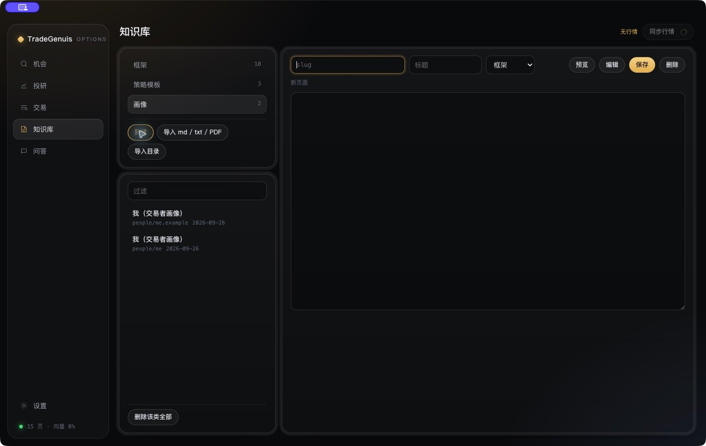

## 14. 采集画面 05-014 · 14-知识库-更新冲突

来源：**原生产品界面**。画面仅记录当时状态；空白、加载、未配置或错误界面不作为功能成功证明。

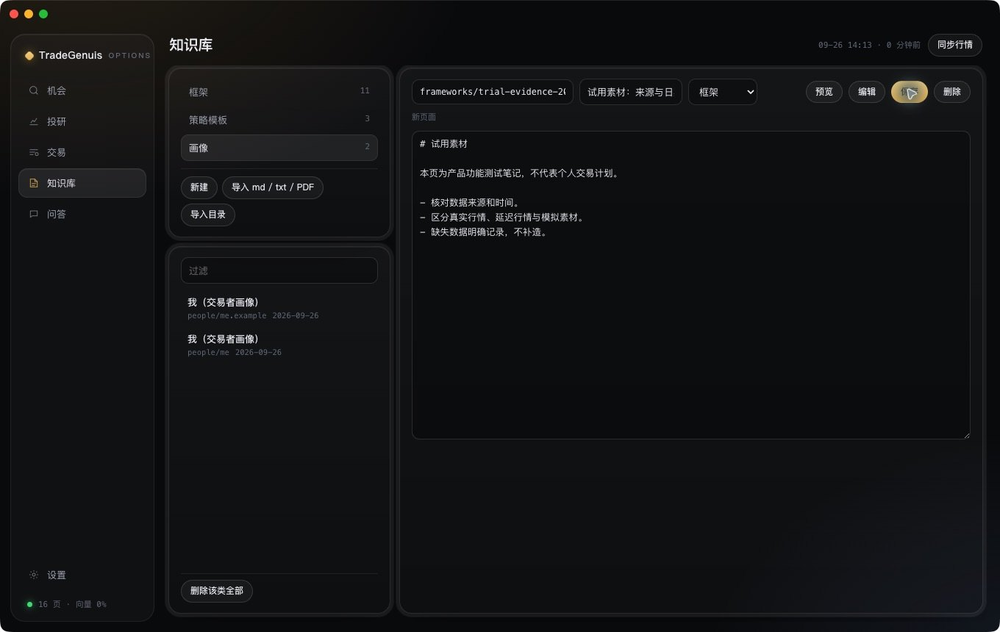

## 15. 采集画面 05-015 · 15-机会-同步完成

来源：**原生产品界面**。画面仅记录当时状态；空白、加载、未配置或错误界面不作为功能成功证明。

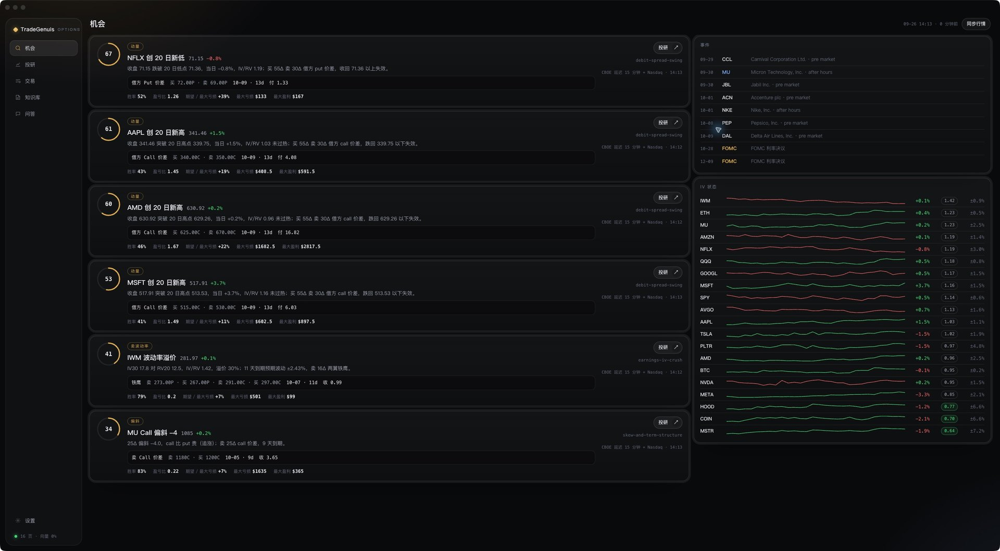

## 16. 手动试用画面 05-017

来源：**用户手动截图 · 原生产品界面**。画面仅记录当时状态；空白、加载、未配置或错误界面不作为功能成功证明。已裁去浏览器标签、聊天侧栏或无关桌面。

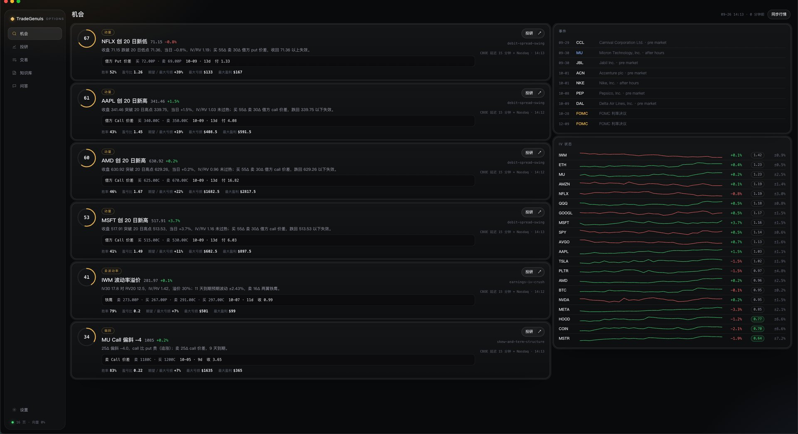

## 17. 手动试用画面 05-019

来源：**用户手动截图 · 原生产品界面**。画面仅记录当时状态；空白、加载、未配置或错误界面不作为功能成功证明。已裁去浏览器标签、聊天侧栏或无关桌面。

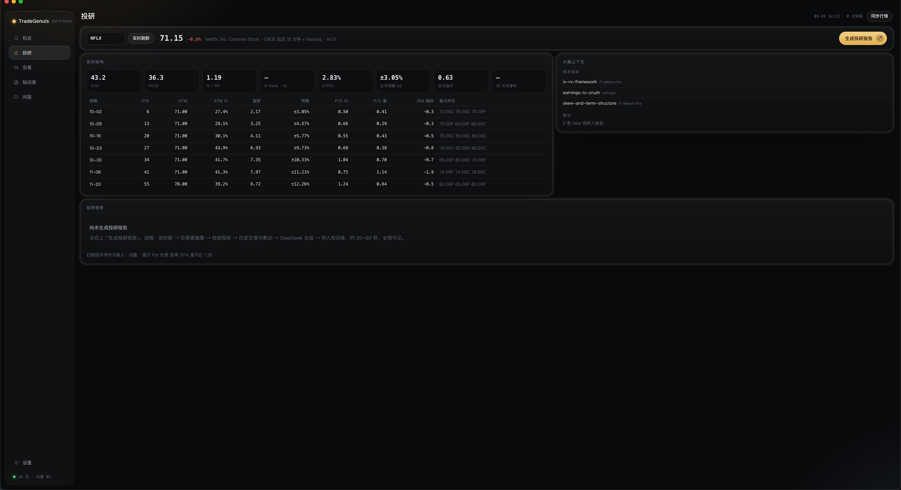
