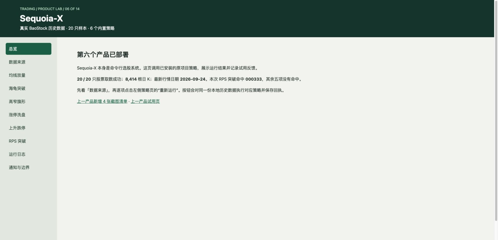
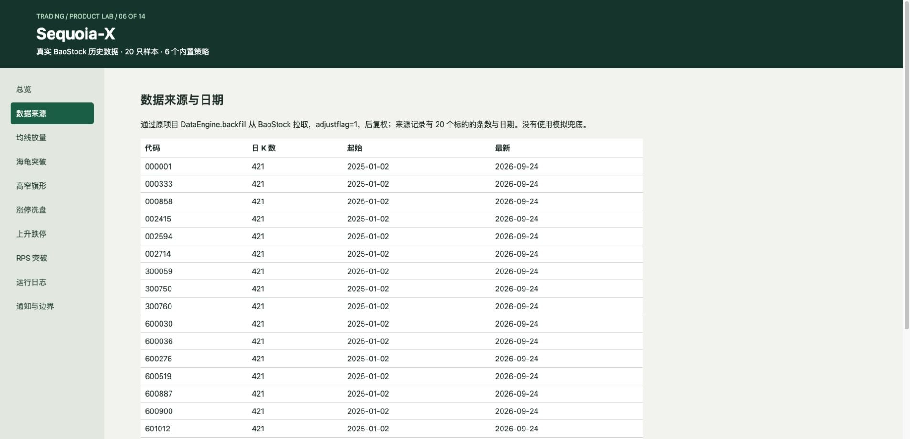
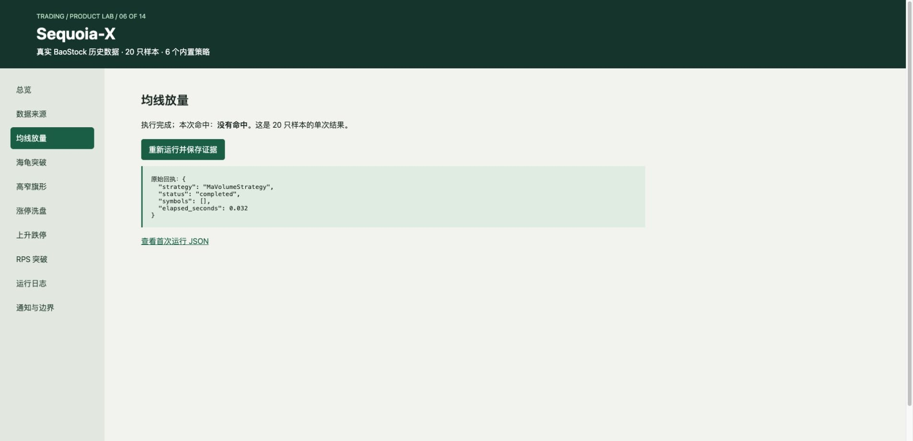
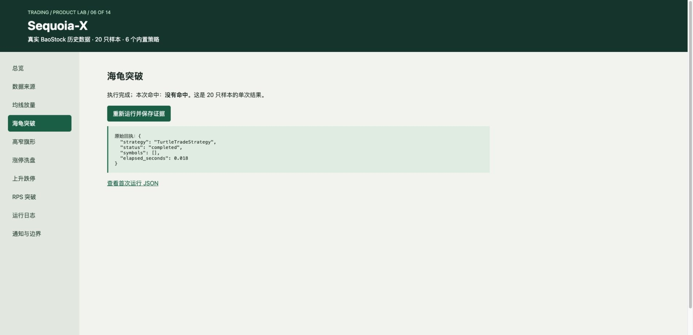
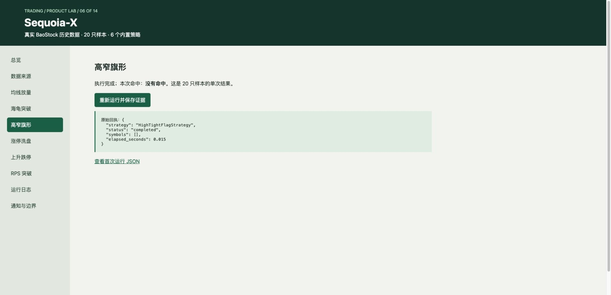
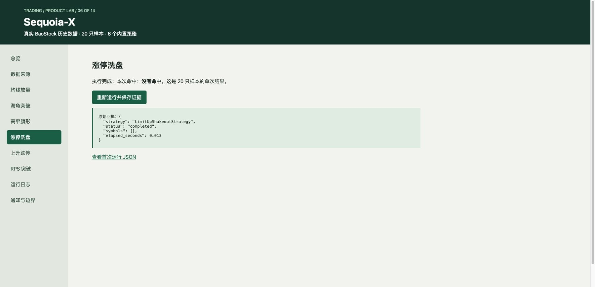
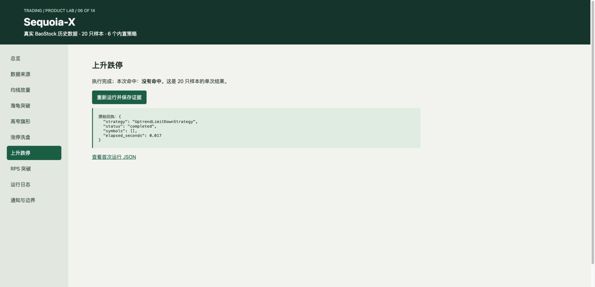
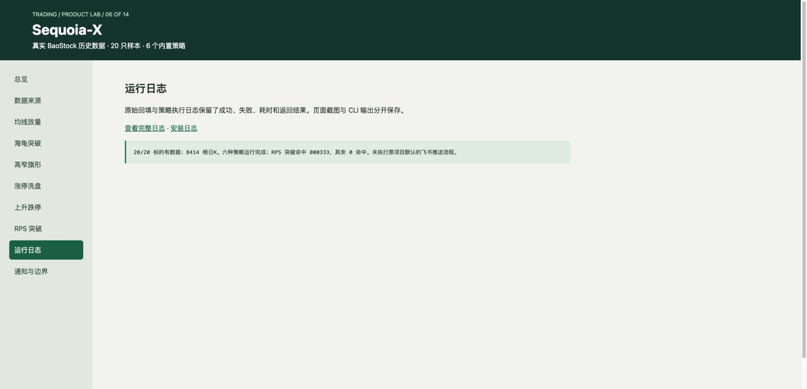
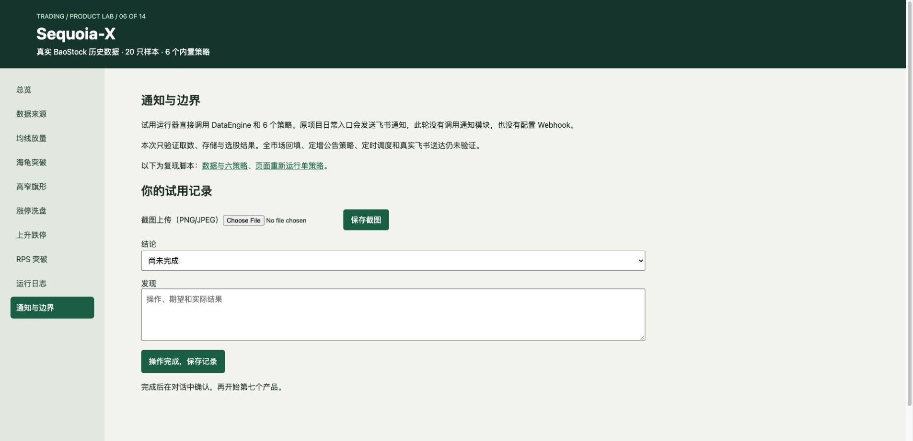
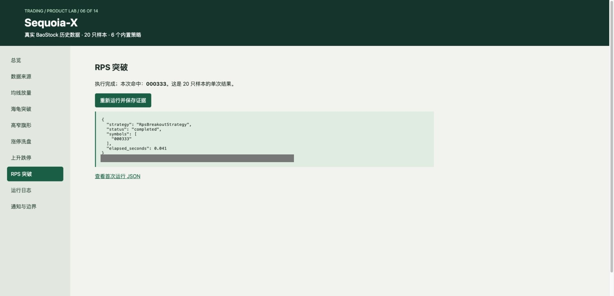

# Sequoia-X · 完整公开图库

[评测判断](README.md) · [总排名](../README.md)

采集于 2026-09-26，共 11 张经去重/公开处理的图片。界面可见不等于功能通过。真实行情；未发送通知。

## 01. 采集画面 06-001 · 01-总览

来源：**Product Lab 辅助页（不是原生 Web UI）**。画面仅记录当时状态；空白、加载、未配置或错误界面不作为功能成功证明。

## 02. 采集画面 06-002 · 02-数据来源

来源：**Product Lab 辅助页（不是原生 Web UI）**。画面仅记录当时状态；空白、加载、未配置或错误界面不作为功能成功证明。

## 03. 采集画面 06-003 · 03-均线放量

来源：**Product Lab 辅助页（不是原生 Web UI）**。画面仅记录当时状态；空白、加载、未配置或错误界面不作为功能成功证明。

## 04. 采集画面 06-004 · 04-海龟突破

来源：**Product Lab 辅助页（不是原生 Web UI）**。画面仅记录当时状态；空白、加载、未配置或错误界面不作为功能成功证明。

## 05. 采集画面 06-005 · 05-高窄旗形

来源：**Product Lab 辅助页（不是原生 Web UI）**。画面仅记录当时状态；空白、加载、未配置或错误界面不作为功能成功证明。

## 06. 采集画面 06-006 · 06-涨停洗盘

来源：**Product Lab 辅助页（不是原生 Web UI）**。画面仅记录当时状态；空白、加载、未配置或错误界面不作为功能成功证明。

## 07. 采集画面 06-007 · 07-上升跌停

来源：**Product Lab 辅助页（不是原生 Web UI）**。画面仅记录当时状态；空白、加载、未配置或错误界面不作为功能成功证明。

## 08. 采集画面 06-008 · 08-RPS 突破

来源：**Product Lab 辅助页（不是原生 Web UI）**。画面仅记录当时状态；空白、加载、未配置或错误界面不作为功能成功证明。

## 09. 采集画面 06-009 · 09-运行日志

来源：**Product Lab 辅助页（不是原生 Web UI）**。画面仅记录当时状态；空白、加载、未配置或错误界面不作为功能成功证明。

## 10. 采集画面 06-010 · 10-通知与边界

来源：**Product Lab 辅助页（不是原生 Web UI）**。画面仅记录当时状态；空白、加载、未配置或错误界面不作为功能成功证明。

## 11. 采集画面 06-011 · 11-RPS重新运行

来源：**Product Lab 辅助页（不是原生 Web UI）**。画面仅记录当时状态；空白、加载、未配置或错误界面不作为功能成功证明。公开版遮盖了本机路径或联系标识；原文件哈希在清单中保留。

