# tick-stock-panel · 完整公开图库

[评测判断](README.md) · [总排名](../README.md)

采集于 2026-09-26，共 45 张经去重/公开处理的图片。界面可见不等于功能通过。真实历史行情；AI 未配置；模拟盘截图停在建账户页。

## 01. 采集画面 07-001 · 01-首次引导-说明

来源：**原生产品界面**。画面仅记录当时状态；空白、加载、未配置或错误界面不作为功能成功证明。

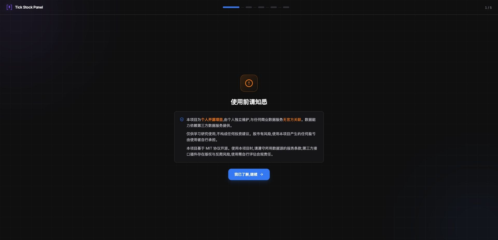

## 02. 采集画面 07-002 · 02-首次引导-欢迎

来源：**原生产品界面**。画面仅记录当时状态；空白、加载、未配置或错误界面不作为功能成功证明。

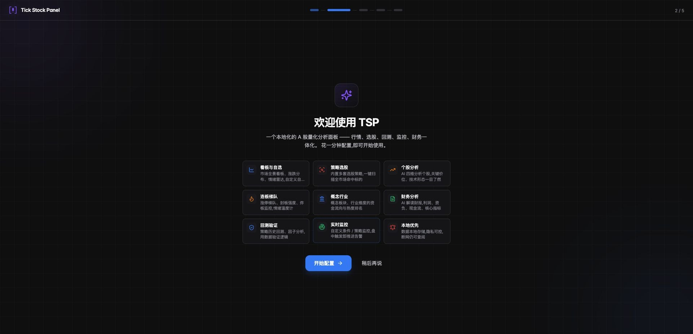

## 03. 采集画面 07-003 · 03-首次引导-数据源

来源：**原生产品界面**。画面仅记录当时状态；空白、加载、未配置或错误界面不作为功能成功证明。

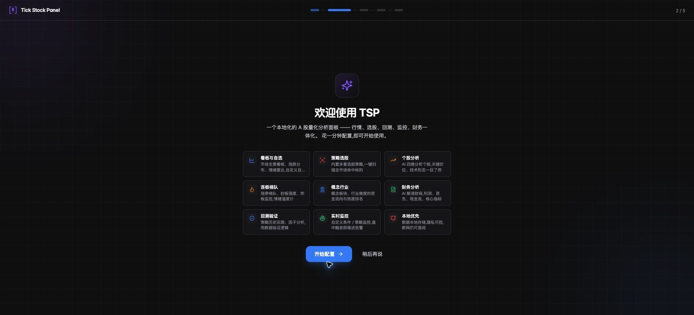

## 04. 采集画面 07-004 · 04-首次引导-能力路由

来源：**原生产品界面**。画面仅记录当时状态；空白、加载、未配置或错误界面不作为功能成功证明。

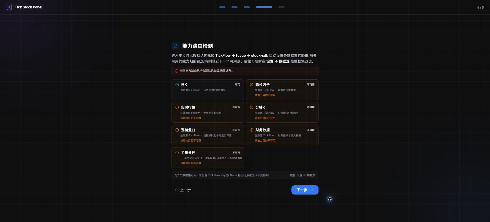

## 05. 采集画面 07-005 · 05-首次引导-完成

来源：**原生产品界面**。画面仅记录当时状态；空白、加载、未配置或错误界面不作为功能成功证明。

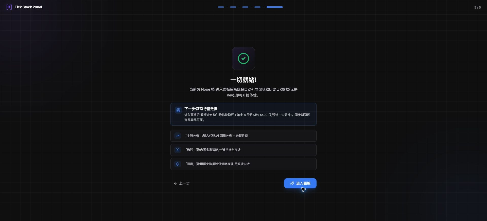

## 06. 采集画面 07-006 · 06-看板-同步前

来源：**原生产品界面**。画面仅记录当时状态；空白、加载、未配置或错误界面不作为功能成功证明。

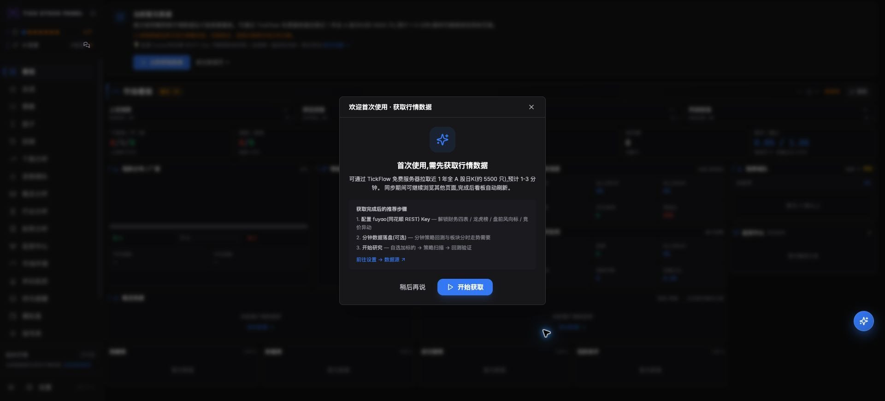

## 07. 采集画面 07-007 · 07-看板

来源：**原生产品界面**。画面仅记录当时状态；空白、加载、未配置或错误界面不作为功能成功证明。本张带模糊遮罩，不用于代表图。

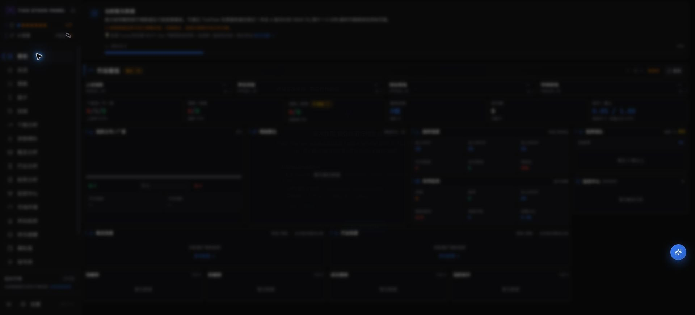

## 08. 采集画面 07-008 · 08-自选

来源：**原生产品界面**。画面仅记录当时状态；空白、加载、未配置或错误界面不作为功能成功证明。

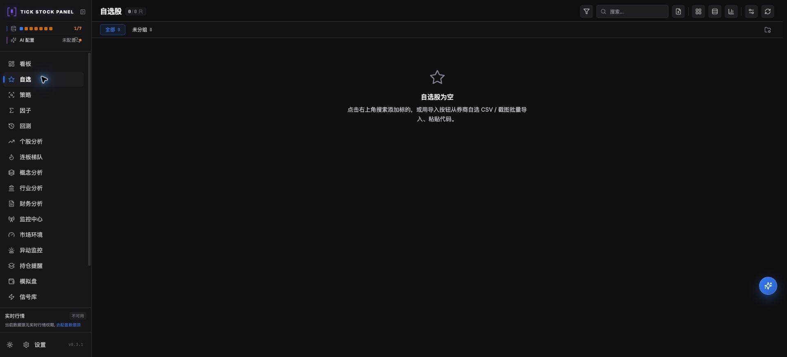

## 09. 采集画面 07-009 · 09-策略

来源：**原生产品界面**。画面仅记录当时状态；空白、加载、未配置或错误界面不作为功能成功证明。

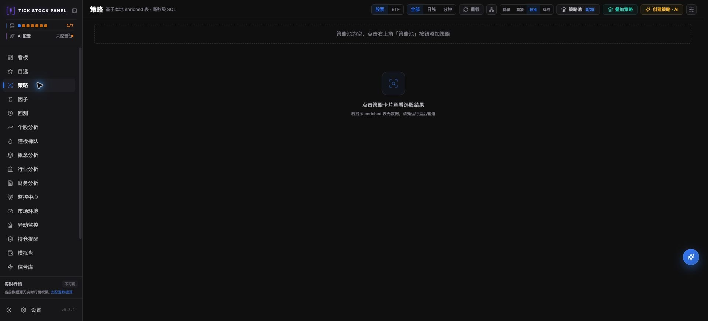

## 10. 采集画面 07-010 · 10-因子

来源：**原生产品界面**。画面仅记录当时状态；空白、加载、未配置或错误界面不作为功能成功证明。

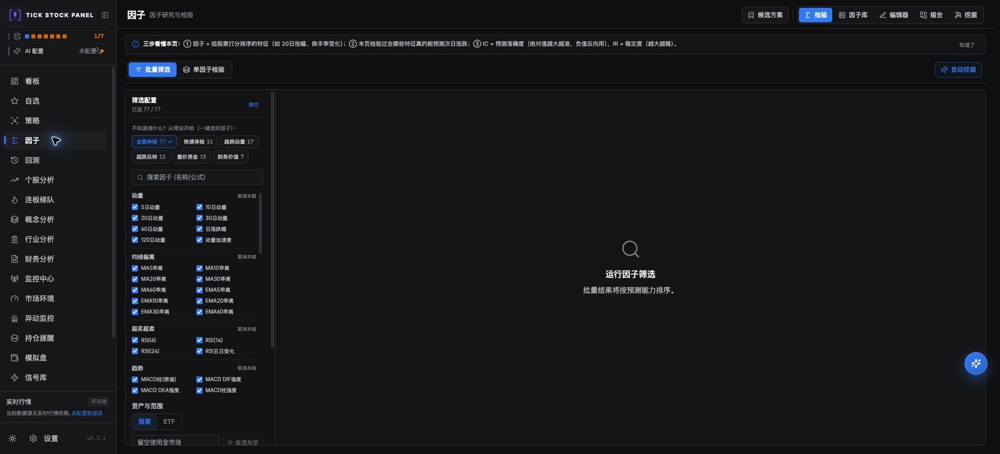

## 11. 采集画面 07-011 · 11-回测

来源：**原生产品界面**。画面仅记录当时状态；空白、加载、未配置或错误界面不作为功能成功证明。

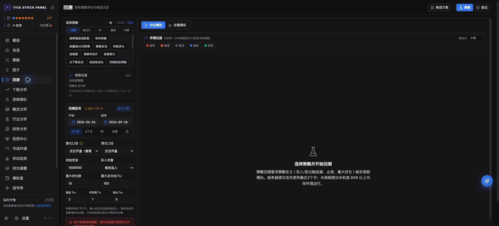

## 12. 采集画面 07-012 · 12-个股分析

来源：**原生产品界面**。画面仅记录当时状态；空白、加载、未配置或错误界面不作为功能成功证明。

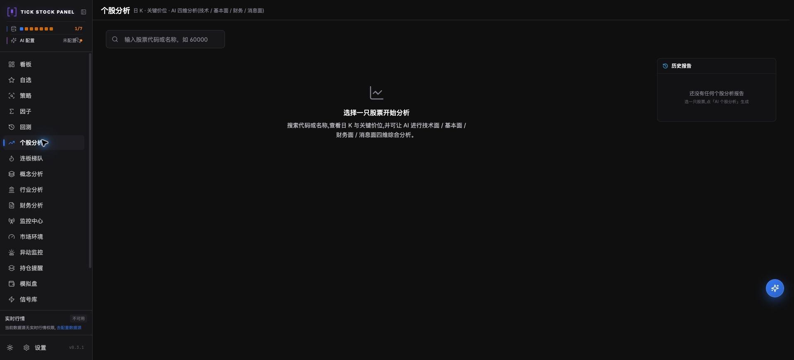

## 13. 采集画面 07-013 · 13-连板梯队

来源：**原生产品界面**。画面仅记录当时状态；空白、加载、未配置或错误界面不作为功能成功证明。

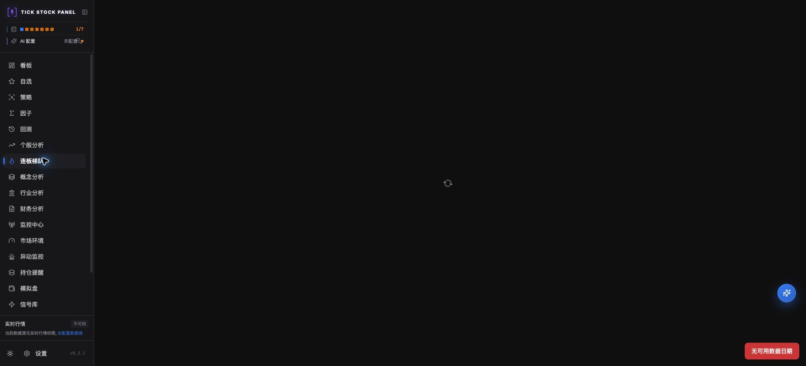

## 14. 采集画面 07-014 · 14-概念分析

来源：**原生产品界面**。画面仅记录当时状态；空白、加载、未配置或错误界面不作为功能成功证明。

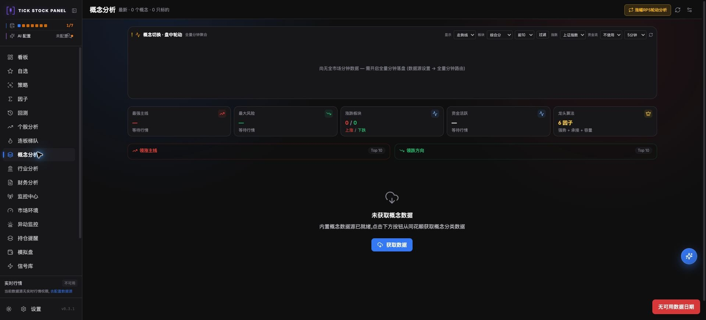

## 15. 采集画面 07-015 · 15-行业分析

来源：**原生产品界面**。画面仅记录当时状态；空白、加载、未配置或错误界面不作为功能成功证明。

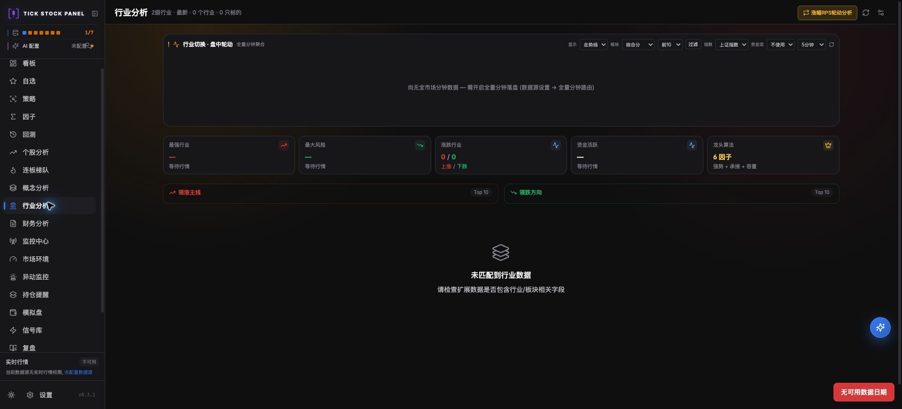

## 16. 采集画面 07-016 · 16-财务分析

来源：**原生产品界面**。画面仅记录当时状态；空白、加载、未配置或错误界面不作为功能成功证明。

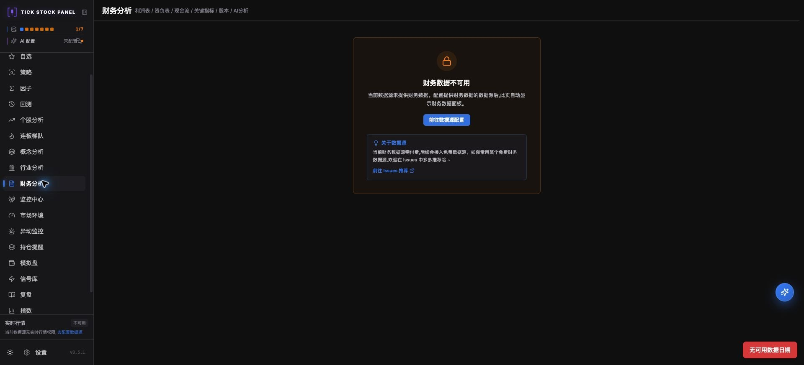

## 17. 采集画面 07-017 · 17-监控中心

来源：**原生产品界面**。画面仅记录当时状态；空白、加载、未配置或错误界面不作为功能成功证明。

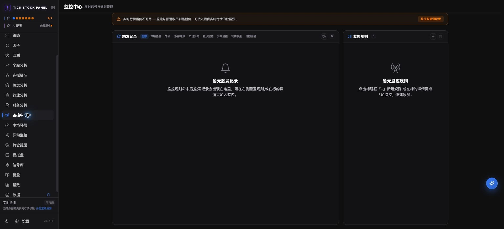

## 18. 采集画面 07-018 · 18-市场环境

来源：**原生产品界面**。画面仅记录当时状态；空白、加载、未配置或错误界面不作为功能成功证明。

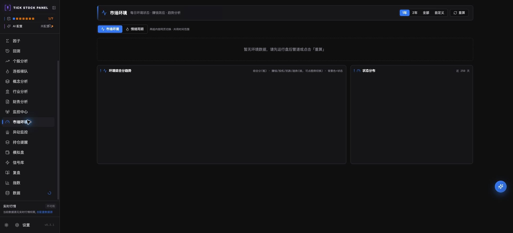

## 19. 采集画面 07-019 · 19-异动监控

来源：**原生产品界面**。画面仅记录当时状态；空白、加载、未配置或错误界面不作为功能成功证明。

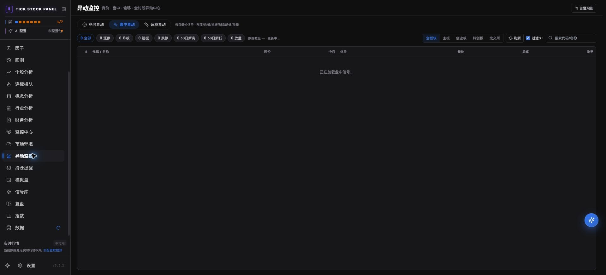

## 20. 采集画面 07-020 · 20-持仓提醒

来源：**原生产品界面**。画面仅记录当时状态；空白、加载、未配置或错误界面不作为功能成功证明。

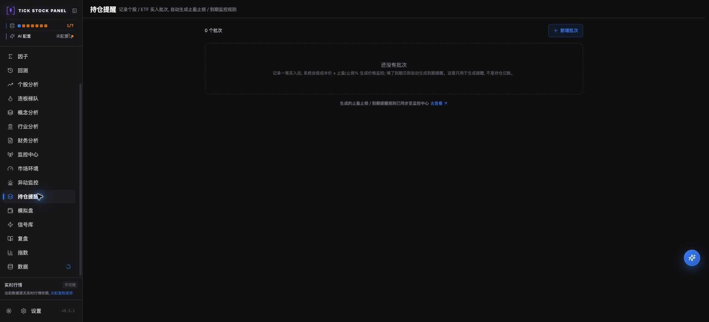

## 21. 采集画面 07-021 · 21-模拟盘

来源：**原生产品界面**。画面仅记录当时状态；空白、加载、未配置或错误界面不作为功能成功证明。

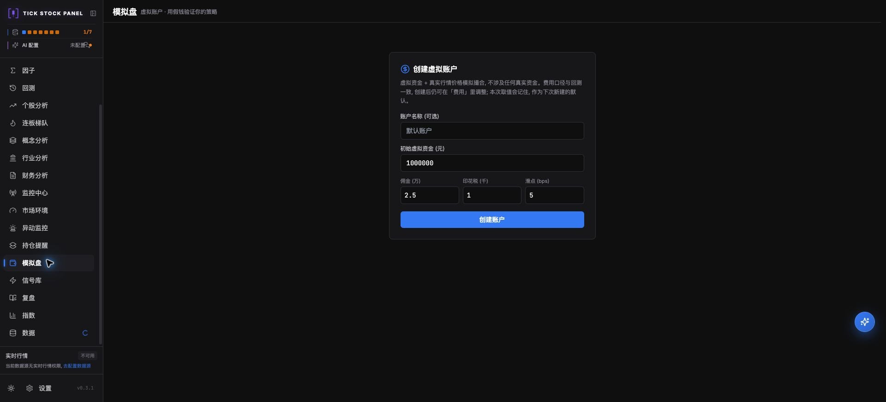

## 22. 采集画面 07-022 · 22-信号库

来源：**原生产品界面**。画面仅记录当时状态；空白、加载、未配置或错误界面不作为功能成功证明。

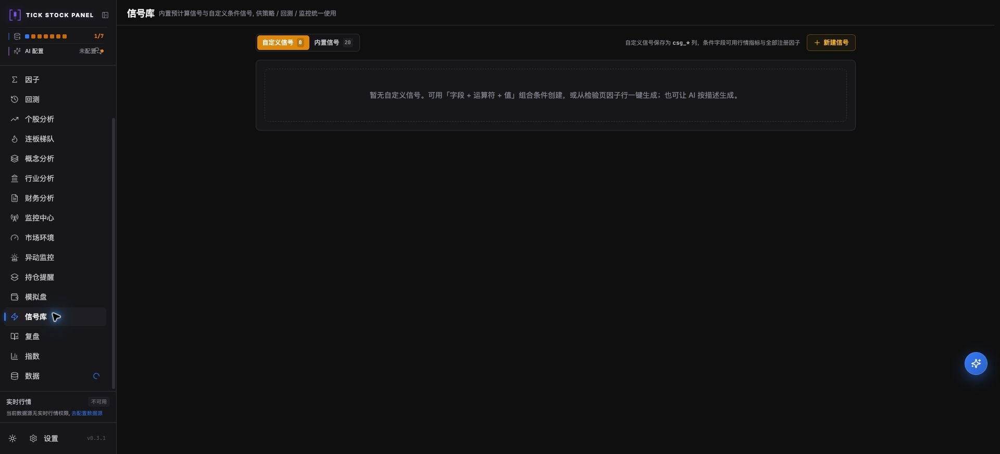

## 23. 采集画面 07-023 · 23-复盘

来源：**原生产品界面**。画面仅记录当时状态；空白、加载、未配置或错误界面不作为功能成功证明。

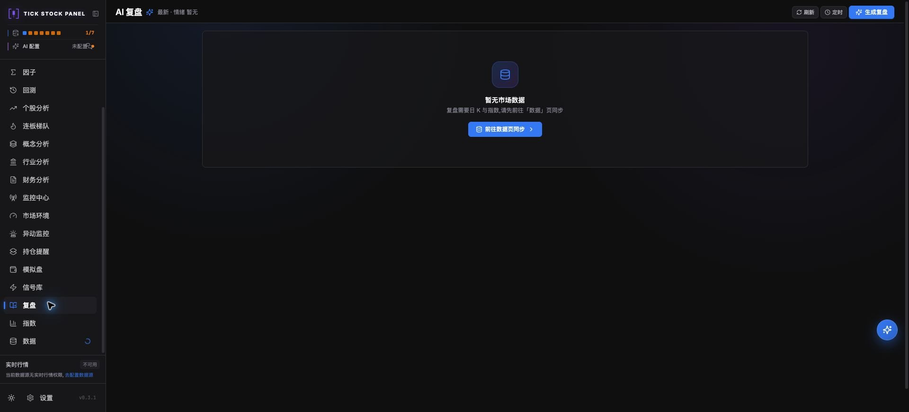

## 24. 采集画面 07-024 · 24-指数

来源：**原生产品界面**。画面仅记录当时状态；空白、加载、未配置或错误界面不作为功能成功证明。

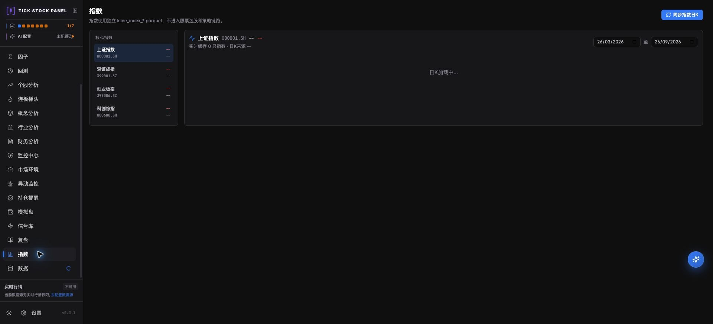

## 25. 采集画面 07-025 · 25-数据

来源：**原生产品界面**。画面仅记录当时状态；空白、加载、未配置或错误界面不作为功能成功证明。

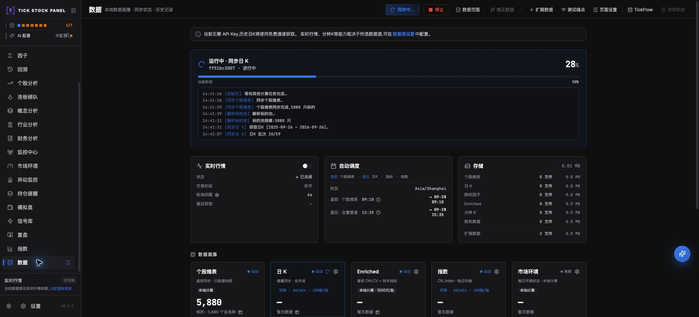

## 26. 采集画面 07-026 · 26-设置

来源：**原生产品界面**。画面仅记录当时状态；空白、加载、未配置或错误界面不作为功能成功证明。

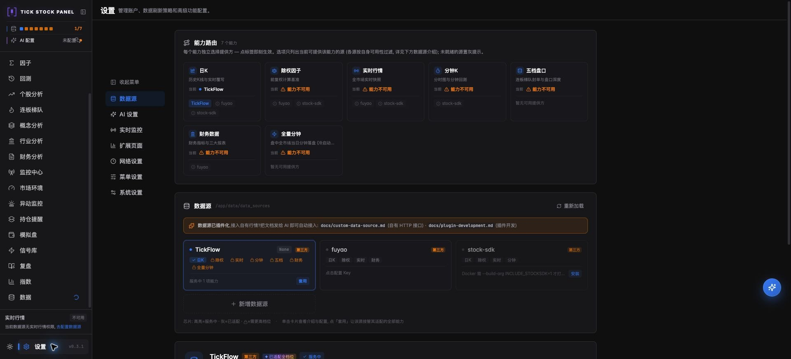

## 27. 采集画面 07-027 · 27-设置-AI 设置

来源：**原生产品界面**。画面仅记录当时状态；空白、加载、未配置或错误界面不作为功能成功证明。

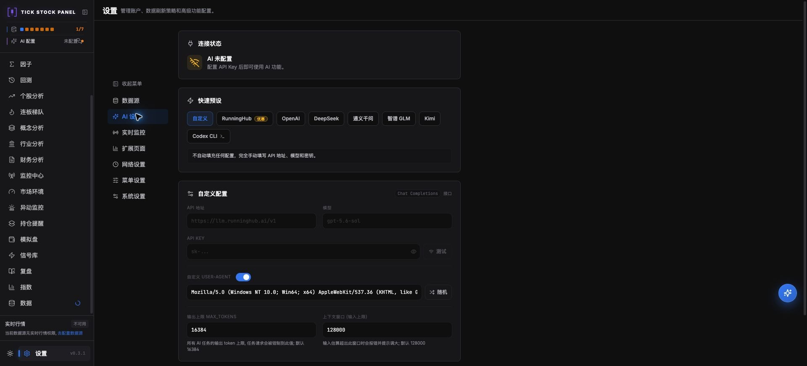

## 28. 采集画面 07-028 · 28-设置-实时监控

来源：**原生产品界面**。画面仅记录当时状态；空白、加载、未配置或错误界面不作为功能成功证明。

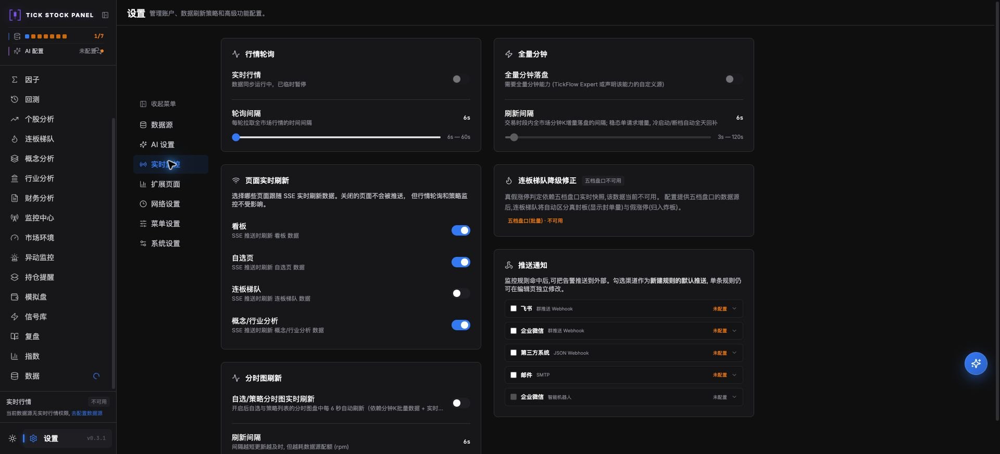

## 29. 采集画面 07-029 · 29-设置-扩展页面

来源：**原生产品界面**。画面仅记录当时状态；空白、加载、未配置或错误界面不作为功能成功证明。

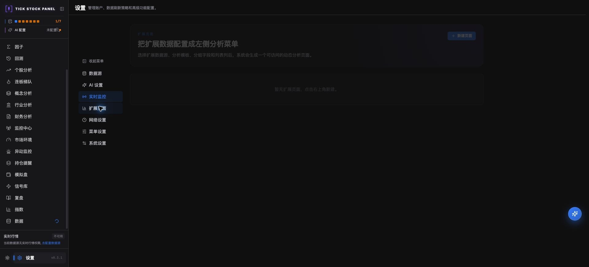

## 30. 采集画面 07-030 · 30-设置-网络设置

来源：**原生产品界面**。画面仅记录当时状态；空白、加载、未配置或错误界面不作为功能成功证明。

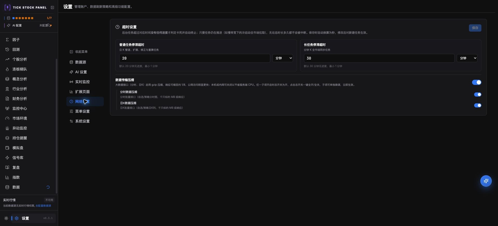

## 31. 采集画面 07-031 · 31-设置-菜单设置

来源：**原生产品界面**。画面仅记录当时状态；空白、加载、未配置或错误界面不作为功能成功证明。

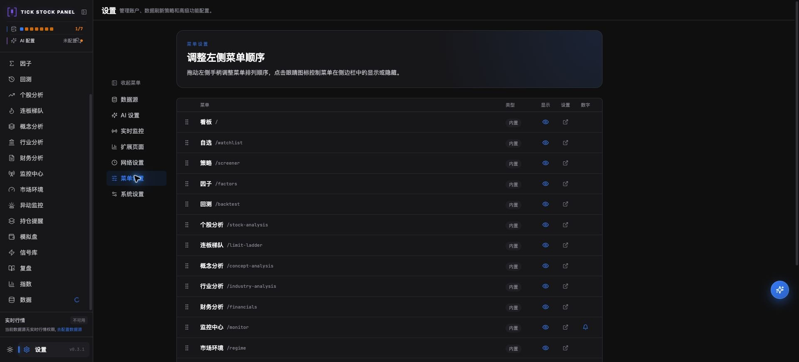

## 32. 采集画面 07-032 · 32-设置-系统设置

来源：**原生产品界面**。画面仅记录当时状态；空白、加载、未配置或错误界面不作为功能成功证明。

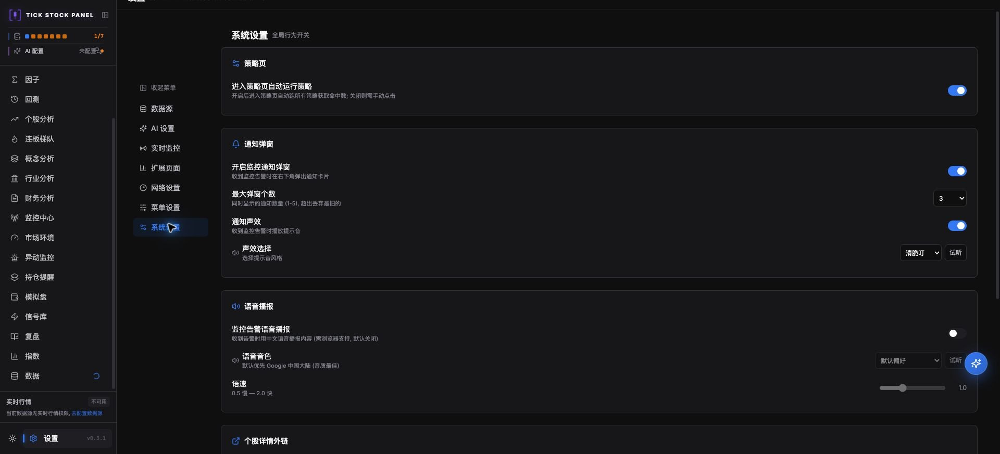

## 33. 采集画面 07-033 · 33-自选-真实行情

来源：**原生产品界面**。画面仅记录当时状态；空白、加载、未配置或错误界面不作为功能成功证明。

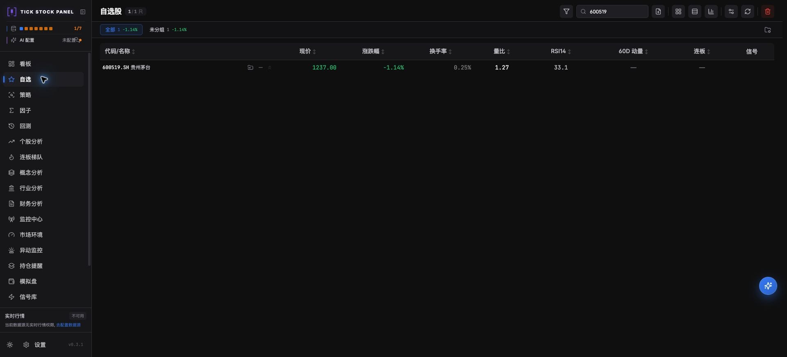

## 34. 采集画面 07-034 · 34-贵州茅台-日K

来源：**原生产品界面**。画面仅记录当时状态；空白、加载、未配置或错误界面不作为功能成功证明。

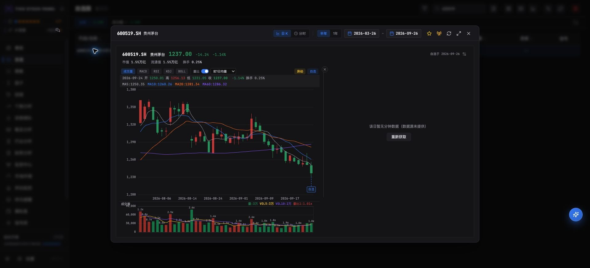

## 35. 采集画面 07-035 · 35-策略-MA金叉65只

来源：**原生产品界面**。画面仅记录当时状态；空白、加载、未配置或错误界面不作为功能成功证明。

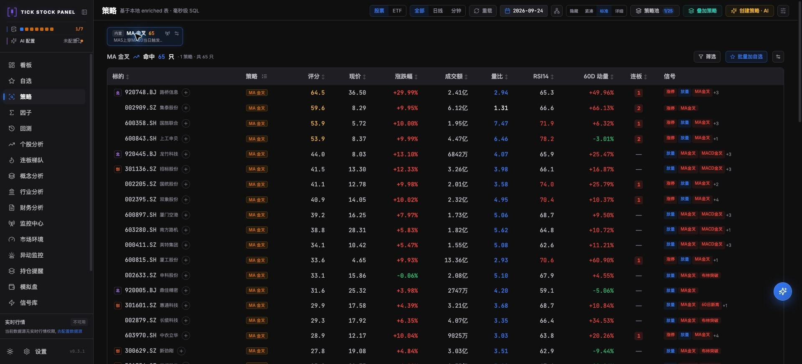

## 36. 采集画面 07-036 · 36-回测-MA金叉结果

来源：**原生产品界面**。画面仅记录当时状态；空白、加载、未配置或错误界面不作为功能成功证明。

## 37. 手动试用画面 07-037

来源：**用户手动截图 · 原生产品界面**。画面仅记录当时状态；空白、加载、未配置或错误界面不作为功能成功证明。已裁去浏览器标签、聊天侧栏或无关桌面。

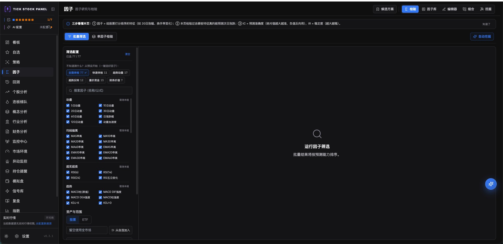

## 38. 手动试用画面 07-039

来源：**用户手动截图 · 原生产品界面**。画面仅记录当时状态；空白、加载、未配置或错误界面不作为功能成功证明。已裁去浏览器标签、聊天侧栏或无关桌面。

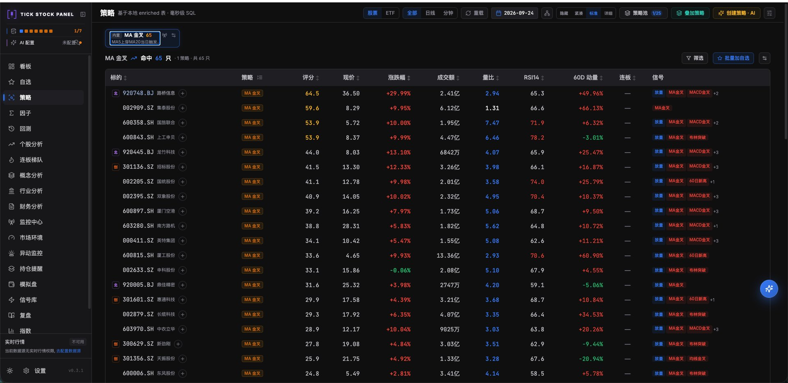

## 39. 手动试用画面 07-041

来源：**用户手动截图 · 原生产品界面**。画面仅记录当时状态；空白、加载、未配置或错误界面不作为功能成功证明。已裁去浏览器标签、聊天侧栏或无关桌面。

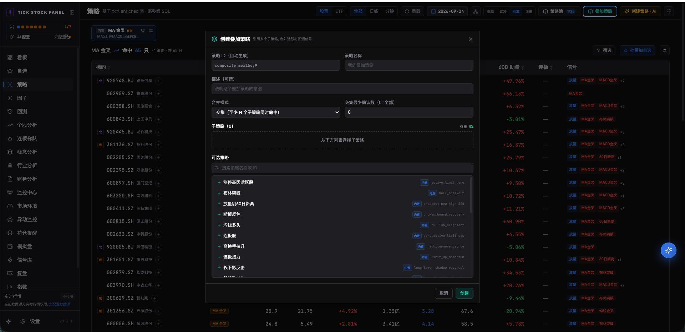

## 40. 手动试用画面 07-043

来源：**用户手动截图 · 原生产品界面**。画面仅记录当时状态；空白、加载、未配置或错误界面不作为功能成功证明。已裁去浏览器标签、聊天侧栏或无关桌面。

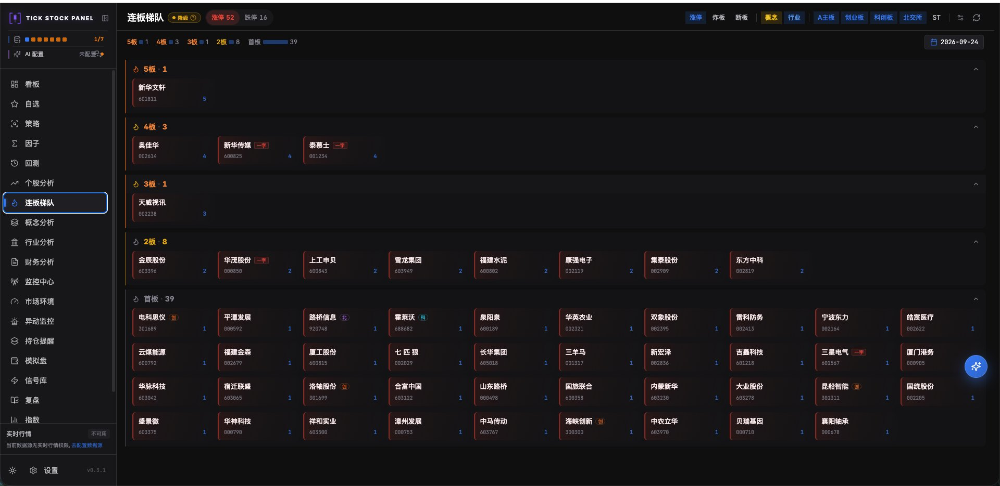

## 41. 手动试用画面 07-045

来源：**用户手动截图 · 原生产品界面**。画面仅记录当时状态；空白、加载、未配置或错误界面不作为功能成功证明。已裁去浏览器标签、聊天侧栏或无关桌面。

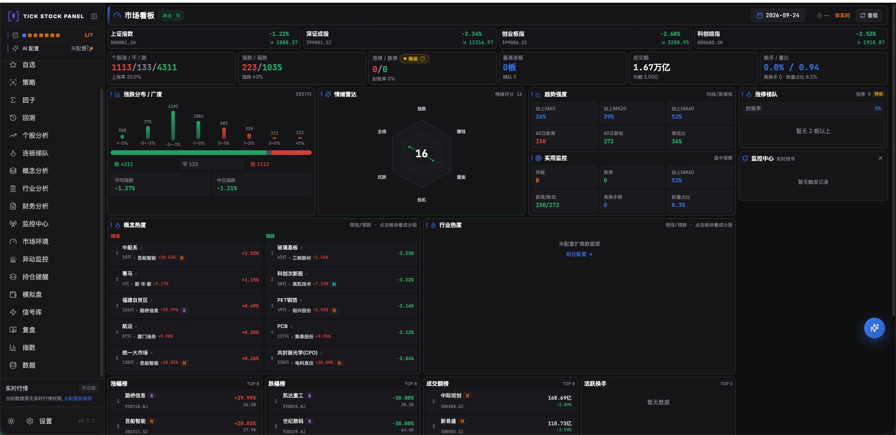

## 42. 手动试用画面 07-047

来源：**用户手动截图 · 原生产品界面**。画面仅记录当时状态；空白、加载、未配置或错误界面不作为功能成功证明。已裁去浏览器标签、聊天侧栏或无关桌面。

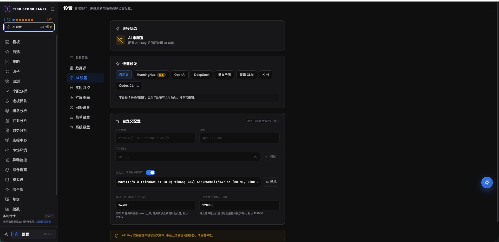

## 43. 手动试用画面 07-049

来源：**用户手动截图 · 原生产品界面**。画面仅记录当时状态；空白、加载、未配置或错误界面不作为功能成功证明。已裁去浏览器标签、聊天侧栏或无关桌面。

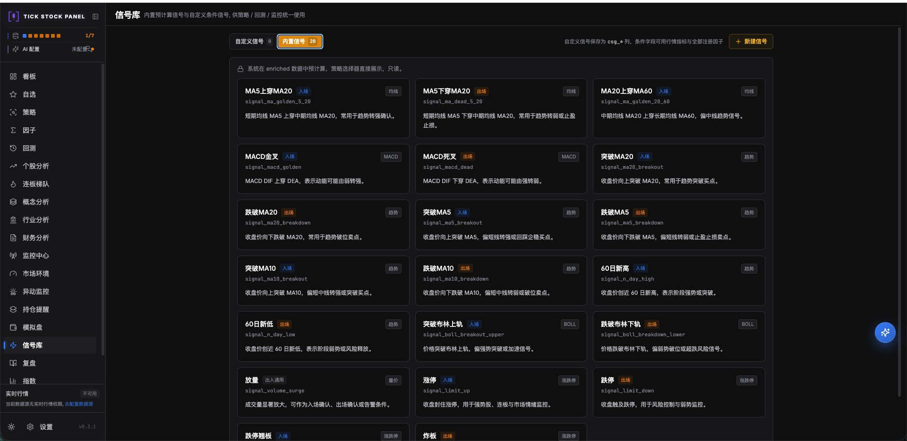

## 44. 手动试用画面 07-051

来源：**用户手动截图 · 原生产品界面**。画面仅记录当时状态；空白、加载、未配置或错误界面不作为功能成功证明。已裁去浏览器标签、聊天侧栏或无关桌面。

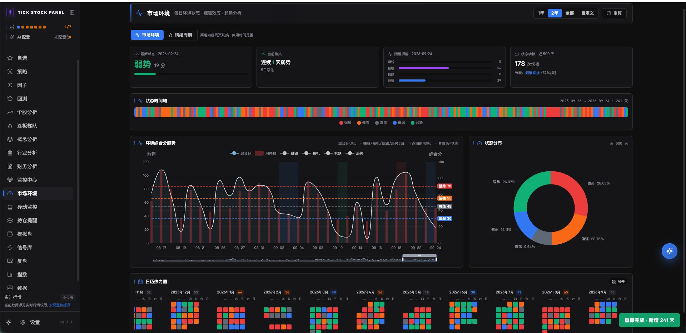

## 45. 手动试用画面 07-053

来源：**用户手动截图 · 原生产品界面**。画面仅记录当时状态；空白、加载、未配置或错误界面不作为功能成功证明。已裁去浏览器标签、聊天侧栏或无关桌面。

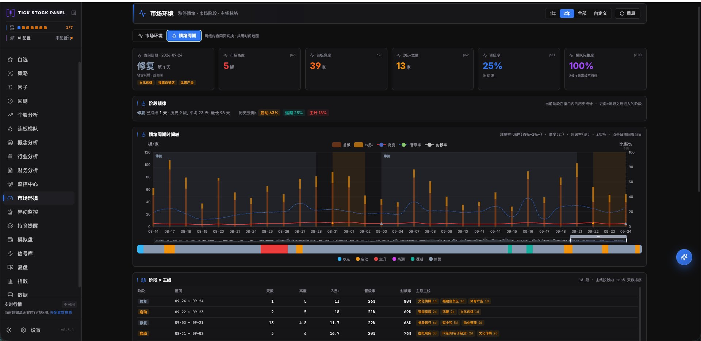
