# finance-quant-skills · 完整公开图库

[评测判断](README.md) · [总排名](../README.md)

采集于 2026-09-26，共 17 张经去重/公开处理的图片。界面可见不等于功能通过。真实数据与试用策略；其余仅盘点。

## 01. 采集画面 08-001 · 01-总览

来源：**Product Lab 辅助页（不是原生 Web UI）**。画面仅记录当时状态；空白、加载、未配置或错误界面不作为功能成功证明。

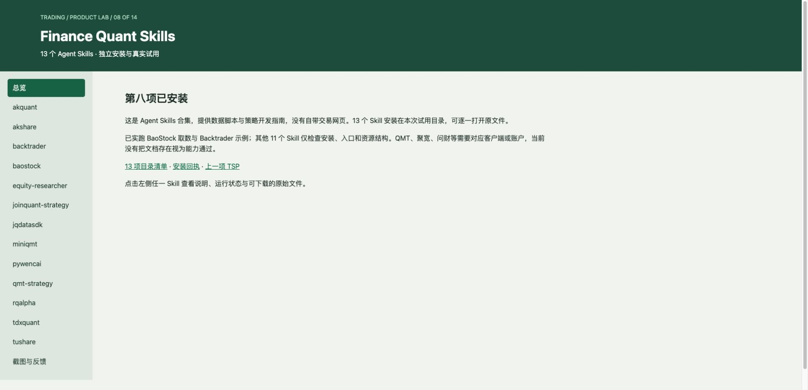

## 02. 采集画面 08-002 · 02-akquant

来源：**Product Lab 辅助页（不是原生 Web UI）**。画面仅记录当时状态；空白、加载、未配置或错误界面不作为功能成功证明。

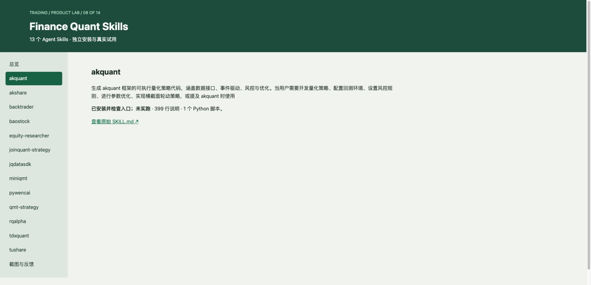

## 03. 采集画面 08-003 · 03-akshare

来源：**Product Lab 辅助页（不是原生 Web UI）**。画面仅记录当时状态；空白、加载、未配置或错误界面不作为功能成功证明。

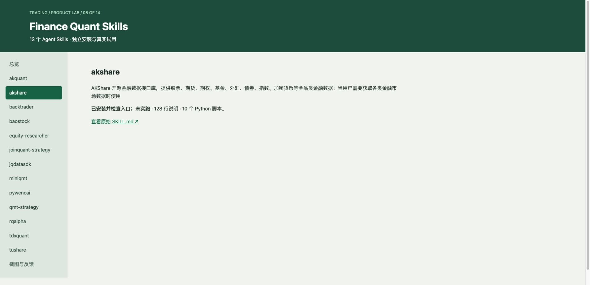

## 04. 采集画面 08-004 · 04-backtrader

来源：**Product Lab 辅助页（不是原生 Web UI）**。画面仅记录当时状态；空白、加载、未配置或错误界面不作为功能成功证明。

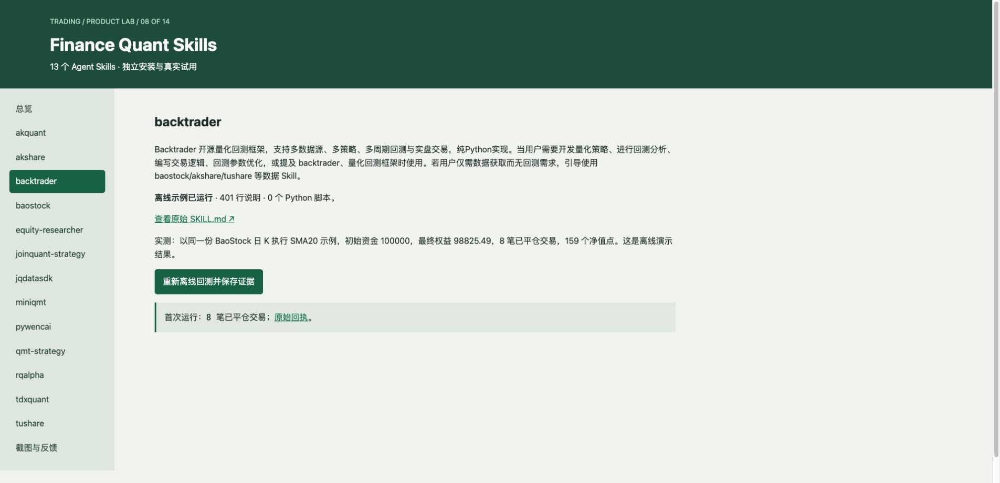

## 05. 采集画面 08-005 · 05-baostock

来源：**Product Lab 辅助页（不是原生 Web UI）**。画面仅记录当时状态；空白、加载、未配置或错误界面不作为功能成功证明。

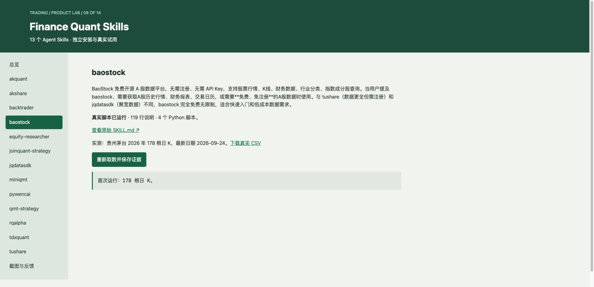

## 06. 采集画面 08-006 · 06-equity-researcher

来源：**Product Lab 辅助页（不是原生 Web UI）**。画面仅记录当时状态；空白、加载、未配置或错误界面不作为功能成功证明。

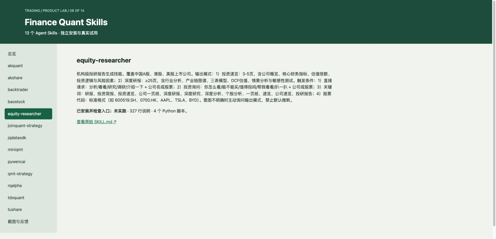

## 07. 采集画面 08-007 · 07-joinquant-strategy

来源：**Product Lab 辅助页（不是原生 Web UI）**。画面仅记录当时状态；空白、加载、未配置或错误界面不作为功能成功证明。

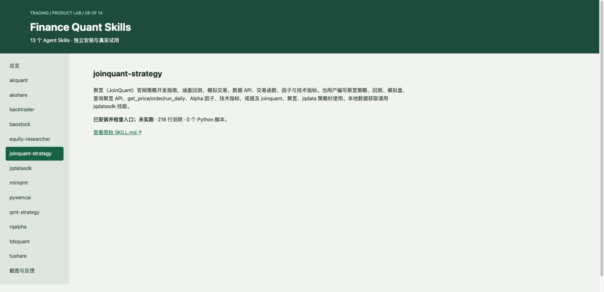

## 08. 采集画面 08-008 · 08-jqdatasdk

来源：**Product Lab 辅助页（不是原生 Web UI）**。画面仅记录当时状态；空白、加载、未配置或错误界面不作为功能成功证明。

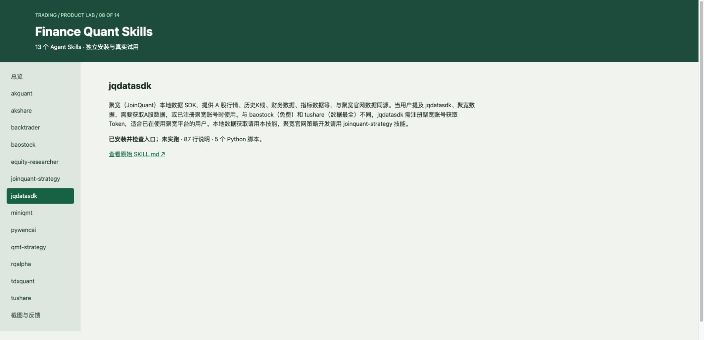

## 09. 采集画面 08-009 · 09-miniqmt

来源：**Product Lab 辅助页（不是原生 Web UI）**。画面仅记录当时状态；空白、加载、未配置或错误界面不作为功能成功证明。

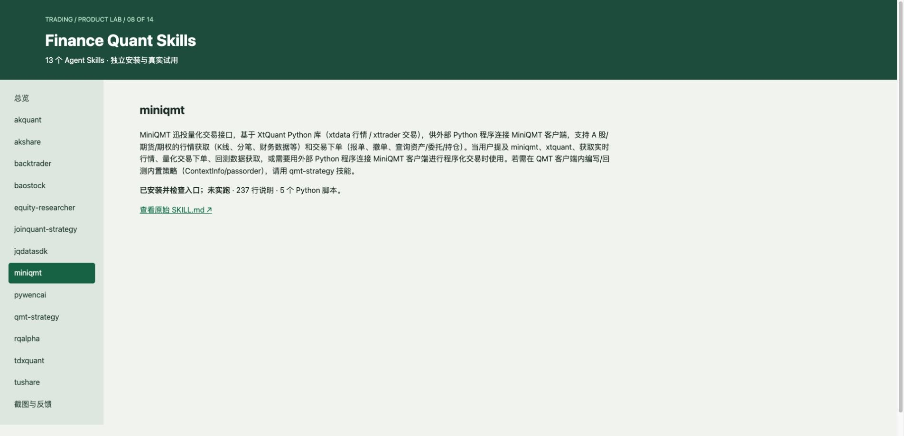

## 10. 采集画面 08-010 · 10-pywencai

来源：**Product Lab 辅助页（不是原生 Web UI）**。画面仅记录当时状态；空白、加载、未配置或错误界面不作为功能成功证明。

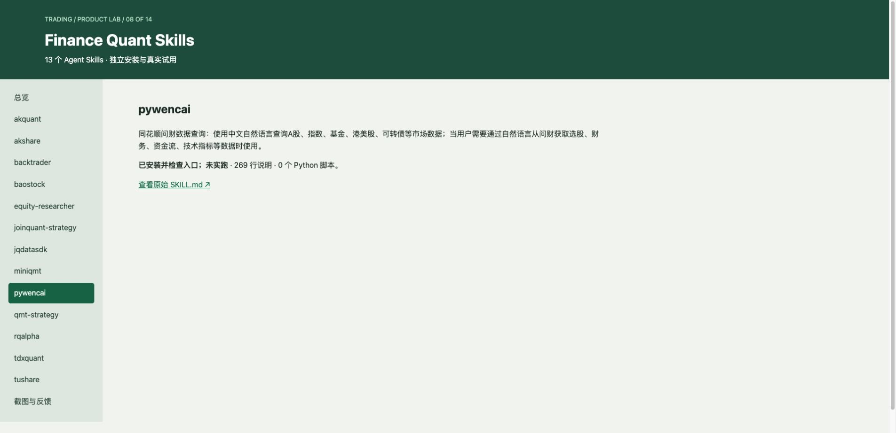

## 11. 采集画面 08-011 · 11-qmt-strategy

来源：**Product Lab 辅助页（不是原生 Web UI）**。画面仅记录当时状态；空白、加载、未配置或错误界面不作为功能成功证明。

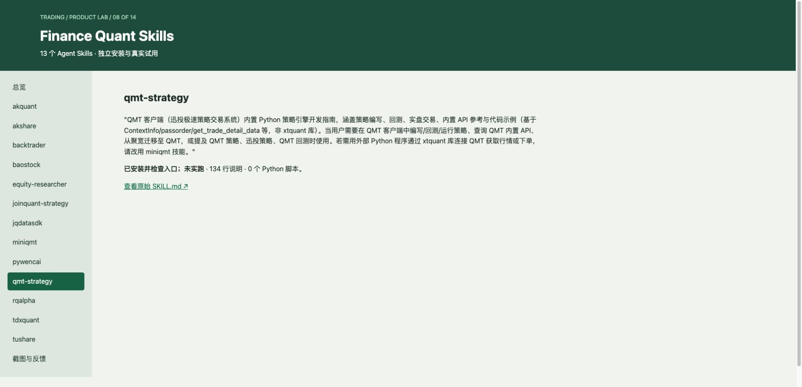

## 12. 采集画面 08-012 · 12-rqalpha

来源：**Product Lab 辅助页（不是原生 Web UI）**。画面仅记录当时状态；空白、加载、未配置或错误界面不作为功能成功证明。

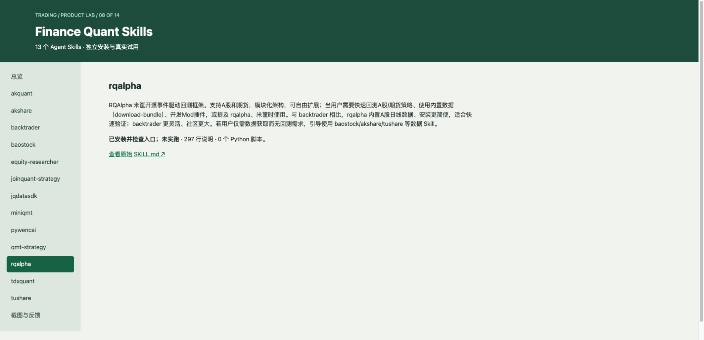

## 13. 采集画面 08-013 · 13-tdxquant

来源：**Product Lab 辅助页（不是原生 Web UI）**。画面仅记录当时状态；空白、加载、未配置或错误界面不作为功能成功证明。

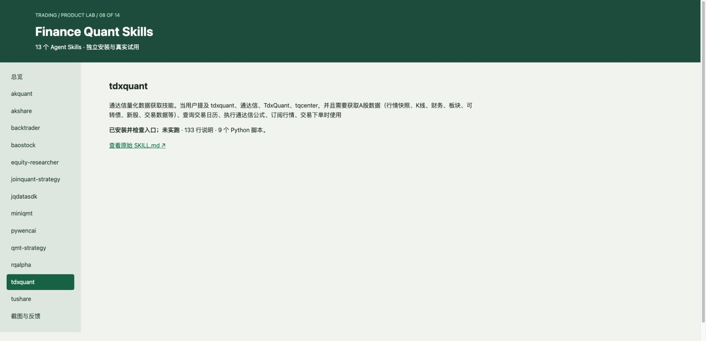

## 14. 采集画面 08-014 · 14-tushare

来源：**Product Lab 辅助页（不是原生 Web UI）**。画面仅记录当时状态；空白、加载、未配置或错误界面不作为功能成功证明。

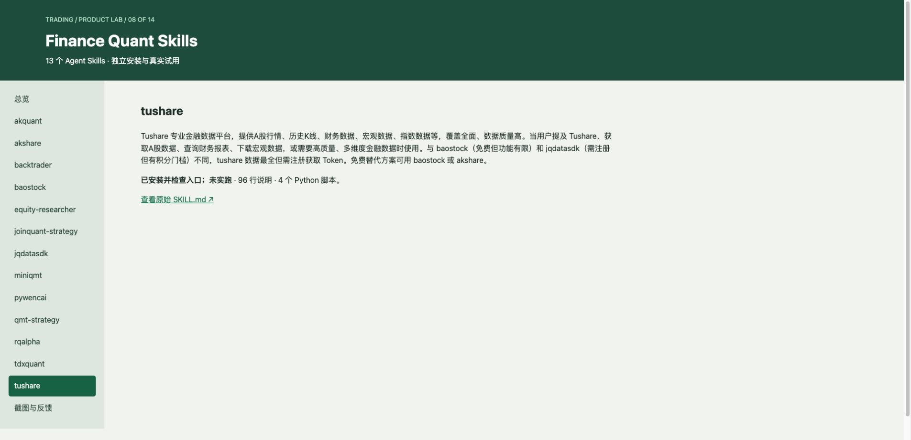

## 15. 采集画面 08-015 · 15-截图与反馈

来源：**Product Lab 辅助页（不是原生 Web UI）**。画面仅记录当时状态；空白、加载、未配置或错误界面不作为功能成功证明。

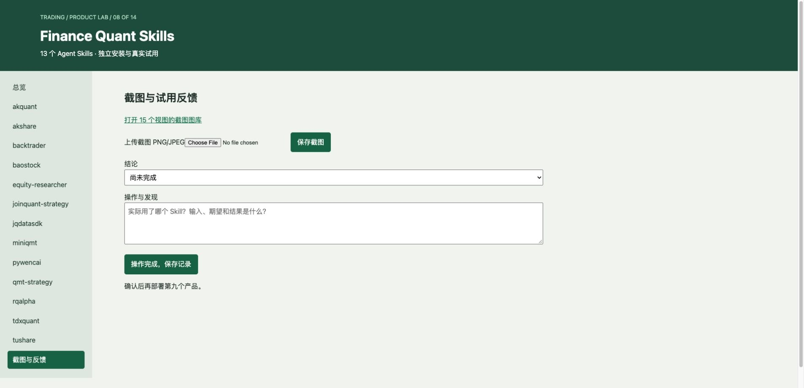

## 16. 采集画面 08-016 · 16-baostock-重新取数

来源：**Product Lab 辅助页（不是原生 Web UI）**。画面仅记录当时状态；空白、加载、未配置或错误界面不作为功能成功证明。

## 17. 采集画面 08-017 · 17-backtrader-重新回测

来源：**Product Lab 辅助页（不是原生 Web UI）**。画面仅记录当时状态；空白、加载、未配置或错误界面不作为功能成功证明。

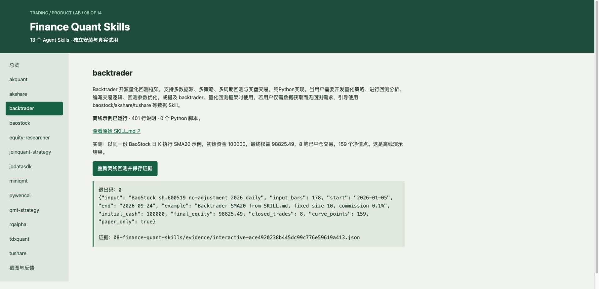
