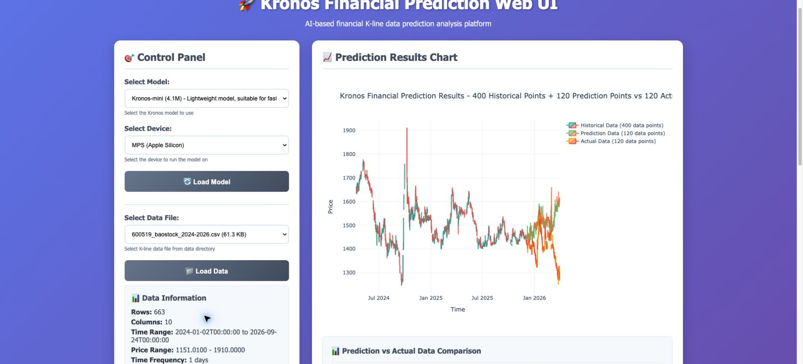

# 11. Kronos · 36/100

模型推理有结果；它的任务是预测，不是替用户管理订单和账户。

[原仓库](https://github.com/shiyu-coder/Kronos) · [全部 10 张公开截图](screenshots.md) · [证据记录](evidence.json) · [返回排名](../README.md)

**定位判断：** 金融预测模型 / Trading Strategy 组件

**本轮状态：** 模型可跑，日期显示有问题

**界面来源：** 原生模型/Web 展示与辅助记录

**素材与依赖：** 真实 BaoStock 输入；预测结果不是已实现收益

**首轮试用，非完整功能认证。** 评分为人工的“完整交易产品适配＋本轮已验证可用性”分，不是盈利能力、生产成熟度或 repo-evals 通用分。试用配置与深度不完全一致；未测不等于不支持，几分差距不代表显著优劣。所有产品本轮订单/持仓闭环均未实测通过，该项统一 **0/15**。框架、模型、技能库保留在原样本中；其低分可能源于完整系统定位不匹配，不等于该工具不可用。

## 本轮得分

| 分项 | 得分 | 依据 |
|---|---:|---|
| 完整系统能力覆盖 | 11/35 | 金融预测模型 / Trading Strategy 组件；按完整交易产品的范围评估，并不等同于该工具在自身领域的质量。 |
| 本轮核心任务结果 | 16/30 | Kronos-mini 在 CPU 与 MPS 路径生成 120 个预测点 |
| 部署与操作交付 | 9/20 | 模型推理有结果；它的任务是预测，不是替用户管理订单和账户。 |
| 实际订单/持仓闭环 | 0/15 | 本轮没有完成 paper/券商成交及现金、持仓回读，统一记 0；未测试不等于不支持。 |

## 操作成功并有结果

- Kronos-mini 在 CPU 与 MPS 路径生成 120 个预测点

## 尝试失败 / 问题记录

- Web 日期轴与交易日不一致，117/120 点错位

## 尚未验证

- 预测准确性与长期基线比较
- 预测驱动交易的收益和风险

## 下一次最有价值的验证

修正日期对齐后，用固定留出集和简单基线比较预测质量。

## 试用版本

- 采集日期：2026-09-26
- 实际试用：`67b630e67f6a18c9e9be918d9b4337c960db1e9a; Kronos-mini`
- 原目录 lock：`67b630e67f6a18c9e9be918d9b4337c960db1e9a`（仅作来源对照，不替代实际试用版本）
- 公开图库：10 张；包含失败或未配置画面，不代表所有页面功能通过。
