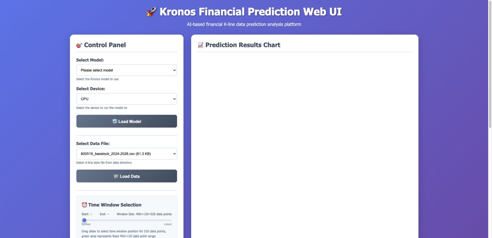
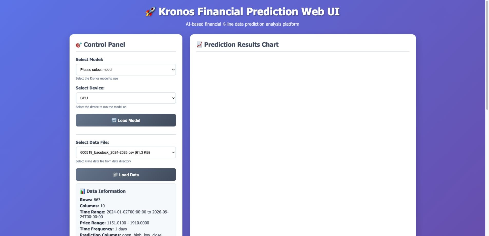
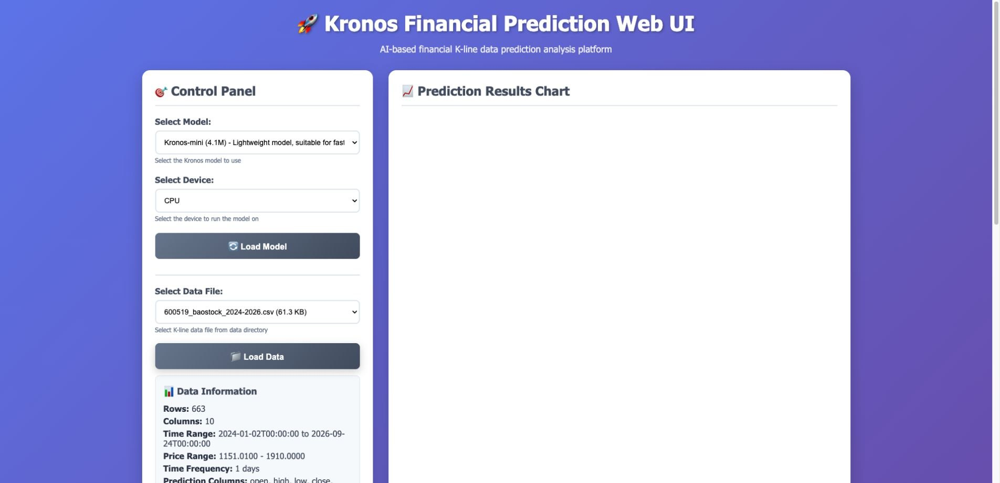
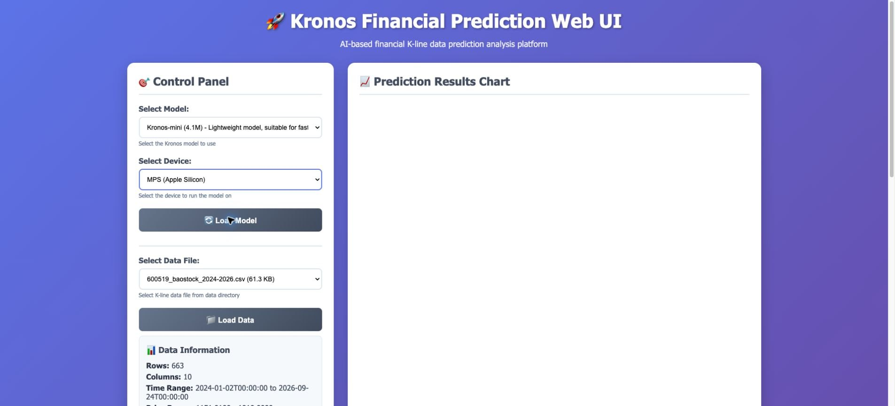
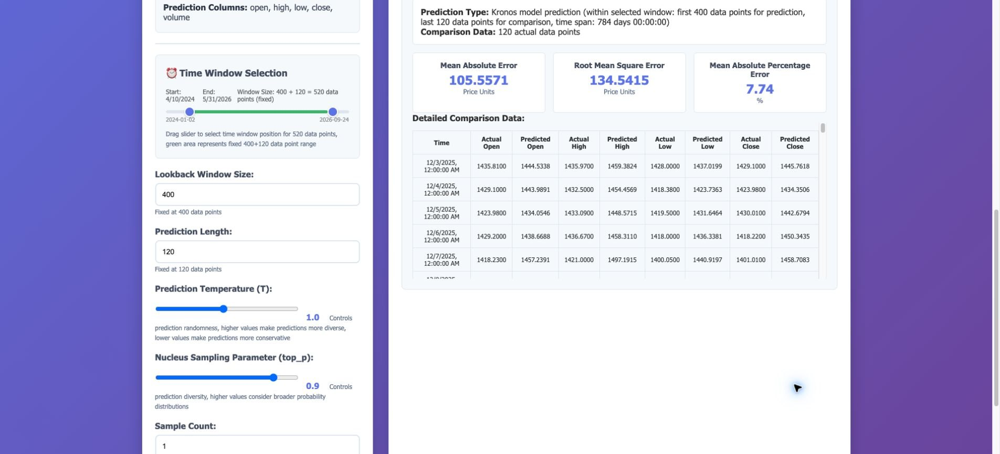
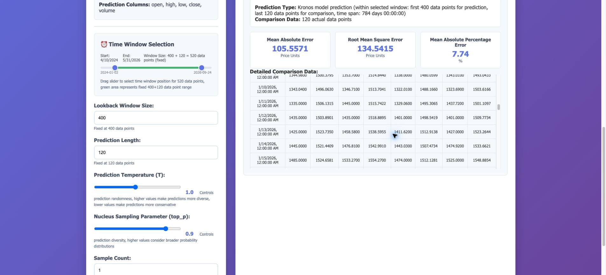
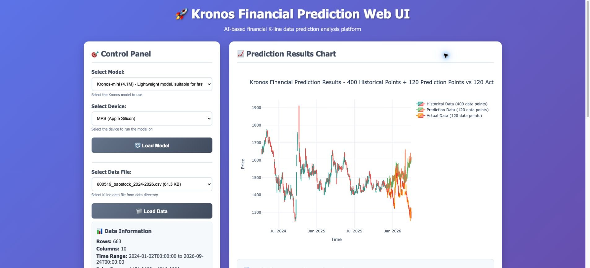
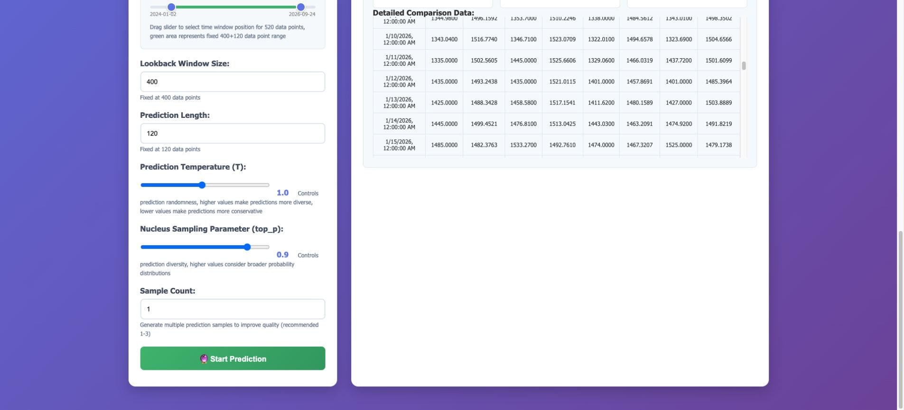

# Kronos · 完整公开图库

[评测判断](README.md) · [总排名](../README.md)

采集于 2026-09-26，共 10 张经去重/公开处理的图片。界面可见不等于功能通过。真实 BaoStock 输入；预测结果不是已实现收益。

## 01. 采集画面 09-001 · 01-初始界面

来源：**原生产品界面**。画面仅记录当时状态；空白、加载、未配置或错误界面不作为功能成功证明。

## 02. 采集画面 09-002 · 02-选中真实数据

来源：**原生产品界面**。画面仅记录当时状态；空白、加载、未配置或错误界面不作为功能成功证明。

## 03. 采集画面 09-003 · 03-数据加载成功

来源：**原生产品界面**。画面仅记录当时状态；空白、加载、未配置或错误界面不作为功能成功证明。

## 04. 采集画面 09-004 · 04-模型已选未加载

来源：**原生产品界面**。画面仅记录当时状态；空白、加载、未配置或错误界面不作为功能成功证明。

## 05. 采集画面 09-005 · 05-Kronos-mini真实模型已加载

来源：**原生产品界面**。画面仅记录当时状态；空白、加载、未配置或错误界面不作为功能成功证明。

## 06. 采集画面 09-006 · 06-真实预测-图表与比较

来源：**原生产品界面**。画面仅记录当时状态；空白、加载、未配置或错误界面不作为功能成功证明。

## 07. 采集画面 09-007 · 07-预测对照-误差与逐行表

来源：**原生产品界面**。画面仅记录当时状态；空白、加载、未配置或错误界面不作为功能成功证明。

## 08. 采集画面 09-008 · 08-预测对照-后段行

来源：**原生产品界面**。画面仅记录当时状态；空白、加载、未配置或错误界面不作为功能成功证明。

## 09. 采集画面 09-009 · 09-AppleSilicon-MPS模型已加载

来源：**原生产品界面**。画面仅记录当时状态；空白、加载、未配置或错误界面不作为功能成功证明。

## 10. 采集画面 09-010 · 10-MPS真实预测-图表

来源：**原生产品界面**。画面仅记录当时状态；空白、加载、未配置或错误界面不作为功能成功证明。

