# Vibe-Research · 完整公开图库

[评测判断](README.md) · [总排名](../README.md)

采集于 2026-09-26，共 23 张经去重/公开处理的图片。界面可见不等于功能通过。部署记录未连接 AI；手动画面出现 Codex 订阅入口，但本轮未核实模型调用成功，也未产出可验收研究报告。。

## 01. 手动试用画面 07-056

来源：**用户手动截图 · 原生产品界面**。画面仅记录当时状态；空白、加载、未配置或错误界面不作为功能成功证明。原档案误放在 Tick Stock Panel，按可见 Vibe-Research 标识更正归属。已裁去浏览器标签、聊天侧栏或无关桌面。

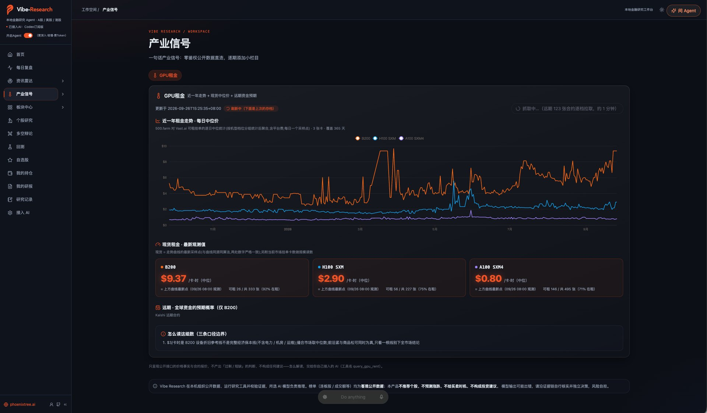

## 02. 手动试用画面 07-058

来源：**用户手动截图 · 原生产品界面**。画面仅记录当时状态；空白、加载、未配置或错误界面不作为功能成功证明。原档案误放在 Tick Stock Panel，按可见 Vibe-Research 标识更正归属。已裁去浏览器标签、聊天侧栏或无关桌面。

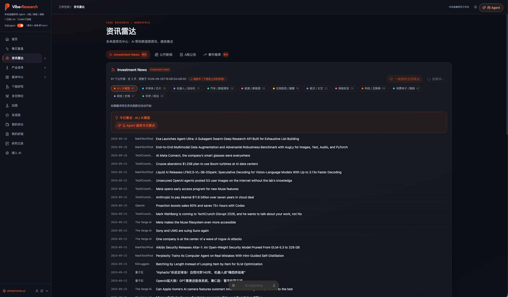

## 03. 手动试用画面 07-060

来源：**用户手动截图 · 原生产品界面**。画面仅记录当时状态；空白、加载、未配置或错误界面不作为功能成功证明。原档案误放在 Tick Stock Panel，按可见 Vibe-Research 标识更正归属。已裁去浏览器标签、聊天侧栏或无关桌面。

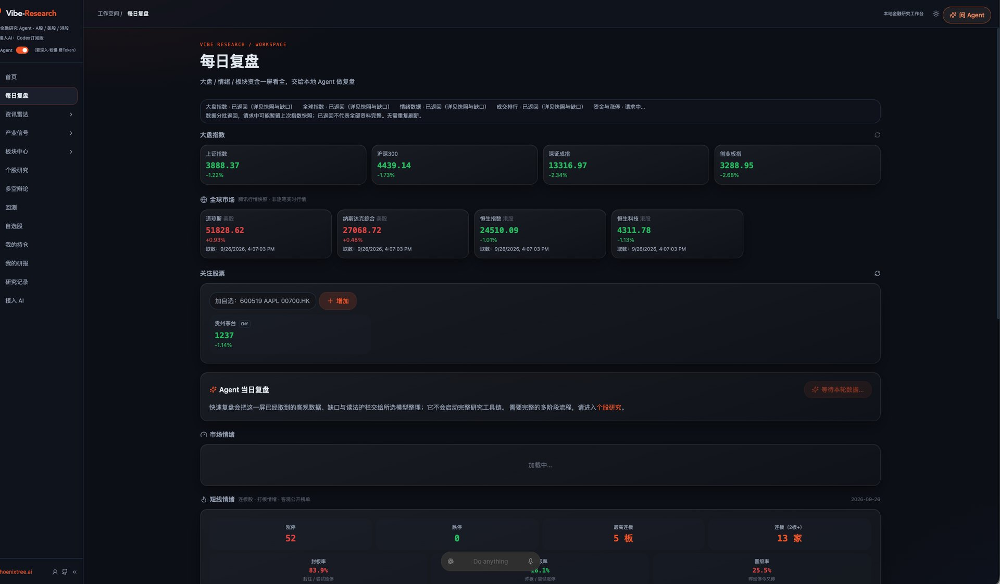

## 04. 手动试用画面 07-062

来源：**用户手动截图 · 原生产品界面**。画面仅记录当时状态；空白、加载、未配置或错误界面不作为功能成功证明。原档案误放在 Tick Stock Panel，按可见 Vibe-Research 标识更正归属。已裁去浏览器标签、聊天侧栏或无关桌面。

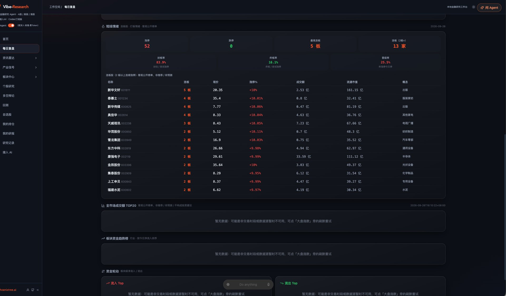

## 05. 手动试用画面 07-064

来源：**用户手动截图 · 原生产品界面**。画面仅记录当时状态；空白、加载、未配置或错误界面不作为功能成功证明。原档案误放在 Tick Stock Panel，按可见 Vibe-Research 标识更正归属。已裁去浏览器标签、聊天侧栏或无关桌面。

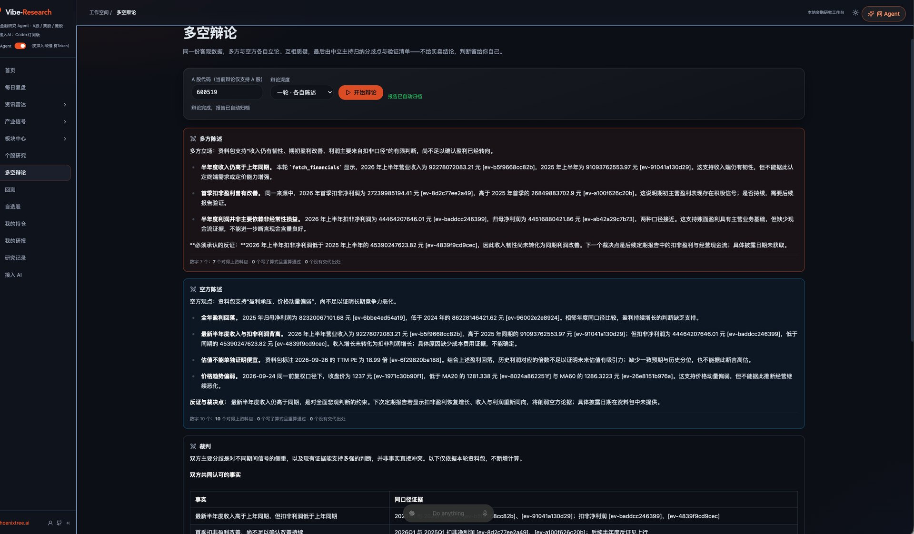

## 06. 手动试用画面 07-066

来源：**用户手动截图 · 原生产品界面**。画面仅记录当时状态；空白、加载、未配置或错误界面不作为功能成功证明。原档案误放在 Tick Stock Panel，按可见 Vibe-Research 标识更正归属。已裁去浏览器标签、聊天侧栏或无关桌面。

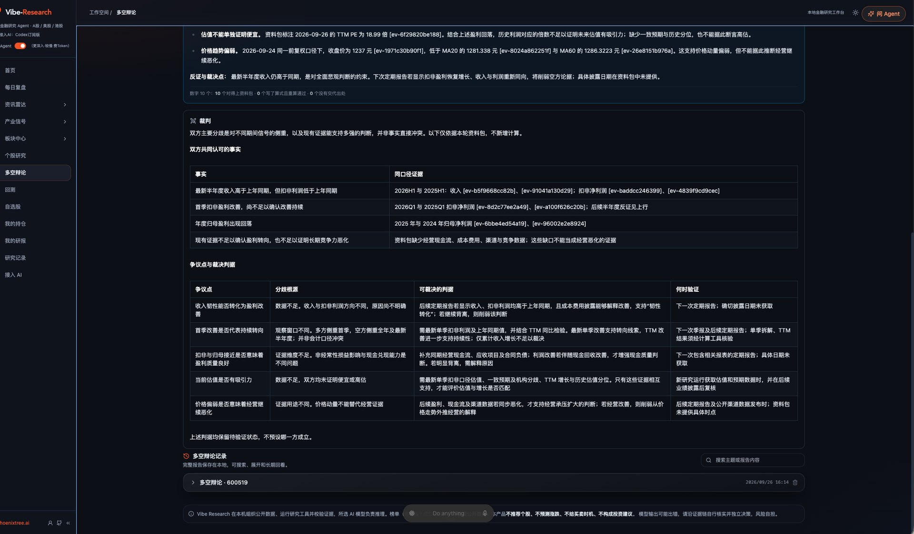

## 07. 手动试用画面 07-068

来源：**用户手动截图 · 原生产品界面**。画面仅记录当时状态；空白、加载、未配置或错误界面不作为功能成功证明。原档案误放在 Tick Stock Panel，按可见 Vibe-Research 标识更正归属。已裁去浏览器标签、聊天侧栏或无关桌面。

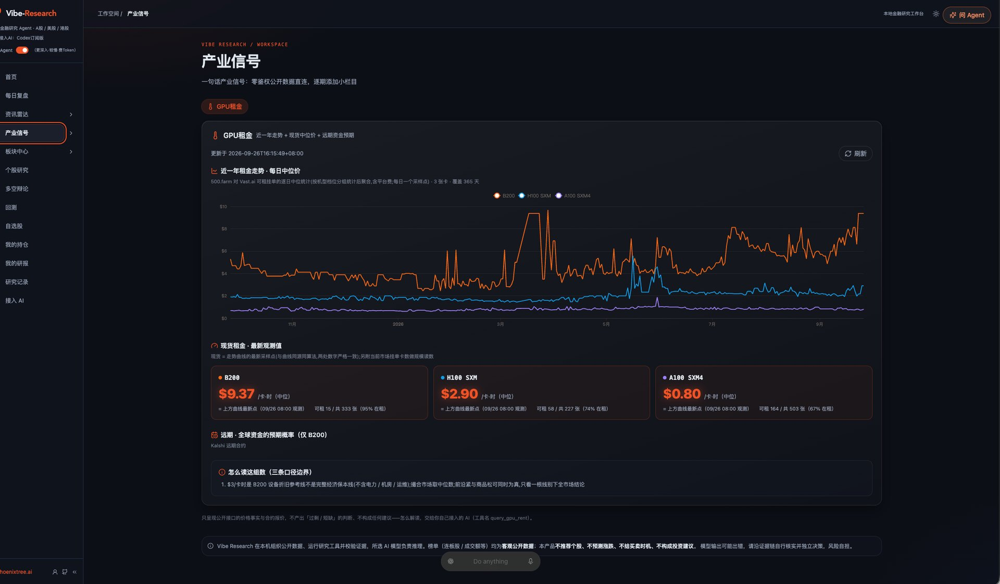

## 08. 手动试用画面 07-070

来源：**用户手动截图 · 原生产品界面**。画面仅记录当时状态；空白、加载、未配置或错误界面不作为功能成功证明。原档案误放在 Tick Stock Panel，按可见 Vibe-Research 标识更正归属。已裁去浏览器标签、聊天侧栏或无关桌面。

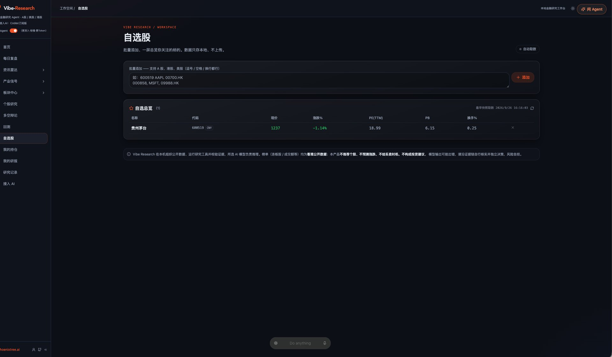

## 09. 手动试用画面 07-072

来源：**用户手动截图 · 原生产品界面**。画面仅记录当时状态；空白、加载、未配置或错误界面不作为功能成功证明。原档案误放在 Tick Stock Panel，按可见 Vibe-Research 标识更正归属。已裁去浏览器标签、聊天侧栏或无关桌面。

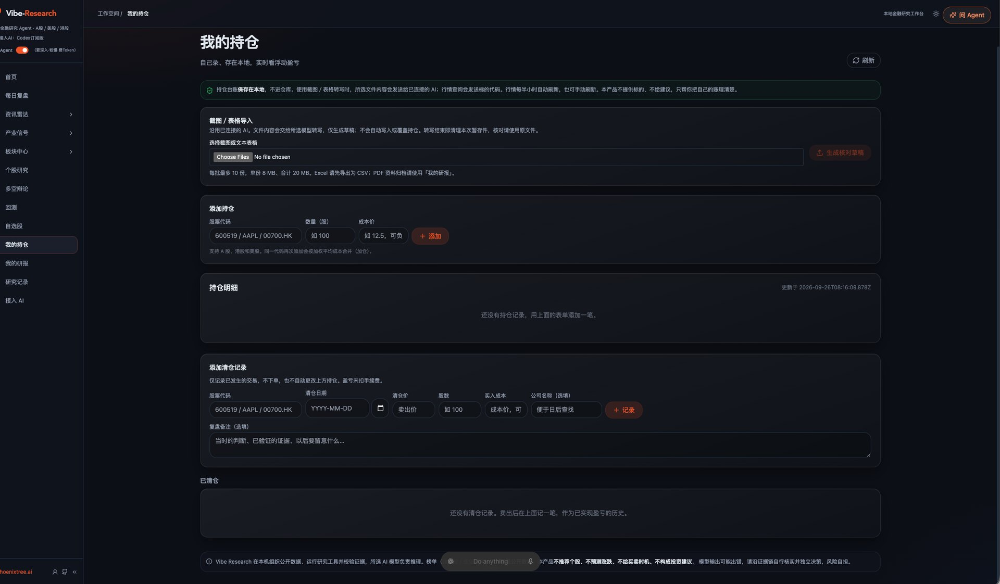

## 10. 采集画面 10-001 · 01-接入AI-额度提示

来源：**原生产品界面**。画面仅记录当时状态；空白、加载、未配置或错误界面不作为功能成功证明。

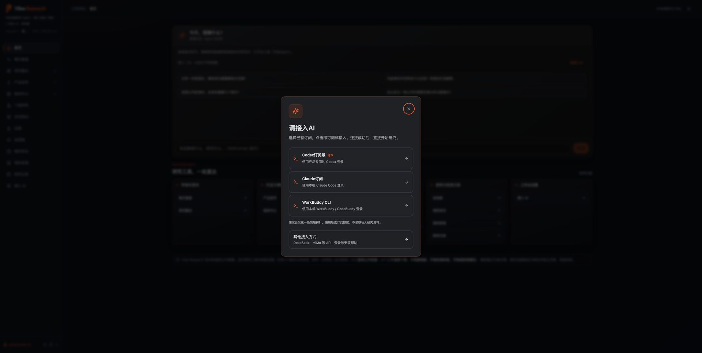

## 11. 采集画面 10-002 · 02-首页-未接入AI

来源：**原生产品界面**。画面仅记录当时状态；空白、加载、未配置或错误界面不作为功能成功证明。

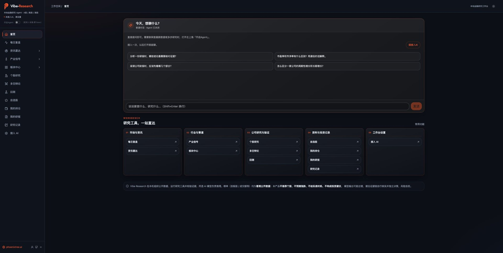

## 12. 采集画面 10-003 · 03-每日复盘

来源：**原生产品界面**。画面仅记录当时状态；空白、加载、未配置或错误界面不作为功能成功证明。

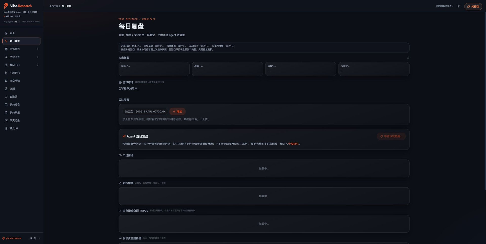

## 13. 采集画面 10-004 · 04-资讯雷达

来源：**原生产品界面**。画面仅记录当时状态；空白、加载、未配置或错误界面不作为功能成功证明。

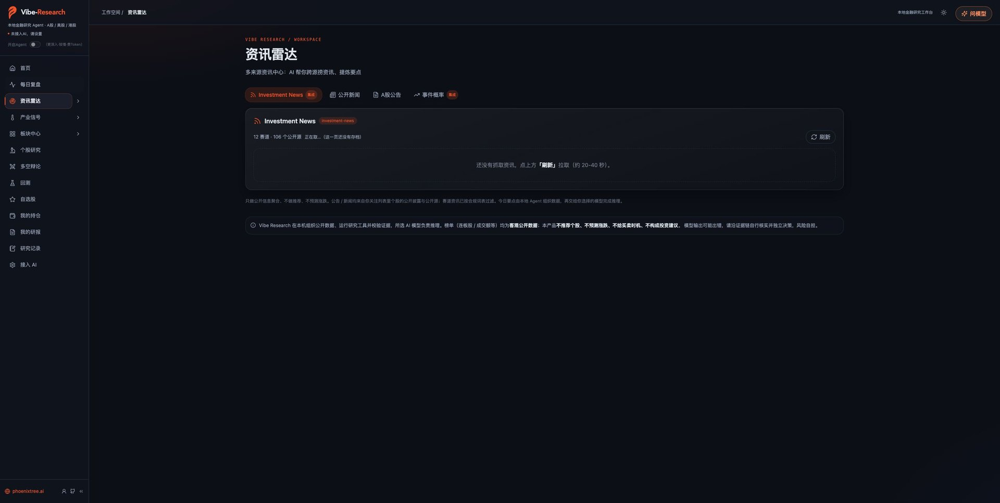

## 14. 采集画面 10-005 · 05-产业信号

来源：**原生产品界面**。画面仅记录当时状态；空白、加载、未配置或错误界面不作为功能成功证明。

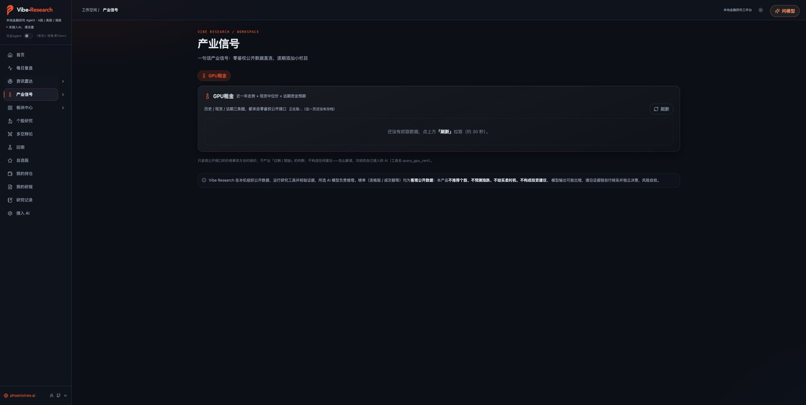

## 15. 采集画面 10-006 · 06-板块中心

来源：**原生产品界面**。画面仅记录当时状态；空白、加载、未配置或错误界面不作为功能成功证明。

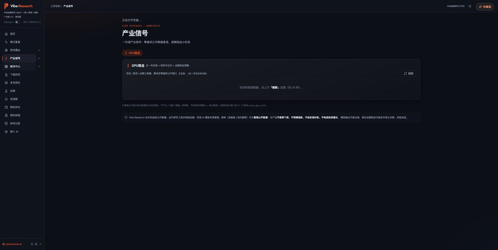

## 16. 采集画面 10-007 · 07-个股研究

来源：**原生产品界面**。画面仅记录当时状态；空白、加载、未配置或错误界面不作为功能成功证明。

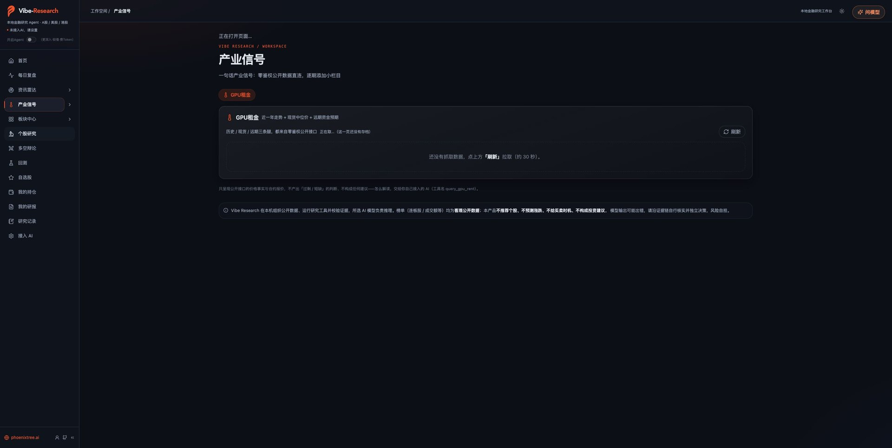

## 17. 采集画面 10-008 · 08-多空辩论

来源：**原生产品界面**。画面仅记录当时状态；空白、加载、未配置或错误界面不作为功能成功证明。

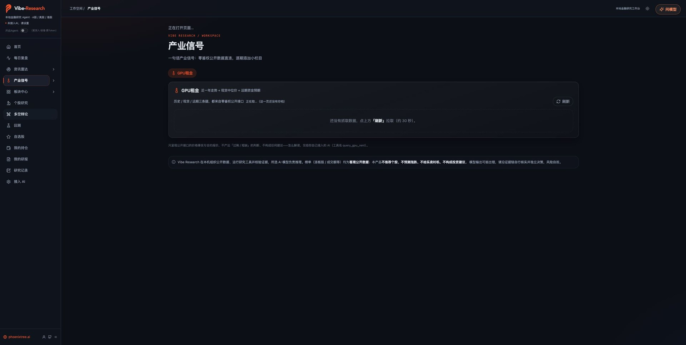

## 18. 采集画面 10-009 · 09-回测

来源：**原生产品界面**。画面仅记录当时状态；空白、加载、未配置或错误界面不作为功能成功证明。

## 19. 采集画面 10-010 · 10-自选股

来源：**原生产品界面**。画面仅记录当时状态；空白、加载、未配置或错误界面不作为功能成功证明。

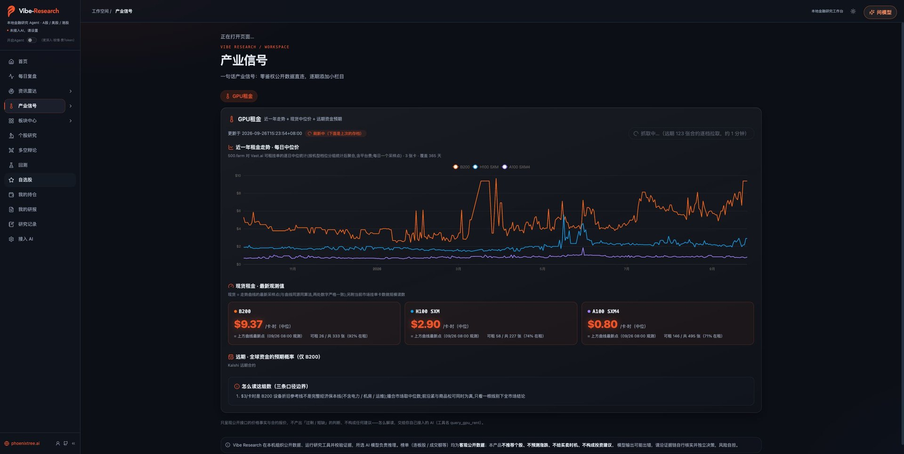

## 20. 采集画面 10-011 · 11-我的持仓

来源：**原生产品界面**。画面仅记录当时状态；空白、加载、未配置或错误界面不作为功能成功证明。

## 21. 采集画面 10-012 · 12-我的研报

来源：**原生产品界面**。画面仅记录当时状态；空白、加载、未配置或错误界面不作为功能成功证明。

## 22. 采集画面 10-013 · 13-研究记录

来源：**原生产品界面**。画面仅记录当时状态；空白、加载、未配置或错误界面不作为功能成功证明。

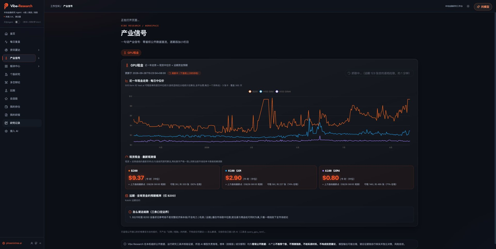

## 23. 采集画面 10-014 · 14-接入 AI

来源：**原生产品界面**。画面仅记录当时状态；空白、加载、未配置或错误界面不作为功能成功证明。

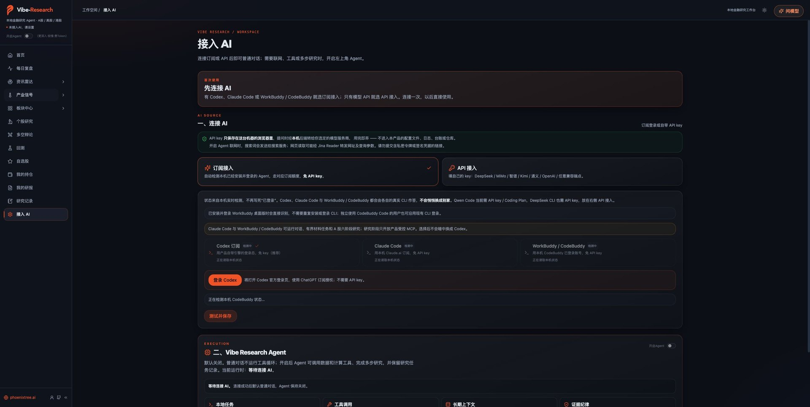
