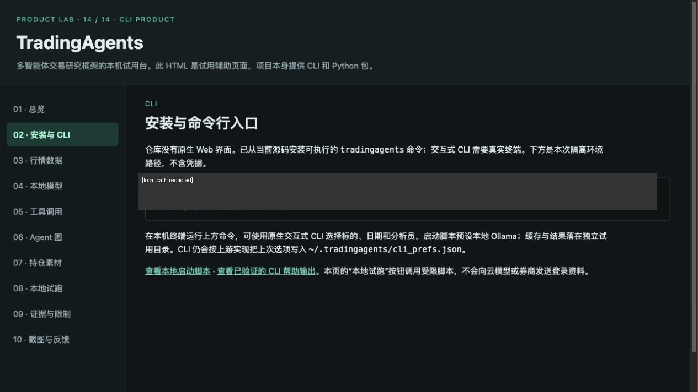
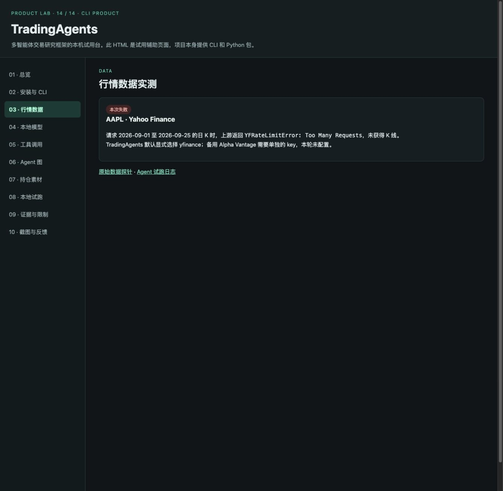
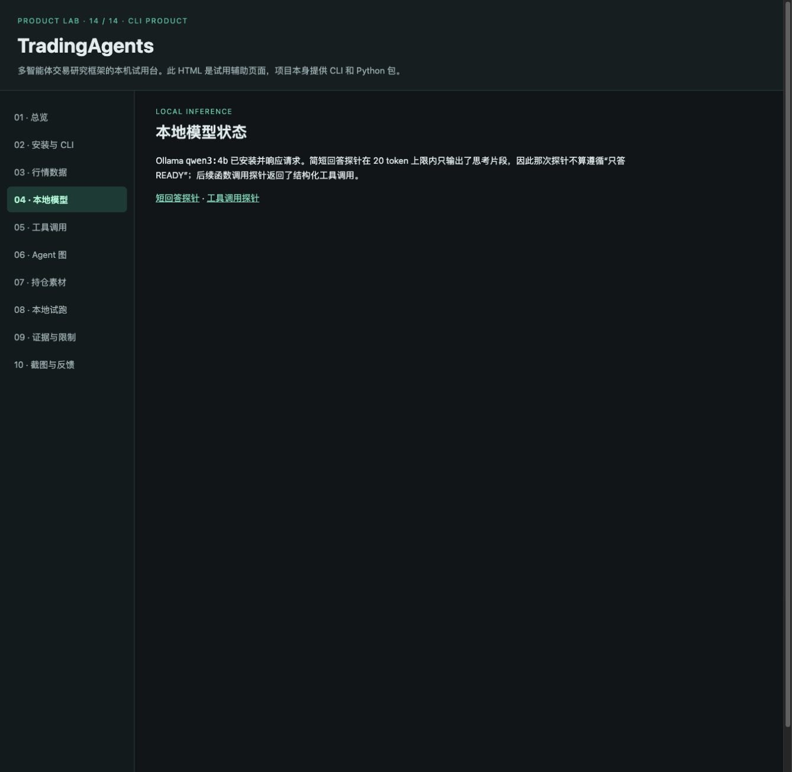
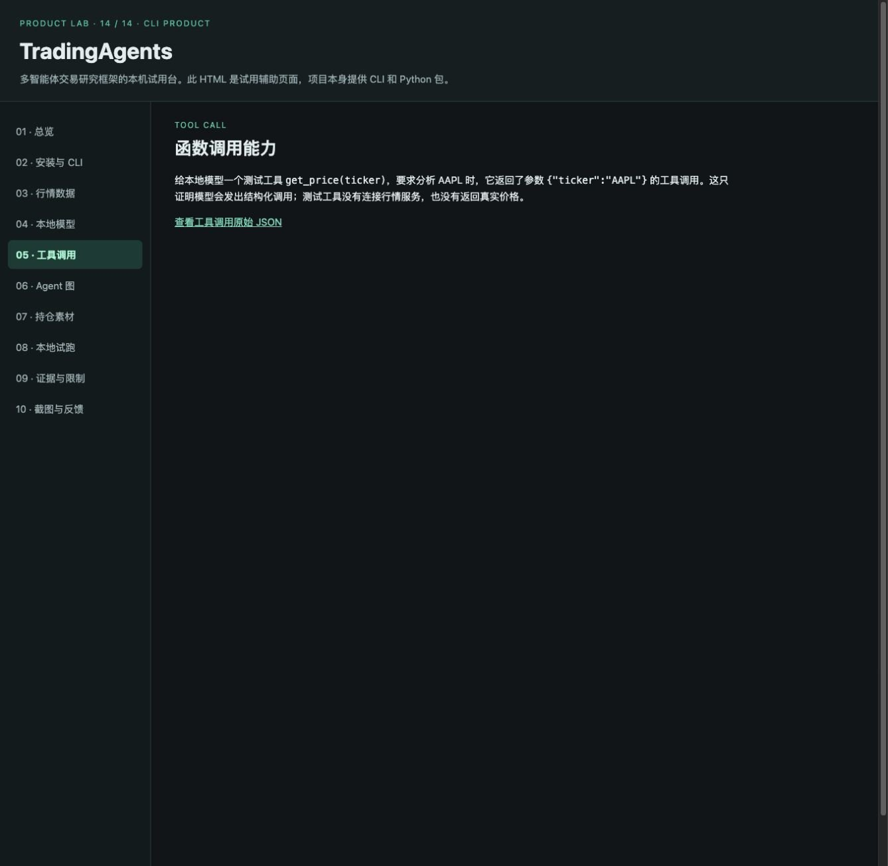
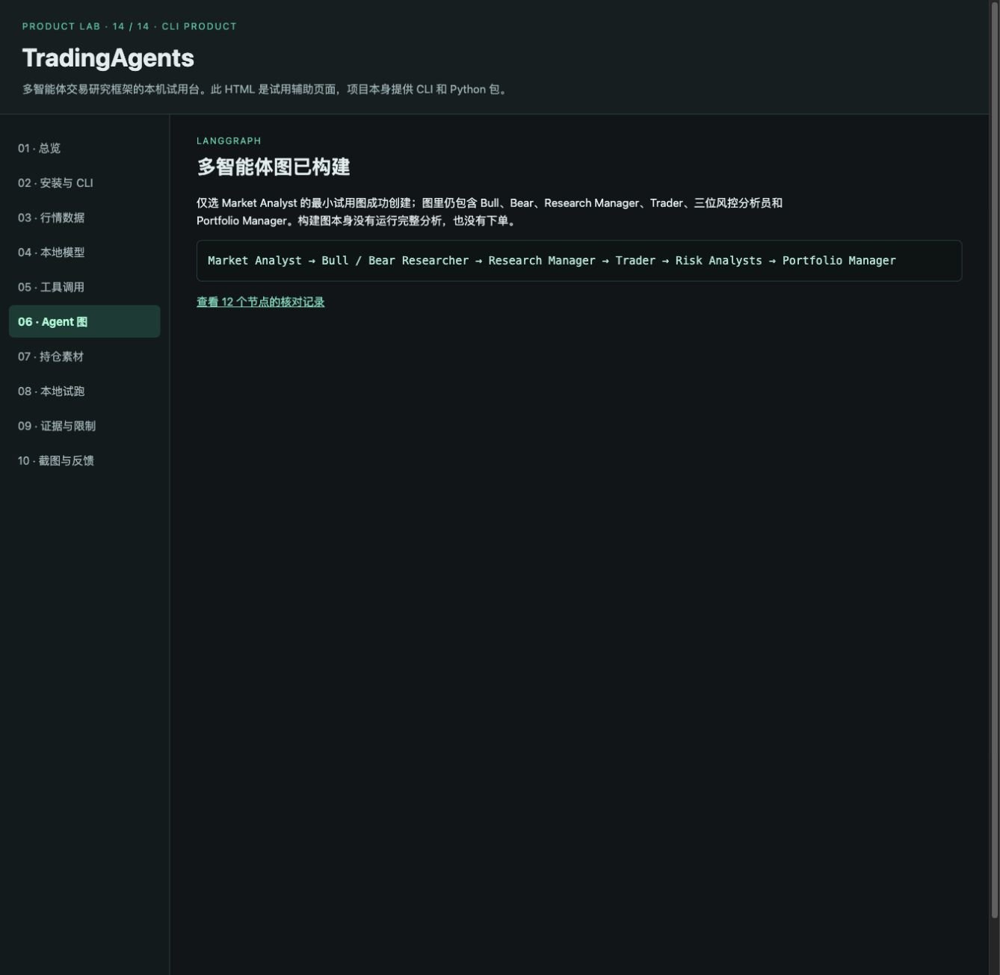
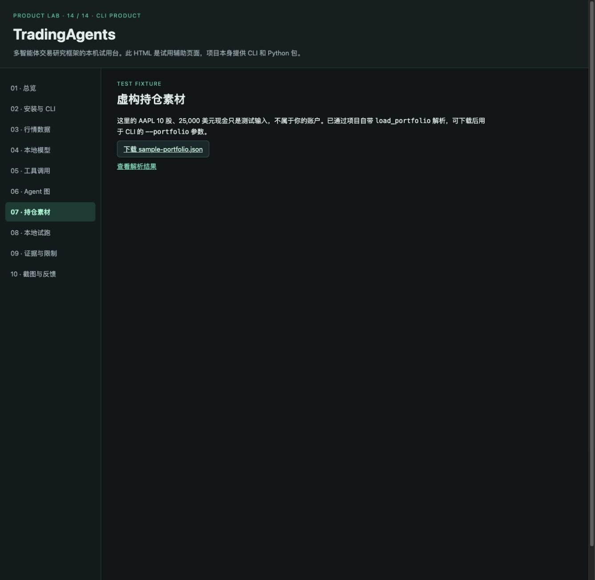
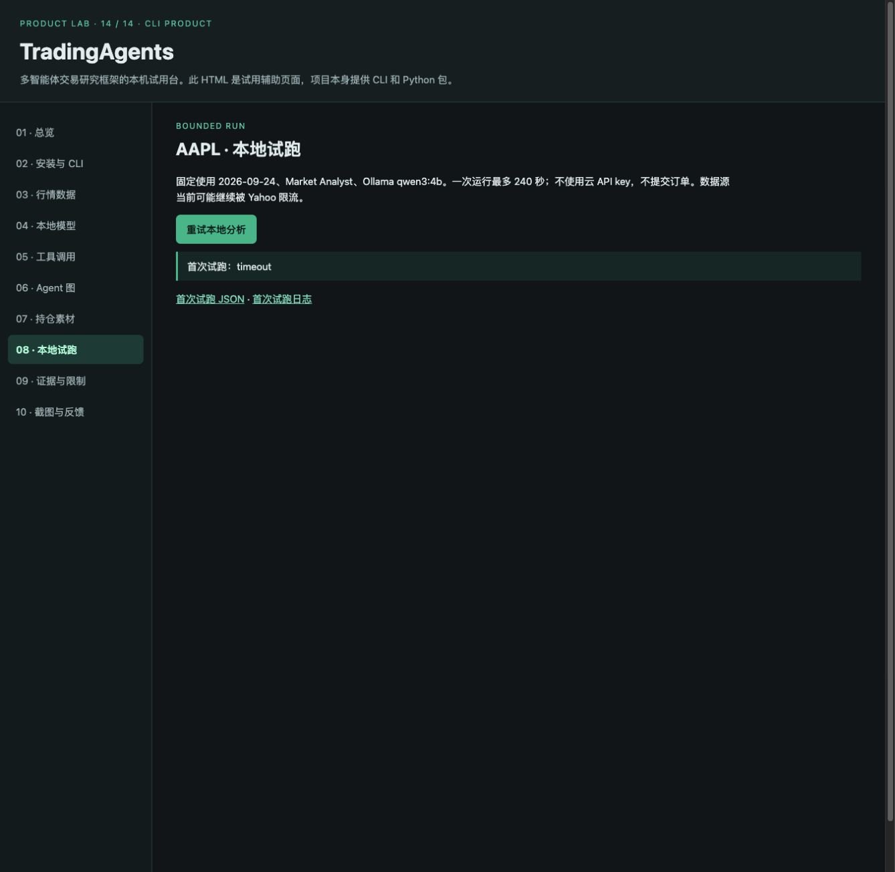
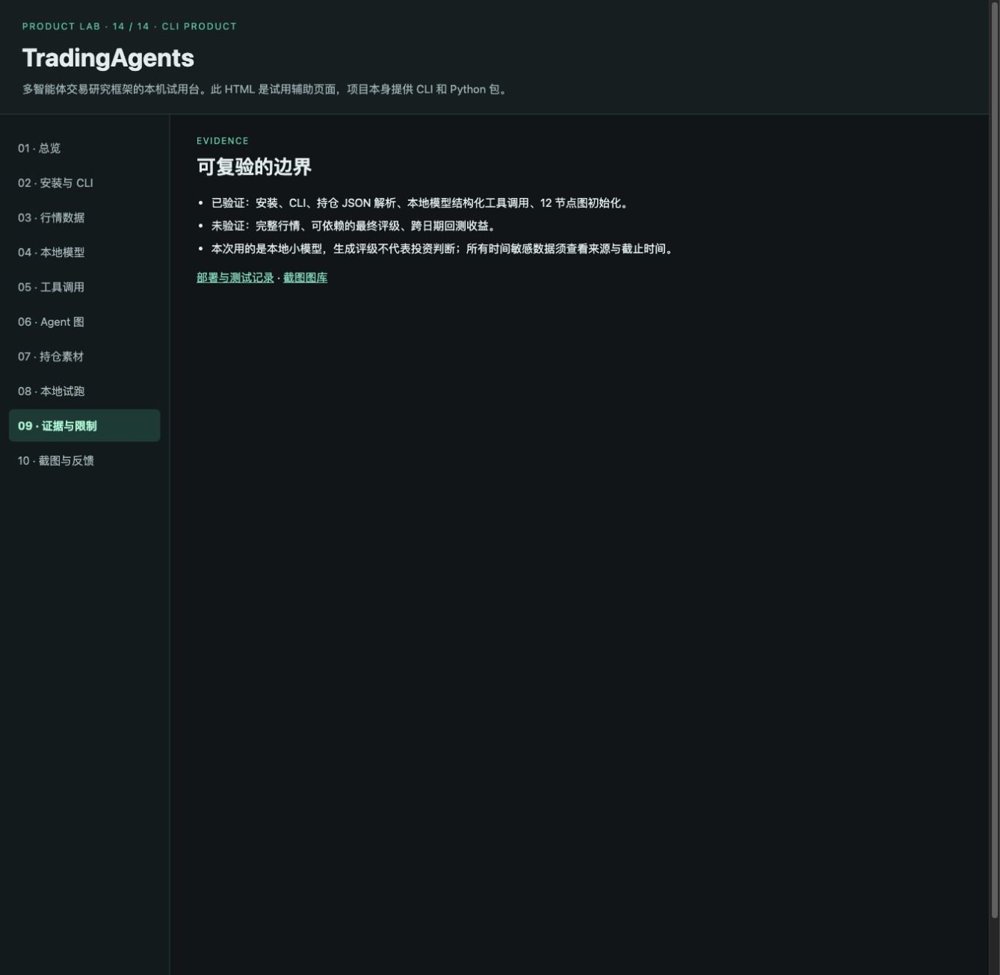
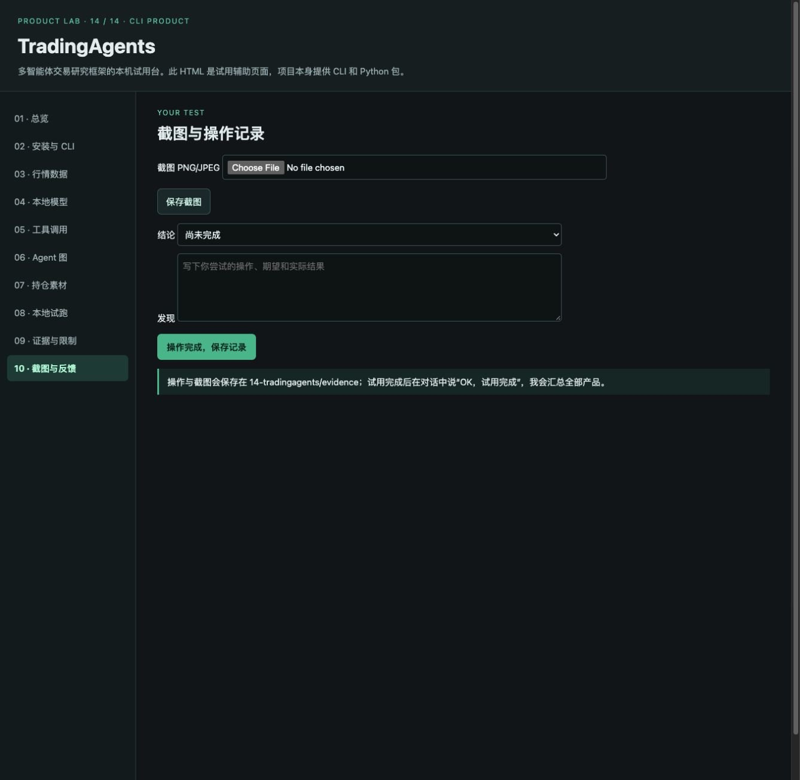
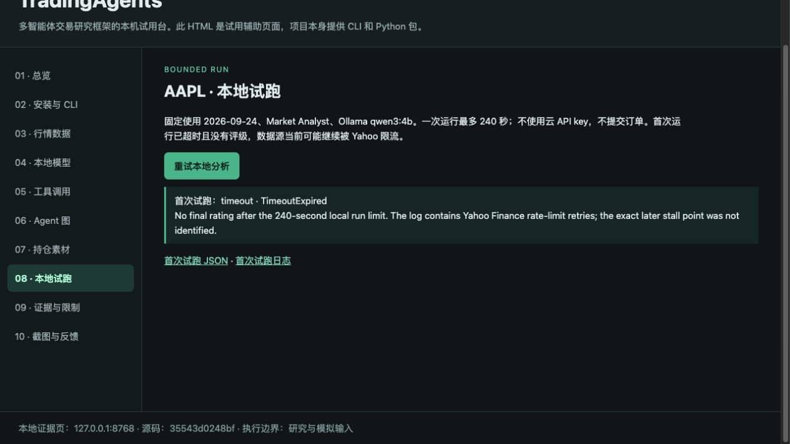

# TradingAgents · 完整公开图库

[评测判断](README.md) · [总排名](../README.md)

采集于 2026-09-26，共 11 张经去重/公开处理的图片。界面可见不等于功能通过。本地模型、虚构持仓样例；没有真实账户。

## 01. 采集画面 14-001 · 01-overview

来源：**Product Lab 辅助页（不是原生 Web UI）**。画面仅记录当时状态；空白、加载、未配置或错误界面不作为功能成功证明。

## 02. 采集画面 14-002 · 02-install

来源：**Product Lab 辅助页（不是原生 Web UI）**。画面仅记录当时状态；空白、加载、未配置或错误界面不作为功能成功证明。本机路径已遮盖。

## 03. 采集画面 14-003 · 03-market-data

来源：**Product Lab 辅助页（不是原生 Web UI）**。画面仅记录当时状态；空白、加载、未配置或错误界面不作为功能成功证明。

## 04. 采集画面 14-004 · 04-local-model

来源：**Product Lab 辅助页（不是原生 Web UI）**。画面仅记录当时状态；空白、加载、未配置或错误界面不作为功能成功证明。

## 05. 采集画面 14-005 · 05-tool-call

来源：**Product Lab 辅助页（不是原生 Web UI）**。画面仅记录当时状态；空白、加载、未配置或错误界面不作为功能成功证明。

## 06. 采集画面 14-006 · 06-agent-graph

来源：**Product Lab 辅助页（不是原生 Web UI）**。画面仅记录当时状态；空白、加载、未配置或错误界面不作为功能成功证明。

## 07. 采集画面 14-007 · 07-portfolio

来源：**Product Lab 辅助页（不是原生 Web UI）**。画面仅记录当时状态；空白、加载、未配置或错误界面不作为功能成功证明。

## 08. 采集画面 14-008 · 08-local-run

来源：**Product Lab 辅助页（不是原生 Web UI）**。画面仅记录当时状态；空白、加载、未配置或错误界面不作为功能成功证明。

## 09. 采集画面 14-009 · 09-evidence

来源：**Product Lab 辅助页（不是原生 Web UI）**。画面仅记录当时状态；空白、加载、未配置或错误界面不作为功能成功证明。

## 10. 采集画面 14-010 · 10-feedback

来源：**Product Lab 辅助页（不是原生 Web UI）**。画面仅记录当时状态；空白、加载、未配置或错误界面不作为功能成功证明。

## 11. 采集画面 14-011 · 11-run-timeout

来源：**Product Lab 辅助页（不是原生 Web UI）**。画面仅记录当时状态；空白、加载、未配置或错误界面不作为功能成功证明。

