# Trading Systems · 首轮实测与截图

**首轮试用，非完整功能认证。** 评分为人工的“完整交易产品适配＋本轮已验证可用性”分，不是盈利能力、生产成熟度或 repo-evals 通用分。试用配置与深度不完全一致；未测不等于不支持，几分差距不代表显著优劣。所有产品本轮订单/持仓闭环均未实测通过，该项统一 **0/15**。框架、模型、技能库保留在原样本中；其低分可能源于完整系统定位不匹配，不等于该工具不可用。

[评分方法](methodology.md) · [图片处理清单](screenshot-inventory.json) · [返回 Trading](../../../README.md)

| 排名 | 产品 · 原仓库 | 分数 | 实际定位 | 本轮结论 | 评测与全部截图 |
|---:|---|---:|---|---|---|
| 1 | [tick-stock-panel](https://github.com/shy3130/tick-stock-panel) | **77/100** | A 股量化工作台 / 完整本地模拟交易系统候选 | 本轮核心任务证据最充分 | [判断与证据](07-tick-stock-panel/README.md) · [图库](07-tick-stock-panel/screenshots.md) |
| 2 | [QuantDinger](https://github.com/OpenByteInc/QuantDinger) | **68/100** | 多市场完整交易产品候选 | 策略可创建，回测执行未验 | [判断与证据](13-quantdinger/README.md) · [图库](13-quantdinger/screenshots.md) |
| 3 | [Vibe-Trading](https://github.com/HKUDS/Vibe-Trading) | **63/100** | 多市场完整交易 Agent 候选 | 结构完整，核心闭环未验 | [判断与证据](11-vibe-trading/README.md) · [图库](11-vibe-trading/screenshots.md) |
| 4 | [go-stock](https://github.com/ArvinLovegood/go-stock) | **61/100** | 桌面股票研究工具 | 核心研究功能可用 | [判断与证据](01-go-stock/README.md) · [图库](01-go-stock/screenshots.md) |
| 5 | [KHunter](https://github.com/ling-0729/KHunter) | **57/100** | A 股完整交易系统候选（PTrade） | 真实数据可用，交易闭环未验 | [判断与证据](04-khunter/README.md) · [图库](04-khunter/screenshots.md) |
| 6 | [Sequoia-X](https://github.com/sngyai/Sequoia-X) | **54/100** | CLI 选股引擎 / Trading Strategy | 选股任务可用 | [判断与证据](06-sequoia-x/README.md) · [图库](06-sequoia-x/screenshots.md) |
| 7 | [TradeGenuis-Options](https://github.com/Theclues/TradeGenuis-Options) | **52/100** | 期权研究工作台 | 部分可用 | [判断与证据](05-tradegenuis-options/README.md) · [图库](05-tradegenuis-options/screenshots.md) |
| 8 | [Vibe-Research](https://github.com/simonlin1212/Vibe-Research) | **48/100** | 个人投研 Agent / Equity Research | 界面可用，AI 主路径未验 | [判断与证据](10-vibe-research/README.md) · [图库](10-vibe-research/screenshots.md) |
| 9 | [daily_stock_analysis](https://github.com/ZhuLinsen/daily_stock_analysis) | **46/100** | 研究报告与自动推送 / Equity Research | 部分可用 | [判断与证据](12-daily-stock-analysis/README.md) · [图库](12-daily-stock-analysis/screenshots.md) |
| 10 | [finance-quant-skills](https://github.com/lzwme/finance-quant-skills) | **37/100** | Knowledge & Collections / Agent Skills | 两项技能已验，其余未验 | [判断与证据](08-finance-quant-skills/README.md) · [图库](08-finance-quant-skills/screenshots.md) |
| 11 | [Kronos](https://github.com/shiyu-coder/Kronos) | **36/100** | 金融预测模型 / Trading Strategy 组件 | 模型可跑，日期显示有问题 | [判断与证据](09-kronos/README.md) · [图库](09-kronos/screenshots.md) |
| 12 | [TradingAgents](https://github.com/TauricResearch/TradingAgents) | **34/100** | CLI 研究决策 Agent 框架 | 组件可用，完整分析未完成 | [判断与证据](14-tradingagents/README.md) · [图库](14-tradingagents/screenshots.md) |
| 13 | [finhack](https://github.com/FinHackCN/finhack) | **30/100** | 量化开发框架 / Trading Infra | 本机关键命令失败 | [判断与证据](02-finhack/README.md) · [图库](02-finhack/screenshots.md) |
| 14 | [fomomo](https://github.com/nishuzumi/fomomo) | **23/100** | 群消息代币监测 / 原生范围待核实 | 仅模拟适配页体验 | [判断与证据](03-fomomo/README.md) · [图库](03-fomomo/screenshots.md) |

## 1. tick-stock-panel · 77/100

本轮首选。数据、选股和回测产出最充分；源码还有模拟订单/撮合/台账，但尚未实测模拟成交。

**A 股量化工作台 / 完整本地模拟交易系统候选** · 原生 Web

[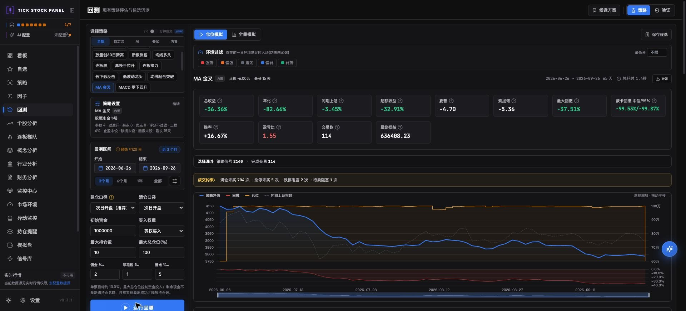](07-tick-stock-panel/README.md)

[完整判断](07-tick-stock-panel/README.md) · [全部截图](07-tick-stock-panel/screenshots.md)

## 2. QuantDinger · 68/100

产品化界面完整，策略代码验证和保存通过；短区间回测受日期选择问题阻挡。

**多市场完整交易产品候选** · 原生 Vue Web

[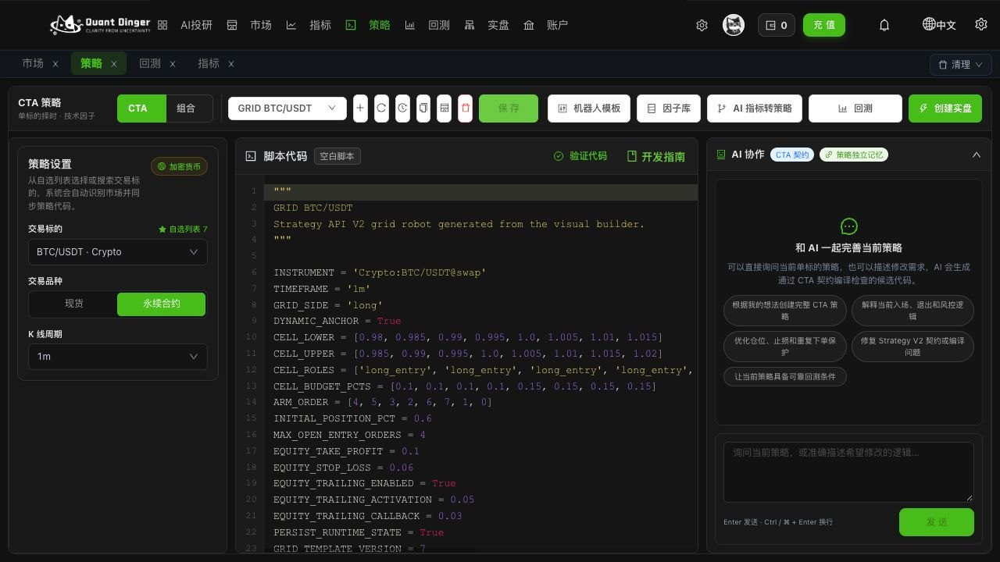](13-quantdinger/README.md)

[完整判断](13-quantdinger/README.md) · [全部截图](13-quantdinger/screenshots.md)

## 3. Vibe-Trading · 63/100

研究、回测和券商连接覆盖广；本轮缺模型与券商配置，不能把连接器数量当已可用账户。

**多市场完整交易 Agent 候选** · 原生 Web / CLI

[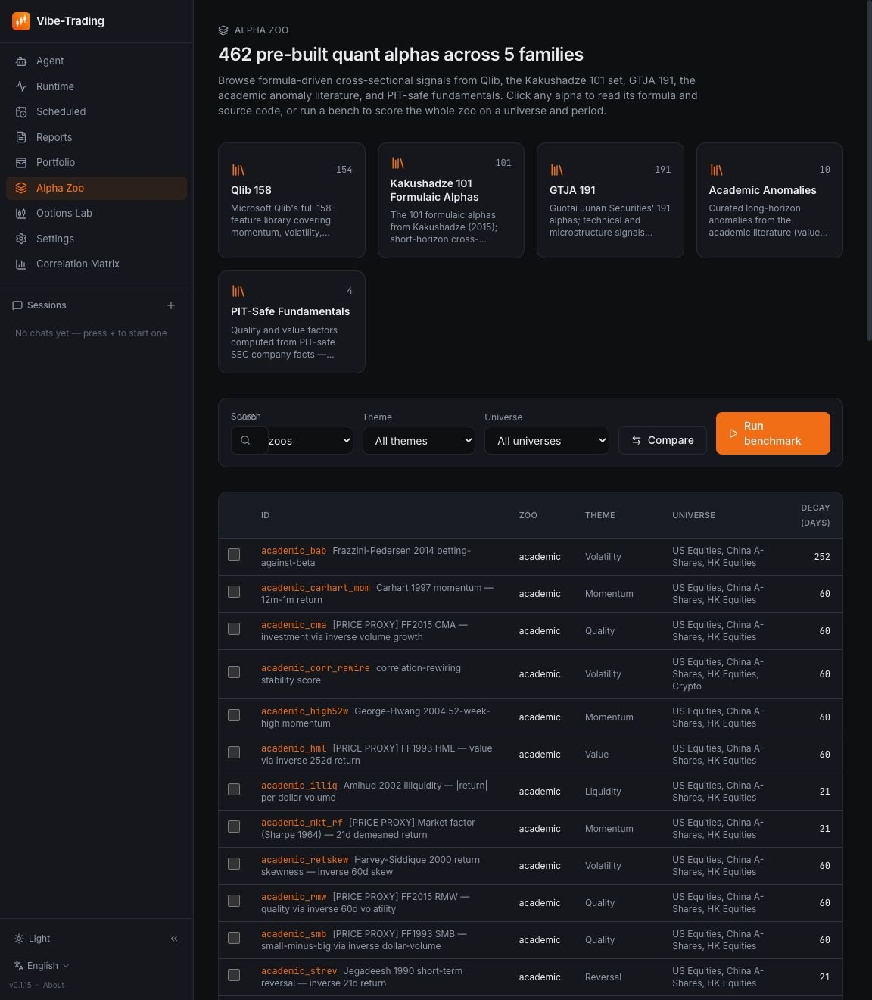](11-vibe-trading/README.md)

[完整判断](11-vibe-trading/README.md) · [全部截图](11-vibe-trading/screenshots.md)

## 4. go-stock · 61/100

桌面成品体验成熟；自选股与日 K 可用，AI Agent 有会员门槛。

**桌面股票研究工具** · 原生桌面；少量辅助反馈页面

[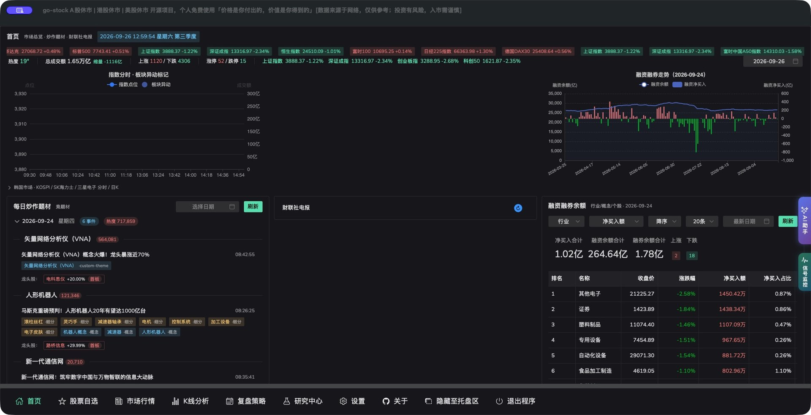](01-go-stock/README.md)

[完整判断](01-go-stock/README.md) · [全部截图](01-go-stock/screenshots.md)

## 5. KHunter · 57/100

有原生 Web、策略、回测和 PTrade 下单/反馈代码；本轮样本较小。

**A 股完整交易系统候选（PTrade）** · 原生 Web；辅助反馈页面另标

[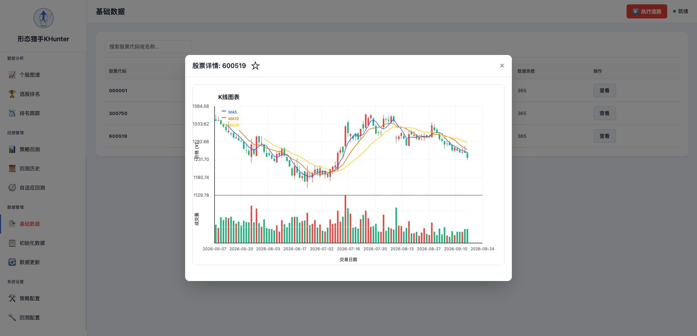](04-khunter/README.md)

[完整判断](04-khunter/README.md) · [全部截图](04-khunter/screenshots.md)

## 6. Sequoia-X · 54/100

窄任务结果明确：真实数据与 6 个策略跑通；没有原生 Web UI。

**CLI 选股引擎 / Trading Strategy** · 原生 CLI；所有网页截图来自辅助试用台

[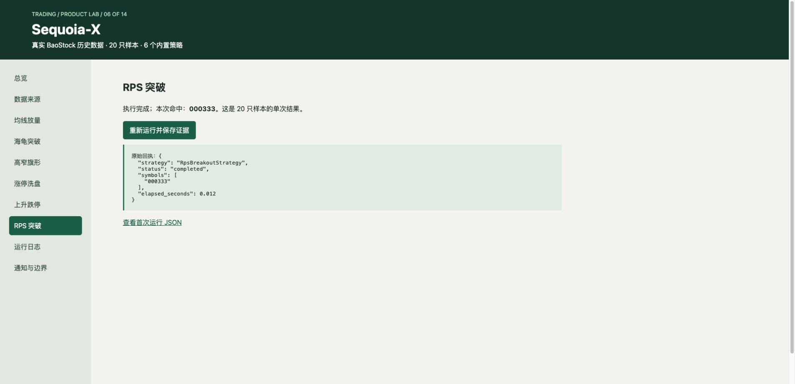](06-sequoia-x/README.md)

[完整判断](06-sequoia-x/README.md) · [全部截图](06-sequoia-x/screenshots.md)

## 7. TradeGenuis-Options · 52/100

原生 Electron 可浏览研究素材与机会，AI 与知识检索效果尚未验证。

**期权研究工作台** · 原生 Electron

[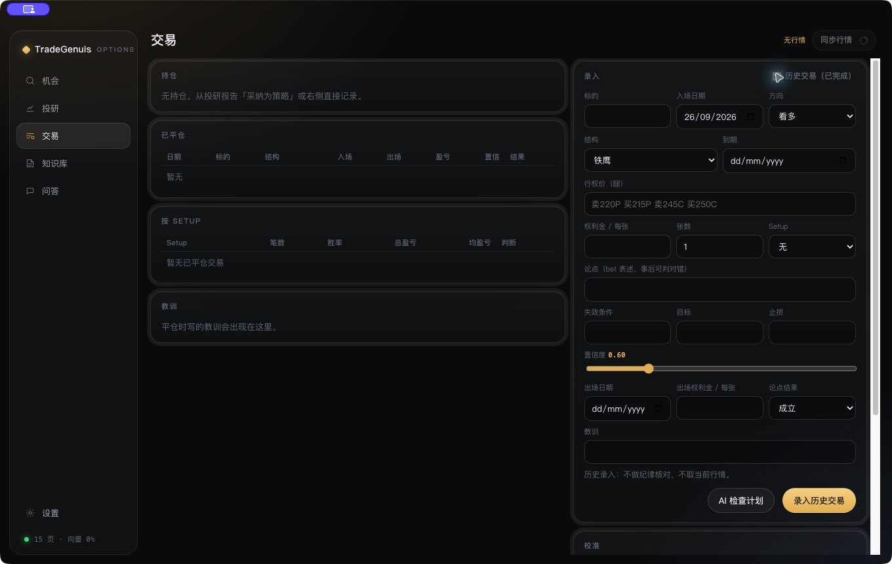](05-tradegenuis-options/README.md)

[完整判断](05-tradegenuis-options/README.md) · [全部截图](05-tradegenuis-options/screenshots.md)

## 8. Vibe-Research · 48/100

研究台页面覆盖广；本轮主要证明界面能运行。

**个人投研 Agent / Equity Research** · 原生 Electron/Web

[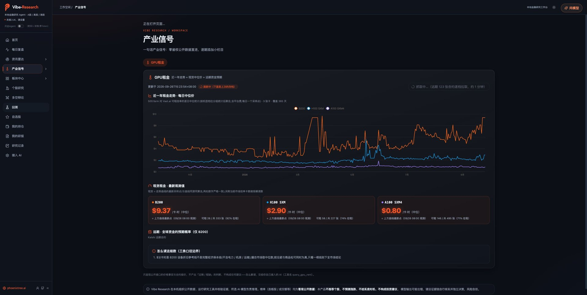](10-vibe-research/README.md)

[完整判断](10-vibe-research/README.md) · [全部截图](10-vibe-research/screenshots.md)

## 9. daily_stock_analysis · 46/100

数据降级路径有真实结果；核心 AI 报告与推送尚未验证。

**研究报告与自动推送 / Equity Research** · 原生 Web

[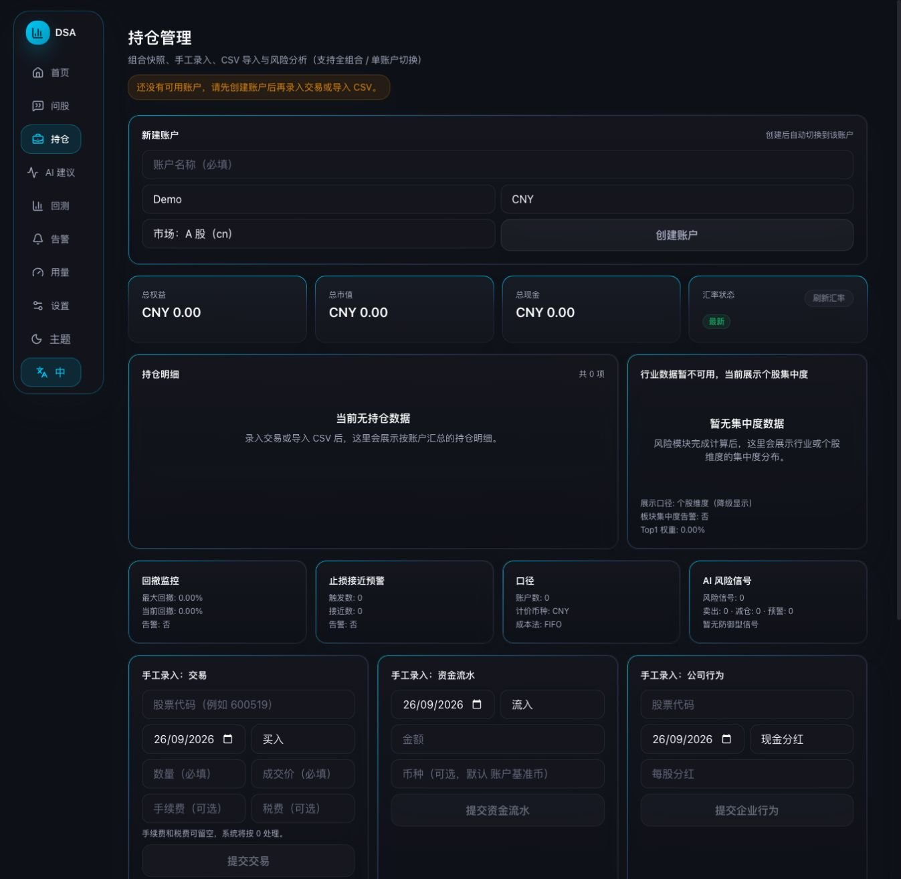](12-daily-stock-analysis/README.md)

[完整判断](12-daily-stock-analysis/README.md) · [全部截图](12-daily-stock-analysis/screenshots.md)

## 10. finance-quant-skills · 37/100

这是技能集合；低完整系统适配分不表示技能本身不好。

**Knowledge & Collections / Agent Skills** · 技能/CLI；网页截图为辅助页

[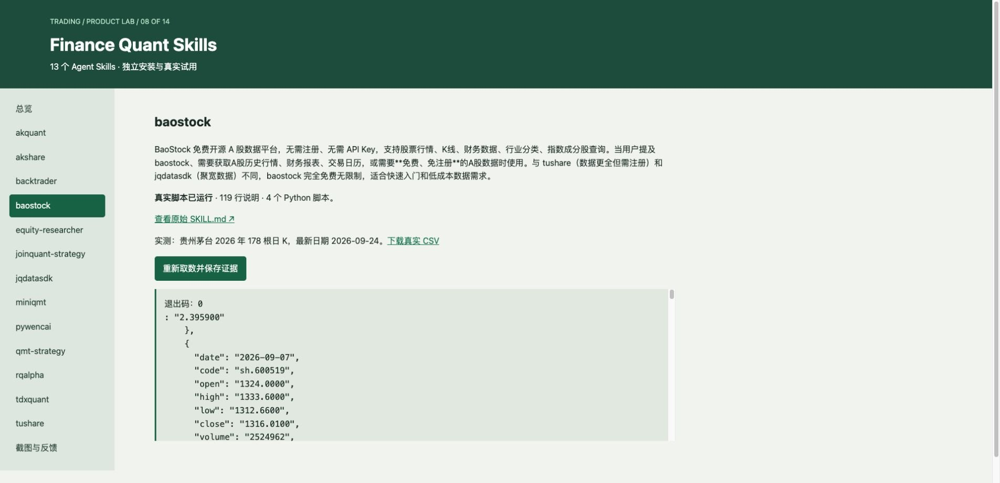](08-finance-quant-skills/README.md)

[完整判断](08-finance-quant-skills/README.md) · [全部截图](08-finance-quant-skills/screenshots.md)

## 11. Kronos · 36/100

模型推理有结果；它的任务是预测，不是替用户管理订单和账户。

**金融预测模型 / Trading Strategy 组件** · 原生模型/Web 展示与辅助记录

[完整判断](09-kronos/README.md) · [全部截图](09-kronos/screenshots.md)

## 12. TradingAgents · 34/100

CLI 和研究图构建通过；本轮未取得最终评级，也没有原生 Web UI。

**CLI 研究决策 Agent 框架** · 原生 CLI；所有网页截图是 Product Lab 辅助页

[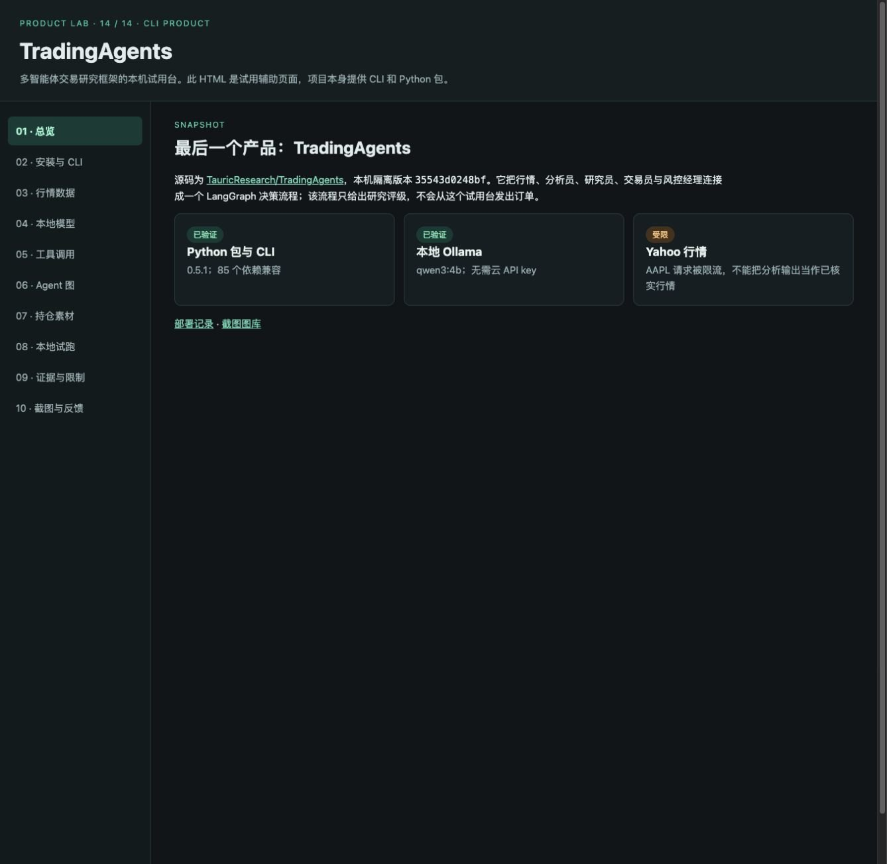](14-tradingagents/README.md)

[完整判断](14-tradingagents/README.md) · [全部截图](14-tradingagents/screenshots.md)

## 13. finhack · 30/100

覆盖数据、因子、策略与交易接入的框架；本轮未得到回测结果。

**量化开发框架 / Trading Infra** · 原生 CLI；截图为辅助试用记录

[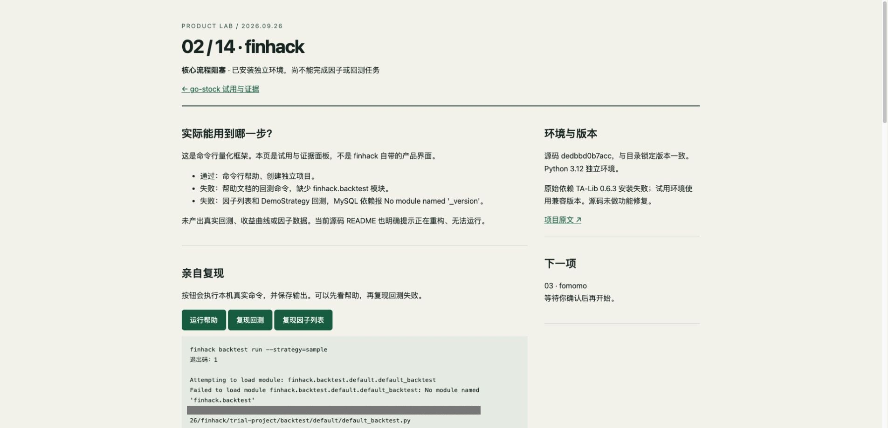](02-finhack/README.md)

[完整判断](02-finhack/README.md) · [全部截图](02-finhack/screenshots.md)

## 14. fomomo · 23/100

本轮看到的是明确标注的模拟群消息与价格适配页，不能据此确认原生产品成熟度。

**群消息代币监测 / 原生范围待核实** · 辅助 HTML / 模拟适配页，不是原生 UI

[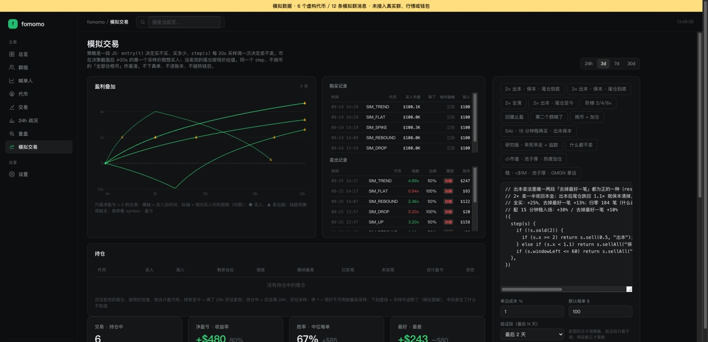](03-fomomo/README.md)

[完整判断](03-fomomo/README.md) · [全部截图](03-fomomo/screenshots.md)
