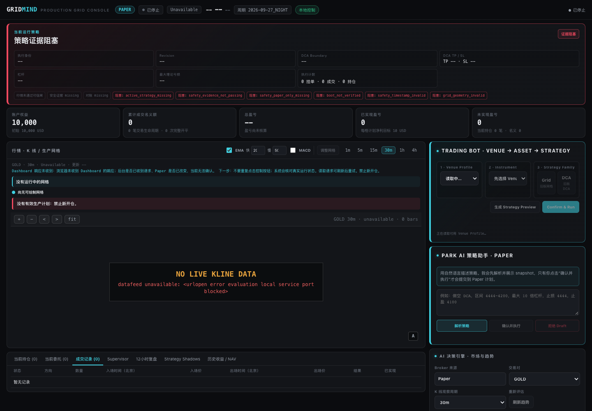

<!-- 本文件由 scripts/render-hub.py 生成，请改 evaluations/assessments/*.json 后重跑 -->
# Full Trading System / Agent · 评测

**目标：** 有完整骨架，各环节先解耦再重耦，能跑通一次 paper 闭环。

**环节：** 1 数据获取、2 清洗与标准化、3 数据存档、4 指标与特征、5 策略与信号、6 回测、7 策略管理、8 风控、9 执行与券商、10 监控与看板

[评测框架](../FRAMEWORK.md) · [Pipeline 总览](../README.md) · [返回目录](../../README.md)

评级：✅ 做到 · 🟡 部分 · ❌ 未做到 · ⬜ 未验证 · — 不适用。分数 = Σ(权重 × 评级值) ÷ Σ适用权重 × 100；已验证 = 做到、部分、未做到三种评级占适用权重的比例。环节：● 实测跑通 · ◐ 源码可见未实测 · ○ 无 · · 不在其角色内；排名表的环节列按 1 获取到 10 看板的顺序排列。

## 评判标准

| 标准 | 权重 | 怎么判 |
|---|---:|---|
| F1 环节覆盖 | 25 | 十个环节中实际存在多少；源码可见与实测跑通分开计。 |
| F2 解耦 | 20 | 数据源、策略、券商等组件有边界和接口，能单独替换。 |
| F3 重耦跑通 | 25 | 端到端一次 paper 闭环：数据→信号→风控→模拟成交→持仓回读。 |
| F4 风控与安全 | 15 | fail-closed、密钥隔离、没有默认实盘。 |
| F5 运维交付 | 15 | 安装、配置、监控、失败恢复。 |

## 排名

| 排名 | 产品 | 分数 | 已验证 | 环节 1–10 | 实测 | 卡片 |
|---:|---|---:|---:|---|---|---|
| 1 | [tick-stock-panel](https://github.com/shy3130/tick-stock-panel) | **70** | 100% | `●●●●●●◐○◐●` | 🟡 选股与回测按声明跑通（65 只、114 笔），监控页面可用但 None 数据模式下无实时行情，LLM 能力未配置。 | [卡片](README.md#tick-stock-panel) |
| 2 | [KHunter](https://github.com/ling-0729/KHunter) | **62** | 100% | `●○●◐●●◐○◐◐` | 🟡 真实数据、选股与回测都能在原生 Web 里跑，但样本只有 3 个标的、回测 0 笔交易，PTrade 交易闭环未验。 | [卡片](README.md#khunter) |
| 3 | [daily_stock_analysis](https://github.com/ZhuLinsen/daily_stock_analysis) | **38** | 100% | `●○●○◐◐○○○◐` | 🟡 数据降级路径拿到 600519 真实日线，但核心 AI 报告与推送未配置未验证，dry-run 进程不退出。 | [卡片](README.md#daily-stock-analysis) |
| 4 | [QuantDinger](https://github.com/OpenByteInc/QuantDinger) | **38** | 75% | `◐○◐◐◐◐●○◐◐` | 🟡 产品化界面完整、策略可生成验证并保存，但回测被日期选择问题挡住未提交，paper/live 未验。 | [卡片](README.md#quantdinger) |
| 5 | [trading-system](https://github.com/zinan92/trading-system) | **38** | 75% | `◐◐◐○◐○◐◐◐●` | 🟡 Dashboard、Desk 与 /trade 代理本地可开，预部署闸门 pass，88 个聚焦测试通过；但行情 read-model 为 blocked、bar_count=0，系统保持 Paper/stopped，没有跑通一次 paper 闭环。 | [卡片](README.md#trading-system) |
| 6 | [Vibe-Trading](https://github.com/HKUDS/Vibe-Trading) | **38** | 75% | `◐○○◐◐◐◐○◐◐` | 🟡 结构完整、API 与主要页面可用，但缺模型与券商配置，研究、回测、订单三条核心路径都没有产出。 | [卡片](README.md#vibe-trading) |
| 7 | [Sequoia-X](https://github.com/sngyai/Sequoia-X) | **30** | 85% | `●○○●●○○○○◐` | 🟡 选股扫描按声明跑通并命中 000333，但收盘后自动运行与飞书推送未验证。 | [卡片](README.md#sequoia-x) |
| 8 | [finhack](https://github.com/FinHackCN/finhack) | **22** | 85% | `◐○◐◐◐◐○○◐○` | ❌ CLI 帮助与项目初始化可用，但因子、回测、交易三条关键命令全部失败，没有拿到任何回测结果。 | [卡片](README.md#finhack) |
| 9 | [TradingAgents](https://github.com/TauricResearch/TradingAgents) | **21** | 100% | `◐··◐◐○·○○○` | ❌ CLI、12 节点图构建与本地模型工具调用可用，但一次完整分析都没跑完（240 秒超时、无最终评级）。 | [卡片](README.md#tradingagents) |
| 10 | [go-stock](https://github.com/ArvinLovegood/go-stock) | **20** | 65% | `●○◐◐◐○○○○◐` | 🟡 原生 macOS 应用启动、自选股与日 K 可用，AI 分析被 VIP2 会员门槛挡住，AI 完整输出未验证。 | [卡片](README.md#go-stock) |
| 11 | [Vibe-Research](https://github.com/simonlin1212/Vibe-Research) | **20** | 65% | `◐○○○◐◐○○○◐` | 🟡 本地原生界面与主要页面能打开，但 AI 未接入，没有产出任何可核验的研究结论。 | [卡片](README.md#vibe-research) |
| 12 | [TradeGenuis-Options](https://github.com/Theclues/TradeGenuis-Options) | **8** | 65% | `●○○○◐○○○○◐` | 🟡 Electron 能浏览素材、20 个 watchlist 项与 6 个机会，但 AI 分析与检索未配置，4 页素材拒收且更新出现冲突。 | [卡片](README.md#tradegenuis-options) |

### 证据不足，不排名

| 产品 | 原因 | 卡片 |
|---|---|---|
| [fomomo](https://github.com/nishuzumi/fomomo) | 已验证 0%，低于 40%：本轮只看到明确标注的模拟群消息与价格适配页，原生流程、真实群、行情与钱包都没有接入。 | [卡片](README.md#fomomo) |
| [finance-quant-skills](https://github.com/lzwme/finance-quant-skills) | 本类标准只有 40% 适用，不属于本类产品，建议归 Knowledge & Collections：13 项技能隔离安装，BaoStock 与 Backtrader 两项按声明跑通，其余 11 项只盘点未运行。 | [卡片](README.md#finance-quant-skills) |
| [Kronos](https://github.com/shiyu-coder/Kronos) | 本类标准只有 40% 适用，不属于本类产品，建议归 Trading Strategy：Kronos-mini 在 CPU 与 MPS 各生成 120 个预测点，但 Web 日期轴 117/120 点与交易日错位，预测质量未与基线比较。 | [卡片](README.md#kronos) |

## 分类说明

- **trading-system** 目录归 Trading Infra，按本类标准评测并参与本类排名。

## 产品卡片

### 1. tick-stock-panel · 70/100 · 已验证 100%

| 1 获取 | 2 清洗 | 3 存档 | 4 指标 | 5 策略 | 6 回测 | 7 管理 | 8 风控 | 9 执行 | 10 看板 |
| :--: | :--: | :--: | :--: | :--: | :--: | :--: | :--: | :--: | :--: |
| ● | ● | ● | ● | ● | ● | ◐ | ○ | ◐ | ● |

**声称：** 自托管、零运维的 A 股「选股 + 监控 + 回测」量化工作台，LLM 驱动策略定制与复盘，可自由接入第三方数据源。

**实测：** 🟡 选股与回测按声明跑通（65 只、114 笔），监控页面可用但 None 数据模式下无实时行情，LLM 能力未配置。

| 标准 | 权重 | 评级 | 证据 |
|---|---:|:--:|---|
| F1 环节覆盖 | 25 | ✅ | 10 环节中 9 个存在，7 个实测：5880 个标的、241 个交易日、1321930 行日线入库并全部经 pipeline 处理（enriched_rows 相等）、因子页与 MA 金叉筛出 65 只、回测 114 笔；策略/信号库仅界面可见，模拟盘订单/撮合/台账仅源码，风控未见。 [图1](2026-09-26/07-tick-stock-panel/images/07-025.jpg) [图2](2026-09-26/07-tick-stock-panel/images/07-010.jpg) [图3](2026-09-26/07-tick-stock-panel/images/07-035.jpg) [图4](2026-09-26/07-tick-stock-panel/images/07-036.jpg) [图5](2026-09-26/07-tick-stock-panel/images/07-017.jpg) |
| F2 解耦 | 20 | 🟡 | 首次引导可选数据源与能力路由，声称可接第三方数据源；本轮 None 数据模式下实时行情不可用，替换未验证。 [图1](2026-09-26/07-tick-stock-panel/images/07-003.jpg) [图2](2026-09-26/07-tick-stock-panel/images/07-004.jpg) |
| F3 重耦跑通 | 25 | 🟡 | 数据→MA 金叉信号→回测 114 笔（2026-06-26 至 09-26，收益 -36.36% 仅描述该策略）跑通；模拟盘停在建账户页，未下单、未成交、未回读持仓。 [图1](2026-09-26/07-tick-stock-panel/images/07-036.jpg) [图2](2026-09-26/07-tick-stock-panel/images/07-021.jpg) |
| F4 风控与安全 | 15 | 🟡 | 本轮版本只有本地模拟盘、无券商实盘，天然没有默认实盘；fail-closed 与密钥隔离未观察，AI 未配置。 [图1](2026-09-26/07-tick-stock-panel/images/07-021.jpg) [图2](2026-09-26/07-tick-stock-panel/images/07-027.jpg) |
| F5 运维交付 | 15 | ✅ | Docker 镜像启动、首次引导 5 步完成、数据 pipeline 任务 ff51bc3007 成功、监控中心与系统设置可用；失败恢复未专门测试。 [图1](2026-09-26/07-tick-stock-panel/images/07-005.jpg) [图2](2026-09-26/07-tick-stock-panel/images/07-007.jpg) [图3](2026-09-26/07-tick-stock-panel/images/07-017.jpg) |

**适合：** 想在本地自托管一套 A 股全市场数据→选股→回测→模拟盘工作台的个人量化用户。  
**不适合：** 需要券商实盘或已验证模拟成交回读的人；实时行情依赖数据源配置。

**未验证：** 模拟账户→下单→成交→持仓回读；AI 输出；券商实盘接入（本轮实现为本地模拟盘）  
**下一步：** 创建隔离模拟账户，完成一笔模拟买卖并核对现金、费用和持仓。

证据：[45 张截图](2026-09-26/07-tick-stock-panel/screenshots.md) · [实测记录](2026-09-26/07-tick-stock-panel/README.md) · 实测版本 `529be9555ef9` · 目录锁 `bfbccf9c414f` · Web 应用 · A股

备注：本轮首选。clean 记 run 依据 pipeline 对 1321930 行全部完成处理；risk 记 none 因记录只提到模拟订单/撮合/台账，未见下单前风控。

### 2. KHunter · 62/100 · 已验证 100%

| 1 获取 | 2 清洗 | 3 存档 | 4 指标 | 5 策略 | 6 回测 | 7 管理 | 8 风控 | 9 执行 | 10 看板 |
| :--: | :--: | :--: | :--: | :--: | :--: | :--: | :--: | :--: | :--: |
| ● | ○ | ● | ◐ | ● | ● | ◐ | ○ | ◐ | ◐ |

**声称：** 开箱即用的 A 股量化交易系统：数据管理、策略选股、择时交易、风险控制、回测验证一体，从数据到交易全流程。

**实测：** 🟡 真实数据、选股与回测都能在原生 Web 里跑，但样本只有 3 个标的、回测 0 笔交易，PTrade 交易闭环未验。

| 标准 | 权重 | 评级 | 证据 |
|---|---:|:--:|---|
| F1 环节覆盖 | 25 | ✅ | 10 环节中 8 个存在，4 个实测：3 个真实标的 1095 根 K 线（BaoStock/腾讯）初始化入库、选股执行（0 命中）、回测运行（0 笔交易）；PTrade 下单/反馈、策略与回测配置、市场速览仅源码或界面可见，风控未见。 [图1](2026-09-26/04-khunter/images/04-001.jpg) [图2](2026-09-26/04-khunter/images/04-003.jpg) [图3](2026-09-26/04-khunter/images/04-004.jpg) [图4](2026-09-26/04-khunter/images/04-019.jpg) |
| F2 解耦 | 20 | 🟡 | 数据源 BaoStock/腾讯并存，PTrade 与自动调度可开关（试用配置 ptrade=false），策略与回测各有独立配置页，边界源码/配置可见；未做替换验证。 [图1](2026-09-26/04-khunter/images/04-018.jpg) [图2](2026-09-26/04-khunter/images/04-021.jpg) [图3](2026-09-26/04-khunter/images/04-022.jpg) |
| F3 重耦跑通 | 25 | 🟡 | 数据→选股→回测串通但回测 0 笔交易；PTrade 关闭，没有走到模拟成交与持仓回读。 [图1](2026-09-26/04-khunter/images/04-004.jpg) [图2](2026-09-26/04-khunter/images/04-016.jpg) |
| F4 风控与安全 | 15 | 🟡 | 本轮配置下 PTrade 与自动调度默认关闭，没有默认实盘；fail-closed 与密钥隔离未观察。 [图1](2026-09-26/04-khunter/images/04-021.jpg) |
| F5 运维交付 | 15 | 🟡 | 本地 Web 启动，基础数据初始化与数据更新页面可操作；自动调度未开，失败恢复未观察。 [图1](2026-09-26/04-khunter/images/04-019.jpg) [图2](2026-09-26/04-khunter/images/04-020.jpg) |

**适合：** 想在本地 Web 里对 A 股做数据→选股→回测、并计划接 PTrade 的个人投资者。  
**不适合：** 需要已验证成交回读或大样本回测结论的人。

**未验证：** 有成交的回测；PTrade 下单与反馈；自动调度；风险控制模块（目录声称，本轮未见）  
**下一步：** 扩大样本并先得到有交易明细的回测，再验证 PTrade 模拟环境。

证据：[23 张截图](2026-09-26/04-khunter/screenshots.md) · [实测记录](2026-09-26/04-khunter/README.md) · 实测版本 `ca93f9e05523` · 目录锁 `ca93f9e05523` · Web 应用 · A股

备注：F1 按环节计数为 done，但 4 个实测环节样本很小（3 标的、0 命中、0 笔交易），结论强度有限。

### 3. daily_stock_analysis · 38/100 · 已验证 100%

| 1 获取 | 2 清洗 | 3 存档 | 4 指标 | 5 策略 | 6 回测 | 7 管理 | 8 风控 | 9 执行 | 10 看板 |
| :--: | :--: | :--: | :--: | :--: | :--: | :--: | :--: | :--: | :--: |
| ● | ○ | ● | ○ | ◐ | ◐ | ○ | ○ | ○ | ◐ |

**声称：** LLM 驱动的多市场股票智能分析：多源行情、实时新闻、决策看板与自动推送，支持零成本定时运行。

**实测：** 🟡 数据降级路径拿到 600519 真实日线，但核心 AI 报告与推送未配置未验证，dry-run 进程不退出。

| 标准 | 权重 | 评级 | 证据 |
|---|---:|:--:|---|
| F1 环节覆盖 | 25 | 🟡 | 10 环节中 5 个存在，2 个实测：600519 取 43 行真实日线（Eastmoney 超时后 AkShare→Sina 降级）并写入 SQLite 核实；AI 信号、回测、告警页存在但输入为空，调度关闭。 [图1](2026-09-26/12-daily-stock-analysis/images/12-003.jpg) [图2](2026-09-26/12-daily-stock-analysis/images/12-006.jpg) [图3](2026-09-26/12-daily-stock-analysis/images/12-007.jpg) [图4](2026-09-26/12-daily-stock-analysis/images/12-008.jpg) |
| F2 解耦 | 20 | 🟡 | 多源行情降级链实测触发（Eastmoney→AkShare→Sina），LLM provider、数据源、通知渠道在设置页各自独立配置；未替换 LLM 与通知验证。 [图1](2026-09-26/12-daily-stock-analysis/images/12-012.jpg) [图2](2026-09-26/12-daily-stock-analysis/images/12-011.jpg) [图3](2026-09-26/12-daily-stock-analysis/images/12-013.jpg) |
| F3 重耦跑通 | 25 | ❌ | 产品无下单环节（持仓页为跟踪），LLM 未配置无信号，闭环无从跑起。 [图1](2026-09-26/12-daily-stock-analysis/images/12-005.jpg) [图2](2026-09-26/12-daily-stock-analysis/images/12-006.jpg) |
| F4 风控与安全 | 15 | 🟡 | LLM 未配置时分析与 Ask 明确禁用而非静默；但生产依赖 npm audit 有 3 项 high（form-data、react-router、react-router-dom），可利用性未验证。 [图1](2026-09-26/12-daily-stock-analysis/images/12-011.jpg) [图2](2026-09-26/12-daily-stock-analysis/images/12-014.jpg) |
| F5 运维交付 | 15 | 🟡 | uv 安装 143 包、npm 构建、/api/health 200；dry-run 记录完成后进程 150 秒不退出，调度器关闭，失败恢复未观察。 [图1](2026-09-26/12-daily-stock-analysis/images/12-014.jpg) [图2](2026-09-26/12-daily-stock-analysis/images/12-009.jpg) |

**适合：** 想零成本定时跑一份多源行情加新闻的 LLM 分析并推送的人，需自配模型。  
**不适合：** 需要下单、风控或已验证报告质量的人。

**未验证：** AI 分析与 Ask；通知和定时任务；历史报告和回测  
**下一步：** 先查明进程不退出原因，再生成一份可核对来源的报告。

证据：[16 张截图](2026-09-26/12-daily-stock-analysis/screenshots.md) · [实测记录](2026-09-26/12-daily-stock-analysis/README.md) · 实测版本 `f9e7b778c48c` · 目录锁 `1168e316269b` · Web 应用 · A股、新闻/事件

备注：记录定位为研究报告与自动推送 / Equity Research。目录声称多市场但记录只测了 A 股 600519，markets 只记已见部分。实际试用 SHA 与目录锁不同。

### 4. QuantDinger · 38/100 · 已验证 75%

| 1 获取 | 2 清洗 | 3 存档 | 4 指标 | 5 策略 | 6 回测 | 7 管理 | 8 风控 | 9 执行 | 10 看板 |
| :--: | :--: | :--: | :--: | :--: | :--: | :--: | :--: | :--: | :--: |
| ◐ | ○ | ◐ | ◐ | ◐ | ◐ | ● | ○ | ◐ | ◐ |

**声称：** 开源 AI Trading OS 与多租户 SaaS：研究、Python 策略、回测、paper/live 交易与监控，覆盖加密、股票、外汇，自带用户管理与计费。

**实测：** 🟡 产品化界面完整、策略可生成验证并保存，但回测被日期选择问题挡住未提交，paper/live 未验。

| 标准 | 权重 | 评级 | 证据 |
|---|---:|:--:|---|
| F1 环节覆盖 | 25 | 🟡 | 10 环节中 8 个存在，1 个实测：GRID BTC/USDT 策略生成→代码验证→保存入库（qd_script_sources id=1）；SuperTrend 指标代码检查通过但未算值，回测未提交，交易/调度 worker 未启动，首页价格来源未核实。 [图1](2026-09-26/13-quantdinger/images/13-046.jpg) [图2](2026-09-26/13-quantdinger/images/13-042.jpg) [图3](2026-09-26/13-quantdinger/images/13-047.jpg) [图4](2026-09-26/13-quantdinger/images/13-007.jpg) |
| F2 解耦 | 20 | 🟡 | 券商账户、LLM、市场、数据同步各为独立设置页，交易与调度为独立 worker 进程（本轮未启动）；边界可见，未替换验证。 [图1](2026-09-26/13-quantdinger/images/13-008.jpg) [图2](2026-09-26/13-quantdinger/images/13-023.jpg) [图3](2026-09-26/13-quantdinger/images/13-029.jpg) |
| F3 重耦跑通 | 25 | ⬜ | 回测因短区间日期选择障碍未提交，交易 worker 未启动，数据→信号→回测→paper 一步未跑。 [图1](2026-09-26/13-quantdinger/images/13-048.jpg) [图2](2026-09-26/13-quantdinger/images/13-049.jpg) |
| F4 风控与安全 | 15 | 🟡 | 登录鉴权通过、安全设置与 agent tokens 页存在，券商未接且交易 worker 未启动即无实盘；fail-closed 未测试。 [图1](2026-09-26/13-quantdinger/images/13-001.jpg) [图2](2026-09-26/13-quantdinger/images/13-022.jpg) [图3](2026-09-26/13-quantdinger/images/13-013.jpg) |
| F5 运维交付 | 15 | 🟡 | PostgreSQL 迁移、pnpm 构建、uv pip check、/api/health 200、管理员登录通过；Redis/交易/调度/Celery worker 未启动，前后端 5.4.1/5.0.20 版本不一致，失败恢复未观察。 [图1](2026-09-26/13-quantdinger/images/13-001.jpg) [图2](2026-09-26/13-quantdinger/images/13-015.jpg) |

**适合：** 想在自有服务器上部署带用户管理与计费的多市场交易 SaaS 骨架的团队。  
**不适合：** 个人想快速拿到回测或 paper 成交结果的场景；worker 与券商需另行配置。

**未验证：** 回测结果；模型研究；paper/live 订单与持仓回读  
**下一步：** 先用短区间跑出回测明细，再验证 paper 交易闭环。

证据：[49 张截图](2026-09-26/13-quantdinger/screenshots.md) · [实测记录](2026-09-26/13-quantdinger/README.md) · 实测版本 `backend 7da2` · 目录锁 `d8508a85a473` · Web 应用 · 加密、美股、外汇

备注：前后端来自两个仓库（QuantDinger / QuantDinger-Vue），界面问题不能直接归因单一仓库。lifecycle 记 run 依据策略注册入库这一步实测。

### 5. trading-system · 38/100 · 已验证 75%

| 1 获取 | 2 清洗 | 3 存档 | 4 指标 | 5 策略 | 6 回测 | 7 管理 | 8 风控 | 9 执行 | 10 看板 |
| :--: | :--: | :--: | :--: | :--: | :--: | :--: | :--: | :--: | :--: |
| ◐ | ◐ | ◐ | ○ | ◐ | ○ | ◐ | ◐ | ◐ | ● |

**声称：** Park 交易平台：GridMind 面板 + 交易台 + broker/strategy/kline 包，Testnet/Paper only 的完整交易系统。

**实测：** 🟡 Dashboard、Desk 与 /trade 代理本地可开，预部署闸门 pass，88 个聚焦测试通过；但行情 read-model 为 blocked、bar_count=0，系统保持 Paper/stopped，没有跑通一次 paper 闭环。

| 标准 | 权重 | 评级 | 证据 |
|---|---:|:--:|---|
| F1 环节覆盖 | 25 | 🟡 | 十环中只有 monitor 实测跑通（Dashboard、Desk、/trade 代理均 HTTP 200，31+19 张视图）；fetch/store/strategy/risk/execute 仅源码与空面板可见，行情 bar_count=0，持仓/委托/成交均为 0。 [图1](../trading-infra/2026-09-28/03-trading-system/images/01-dashboard-overview.png) [图2](../trading-infra/2026-09-28/03-trading-system/images/desk-overview.png) [图3](../trading-infra/2026-09-28/03-trading-system/images/integrated-trade-dashboard.png) |
| F2 解耦 | 20 | 🟡 | monorepo 拆成 dashboard、trading-desk、standard-broker、standard-kline、strategy 包，Desk 经 /trade 代理依赖 GridMind 后端，后端隔离时显式报后台不可用；单独替换某一组件未实测。 [图1](../trading-infra/2026-09-28/03-trading-system/images/desk-system.png) [图2](../trading-infra/2026-09-28/03-trading-system/images/integrated-trade-dashboard.png) [图3](../trading-infra/2026-09-28/03-trading-system/images/desk-api-health.png) |
| F3 重耦跑通 | 25 | ⬜ | 评测隔离把 datafeed 指向空 loopback 端口，行情返回 status=blocked、bar_count=0，且本轮 0 次写请求，没有提交预览/执行/启停/撤单/平仓，闭环没有尝试。 [图1](../trading-infra/2026-09-28/03-trading-system/images/11-chart-timeframe-11.png) |
| F4 风控与安全 | 15 | 🟡 | 无可信行情时 read-model 返回 blocked 且 is_synthetic=false，不伪造数据；系统默认 Paper/stopped，Desk /api/health 声明执行范围仅 Hyperliquid Testnet 且需人工动作；密钥隔离未专门检验。 [图1](../trading-infra/2026-09-28/03-trading-system/images/01-dashboard-overview.png) [图2](../trading-infra/2026-09-28/03-trading-system/images/desk-api-health.png) [图3](../trading-infra/2026-09-28/03-trading-system/images/34-venue-workflow-scroll.png) |
| F5 运维交付 | 15 | 🟡 | PaperPredeployGate 在隔离输出目录给出 pass 回执，Dashboard/Desk 以临时端口 18765/18890 从开发 checkout 启动，88 个聚焦测试通过；完整 monorepo make test 未跑，失败恢复未测。 [图1](../trading-infra/2026-09-28/03-trading-system/images/desk-system.png) [图2](../trading-infra/2026-09-28/03-trading-system/images/31-live-summary-top.png) [图3](../trading-infra/2026-09-28/03-trading-system/images/05-readonly-panel-05.png) |

**适合：** Park 自有的 Paper-first 交易台骨架，作为 Full Trading System 候选继续补数据链路与闭环。  
**不适合：** 现在就要跑通 paper 闭环、或要看到真实行情与成交的用户。

**未验证：** 可信实时行情接入（本轮 datafeed 被隔离到空端口）；策略预览→确认→执行的订单生命周期；trading-system 内的 Nautilus 集成；外部 Testnet/Live 账户；完整 monorepo make test  
**下一步：** 接入一个可信的 Paper 数据源让 bar_count>0，然后走一次 数据→信号→风控→模拟成交→持仓回读 的 paper 闭环。

证据：[50 张截图](../trading-infra/2026-09-28/03-trading-system/screenshots.md) · [实测记录](../trading-infra/2026-09-28/03-trading-system/findings.md) · 实测版本 `bbdcf9005cbf` · 目录锁 `owned source` · Web 应用 · 加密

目录归 **Trading Infra**，按 **Full Trading System / Agent** 标准评测；分类建议不改 canonical 目录。

备注：目录归 Trading Infra，但它是完整平台，本卡按 Full Trading System / Agent 的 F1–F5 评；建议主类迁出，standard-broker 等组件留在 Infra。指标与回测环节本轮记录未见，按无计。浏览器只读：0 次写请求、0 个未捕获页面错误。

### 6. Vibe-Trading · 38/100 · 已验证 75%

| 1 获取 | 2 清洗 | 3 存档 | 4 指标 | 5 策略 | 6 回测 | 7 管理 | 8 风控 | 9 执行 | 10 看板 |
| :--: | :--: | :--: | :--: | :--: | :--: | :--: | :--: | :--: | :--: |
| ◐ | ○ | ○ | ◐ | ◐ | ◐ | ◐ | ○ | ◐ | ◐ |

**声称：** 个人交易 Agent：LLM 研究、Alpha 策略库与回测、券商连接器、定时任务与 IM 推送。

**实测：** 🟡 结构完整、API 与主要页面可用，但缺模型与券商配置，研究、回测、订单三条核心路径都没有产出。

| 标准 | 权重 | 评级 | 证据 |
|---|---:|:--:|---|
| F1 环节覆盖 | 25 | 🟡 | 10 环节中 7 个界面/源码可见，0 个实测：yfinance 端点可达但未取数，Alpha Zoo/Bench/Compare、定时任务、券商连接器、组合与报告页存在；模型未配置 agent 生成不可用，订单路径未走。 [图1](2026-09-26/11-vibe-trading/images/11-006.jpg) [图2](2026-09-26/11-vibe-trading/images/11-012.jpg) [图3](2026-09-26/11-vibe-trading/images/11-003.jpg) [图4](2026-09-26/11-vibe-trading/images/11-005.jpg) |
| F2 解耦 | 20 | 🟡 | LLM provider/model、券商 profile、IM 渠道运行时各自独立配置，API preflight 单独报告缺失项，边界在设置页可见；未实际替换任何组件。 [图1](2026-09-26/11-vibe-trading/images/11-014.jpg) [图2](2026-09-26/11-vibe-trading/images/11-008.jpg) |
| F3 重耦跑通 | 25 | ⬜ | 模型未配置无信号，券商未连接，paper connector 订单回读未尝试。 [图1](2026-09-26/11-vibe-trading/images/11-002.jpg) |
| F4 风控与安全 | 15 | 🟡 | 无模型配置时 API preflight 明确报告 agent 生成不可用而非静默运行；券商与 IM 未连接、渠道运行时停止，无默认实盘；密钥隔离未深入观察。 [图1](2026-09-26/11-vibe-trading/images/11-014.jpg) [图2](2026-09-26/11-vibe-trading/images/11-002.jpg) |
| F5 运维交付 | 15 | 🟡 | 锁定依赖 --require-hashes 安装、pip check 通过、npm ci 0 漏洞、构建通过、API 与首页 HTTP 200；Docker 构建因本机 containerd 缺 blob 失败改用原生 venv，失败恢复未观察。 [图1](2026-09-26/11-vibe-trading/images/11-002.jpg) [图2](2026-09-26/11-vibe-trading/images/11-010.jpg) |

**适合：** 想要多市场、多券商连接器、可定时运行的个人交易 Agent 骨架，并自带模型与账户的人。  
**不适合：** 想开箱即得研究或交易结果的人；连接器数量不等于可用账户。

**未验证：** LLM 研究输出；回测产出；券商授权、订单执行与持仓回读  
**下一步：** 用同一研究任务验证模型输出，再在 paper connector 完成订单回读。

证据：[27 张截图](2026-09-26/11-vibe-trading/screenshots.md) · [实测记录](2026-09-26/11-vibe-trading/README.md) · 实测版本 `5e9ffd1a73e7` · 目录锁 `e476b4ce4c3b` · Web 应用 · 美股、A股

备注：markets 依据记录：免费 yfinance 可达（美股），A 股 Tushare token 缺失。实际试用 SHA 与目录锁不同。

### 7. Sequoia-X · 30/100 · 已验证 85%

| 1 获取 | 2 清洗 | 3 存档 | 4 指标 | 5 策略 | 6 回测 | 7 管理 | 8 风控 | 9 执行 | 10 看板 |
| :--: | :--: | :--: | :--: | :--: | :--: | :--: | :--: | :--: | :--: |
| ● | ○ | ○ | ● | ● | ○ | ○ | ○ | ○ | ◐ |

**声称：** A 股自动选股系统：多种技术形态自动扫描，收盘后自动运行并推送飞书。

**实测：** 🟡 选股扫描按声明跑通并命中 000333，但收盘后自动运行与飞书推送未验证。

| 标准 | 权重 | 评级 | 证据 |
|---|---:|:--:|---|
| F1 环节覆盖 | 25 | 🟡 | 10 环节中 4 个存在，3 个实测：20 个标的 8414 根 K 线（末日 2026-09-24）、6 个策略完成、RPS 突破命中 000333；飞书通知未发送，无回测与执行。 [图1](2026-09-26/06-sequoia-x/images/06-002.jpg) [图2](2026-09-26/06-sequoia-x/images/06-008.jpg) [图3](2026-09-26/06-sequoia-x/images/06-009.jpg) |
| F2 解耦 | 20 | 🟡 | 6 个策略为独立模块逐个运行并各自计时（HighTightFlag、Turtle、RPS、MaVolume、LimitUpShakeout、UptrendLimitDown），策略边界源码可见；数据源与通知渠道未替换验证。 [图1](2026-09-26/06-sequoia-x/images/06-008.jpg) [图2](2026-09-26/06-sequoia-x/images/06-009.jpg) |
| F3 重耦跑通 | 25 | ❌ | 无回测、无下单环节，选股信号止于日志与推送，闭环不在产品内。 [图1](2026-09-26/06-sequoia-x/images/06-010.jpg) |
| F4 风控与安全 | 15 | ⬜ | 本轮未观察；无交易功能，通知 webhook 未配置。 |
| F5 运维交付 | 15 | 🟡 | CLI 本地跑通 6 个策略、日志可见；收盘后定时与飞书推送未验证，失败恢复未观察。 [图1](2026-09-26/06-sequoia-x/images/06-009.jpg) [图2](2026-09-26/06-sequoia-x/images/06-010.jpg) |

**适合：** 想每天收盘后跑一遍固定技术形态扫描并推送的 A 股用户。  
**不适合：** 需要回测、仓位或执行的人；它只输出选股名单。

**未验证：** 通知发送；定时持续运行；订单与持仓闭环  
**下一步：** 验证收盘后自动执行及通知送达，核对同一信号可重复出现。

证据：[11 张截图](2026-09-26/06-sequoia-x/screenshots.md) · [实测记录](2026-09-26/06-sequoia-x/README.md) · 实测版本 `444c0db69ff3` · 目录锁 `444c0db69ff3` · CLI · A股

备注：记录定位为 CLI 选股引擎 / Trading Strategy；所有网页截图来自辅助试用台，上游无原生 Web UI。

### 8. finhack · 22/100 · 已验证 85%

| 1 获取 | 2 清洗 | 3 存档 | 4 指标 | 5 策略 | 6 回测 | 7 管理 | 8 风控 | 9 执行 | 10 看板 |
| :--: | :--: | :--: | :--: | :--: | :--: | :--: | :--: | :--: | :--: |
| ◐ | ○ | ◐ | ◐ | ◐ | ◐ | ○ | ○ | ◐ | ○ |

**声称：** 易于拓展的量化金融框架，集成数据采集、因子计算与挖掘、机器学习、策略编写、回测、实盘接入全流程。

**实测：** ❌ CLI 帮助与项目初始化可用，但因子、回测、交易三条关键命令全部失败，没有拿到任何回测结果。

| 标准 | 权重 | 评级 | 证据 |
|---|---:|:--:|---|
| F1 环节覆盖 | 25 | 🟡 | 10 环节中 6 个源码/命令可见，0 个实测：backtest run、factor list、trader run 三条命令均退出码 1（缺 finhack.backtest、MySQL connector 缺 _version）。 [图1](2026-09-26/02-finhack/images/02-001.jpg) [图2](2026-09-26/02-finhack/images/02-002.jpg) |
| F2 解耦 | 20 | 🟡 | CLI 按 backtest / factor / trader 分模块，模块边界源码可见；因命令失败未能验证可替换性。 [图1](2026-09-26/02-finhack/images/02-001.jpg) |
| F3 重耦跑通 | 25 | ❌ | backtest run 与 DemoStrategy 都退出码 1，数据→信号→回测一步没跑通，更谈不上模拟成交。 [图1](2026-09-26/02-finhack/images/02-002.jpg) |
| F4 风控与安全 | 15 | ⬜ | 本轮未观察；命令未跑通，无法看到风控与密钥处理。 |
| F5 运维交付 | 15 | ❌ | pip 安装 0.0.3.dev2 后三条关键命令都失败；Python 3.12 下 MySQL connector 与 importlib 依赖未就绪，只有初始化通过。 [图1](2026-09-26/02-finhack/images/02-002.jpg) |

**适合：** 愿意自行修复依赖、在受支持环境里搭因子→回测→实盘全流程的开发者。  
**不适合：** 想开箱即用拿到回测结果的人；本轮 Python 3.12 环境关键命令全失败。

**未验证：** 因子计算结果；回测输出；实盘适配器  
**下一步：** 先在受支持环境修复依赖并跑通官方最小策略；本轮失败不代表所有环境均失败。

证据：[2 张截图](2026-09-26/02-finhack/screenshots.md) · [实测记录](2026-09-26/02-finhack/README.md) · 实测版本 `PyPI finhack` · 目录锁 `dedbbd0b7acc` · CLI · A股

备注：记录定位为量化开发框架 / Trading Infra。实际试用 PyPI 包，源码 SHA 未记录，与目录锁不能直接对应。

### 9. TradingAgents · 21/100 · 已验证 100%

| 1 获取 | 2 清洗 | 3 存档 | 4 指标 | 5 策略 | 6 回测 | 7 管理 | 8 风控 | 9 执行 | 10 看板 |
| :--: | :--: | :--: | :--: | :--: | :--: | :--: | :--: | :--: | :--: |
| ◐ | · | · | ◐ | ◐ | ○ | · | ○ | ○ | ○ |

**声称：** 多 Agent LLM 金融交易框架：分析师、研究员、交易员等角色协作，对标的给出交易决策。

**实测：** ❌ CLI、12 节点图构建与本地模型工具调用可用，但一次完整分析都没跑完（240 秒超时、无最终评级）。

| 标准 | 权重 | 评级 | 证据 |
|---|---:|:--:|---|
| F1 环节覆盖 | 25 | ❌ | 10 环节中 3 个源码可见，0 个实测：Yahoo 取 AAPL 日线触发限流无数据，12 节点研究图构建后完整分析 240 秒超时无评级；无回测、无成交台账。 [图1](2026-09-26/14-tradingagents/images/14-003.jpg) [图2](2026-09-26/14-tradingagents/images/14-006.jpg) [图3](2026-09-26/14-tradingagents/images/14-011.jpg) |
| F2 解耦 | 20 | 🟡 | 模型层可换：本轮用本地 Ollama qwen3:4b 替代云模型并输出结构化 get_price(AAPL) 工具调用；数据供应商为独立工具层，券商适配不在框架内。 [图1](2026-09-26/14-tradingagents/images/14-004.jpg) [图2](2026-09-26/14-tradingagents/images/14-005.jpg) |
| F3 重耦跑通 | 25 | ❌ | 端到端分析尝试过：AAPL 完整运行 240 秒超时、无最终评级；框架本身不含模拟成交与持仓台账。 [图1](2026-09-26/14-tradingagents/images/14-011.jpg) |
| F4 风控与安全 | 15 | — | 框架不下单、无账户；密钥只涉及模型 API，本轮用本地模型未涉及。 |
| F5 运维交付 | 15 | 🟡 | uv 安装 85 包、pip check、CLI 帮助通过；完整运行超时，Yahoo 限流下无重试恢复迹象。 [图1](2026-09-26/14-tradingagents/images/14-002.jpg) [图2](2026-09-26/14-tradingagents/images/14-011.jpg) |

**适合：** 想研究多 Agent 辩论式研判流程、并自带模型与行情 key 的研究者。  
**不适合：** 想要成交、持仓或回测的人；框架不含执行台账。

**未验证：** 完整决策输出；评级质量；订单与资金持仓闭环（源码评价模块不模拟成交台账）  
**下一步：** 恢复可用行情后重跑最小分析，保存最终评级及引用数据。

证据：[11 张截图](2026-09-26/14-tradingagents/screenshots.md) · [实测记录](2026-09-26/14-tradingagents/README.md) · 实测版本 `35543d0248bf` · 目录锁 `be952b8eccb4` · CLI · 美股、新闻/事件

备注：记录定位为 CLI 研究决策 Agent 框架；所有网页截图为 Product Lab 辅助页，上游只有 CLI/Python 包。超时不能全归于限流。实际试用 SHA 与目录锁不同。

### 10. go-stock · 20/100 · 已验证 65%

| 1 获取 | 2 清洗 | 3 存档 | 4 指标 | 5 策略 | 6 回测 | 7 管理 | 8 风控 | 9 执行 | 10 看板 |
| :--: | :--: | :--: | :--: | :--: | :--: | :--: | :--: | :--: | :--: |
| ● | ○ | ◐ | ◐ | ◐ | ○ | ○ | ○ | ○ | ◐ |

**声称：** AI 加持的股票分析与选股桌面工具：行情获取、AI 热点与财务分析、涨跌报警推送，支持 A 股、港股、美股，数据保留本地。

**实测：** 🟡 原生 macOS 应用启动、自选股与日 K 可用，AI 分析被 VIP2 会员门槛挡住，AI 完整输出未验证。

| 标准 | 权重 | 评级 | 证据 |
|---|---:|:--:|---|
| F1 环节覆盖 | 25 | 🟡 | 10 环节中 5 个存在，1 个实测：真实行情与日 K 通过；本地数据保留、指标选股、形态选股、异动监控只在界面可见，无回测与执行。 [图1](2026-09-26/01-go-stock/images/01-003.jpg) [图2](2026-09-26/01-go-stock/images/01-033.jpg) [图3](2026-09-26/01-go-stock/images/01-028.jpg) |
| F2 解耦 | 20 | ⬜ | 本轮未观察组件边界；多模型平台支持只是目录声明。 |
| F3 重耦跑通 | 25 | ❌ | 产品没有下单与成交环节，交易日志只是手工记录，闭环无从跑起；本轮只到行情与自选。 [图1](2026-09-26/01-go-stock/images/01-035.jpg) [图2](2026-09-26/01-go-stock/images/01-040.jpg) |
| F4 风控与安全 | 15 | ⬜ | 本轮未观察 fail-closed、密钥隔离；无交易功能故无默认实盘问题。 |
| F5 运维交付 | 15 | 🟡 | 发布版 v2026.09.26.1 下载即启动，安装门槛低；AI Agent 页出现 VIP2 门槛，监控与失败恢复未观察。 [图1](2026-09-26/01-go-stock/images/01-001.jpg) [图2](2026-09-26/01-go-stock/images/01-004.jpg) |

**适合：** 想要开箱即用的本地桌面看盘与 AI 研究底座的个人投资者。  
**不适合：** 需要下单、回测或自动交易闭环的人。

**未验证：** AI 完整分析输出；订单执行与持仓回读；长期稳定运行  
**下一步：** 用同一组标的完成一次 AI 研究，记录会员与模型依赖。

证据：[49 张截图](2026-09-26/01-go-stock/screenshots.md) · [实测记录](2026-09-26/01-go-stock/README.md) · 实测版本 `release v202` · 目录锁 `c26304fafab0` · 桌面应用 · A股、港股、美股、新闻/事件

备注：记录定位为桌面股票研究工具；36 个功能页只有启动、自选、日 K 三项实际操作通过，其余仅界面可见。

### 11. Vibe-Research · 20/100 · 已验证 65%

| 1 获取 | 2 清洗 | 3 存档 | 4 指标 | 5 策略 | 6 回测 | 7 管理 | 8 风控 | 9 执行 | 10 看板 |
| :--: | :--: | :--: | :--: | :--: | :--: | :--: | :--: | :--: | :--: |
| ◐ | ○ | ○ | ○ | ◐ | ◐ | ○ | ○ | ○ | ◐ |

**声称：** A 股/美股/港股个人投研 Agent：每日复盘、资讯雷达、个股数据、板块中心、持仓、研究记录、回测，由用户自己的 Agent（Codex Harness）驱动。

**实测：** 🟡 本地原生界面与主要页面能打开，但 AI 未接入，没有产出任何可核验的研究结论。

| 标准 | 权重 | 评级 | 证据 |
|---|---:|:--:|---|
| F1 环节覆盖 | 25 | 🟡 | 10 环节中 4 个界面可见，0 个实测：资讯雷达/个股研究、多空辩论、回测、每日复盘与持仓页可打开；AI 未接入，无数据与研究产出。 [图1](2026-09-26/10-vibe-research/images/10-004.jpg) [图2](2026-09-26/10-vibe-research/images/10-008.jpg) [图3](2026-09-26/10-vibe-research/images/10-009.jpg) [图4](2026-09-26/10-vibe-research/images/10-011.jpg) |
| F2 解耦 | 20 | ⬜ | 本轮未观察组件边界；接入 AI 页只显示额度提示，模型未连接。 |
| F3 重耦跑通 | 25 | ❌ | 产品无下单环节（持仓页为跟踪），且 AI 未接入未产出信号，闭环无从跑起。 [图1](2026-09-26/10-vibe-research/images/10-011.jpg) [图2](2026-09-26/10-vibe-research/images/10-002.jpg) |
| F4 风控与安全 | 15 | ⬜ | 本轮未观察；订阅探测未启动，密钥处理未见。 |
| F5 运维交付 | 15 | 🟡 | 本地原生界面在隔离端口（API 8767 / UI 5932）启动，主要页面可打开，数据根目录隔离；AI 与订阅未配置，失败恢复未观察。 [图1](2026-09-26/10-vibe-research/images/10-002.jpg) [图2](2026-09-26/10-vibe-research/images/10-014.jpg) |

**适合：** 想用自己的模型或 Codex 订阅驱动个人投研台（复盘、资讯、板块、持仓）的人。  
**不适合：** 需要自动交易或已验证 AI 研究输出的人。

**未验证：** AI 研究完整输出；订阅额度与数据质量；回测与组合研究结果  
**下一步：** 配置可用模型后，完成一个带来源和可复核结论的单股研究。

证据：[23 张截图](2026-09-26/10-vibe-research/screenshots.md) · [实测记录](2026-09-26/10-vibe-research/README.md) · 实测版本 `85ba57191ba2` · 目录锁 `34ed58155ca2` · Web 应用 · A股、美股、港股、新闻/事件

备注：记录定位为个人投研 Agent / Equity Research。图库含 9 张编号 07-0xx 的手动截图，属本产品试用。实际试用 SHA 与目录锁不同。

### 12. TradeGenuis-Options · 8/100 · 已验证 65%

| 1 获取 | 2 清洗 | 3 存档 | 4 指标 | 5 策略 | 6 回测 | 7 管理 | 8 风控 | 9 执行 | 10 看板 |
| :--: | :--: | :--: | :--: | :--: | :--: | :--: | :--: | :--: | :--: |
| ● | ○ | ○ | ○ | ◐ | ○ | ○ | ○ | ○ | ◐ |

**声称：** 目录无描述；按本轮定位是期权研究工作台：机会扫描、投研知识库、交易记录与问答。

**实测：** 🟡 Electron 能浏览素材、20 个 watchlist 项与 6 个机会，但 AI 分析与检索未配置，4 页素材拒收且更新出现冲突。

| 标准 | 权重 | 评级 | 证据 |
|---|---:|:--:|---|
| F1 环节覆盖 | 25 | ❌ | 10 环节中 3 个存在，1 个实测：机会同步完成并显示 20 个 watchlist 项、6 个机会（来源与有效性未核实）；策略模板与交易总览仅界面可见，无回测与执行。 [图1](2026-09-26/05-tradegenuis-options/images/05-015.jpg) [图2](2026-09-26/05-tradegenuis-options/images/05-008.jpg) [图3](2026-09-26/05-tradegenuis-options/images/05-003.jpg) |
| F2 解耦 | 20 | ⬜ | 本轮未观察组件边界；AI key 与 embedding 未配置。 |
| F3 重耦跑通 | 25 | ❌ | 没有信号→下单路径，交易页是手工历史交易表单，闭环无从跑起。 [图1](2026-09-26/05-tradegenuis-options/images/05-004.jpg) |
| F4 风控与安全 | 15 | ⬜ | 本轮未观察；无交易功能，AI key 未配置。 |
| F5 运维交付 | 15 | 🟡 | Electron 原生启动、导入 15 页素材；4 页被拒收，更新出现 revision_conflict（首次创建成功），恢复路径未观察。 [图1](2026-09-26/05-tradegenuis-options/images/05-014.jpg) [图2](2026-09-26/05-tradegenuis-options/images/05-012.jpg) |

**适合：** 想用本地桌面整理期权研究笔记、策略模板与机会清单的人。  
**不适合：** 需要期权定价、回测或下单执行的人；AI 与 embedding 本轮未验证。

**未验证：** AI 分析；embedding 检索；机会质量与订单执行  
**下一步：** 修复或复现更新冲突，并用一份可核实的期权材料完成分析。

证据：[17 张截图](2026-09-26/05-tradegenuis-options/screenshots.md) · [实测记录](2026-09-26/05-tradegenuis-options/README.md) · 实测版本 `a77d13dae84b` · 目录锁 `a77d13dae84b` · 桌面应用

备注：目录无描述，记录未标明覆盖市场，markets 留空。定位更接近研究工作台，但记录没有给出框架类别，不做分类建议。

### fomomo · 0/100 · 已验证 0%

| 1 获取 | 2 清洗 | 3 存档 | 4 指标 | 5 策略 | 6 回测 | 7 管理 | 8 风控 | 9 执行 | 10 看板 |
| :--: | :--: | :--: | :--: | :--: | :--: | :--: | :--: | :--: | :--: |
| ◐ | ○ | ○ | ○ | ◐ | ○ | ○ | ○ | ○ | ○ |

**声称：** 目录无描述；按本轮定位是群消息代币监测：从群聊消息识别代币并跟踪价格与退出。

**实测：** ⬜ 本轮只看到明确标注的模拟群消息与价格适配页，原生流程、真实群、行情与钱包都没有接入。

| 标准 | 权重 | 评级 | 证据 |
|---|---:|:--:|---|
| F1 环节覆盖 | 25 | ⬜ | 原生产品未运行（native_app_tested=false）；消息接入与策略只据记录“原有分析与策略未改动”判定源码存在，2 个源码可见、0 个实测。 [图1](2026-09-26/03-fomomo/images/03-002.jpg) |
| F2 解耦 | 20 | ⬜ | 只见试用添加的模拟适配页，未观察原生组件边界。 |
| F3 重耦跑通 | 25 | ⬜ | 真实群、行情、钱包均未接入，没有任何原生流程被尝试。 |
| F4 风控与安全 | 15 | ⬜ | 钱包未加载（wallet_loaded=false），本轮未观察密钥与实盘设置。 |
| F5 运维交付 | 15 | ⬜ | 原生服务未部署，安装与运行未观察。 |

**适合：** 暂无法推荐；需先用授权测试群跑一次原生流程。  
**不适合：** 任何要以本轮证据做选型的场景。

**未验证：** 原生产品运行；真实群消息接入；真实行情与钱包；原生交易或模拟交易功能  
**下一步：** 接入一个获授权的测试群，用原生流程验证消息→代币识别→结果记录。

证据：[10 张截图](2026-09-26/03-fomomo/screenshots.md) · [实测记录](2026-09-26/03-fomomo/README.md) · 实测版本 `c0ea14f419f6` · 目录锁 `a2c6040392e3` · Web 应用 · 加密

备注：目录无描述。本轮只看到模拟适配页（试用侧加了 trial-simulation.ts 与模拟横幅），全部消息与价格为模拟，无法判断原生范围与归属，因此不给分类建议。

### finance-quant-skills · 50/100 · 已验证 100%

| 1 获取 | 2 清洗 | 3 存档 | 4 指标 | 5 策略 | 6 回测 | 7 管理 | 8 风控 | 9 执行 | 10 看板 |
| :--: | :--: | :--: | :--: | :--: | :--: | :--: | :--: | :--: | :--: |
| ● | ○ | ○ | ○ | ◐ | ● | ○ | ○ | ◐ | ○ |

**声称：** 面向金融量化交易领域的 Agent Skills 技能维护仓库，主要聚焦 A 股量化交易。

**实测：** 🟡 13 项技能隔离安装，BaoStock 与 Backtrader 两项按声明跑通，其余 11 项只盘点未运行。

| 标准 | 权重 | 评级 | 证据 |
|---|---:|:--:|---|
| F1 环节覆盖 | 25 | 🟡 | 10 环节中 4 个存在，2 个实测：BaoStock 取 sh.600519 178 根 K 线（2026-01-05 至 09-24）、Backtrader 8 笔平仓 159 个权益点；joinquant/qmt 策略与 miniqmt 下单技能仅盘点入口。 [图1](2026-09-26/08-finance-quant-skills/images/08-016.jpg) [图2](2026-09-26/08-finance-quant-skills/images/08-017.jpg) [图3](2026-09-26/08-finance-quant-skills/images/08-009.jpg) |
| F2 解耦 | 20 | — | 技能集合，每项技能独立安装调用，没有系统级组件边界可评。 |
| F3 重耦跑通 | 25 | — | 不是交易系统，paper 闭环不适用；本轮只串了取数与回测两项技能。 |
| F4 风控与安全 | 15 | — | 技能仓库不持有密钥、不下单，无默认实盘问题。 |
| F5 运维交付 | 15 | 🟡 | 隔离安装 13 项技能（非全局），两项跑通；其余 11 项只盘点入口与资源，未运行。 [图1](2026-09-26/08-finance-quant-skills/images/08-001.jpg) [图2](2026-09-26/08-finance-quant-skills/images/08-004.jpg) |

**适合：** 给 Agent 挂载 A 股取数、回测、券商接口技能的人，按技能逐项验收。  
**不适合：** 想要一套现成交易系统的人；它是技能集合，不是产品。

**未验证：** 其他 11 项技能的运行效果；完整交易产品闭环  
**下一步：** 按技能逐项验收，不以整套交易系统的要求认定其质量。

证据：[17 张截图](2026-09-26/08-finance-quant-skills/screenshots.md) · [实测记录](2026-09-26/08-finance-quant-skills/README.md) · 实测版本 `d973f3595fc7` · 目录锁 `7af066194d8d` · Agent Skill · A股

备注：记录定位为 Knowledge & Collections / Agent Skills；按框架该类别不评测，F2–F4 记不适用。实际试用 SHA 与目录锁不同。

### Kronos · 19/100 · 已验证 100%

| 1 获取 | 2 清洗 | 3 存档 | 4 指标 | 5 策略 | 6 回测 | 7 管理 | 8 风控 | 9 执行 | 10 看板 |
| :--: | :--: | :--: | :--: | :--: | :--: | :--: | :--: | :--: | :--: |
| · | · | · | ● | ○ | ○ | · | · | · | · |

**声称：** Kronos：金融市场语言的基础模型，对 K 线序列做预测。

**实测：** 🟡 Kronos-mini 在 CPU 与 MPS 各生成 120 个预测点，但 Web 日期轴 117/120 点与交易日错位，预测质量未与基线比较。

| 标准 | 权重 | 评级 | 证据 |
|---|---:|:--:|---|
| F1 环节覆盖 | 25 | ❌ | 10 环节中 1 个存在且实测：Kronos-mini 输出 120 个预测点（MAPE 7.74% / 7.77%）作为特征序列；不产生买卖信号，无回测，其余环节不在模型角色内。 [图1](2026-09-26/09-kronos/images/09-006.jpg) [图2](2026-09-26/09-kronos/images/09-007.jpg) |
| F2 解耦 | 20 | — | 单一模型，不是多组件系统，无可替换组件边界。 |
| F3 重耦跑通 | 25 | — | 预测模型不下单、不管账户，paper 闭环不适用。 |
| F4 风控与安全 | 15 | — | 无密钥、无交易，风控与实盘设置不适用。 |
| F5 运维交付 | 15 | 🟡 | CPU 与 Apple Silicon MPS 两条路径都能加载 Kronos-mini 并推理；Web 日期轴 117/120 点与交易日错位。 [图1](2026-09-26/09-kronos/images/09-005.jpg) [图2](2026-09-26/09-kronos/images/09-009.jpg) [图3](2026-09-26/09-kronos/images/09-007.jpg) |

**适合：** 想把 K 线预测模型当作策略特征或信号源做研究的人。  
**不适合：** 想要一个管理订单和账户的交易系统的人；预测不是收益。

**未验证：** 预测准确性与长期基线比较；预测驱动交易的收益和风险  
**下一步：** 修正日期对齐后，用固定留出集和简单基线比较预测质量。

证据：[10 张截图](2026-09-26/09-kronos/screenshots.md) · [实测记录](2026-09-26/09-kronos/README.md) · 实测版本 `67b630e67f6a` · 目录锁 `67b630e67f6a` · 模型 · A股

备注：记录定位为金融预测模型 / Trading Strategy 组件；输入为真实 BaoStock 数据，由试用侧提供，因此 fetch 记不在角色内。

## 原始证据

- [evaluations/full-trading-system/2026-09-26](../../evaluations/full-trading-system/2026-09-26/README.md)：该轮的实测记录、截图与首轮人工分，保留供复核。
- [evaluations/trading-infra/2026-09-28](../../evaluations/trading-infra/2026-09-28/README.md)：该轮的实测记录、截图与首轮人工分，保留供复核。
