# CCXT screenshots

**11 distinct screenshots; all SHA-256 hashes unique.** The local result screens are mocked and no exchange/API requests were made.

- 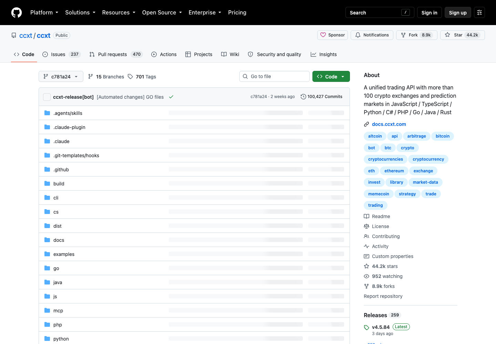 — `01-source-tree.png`
- 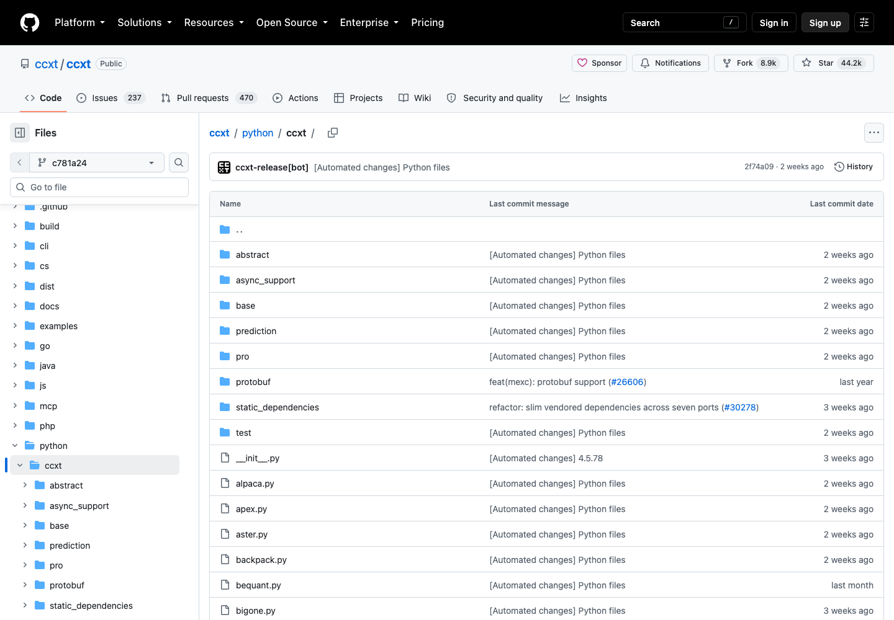 — `02-python-exchange-directory.png`
- 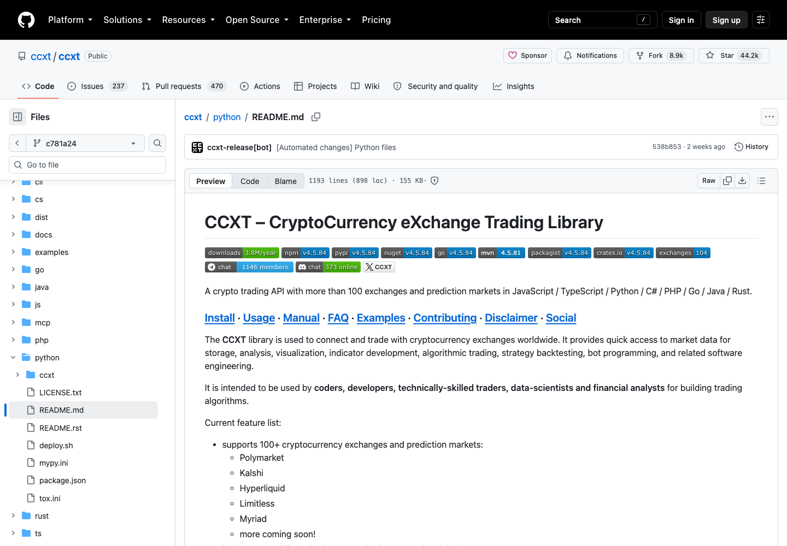 — `03-python-readme.png`
- 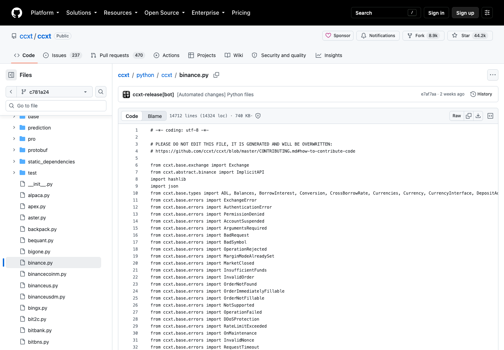 — `04-binance-adapter-top.png`
- 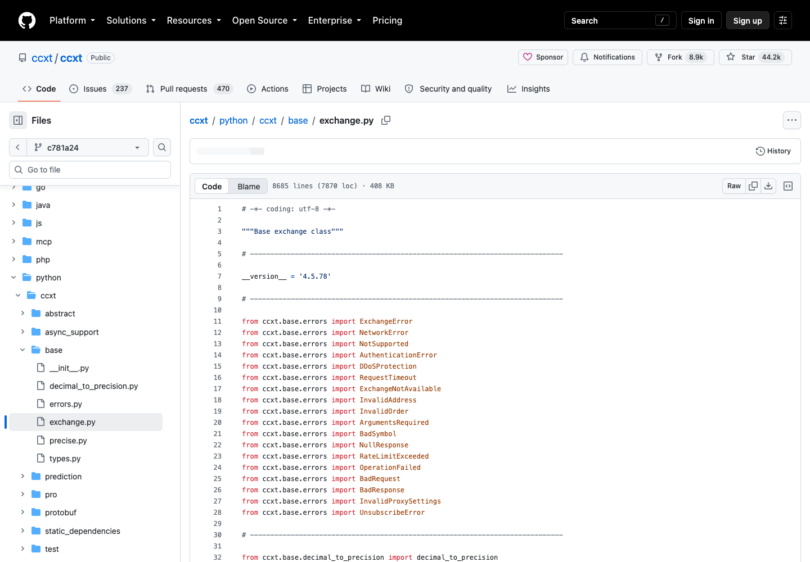 — `05-base-exchange.png`
- 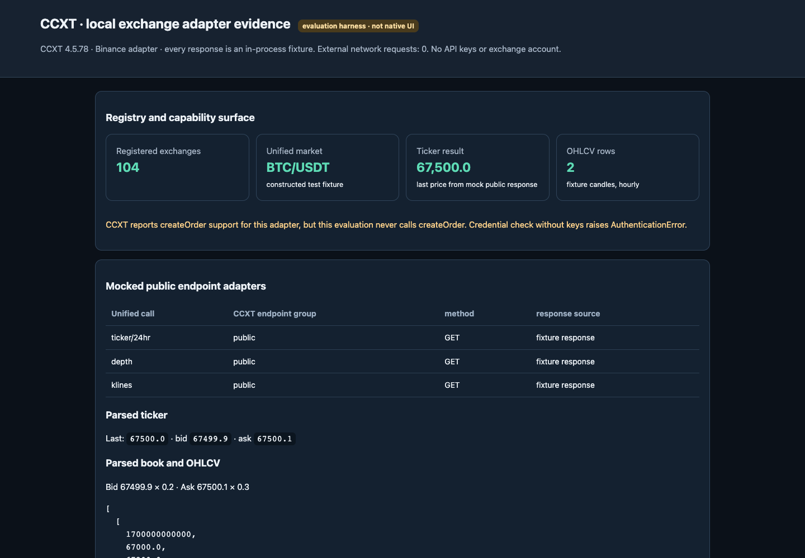 — `14-mock-response-output-0.png`
- 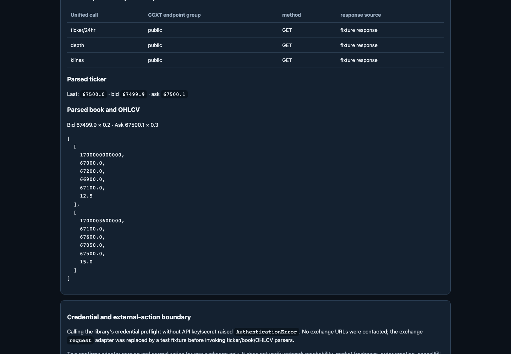 — `15-mock-response-output-520.png`
- 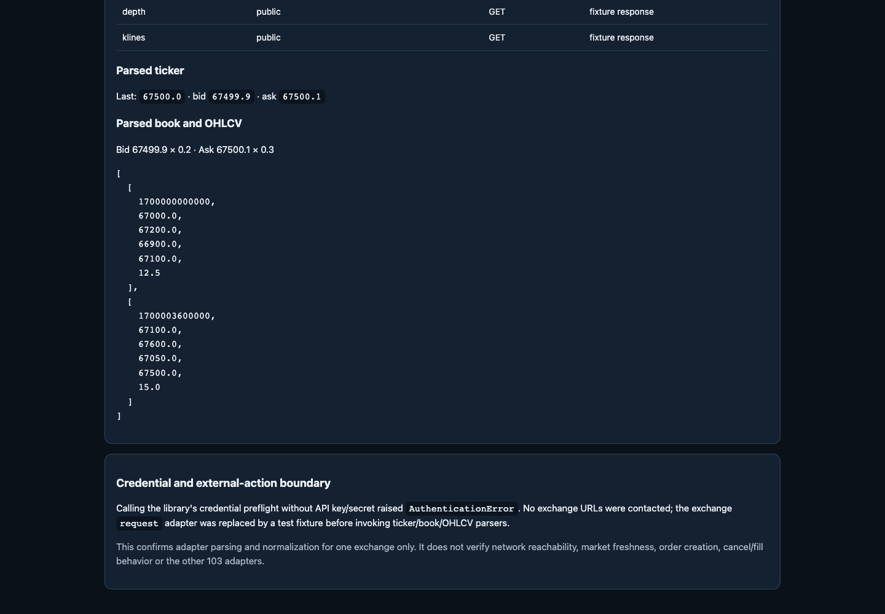 — `16-mock-response-output-1040.png`
- 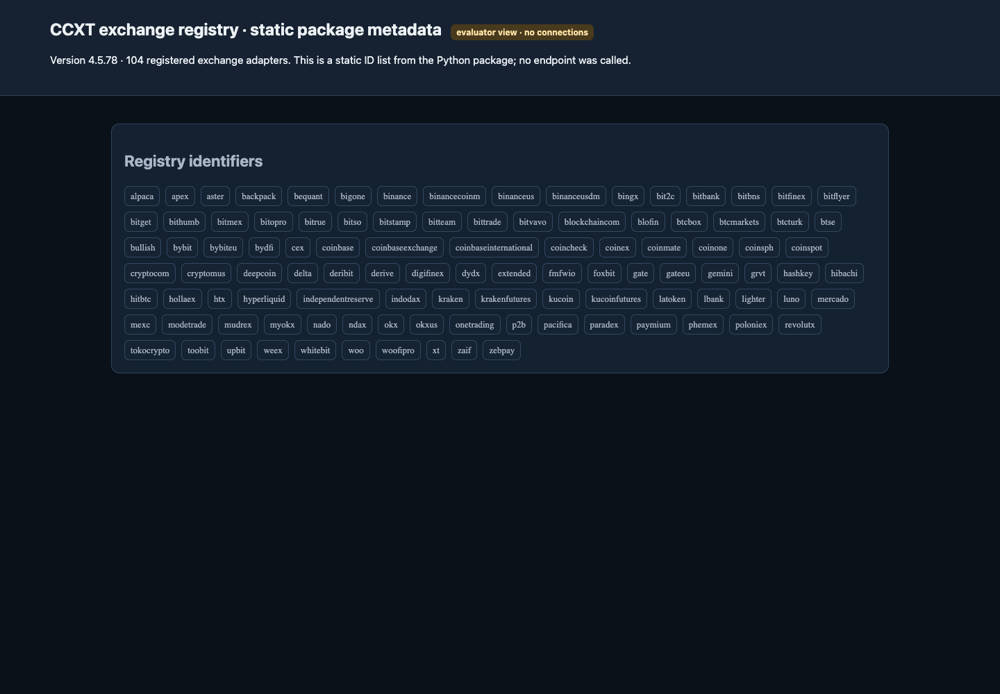 — `17-exchange-registry-top.png`
- 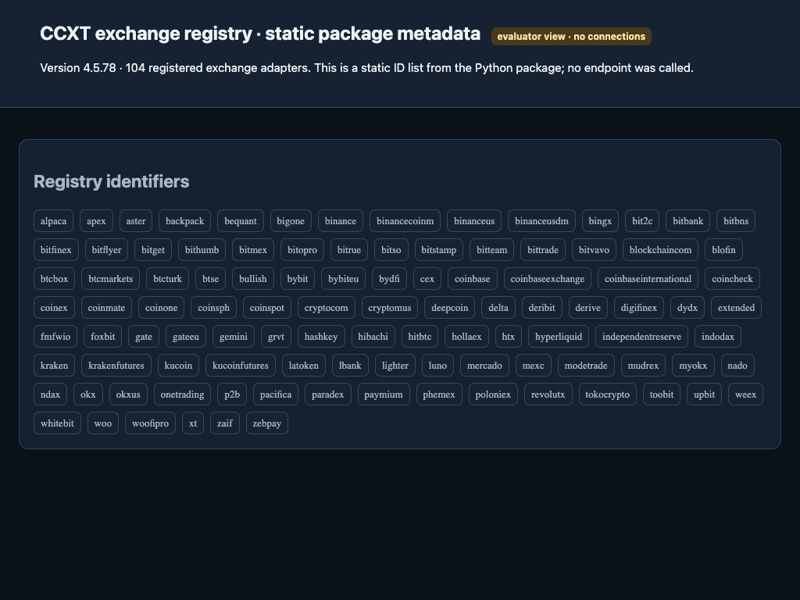 — `18-exchange-registry-middle.png`
- 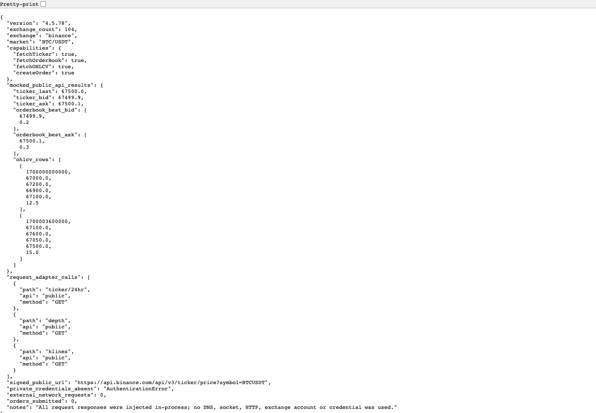 — `19-mocked-api-results-json.png`
