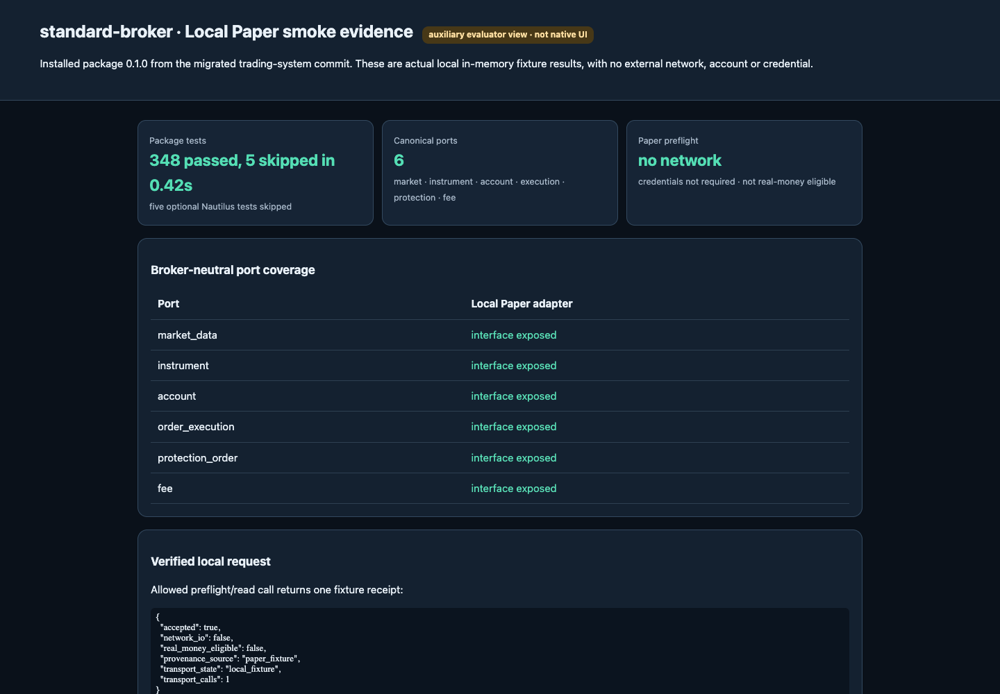
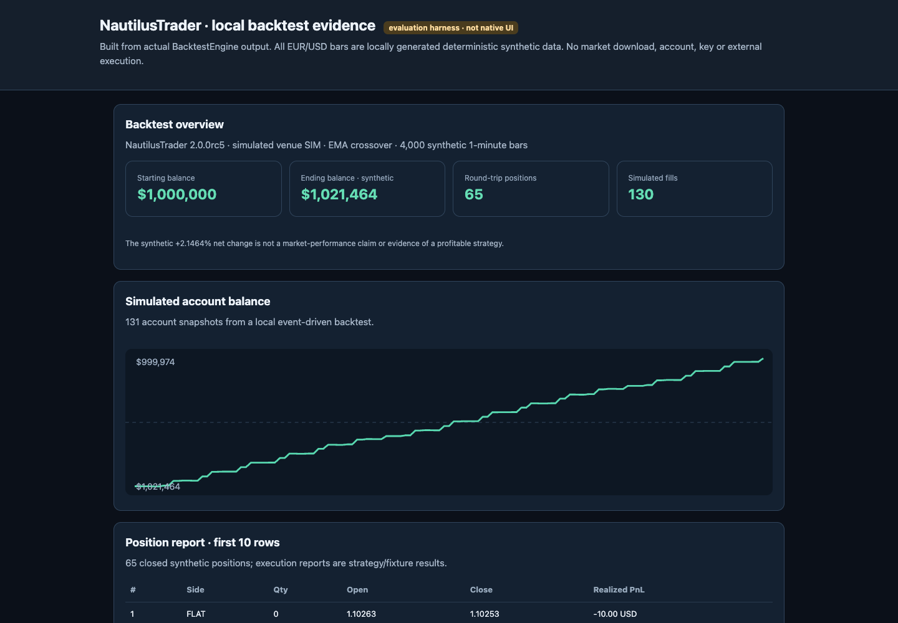
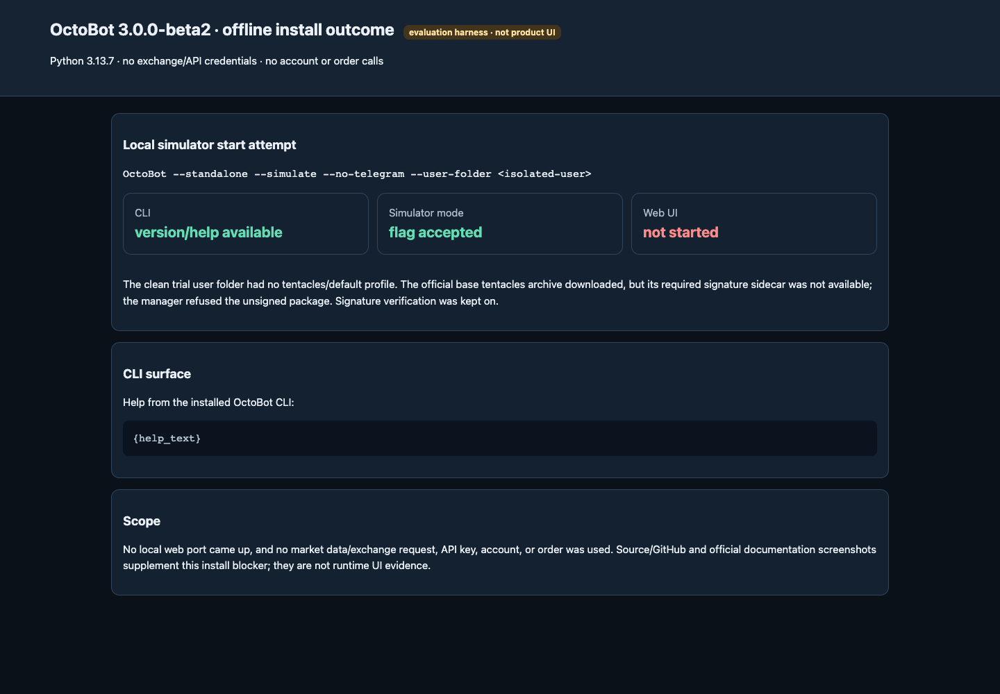

<!-- 本文件由 scripts/render-hub.py 生成，请改 evaluations/assessments/*.json 后重跑 -->
# Trading Infra · 评测

**目标：** 回测→风控→执行的骨架可靠，组件可以单独替换。

**环节：** 6 回测、7 策略管理、8 风控、9 执行与券商

[评测框架](../FRAMEWORK.md) · [Pipeline 总览](../README.md) · [返回目录](../../README.md)

评级：✅ 做到 · 🟡 部分 · ❌ 未做到 · ⬜ 未验证 · — 不适用。分数 = Σ(权重 × 评级值) ÷ Σ适用权重 × 100；已验证 = 做到、部分、未做到三种评级占适用权重的比例。环节：● 实测跑通 · ◐ 源码可见未实测 · ○ 无 · · 不在其角色内。

## 评判标准

| 标准 | 权重 | 怎么判 |
|---|---:|---|
| I1 回测引擎正确 | 20 | 事件顺序、费用与滑点模型、报告完整；合成数据可复现。 |
| I2 执行接口 | 25 | paper、testnet、live 分层；订单类型；成交、持仓、资金回读与对账。 |
| I3 风控钩子 | 15 | 下单前检查可插入；失败即关闭（fail-closed），不会默认放行。 |
| I4 解耦可替换 | 20 | 数据源、策略、券商适配器边界清晰，能单独换掉。 |
| I5 稳定与测试 | 20 | 测试套件、错误态、版本稳定性。 |

## 排名

| 排名 | 产品 | 分数 | 已验证 | 1 获取 | 2 清洗 | 3 存档 | 4 指标 | 5 策略 | 6 回测 | 7 管理 | 8 风控 | 9 执行 | 10 看板 | 实测 | 卡片 |
|---:|---|---:|---:|:--: | :--: | :--: | :--: | :--: | :--: | :--: | :--: | :--: | :--:|---|---|
| 1 | [standard-broker](https://github.com/zinan92/standard-broker) | **75** | 100% | ◐ | · | · | · | · | · | · | ◐ | ◐ | · | 🟡 六个 canonical port、Paper preflight 与 capability-gap 阻断在本地实测成立；InMemory fixture 只返回 accepted 回执，不撮合、不成交、不改余额。 | [卡片](README.md#standard-broker) |
| 2 | [vectorbt](https://github.com/polakowo/vectorbt) | **67** | 100% | · | · | · | ● | ● | ● | ○ | ○ | ○ | ○ | 🟡 两资产各 1,200 根合成小时线经 Portfolio.from_signals 得到 33 条交易记录、完整统计与 Plotly 图；但按声明依赖新装解析到 Plotly 7.1.0 时 import vectorbt 失败，锁到 6.3.0 才可用。 | [卡片](README.md#vectorbt) |
| 3 | [NautilusTrader](https://github.com/nautechsystems/nautilus_trader) | **42** | 85% | ◐ | · | ◐ | ● | ● | ● | ◐ | ◐ | ◐ | ○ | 🟡 本地 SIM 回测跑通：官方 10,000 bar quickstart 退出码 0，自建 4,000 bar EMA 回测产出 65 个仓位、130 笔模拟成交；实盘一侧的券商适配器、Testnet/Live 与费用/滑点模型未测。 | [卡片](README.md#nautilus-trader) |
| 4 | [CCXT](https://github.com/ccxt/ccxt) | **31** | 62% | ◐ | ● | · | · | · | · | · | ○ | ◐ | ○ | 🟡 104 个交易所适配器可枚举，Binance 的 fetch_ticker/fetch_order_book/fetch_ohlcv 在进程内 fixture 下统一解析通过；0 次网络请求、0 次下单，真实交易所路径未验。 | [卡片](README.md#ccxt) |
| 5 | [OctoBot](https://github.com/Drakkar-Software/OctoBot) | **10** | 40% | ◐ | ○ | ○ | ○ | ◐ | ◐ | ○ | ○ | ◐ | ◐ | ❌ 3.0.0-beta2 安装与 CLI 可用，但干净的 simulator 启动因官方 tentacles 包缺少 .signature（HTTP 404）被拒绝安装，默认 profile 缺失，Web UI 未启动，任何交易流程都没跑通。 | [卡片](README.md#octobot) |

## 分类说明

- **trading-system** 目录归本类，按 Full Trading System / Agent 标准评测，见 [trading-system](../full-trading-system/README.md#trading-system)。

## 产品卡片

### 1. standard-broker · 75/100 · 已验证 100%

| 1 获取 | 2 清洗 | 3 存档 | 4 指标 | 5 策略 | 6 回测 | 7 管理 | 8 风控 | 9 执行 | 10 看板 |
| :--: | :--: | :--: | :--: | :--: | :--: | :--: | :--: | :--: | :--: |
| ◐ | · | · | · | · | · | · | ◐ | ◐ | · |

**声称：** 为 Park 交易系统提供 provider-neutral 的 broker 端口与适配边界，把 Paper、Testnet、Live 分层隔开。

**实测：** 🟡 六个 canonical port、Paper preflight 与 capability-gap 阻断在本地实测成立；InMemory fixture 只返回 accepted 回执，不撮合、不成交、不改余额。

| 标准 | 权重 | 评级 | 证据 |
|---|---:|:--:|---|
| I1 回测引擎正确 | 20 | — | broker 契约与适配包，不含回测引擎。 |
| I2 执行接口 | 25 | 🟡 | Paper preflight 返回 network_io=false、real_money_eligible=false、credential_required=false，一次本地请求被 accepted（transport_calls=1）；InMemoryPaperTransport 不撮合、不成交、不更新持仓，Testnet/Live 未测。 [图1](2026-09-28/01-standard-broker/images/19-local-paper-contract-output.png) [图2](2026-09-28/01-standard-broker/images/06-paper-adapter.png) [图3](2026-09-28/01-standard-broker/images/04-broker-context.png) |
| I3 风控钩子 | 15 | 🟡 | 未授予能力的 order_execution.submit 返回 capability_gap 且 transport 调用数保持 1；给 Paper 身份附 signer 或换 Testnet 身份在构造时即被拒绝。fail-closed 成立，但仓位/敞口类可插拔风控钩子未见。 [图1](2026-09-28/01-standard-broker/images/19-local-paper-contract-output.png) [图2](2026-09-28/01-standard-broker/images/08-capability-contract.png) [图3](2026-09-28/01-standard-broker/images/17-host-contract-tests.png) |
| I4 解耦可替换 | 20 | ✅ | 运行时枚举出 market_data、instrument、account、order_execution、protection_order、fee 六个 port，PaperBrokerAdapter 按 port 构造；external_host 与 Hyperliquid profile 在源码中是独立适配边界。 [图1](2026-09-28/01-standard-broker/images/07-canonical-ports.png) [图2](2026-09-28/01-standard-broker/images/14-external-host.png) [图3](2026-09-28/01-standard-broker/images/15-hyperliquid-profile.png) |
| I5 稳定与测试 | 20 | ✅ | 包级测试 348 passed、5 skipped，0.42s，退出码 0；0.1.0 wheel 在 Python 3.13.7 隔离环境安装导入无需密钥。跳过的 5 项依赖未安装的 nautilus_trader extra。 [图1](2026-09-28/01-standard-broker/images/16-paper-tests.png) [图2](2026-09-28/01-standard-broker/images/17-host-contract-tests.png) [图3](2026-09-28/01-standard-broker/images/18-testnet-fixture-lifecycle-tests.png) |

**适合：** 在 Park 系统内充当 broker 接口契约与 Paper/Testnet/Live 边界的适配层。  
**不适合：** 需要真实撮合、成交与资金对账的 Paper 模拟，或任何独立回测。

**未验证：** Hyperliquid 外部适配器与 Testnet/Live 生命周期（proof script 未运行）；5 项依赖 nautilus_trader extra 的可选测试（extra 未安装）；撮合、成交、手续费与持仓更新（fixture 只回 accepted 回执）  
**下一步：** 装上 nautilus_trader extra 跑完 5 项可选测试，再用 Hyperliquid Testnet 走一次下单→成交→持仓回读。

证据：[19 张截图](2026-09-28/01-standard-broker/screenshots.md) · [实测记录](2026-09-28/01-standard-broker/findings.md) · 实测版本 `bbdcf9005cbf` · 目录锁 `owned source` · Python 库

备注：上游 zinan92/standard-broker 已于 2026-09-27 归档，代码迁入 zinan92/trading-system 的 packages/standard-broker；本卡按迁移后的包（0.1.0，monorepo 提交 bbdcf900）评测，截图 01–18 为锁定提交的源码页，19 为本地 fixture 输出的辅助页。

### 2. vectorbt · 67/100 · 已验证 100%

| 1 获取 | 2 清洗 | 3 存档 | 4 指标 | 5 策略 | 6 回测 | 7 管理 | 8 风控 | 9 执行 | 10 看板 |
| :--: | :--: | :--: | :--: | :--: | :--: | :--: | :--: | :--: | :--: |
| · | · | · | ● | ● | ● | ○ | ○ | ○ | ○ |

**声称：** 向量化回测引擎，让你在别人跑完一个想法之前跑完上千个交易想法。

**实测：** 🟡 两资产各 1,200 根合成小时线经 Portfolio.from_signals 得到 33 条交易记录、完整统计与 Plotly 图；但按声明依赖新装解析到 Plotly 7.1.0 时 import vectorbt 失败，锁到 6.3.0 才可用。

| 标准 | 权重 | 评级 | 证据 |
|---|---:|:--:|---|
| I1 回测引擎正确 | 20 | ✅ | seed 3406 的合成小时线，费率 0.1%、滑点 0.05%：SYN_A 付费 409.09、21 笔交易（20 笔平仓），SYN_B 付费 306.47、12 笔，共 33 条交易记录，收益/回撤/Sharpe 等统计齐全且可复现。 [图1](2026-09-28/04-vectorbt/images/19-portfolio.png) [图2](2026-09-28/04-vectorbt/images/20-portfolio-syn-b.png) [图3](2026-09-28/04-vectorbt/images/21-evaluator-summary.png) |
| I2 执行接口 | 25 | — | 纯回测/研究引擎，不提供 broker 或执行接口。 |
| I3 风控钩子 | 15 | — | 没有下单路径，风控钩子不在其角色内。 |
| I4 解耦可替换 | 20 | 🟡 | 数据由调用方以 Pandas/Numpy 数组传入，指标工厂、信号工厂与 Portfolio 是独立 API，本轮自建数据加 MA(12/36) 信号即可接入；没有券商或数据源适配层可替换。 [图1](2026-09-28/04-vectorbt/images/04-portfolio-api.png) [图2](2026-09-28/04-vectorbt/images/09-indicator-factory.png) [图3](2026-09-28/04-vectorbt/images/10-signal-factory.png) |
| I5 稳定与测试 | 20 | 🟡 | pyproject 只写 plotly>=4.12.0，解析到 7.1.0 时 import 因 scattermapbox 模板属性失败，锁 6.3.0 后 uv pip check 通过；多列 Portfolio 的 plot()/stats() 需显式 column 或 group_by，上游测试套件未跑。 [图1](2026-09-28/04-vectorbt/images/21-evaluator-summary.png) [图2](2026-09-28/04-vectorbt/images/02-tests-tree.png) [图3](2026-09-28/04-vectorbt/images/13-test-portfolio.png) |

**适合：** 快速扫参数与多资产组合的向量化策略研究。  
**不适合：** 需要事件级撮合、券商执行或风控钩子的生产链路。

**未验证：** 上游完整测试套件；Rust optional extra；与参考实现的数值对照（本轮只证明管线跑通）；Plotly 7.x 兼容修复  
**下一步：** 用同一组合成信号在 Nautilus 或参考实现上对照成交与 PnL，确认数值一致，并向上游提 Plotly 上限。

证据：[21 张截图](2026-09-28/04-vectorbt/screenshots.md) · [实测记录](2026-09-28/04-vectorbt/findings.md) · 实测版本 `34b6d5935e3e` · 目录锁 `34b6d5935e3e` · Python 库

备注：源码版本 1.1.0，Python 3.13.7、numpy 2.5.3、pandas 3.0.6。记录建议改归 Trading Strategy：它评估策略与组合，不提供 broker/行情连接。 首轮曾建议归 Trading Strategy；本框架把回测引擎放在 Trading Infra 的第 6 环，故不改建议。

### 3. NautilusTrader · 42/100 · 已验证 85%

| 1 获取 | 2 清洗 | 3 存档 | 4 指标 | 5 策略 | 6 回测 | 7 管理 | 8 风控 | 9 执行 | 10 看板 |
| :--: | :--: | :--: | :--: | :--: | :--: | :--: | :--: | :--: | :--: |
| ◐ | · | ◐ | ● | ● | ● | ◐ | ◐ | ◐ | ○ |

**声称：** 生产级 Rust 原生、确定性事件驱动的交易引擎，同一套策略代码既能回测也能实盘。

**实测：** 🟡 本地 SIM 回测跑通：官方 10,000 bar quickstart 退出码 0，自建 4,000 bar EMA 回测产出 65 个仓位、130 笔模拟成交；实盘一侧的券商适配器、Testnet/Live 与费用/滑点模型未测。

| 标准 | 权重 | 评级 | 证据 |
|---|---:|:--:|---|
| I1 回测引擎正确 | 20 | 🟡 | 10,000 bar 官方 quickstart 与 4,000 bar EMA(10/20) 回测在 SIM venue 上确定性复现，产出账户/持仓/成交三份报告（65 个平仓、130 笔 fill、期末 1,021,464 USD）；样例没有显式费用/滑点模型。 [图1](2026-09-28/02-nautilus-trader/images/19-local-overview.png) [图2](2026-09-28/02-nautilus-trader/images/22-local-fills.png) [图3](2026-09-28/02-nautilus-trader/images/10-fill-models.png) |
| I2 执行接口 | 25 | 🟡 | SIM venue 生成 130 笔模拟 fill，账户余额、持仓、成交报告可回读；没有连接任何券商适配器、账户、Testnet 或 Live，paper→live 分层未实测。 [图1](2026-09-28/02-nautilus-trader/images/20-local-account.png) [图2](2026-09-28/02-nautilus-trader/images/21-local-positions.png) [图3](2026-09-28/02-nautilus-trader/images/12-trade-execution.png) |
| I3 风控钩子 | 15 | ⬜ | 本轮没有配置或触发任何下单前风控检查；记录里只有事件驱动回放流程的文档截图，没有风控行为观察。 [图1](2026-09-28/02-nautilus-trader/images/09-backtest-execution-flow.png) |
| I4 解耦可替换 | 20 | 🟡 | 评测方自建的 4,000 bar 合成数据与 EMA 策略直接接入 BacktestEngine 和 SIM venue，数据/策略/venue 边界在实测中成立；券商与数据源适配器只源码可见，未替换。 [图1](2026-09-28/02-nautilus-trader/images/06-low-level-backtest-guide.png) [图2](2026-09-28/02-nautilus-trader/images/08-backtest-data-and-venues.png) [图3](2026-09-28/02-nautilus-trader/images/13-backtest-python-api.png) |
| I5 稳定与测试 | 20 | 🟡 | 2.0.0rc5 预编译 wheel 在 Python 3.13 arm64 安装并导入 Rust 核心成功，quickstart 退出码 0 但耗时约 151 秒；仍是预发布版，2.x 与 1.x API 不兼容，全量测试套件未跑。 [图1](2026-09-28/02-nautilus-trader/images/16-official-install-docs.png) [图2](2026-09-28/02-nautilus-trader/images/04-python-package-metadata.png) [图3](2026-09-28/02-nautilus-trader/images/14-backtest-engine-surface-tests.png) |

**适合：** 需要确定性事件驱动回测与模拟撮合、能接受 2.x 预发布 API 的团队。  
**不适合：** 只想快速扫参数的轻量研究，或期待开箱即有券商/Testnet 接入的用户。

**未验证：** 真实行情导入与 data catalog 工作流；券商适配器、账户与 Testnet/Live 生命周期；费用与滑点 FillModel 对结果的影响；全量仓库测试套件；从锁定 SHA 源码构建（本机无 Rust 工具链）  
**下一步：** 给同一 4,000 bar 样例加显式手续费/滑点模型对比报告，再接一个 sandbox 券商适配器走一次 paper 闭环。

证据：[22 张截图](2026-09-28/02-nautilus-trader/screenshots.md) · [实测记录](2026-09-28/02-nautilus-trader/findings.md) · 实测版本 `23cb3035dff7` · 目录锁 `23cb3035dff7` · Python 库

备注：使用与锁定源码 pyproject 版本一致的 2.0.0rc5 PyPI wheel，未从 Git 提交编译。截图 19–22 为评测 harness 展示的真实 BacktestEngine 报告，不是产品自带 UI。

### 4. CCXT · 31/100 · 已验证 62%

| 1 获取 | 2 清洗 | 3 存档 | 4 指标 | 5 策略 | 6 回测 | 7 管理 | 8 风控 | 9 执行 | 10 看板 |
| :--: | :--: | :--: | :--: | :--: | :--: | :--: | :--: | :--: | :--: |
| ◐ | ● | · | · | · | · | · | ○ | ◐ | ○ |

**声称：** 覆盖 100 多家加密交易所与预测市场的统一交易 API，JavaScript/Python/C#/PHP/Go/Java/Rust 多语言可用。

**实测：** 🟡 104 个交易所适配器可枚举，Binance 的 fetch_ticker/fetch_order_book/fetch_ohlcv 在进程内 fixture 下统一解析通过；0 次网络请求、0 次下单，真实交易所路径未验。

| 标准 | 权重 | 评级 | 证据 |
|---|---:|:--:|---|
| I1 回测引擎正确 | 20 | — | API client 库，不含回测引擎。 |
| I2 执行接口 | 25 | ⬜ | 无密钥、无网络：只看到 binance 声明 createOrder=True 的能力元数据，以及缺 key 时 check_required_credentials 抛 AuthenticationError；下单、成交/持仓/资金回读与 sandbox 分层均未调用。 [图1](2026-09-28/05-ccxt/images/19-mocked-api-results-json.png) |
| I3 风控钩子 | 15 | — | 统一 API client，不承担下单前风控。 |
| I4 解耦可替换 | 20 | 🟡 | 104 个 exchange ID 共用同一 Exchange 基类，binance 实例的 request 被进程内函数替换后 fetch_ticker/fetch_order_book/fetch_ohlcv 仍走统一 parse（last 67500、两根 OHLCV）；只测了一个适配器。 [图1](2026-09-28/05-ccxt/images/17-exchange-registry-top.png) [图2](2026-09-28/05-ccxt/images/05-base-exchange.png) [图3](2026-09-28/05-ccxt/images/19-mocked-api-results-json.png) |
| I5 稳定与测试 | 20 | 🟡 | ccxt==4.5.78 在 Python 3.13.7 隔离环境安装，uv pip check 通过，缺密钥时明确抛 AuthenticationError 而非静默；上游测试套件未跑，限流与网络错误态未测。 [图1](2026-09-28/05-ccxt/images/03-python-readme.png) [图2](2026-09-28/05-ccxt/images/14-mock-response-output-0.png) |

**适合：** 统一多交易所请求/响应形态的 client 层，自备密钥与网络后逐所验收。  
**不适合：** 期望它保证行情新鲜度、限流或订单语义的场景。

**未验证：** 真实交易所网络、时效与限流；下单、撤单与成交/持仓/资金回读；sandbox/testnet 与 live 分层；除 binance 外的 103 个适配器；上游测试套件  
**下一步：** 用 Binance testnet 密钥走一次 createOrder→fetchOrder→fetchBalance 回读。

证据：[11 张截图](2026-09-28/05-ccxt/screenshots.md) · [实测记录](2026-09-28/05-ccxt/findings.md) · 实测版本 `c781a2437d88` · 目录锁 `c781a2437d88` · Python 库 · 加密

备注：所有响应由进程内 fixture 注入，external_network_requests=0、orders_submitted=0；截图 14–19 为 fixture 结果与静态注册表页，不是原生 UI。

### 5. OctoBot · 10/100 · 已验证 40%

| 1 获取 | 2 清洗 | 3 存档 | 4 指标 | 5 策略 | 6 回测 | 7 管理 | 8 风控 | 9 执行 | 10 看板 |
| :--: | :--: | :--: | :--: | :--: | :--: | :--: | :--: | :--: | :--: |
| ◐ | ○ | ○ | ○ | ◐ | ◐ | ○ | ○ | ◐ | ◐ |

**声称：** 免费开源加密交易机器人，在 Binance、Hyperliquid 等 15+ 交易所自动执行 AI、Grid、DCA 与 TradingView 策略，带简单界面。

**实测：** ❌ 3.0.0-beta2 安装与 CLI 可用，但干净的 simulator 启动因官方 tentacles 包缺少 .signature（HTTP 404）被拒绝安装，默认 profile 缺失，Web UI 未启动，任何交易流程都没跑通。

| 标准 | 权重 | 评级 | 证据 |
|---|---:|:--:|---|
| I1 回测引擎正确 | 20 | ⬜ | 回测 runner 工厂只在源码可见；tentacles 未安装、UI 未启动，回测没有跑。 [图1](2026-09-28/06-octobot/images/10-backtesting-factory.png) |
| I2 执行接口 | 25 | ⬜ | simulator 与 15+ 交易所连接均未启动：exchange_api_calls=0、orders_submitted=0，没有配置任何密钥。 [图1](2026-09-28/06-octobot/images/05-default-config.png) |
| I3 风控钩子 | 15 | ⬜ | 程序未启动，未观察到任何下单前检查。 |
| I4 解耦可替换 | 20 | 🟡 | 策略、评估器与交易所连接以 tentacles 插件包外置，源码可见 commands.py 的模块安装路径；本轮插件包无法安装，替换能力未实测。 [图1](2026-09-28/06-octobot/images/07-commands.png) [图2](2026-09-28/06-octobot/images/03-octobot-module-tree.png) |
| I5 稳定与测试 | 20 | ❌ | 官方 tentacles ZIP（2,929,692 字节）下载后因 .signature 侧文件 404 被 SignatureVerificationError 拒绝，5001/18501 无监听；依赖需 --prerelease=allow 才能解析 starfish-protocol==3.0.0a29；未启用 ALLOW_UNSIGNED_TENTACLES。 [图1](2026-09-28/06-octobot/images/17-startup-failure.png) [图2](2026-09-28/06-octobot/images/15-cli-version.png) [图3](2026-09-28/06-octobot/images/16-cli-help.png) |

**适合：** 想试现成 DCA/Grid 加密机器人、且能接受 beta 与插件签名门槛的个人用户（待 tentacles 修复后再评）。  
**不适合：** 需要可复现干净部署，或想把它当可嵌入组件的团队。

**未验证：** 模拟成交与回测；DCA/Grid/TradingView 策略行为；Web UI 与 15+ 交易所连接器；Docker 部署路径（未启动）；Testnet/Live 执行  
**下一步：** 等官方 tentacles 包附上签名或改用稳定版 tag 后重跑 simulator 启动，验证 Web UI 与模拟成交。

证据：[17 张截图](2026-09-28/06-octobot/screenshots.md) · [实测记录](2026-09-28/06-octobot/findings.md) · 实测版本 `d63148e57627` · 目录锁 `dc0efc8ec36c` · Web 应用 · 加密

备注：记录中的实测提交 d63148e5 与目录锁 dc0efc8e 不一致，本卡以记录为准，需复核锁值。记录建议改归 Full Trading System：它是带 UI 与自动交易的整机，不是可复用的 Infra 组件。

## 原始证据

- [evaluations/trading-infra/2026-09-28](../../evaluations/trading-infra/2026-09-28/README.md)：该轮的实测记录、截图与首轮人工分，保留供复核。
