# FMZ Strategy Library screenshots

**20 distinct screenshots; 20 unique SHA-256 hashes.** Native product screenshots and auxiliary evaluation displays are identified in each entry.

-  — `02-20均线趋势突破量化交易策略-EMA-20-Breakout-Trend-Following-Q.png` ([source](https://github.com/fmzquant/strategies/blob/master/20%E5%9D%87%E7%BA%BF%E8%B6%8B%E5%8A%BF%E7%AA%81%E7%A0%B4%E9%87%8F%E5%8C%96%E4%BA%A4%E6%98%93%E7%AD%96%E7%95%A5-EMA-20-Breakout-Trend-Following-Quantitative-Trading-Strategy.md))
- 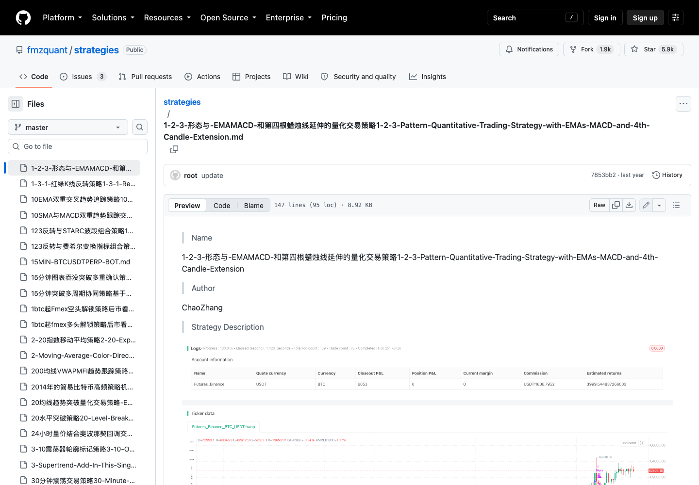 — `03-1-2-3-形态与-EMAMACD-和第四根蜡烛线延伸的量化交易策略1-2-3-Pattern-.png` ([source](https://github.com/fmzquant/strategies/blob/master/1-2-3-%E5%BD%A2%E6%80%81%E4%B8%8E-EMAMACD-%E5%92%8C%E7%AC%AC%E5%9B%9B%E6%A0%B9%E8%9C%A1%E7%83%9B%E7%BA%BF%E5%BB%B6%E4%BC%B8%E7%9A%84%E9%87%8F%E5%8C%96%E4%BA%A4%E6%98%93%E7%AD%96%E7%95%A51-2-3-Pattern-Quantitative-Trading-Strategy-with-EMAs-MACD-and-4th-Candle-Extension.md))
- 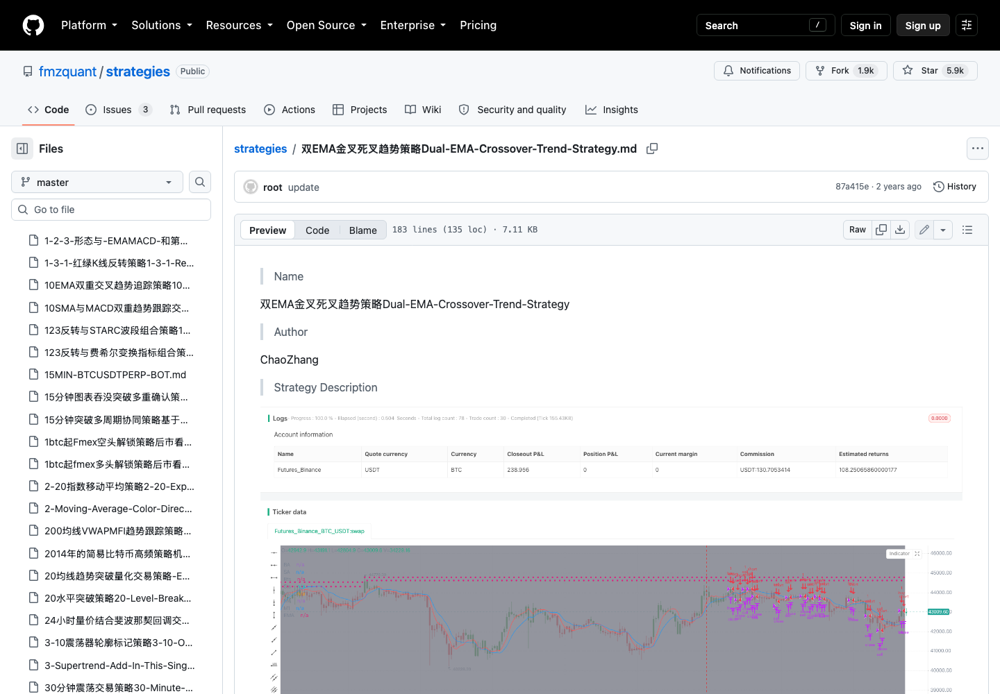 — `04-双EMA金叉死叉趋势策略Dual-EMA-Crossover-Trend-Strategy.png` ([source](https://github.com/fmzquant/strategies/blob/master/%E5%8F%8CEMA%E9%87%91%E5%8F%89%E6%AD%BB%E5%8F%89%E8%B6%8B%E5%8A%BF%E7%AD%96%E7%95%A5Dual-EMA-Crossover-Trend-Strategy.md))
- 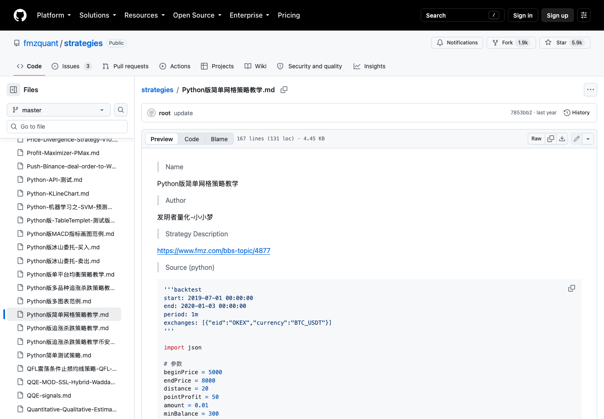 — `05-Python版简单网格策略教学.png` ([source](https://github.com/fmzquant/strategies/blob/master/Python%E7%89%88%E7%AE%80%E5%8D%95%E7%BD%91%E6%A0%BC%E7%AD%96%E7%95%A5%E6%95%99%E5%AD%A6.md))
- 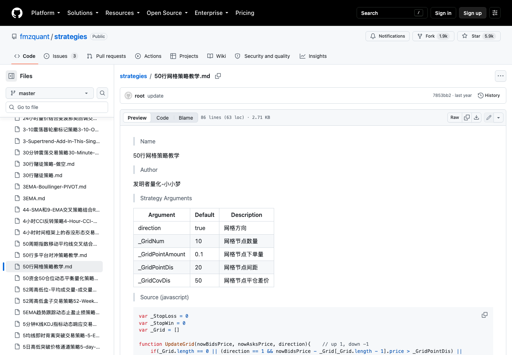 — `06-50行网格策略教学.png` ([source](https://github.com/fmzquant/strategies/blob/master/50%E8%A1%8C%E7%BD%91%E6%A0%BC%E7%AD%96%E7%95%A5%E6%95%99%E5%AD%A6.md))
- 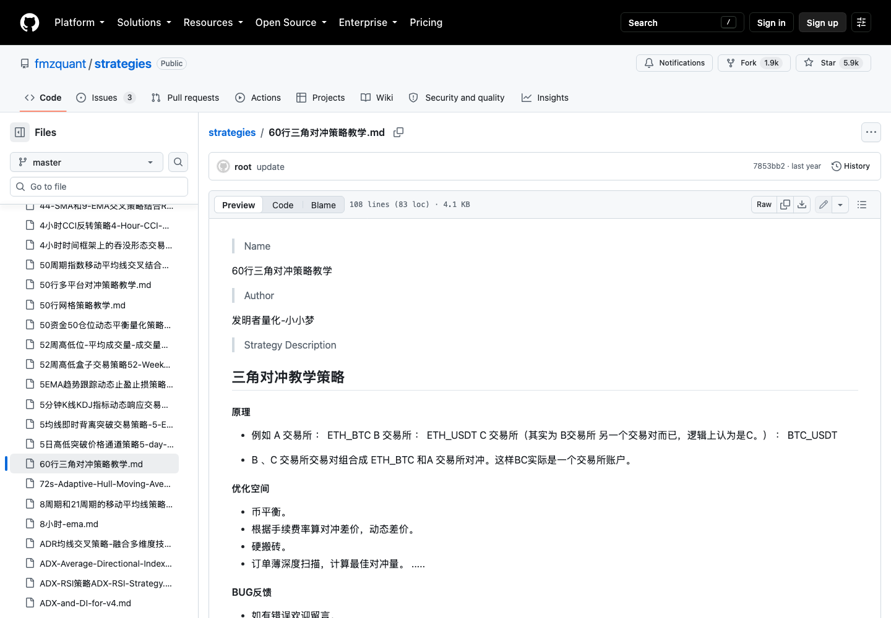 — `07-60行三角对冲策略教学.png` ([source](https://github.com/fmzquant/strategies/blob/master/60%E8%A1%8C%E4%B8%89%E8%A7%92%E5%AF%B9%E5%86%B2%E7%AD%96%E7%95%A5%E6%95%99%E5%AD%A6.md))
- 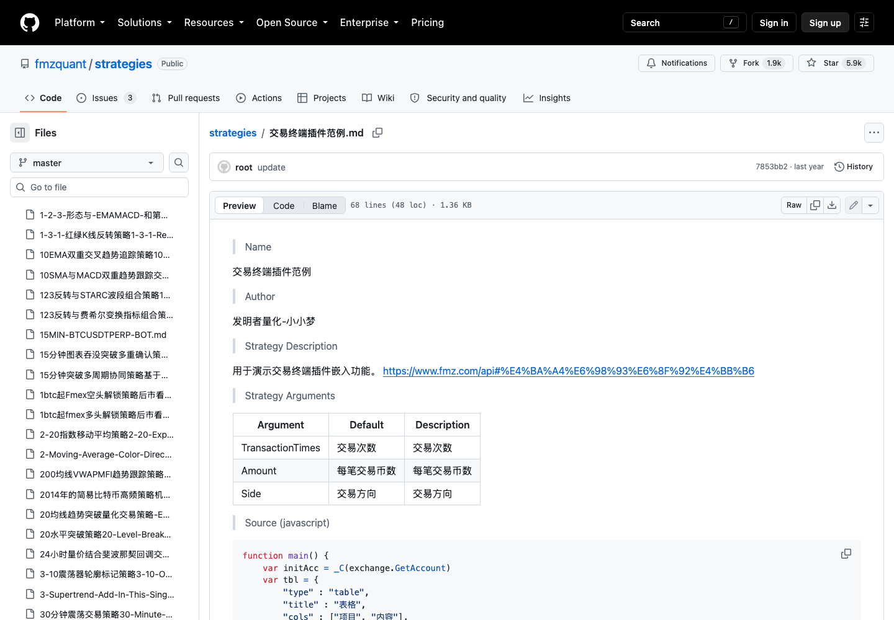 — `08-交易终端插件范例.png` ([source](https://github.com/fmzquant/strategies/blob/master/%E4%BA%A4%E6%98%93%E7%BB%88%E7%AB%AF%E6%8F%92%E4%BB%B6%E8%8C%83%E4%BE%8B.md))
- 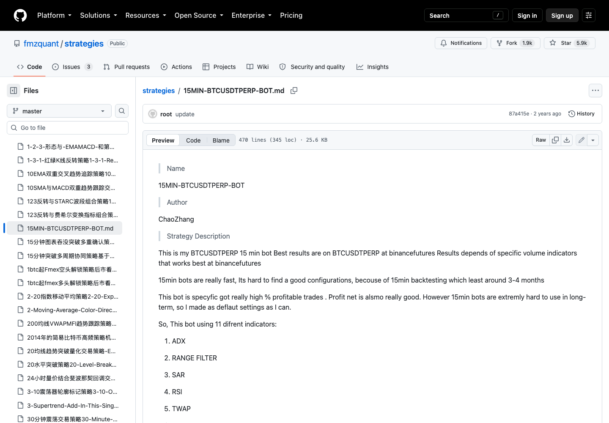 — `09-15MIN-BTCUSDTPERP-BOT.png` ([source](https://github.com/fmzquant/strategies/blob/master/15MIN-BTCUSDTPERP-BOT.md))
- 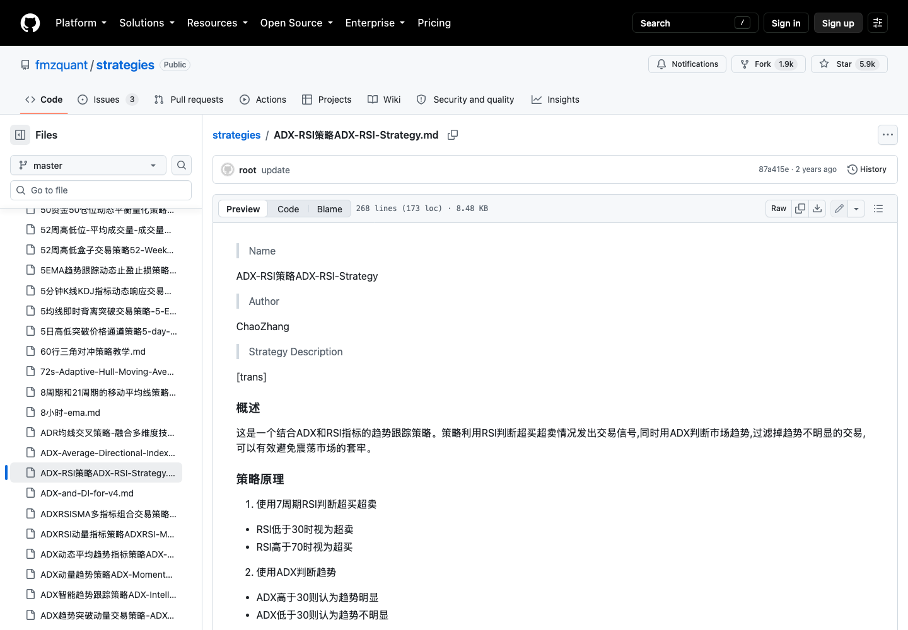 — `10-ADX-RSI策略ADX-RSI-Strategy.png` ([source](https://github.com/fmzquant/strategies/blob/master/ADX-RSI%E7%AD%96%E7%95%A5ADX-RSI-Strategy.md))
- 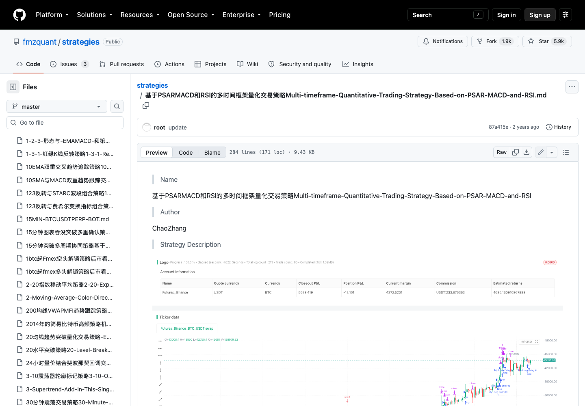 — `11-additional-11.png` ([source](https://github.com/fmzquant/strategies/blob/master/%E5%9F%BA%E4%BA%8EPSARMACD%E5%92%8CRSI%E7%9A%84%E5%A4%9A%E6%97%B6%E9%97%B4%E6%A1%86%E6%9E%B6%E9%87%8F%E5%8C%96%E4%BA%A4%E6%98%93%E7%AD%96%E7%95%A5Multi-timeframe-Quantitative-Trading-Strategy-Based-on-PSAR-MACD-and-RSI.md))
- 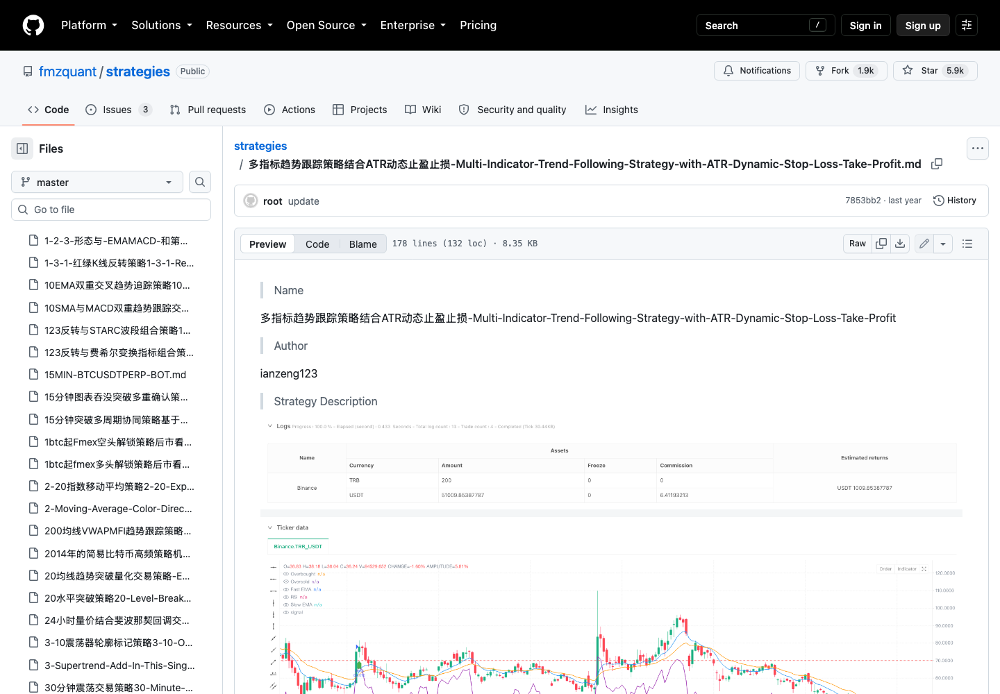 — `12-additional-12.png` ([source](https://github.com/fmzquant/strategies/blob/master/%E5%A4%9A%E6%8C%87%E6%A0%87%E8%B6%8B%E5%8A%BF%E8%B7%9F%E8%B8%AA%E7%AD%96%E7%95%A5%E7%BB%93%E5%90%88ATR%E5%8A%A8%E6%80%81%E6%AD%A2%E7%9B%88%E6%AD%A2%E6%8D%9F-Multi-Indicator-Trend-Following-Strategy-with-ATR-Dynamic-Stop-Loss-Take-Profit.md))
- 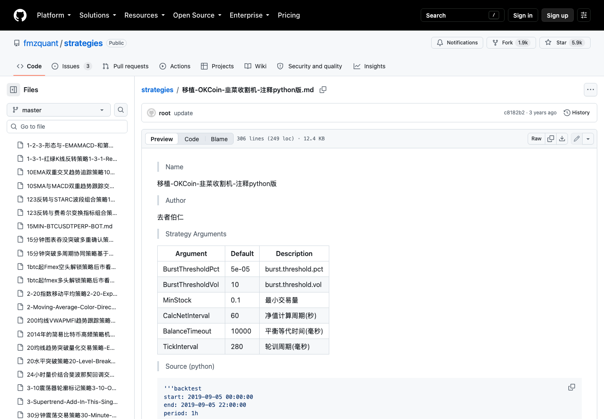 — `13-additional-13.png` ([source](https://github.com/fmzquant/strategies/blob/master/%E7%A7%BB%E6%A4%8D-OKCoin-%E9%9F%AD%E8%8F%9C%E6%94%B6%E5%89%B2%E6%9C%BA-%E6%B3%A8%E9%87%8Apython%E7%89%88.md))
- 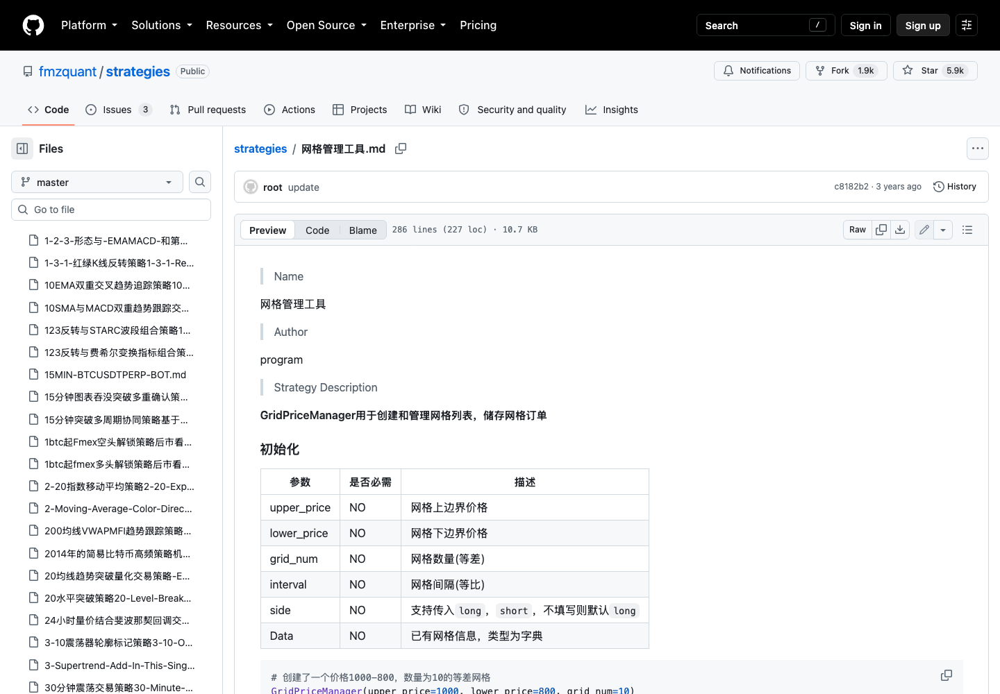 — `14-additional-14.png` ([source](https://github.com/fmzquant/strategies/blob/master/%E7%BD%91%E6%A0%BC%E7%AE%A1%E7%90%86%E5%B7%A5%E5%85%B7.md))
- 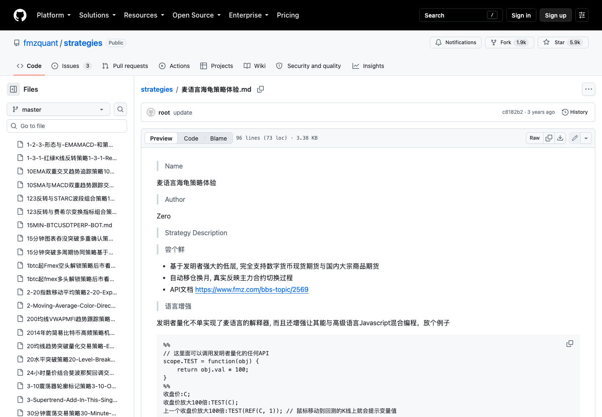 — `15-additional-15.png` ([source](https://github.com/fmzquant/strategies/blob/master/%E9%BA%A6%E8%AF%AD%E8%A8%80%E6%B5%B7%E9%BE%9F%E7%AD%96%E7%95%A5%E4%BD%93%E9%AA%8C.md))
- 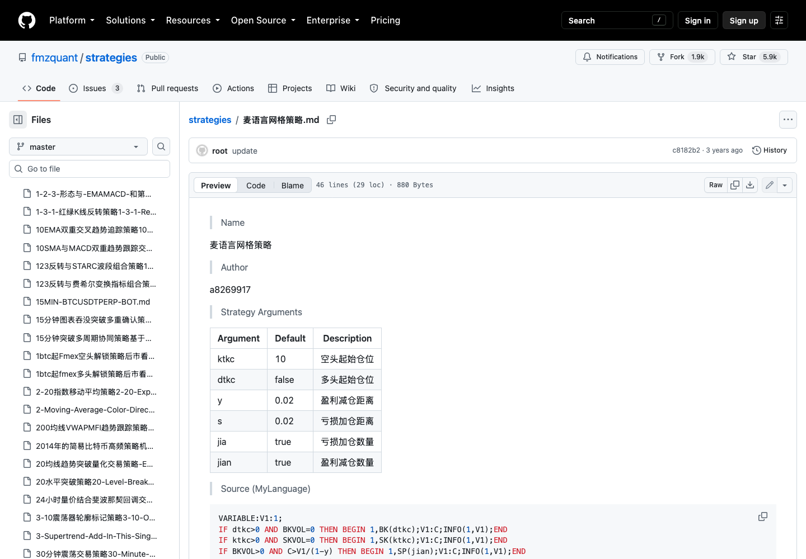 — `16-additional-16.png` ([source](https://github.com/fmzquant/strategies/blob/master/%E9%BA%A6%E8%AF%AD%E8%A8%80%E7%BD%91%E6%A0%BC%E7%AD%96%E7%95%A5.md))
- 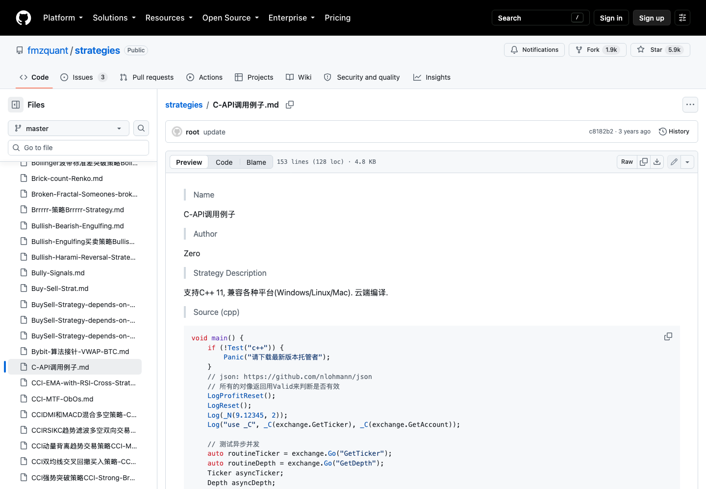 — `17-additional-17.png` ([source](https://github.com/fmzquant/strategies/blob/master/C-API%E8%B0%83%E7%94%A8%E4%BE%8B%E5%AD%90.md))
-  — `18-additional-18.png` ([source](https://github.com/fmzquant/strategies/blob/master/C%E6%9C%9F%E8%B4%A7%E9%AB%98%E9%A2%91%E5%A5%97%E5%B8%81%E7%AD%96%E7%95%A5OKEX-Websocket%E7%89%88.md))
- 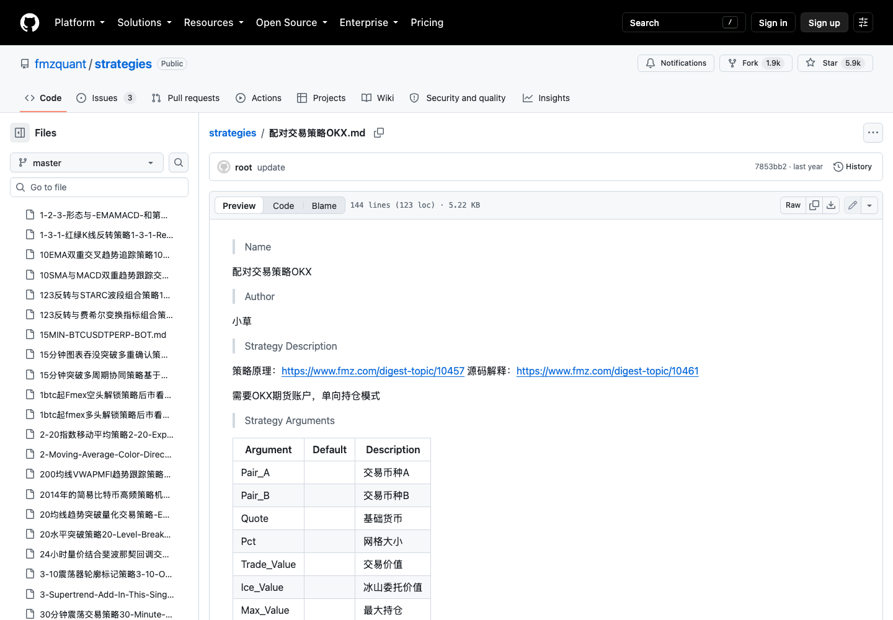 — `19-additional-19.png` ([source](https://github.com/fmzquant/strategies/blob/master/%E9%85%8D%E5%AF%B9%E4%BA%A4%E6%98%93%E7%AD%96%E7%95%A5OKX.md))
-  — `21-additional-21.png` ([source](https://www.fmz.com/strategy/489157))
- 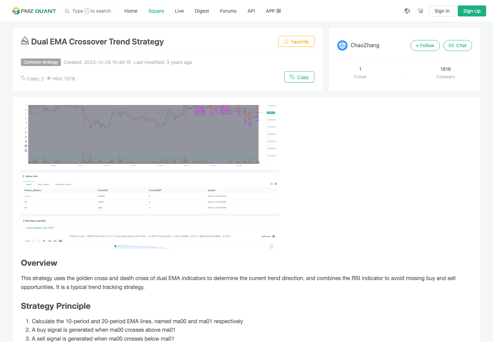 — `22-additional-22.png` ([source](https://www.fmz.com/strategy/437017))
