# WyckoffTradingAgent screenshots

**13 distinct screenshots; 13 unique SHA-256 hashes.** Native product screenshots and auxiliary evaluation displays are identified in each entry.

-  — `01-dashboard-overview-synthetic.png`
- 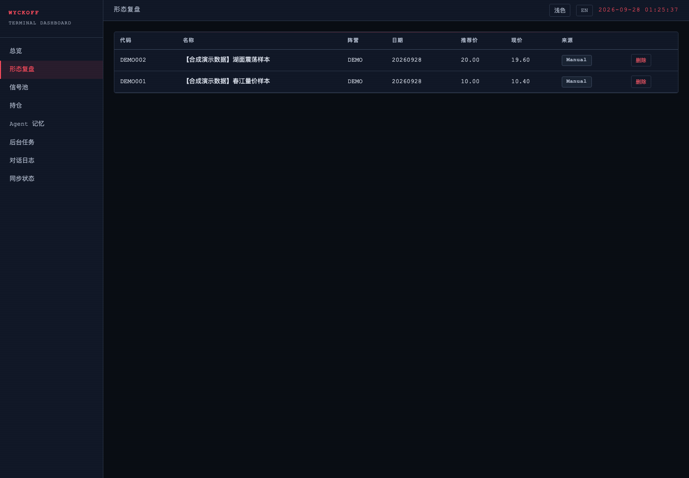 — `02-recommendations-synthetic-or-empty.png`
- 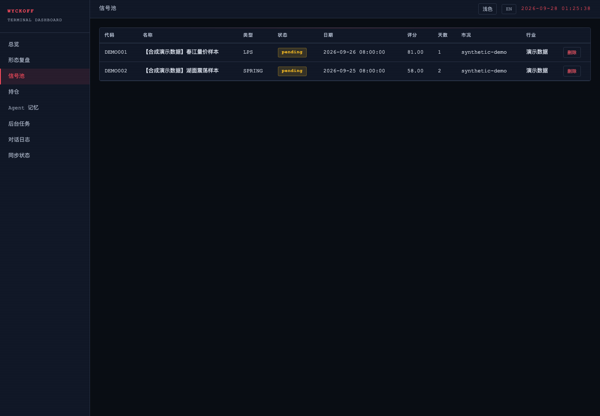 — `03-signals-synthetic-or-empty.png`
- 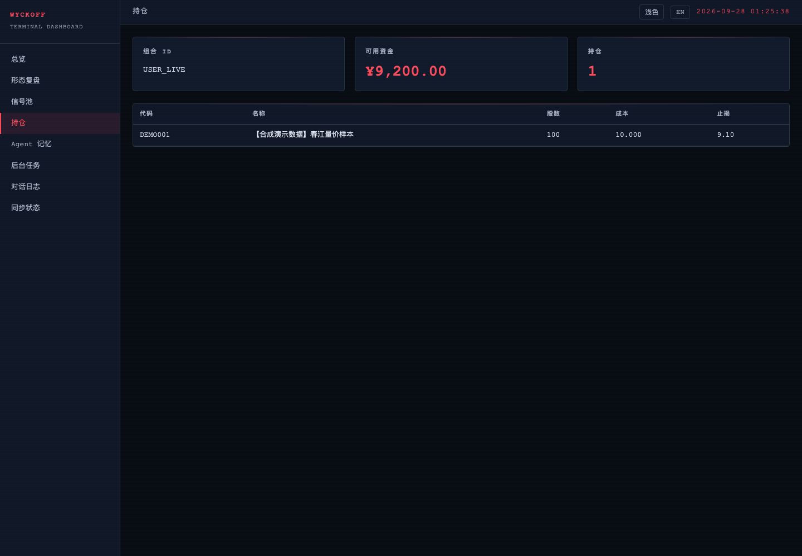 — `04-portfolio-synthetic-or-empty.png`
- 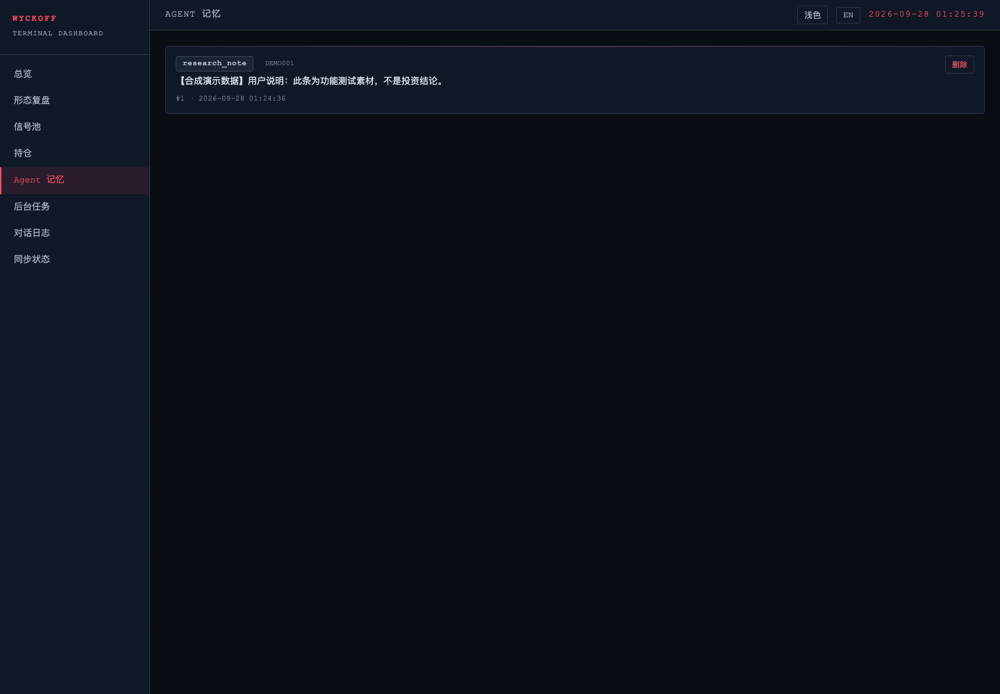 — `05-memory-synthetic-or-empty.png`
- 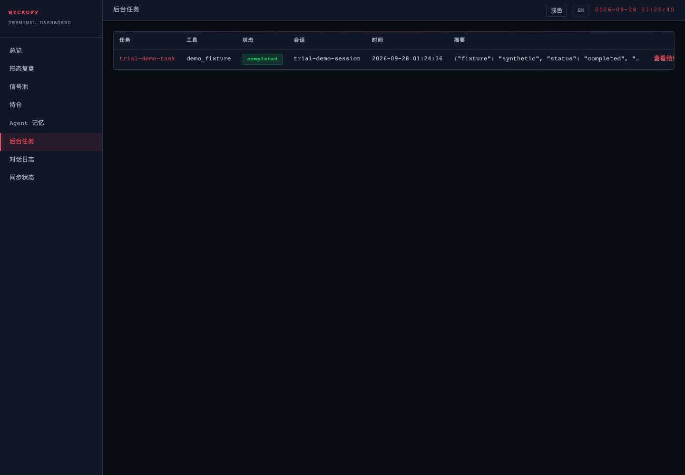 — `06-bgtasks-synthetic-or-empty.png`
- 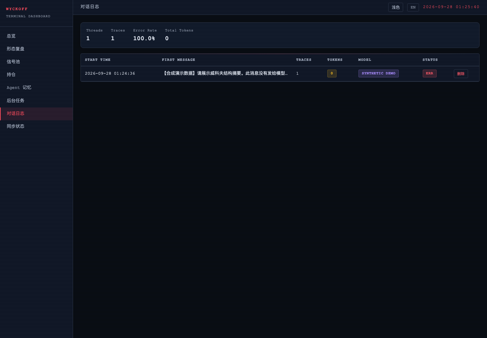 — `07-chatlog-synthetic-or-empty.png`
- 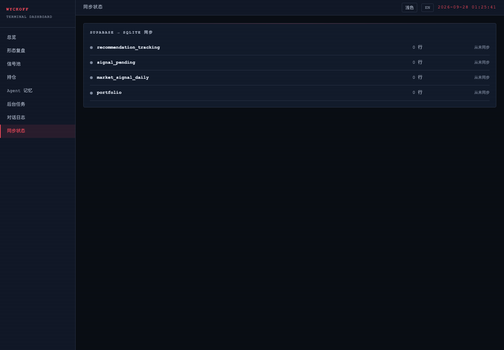 — `08-sync-synthetic-or-empty.png`
- 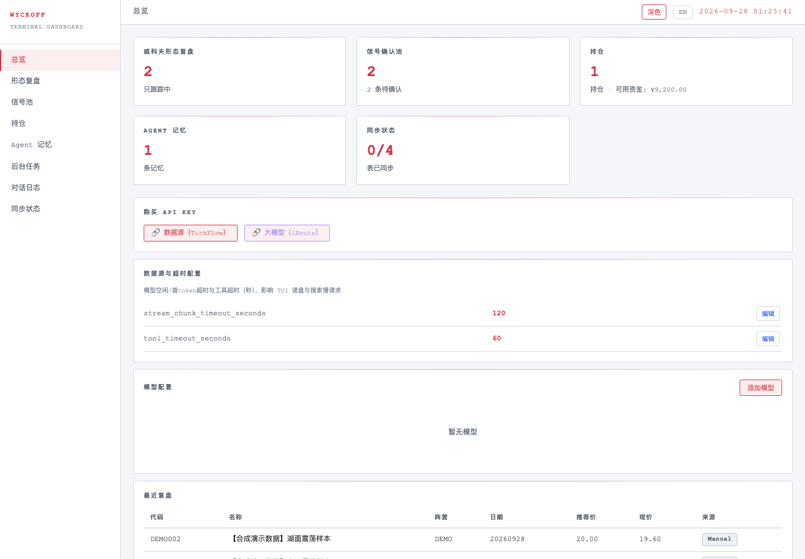 — `09-overview-light-theme.png`
- 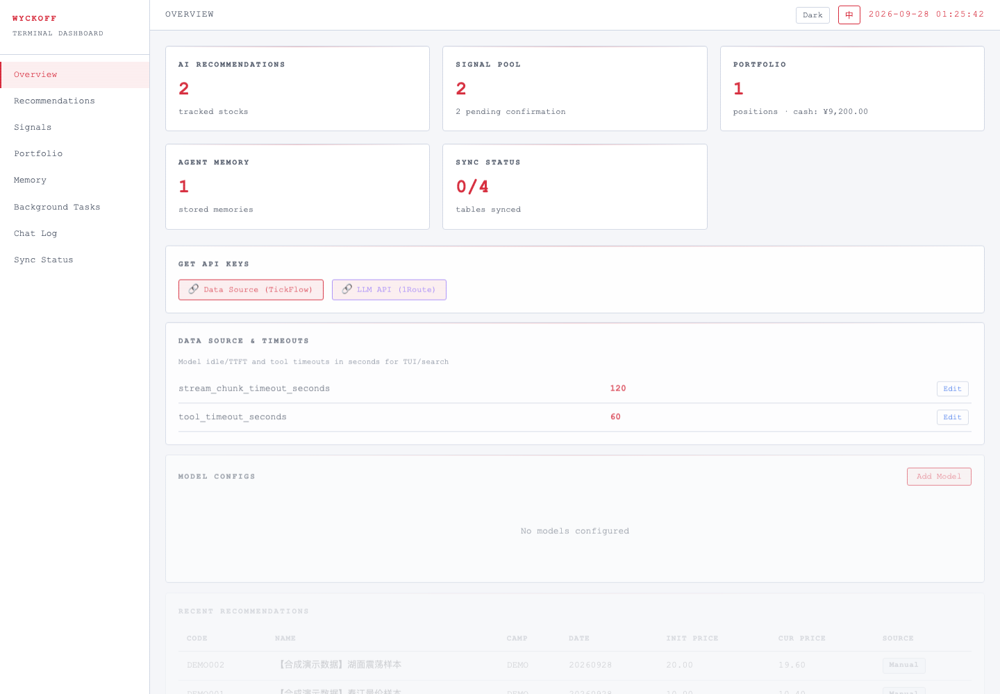 — `10-overview-light-english.png`
- 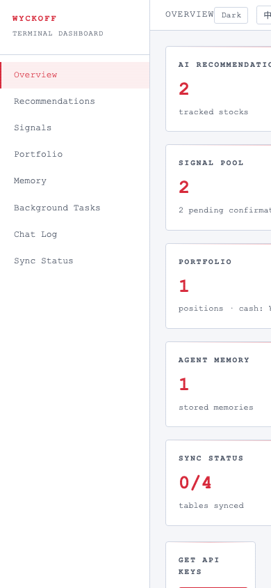 — `11-overview-mobile-width.png`
- 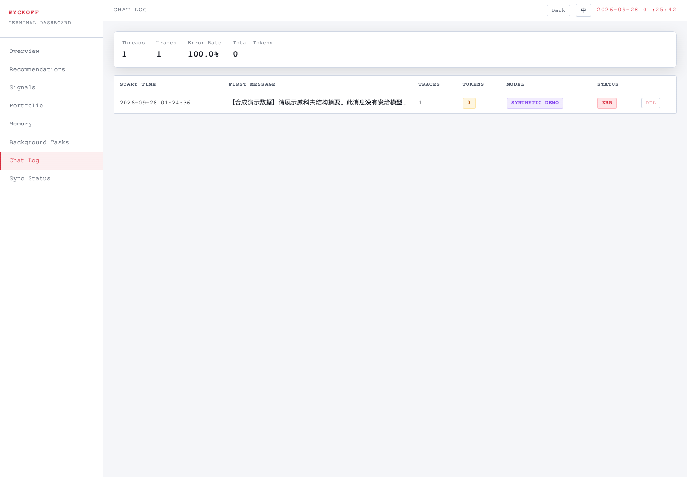 — `12-chatlog-synthetic-transcript.png`
- 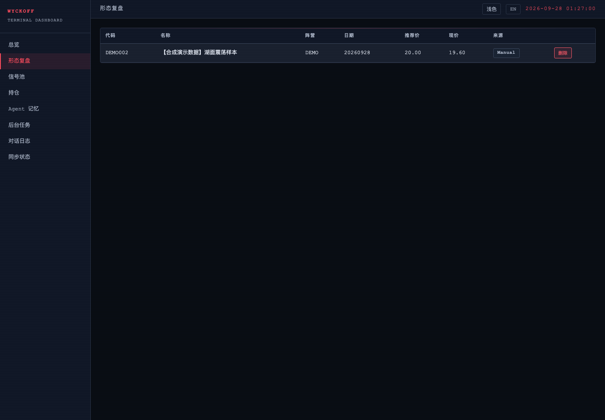 — `13-local-delete-synthetic-row.png`
