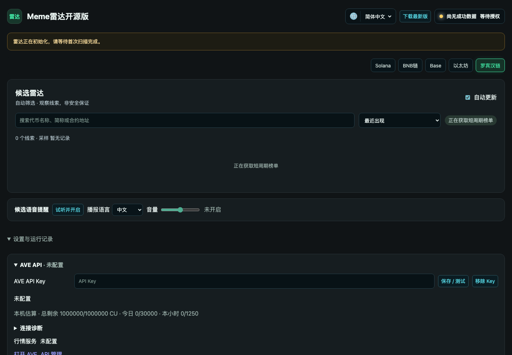
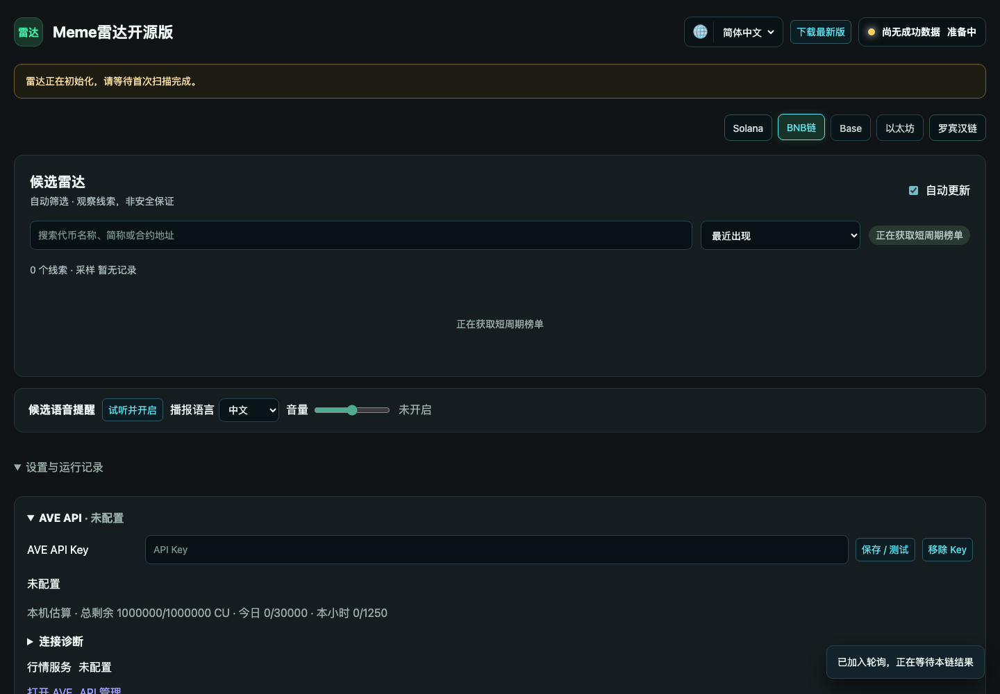
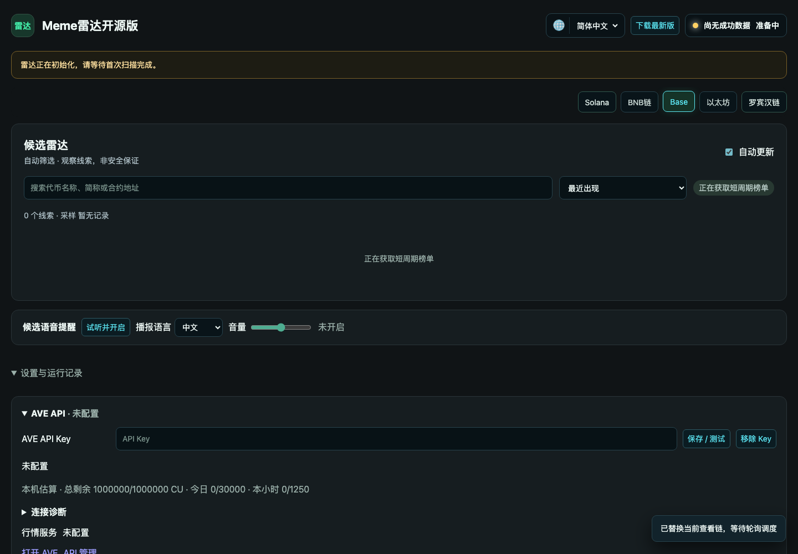
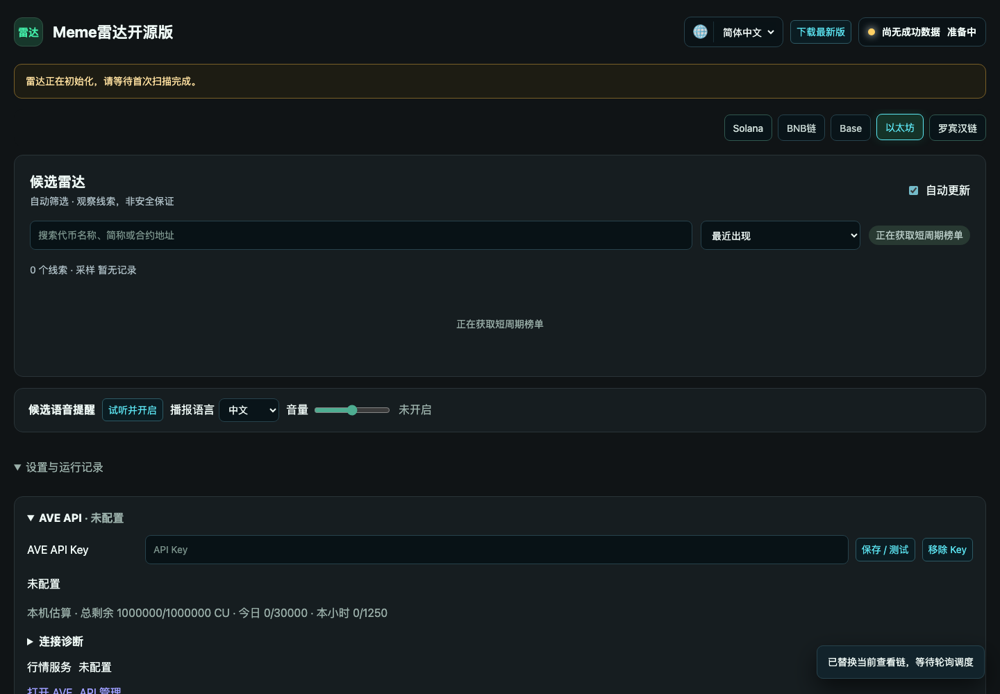
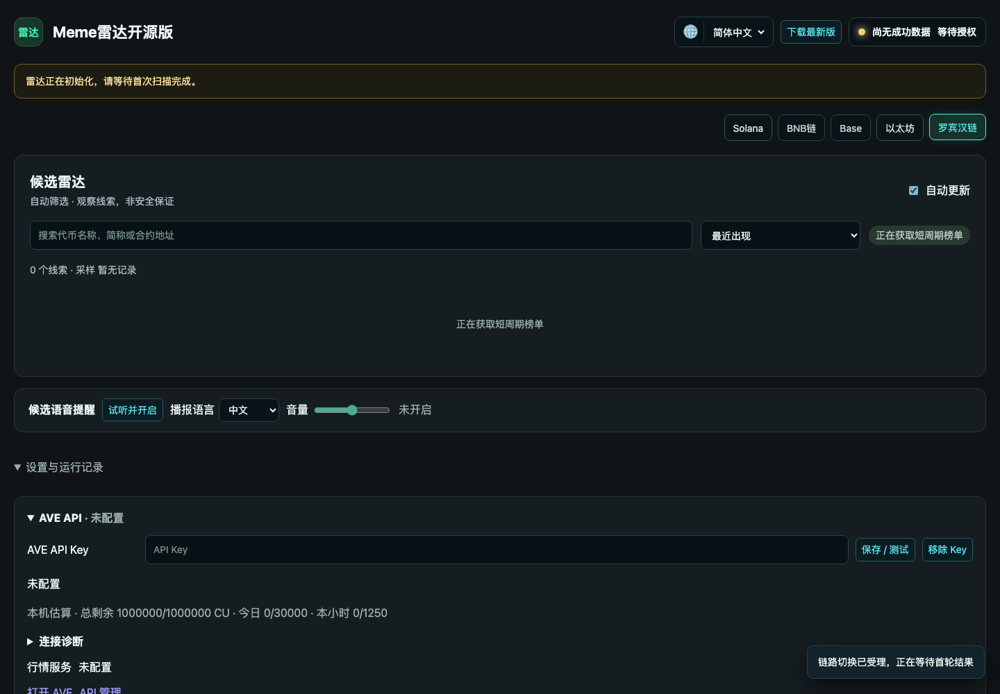
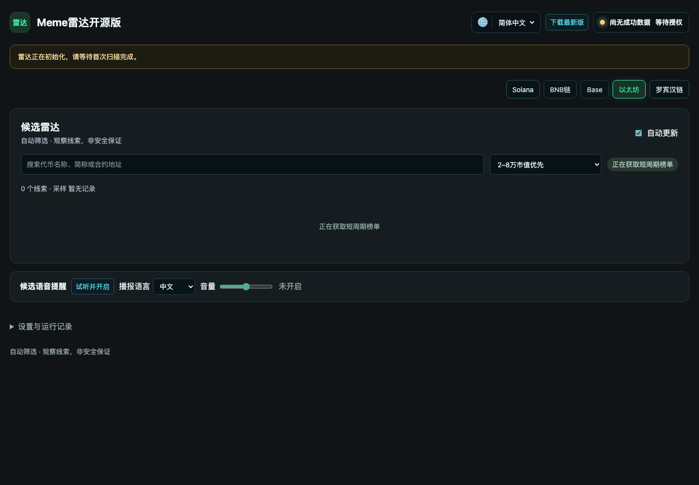
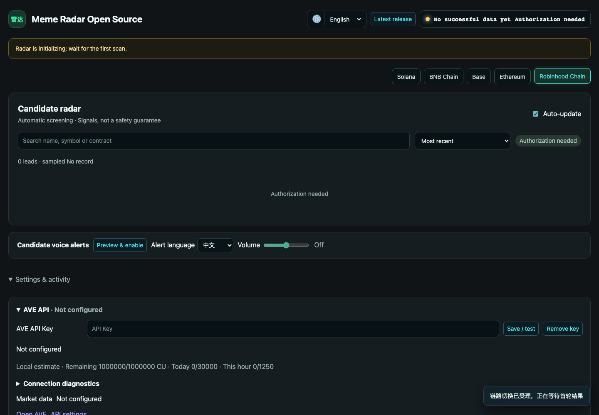
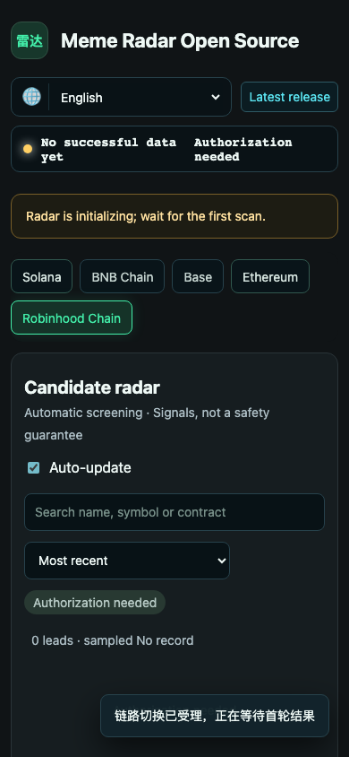
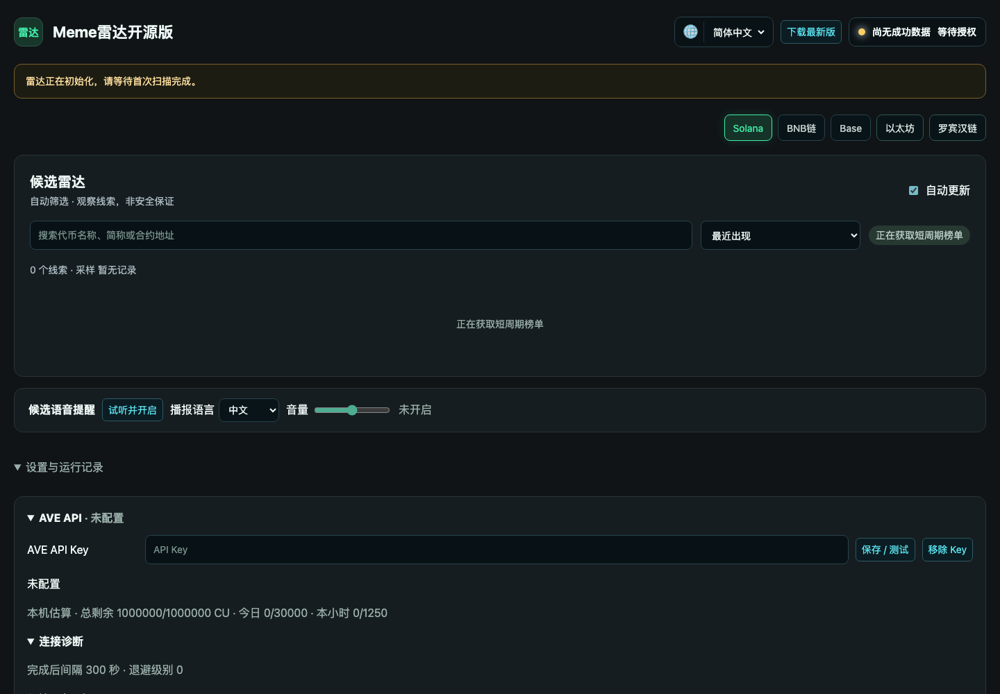

# Meme Radar screenshots

**12 distinct screenshots; 12 unique SHA-256 hashes.** Native product screenshots and auxiliary evaluation displays are identified in each entry.

-  — `01-initial-empty-no-key.png`
-  — `02-ave-settings-key-blank.png`
-  — `03-blank-key-local-validation.png`
-  — `04-chain-sol-no-key.png`
-  — `05-chain-bsc-no-key.png`
-  — `06-chain-base-no-key.png`
-  — `07-chain-eth-no-key.png`
-  — `08-chain-robinhood-no-key.png`
-  — `09-priority-screener-filter-no-key.png`
-  — `10-english-empty-state.png`
-  — `11-mobile-no-key-state.png`
-  — `12-connection-diagnostics-no-key.png`
