# chan.py screenshots

**13 distinct screenshots; 13 unique SHA-256 hashes.** Native product screenshots and auxiliary evaluation displays are identified in each entry.

- 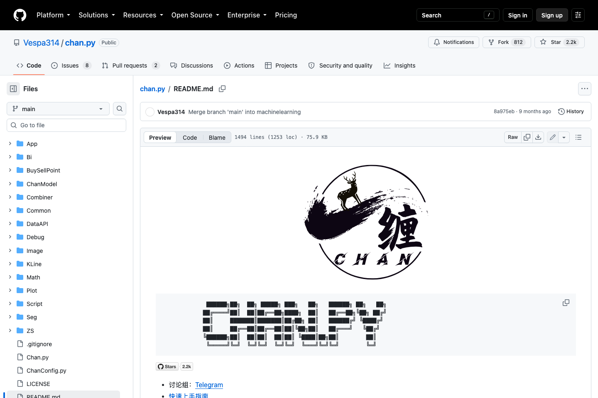 — `01-README.png` ([source](https://github.com/Vespa314/chan.py/blob/main/README.md))
- 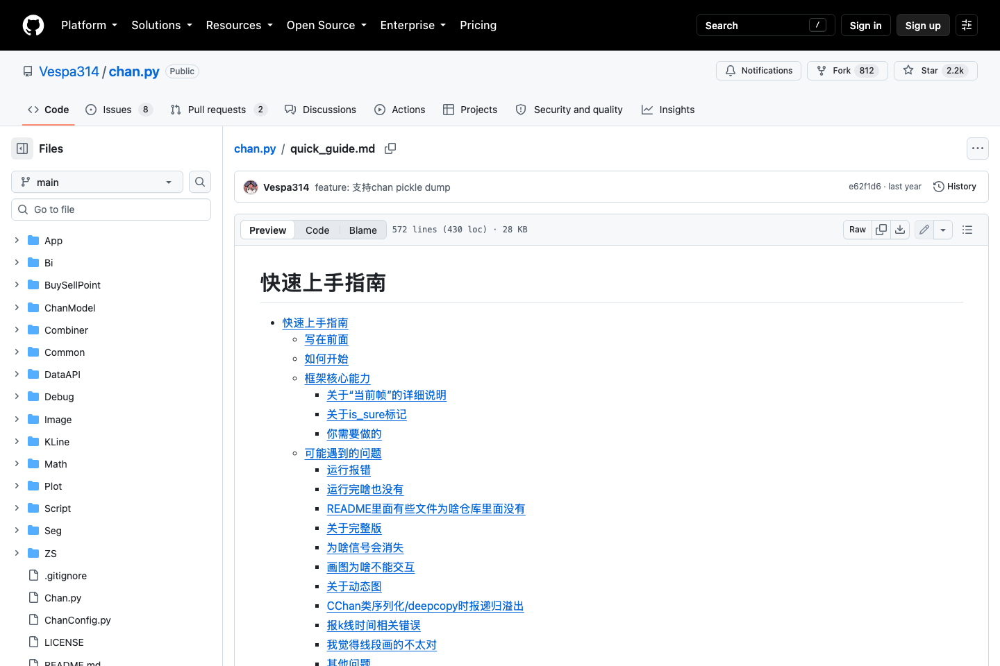 — `02-quick_guide.png` ([source](https://github.com/Vespa314/chan.py/blob/main/quick_guide.md))
- 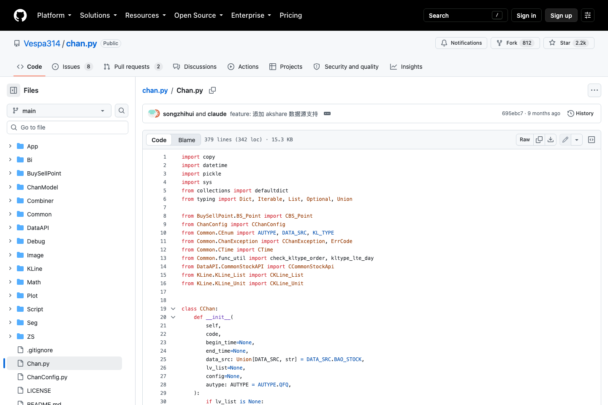 — `03-Chan.png` ([source](https://github.com/Vespa314/chan.py/blob/main/Chan.py))
- 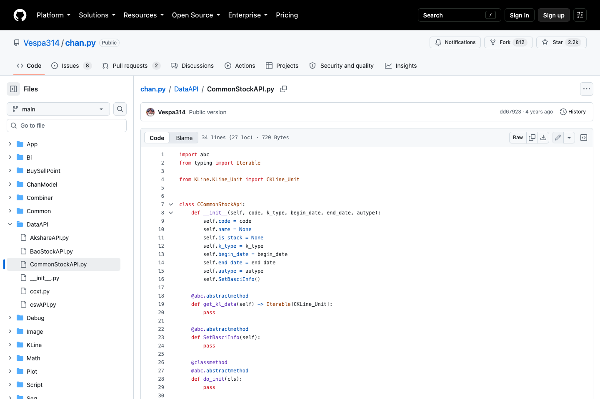 — `04-CommonStockAPI.png` ([source](https://github.com/Vespa314/chan.py/blob/main/DataAPI/CommonStockAPI.py))
- 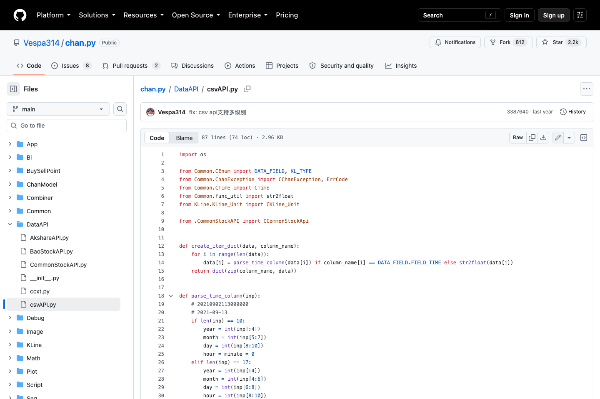 — `05-csvAPI.png` ([source](https://github.com/Vespa314/chan.py/blob/main/DataAPI/csvAPI.py))
- 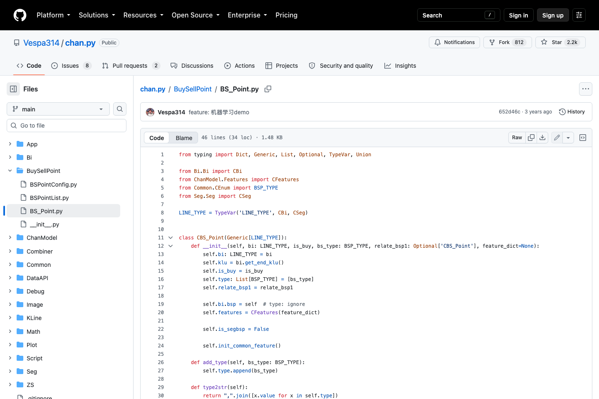 — `06-BS_Point.png` ([source](https://github.com/Vespa314/chan.py/blob/main/BuySellPoint/BS_Point.py))
- 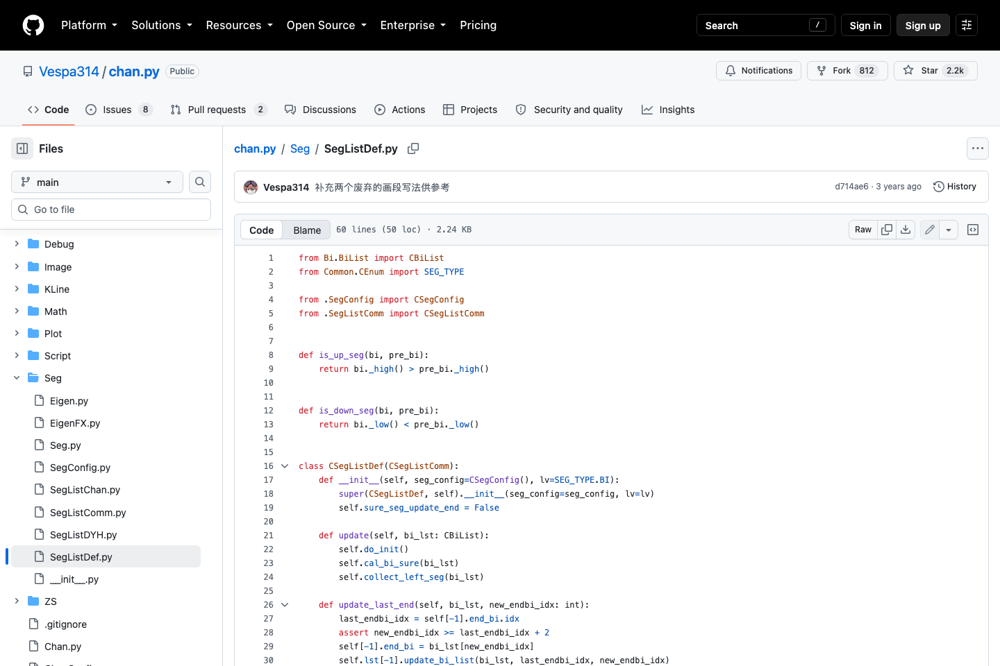 — `07-SegListDef.png` ([source](https://github.com/Vespa314/chan.py/blob/main/Seg/SegListDef.py))
- 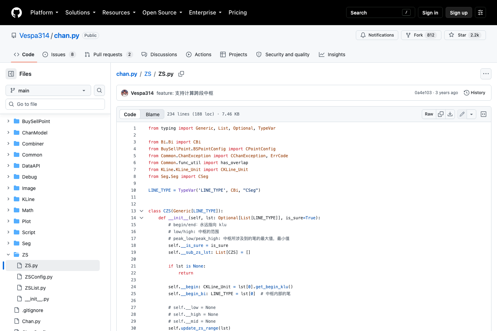 — `08-ZS.png` ([source](https://github.com/Vespa314/chan.py/blob/main/ZS/ZS.py))
- 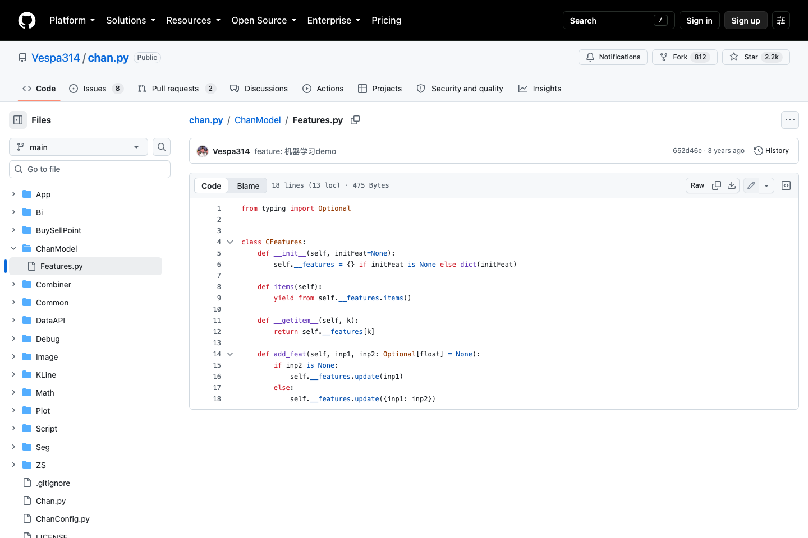 — `09-Features.png` ([source](https://github.com/Vespa314/chan.py/blob/main/ChanModel/Features.py))
- 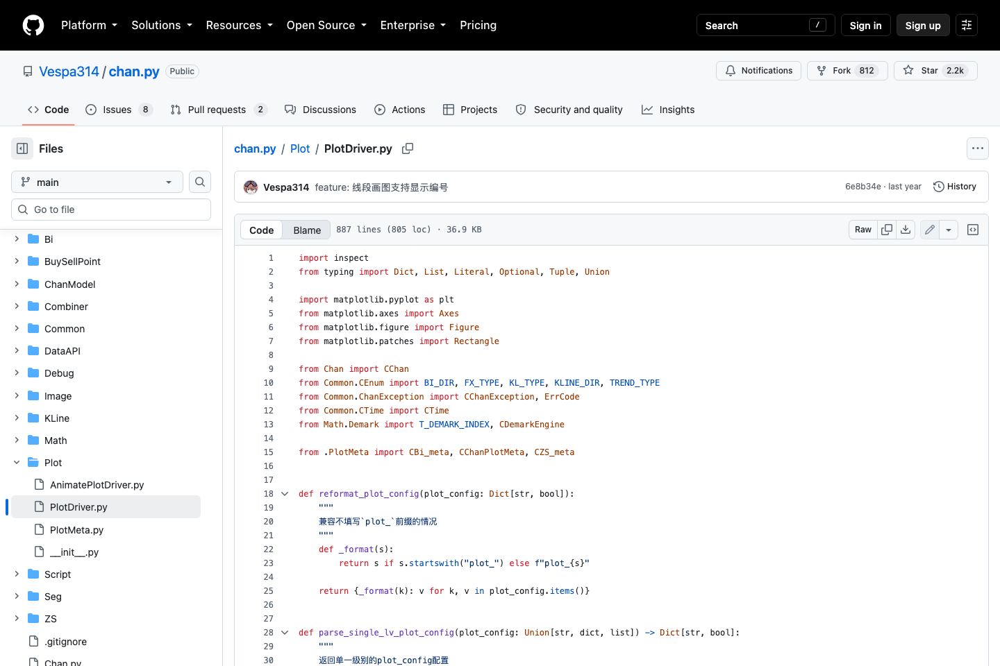 — `10-PlotDriver.png` ([source](https://github.com/Vespa314/chan.py/blob/main/Plot/PlotDriver.py))
- 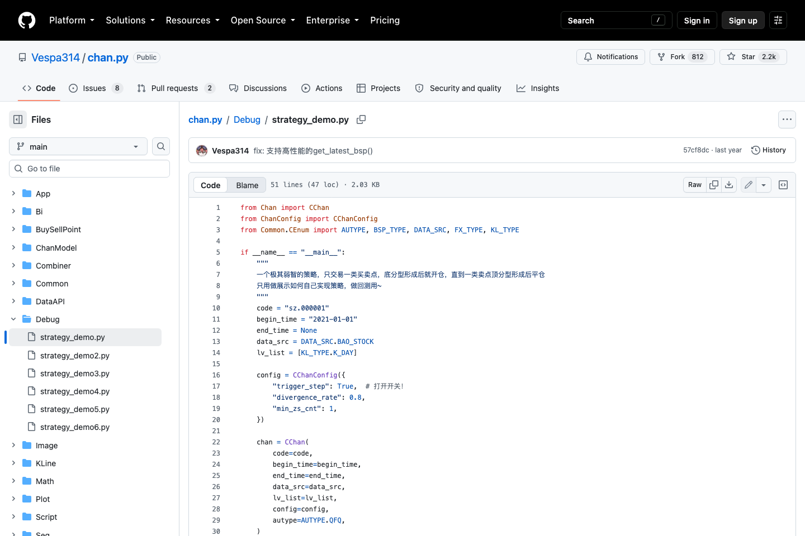 — `11-strategy_demo.png` ([source](https://github.com/Vespa314/chan.py/blob/main/Debug/strategy_demo.py))
- 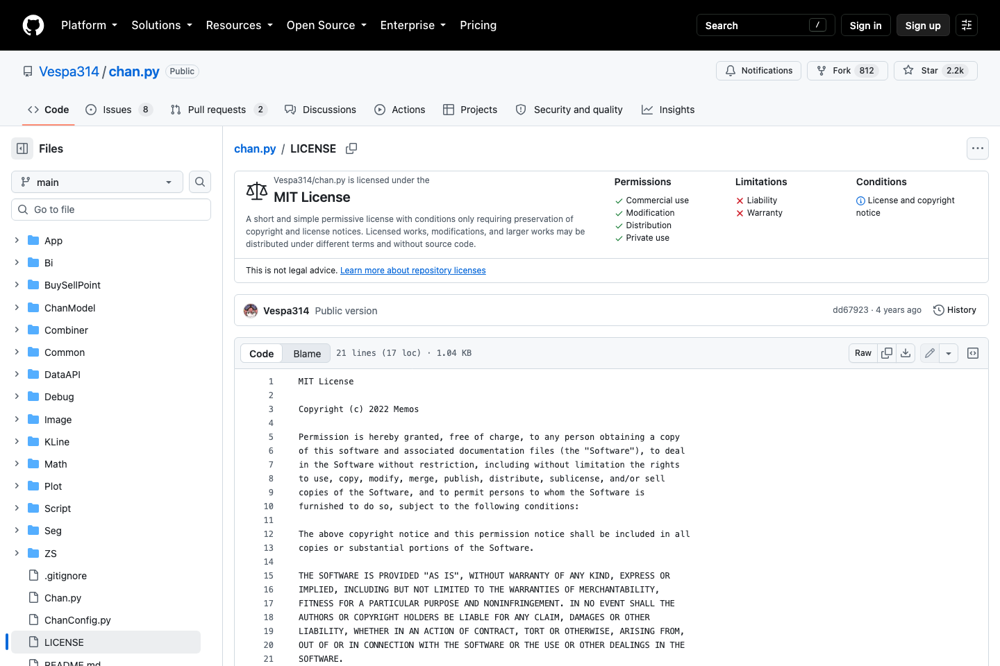 — `12-LICENSE.png` ([source](https://github.com/Vespa314/chan.py/blob/main/LICENSE))
-  — `synthetic_chan_chart.png`
