# one-quant-doc screenshots

**12 distinct screenshots; 12 unique SHA-256 hashes.** Native product screenshots and auxiliary evaluation displays are identified in each entry.

-  — `01-live-site-blocked.png`
- 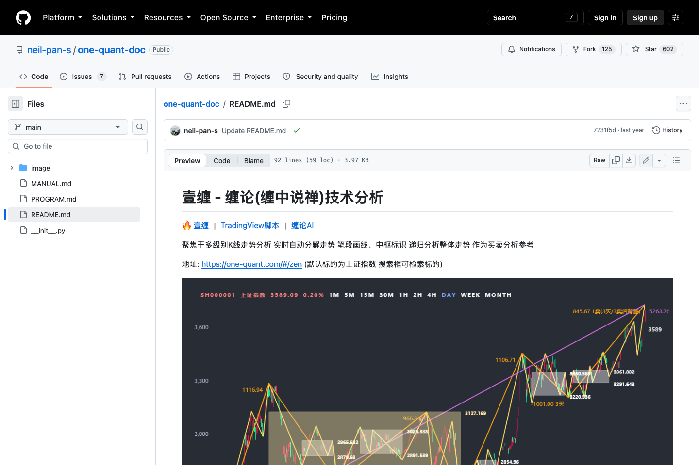 — `02-readme-overview.png`
- 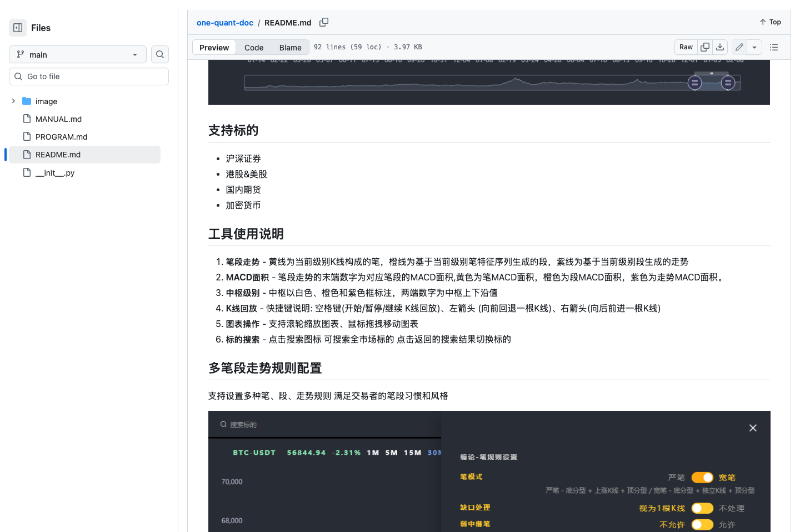 — `03-supported-markets.png`
- 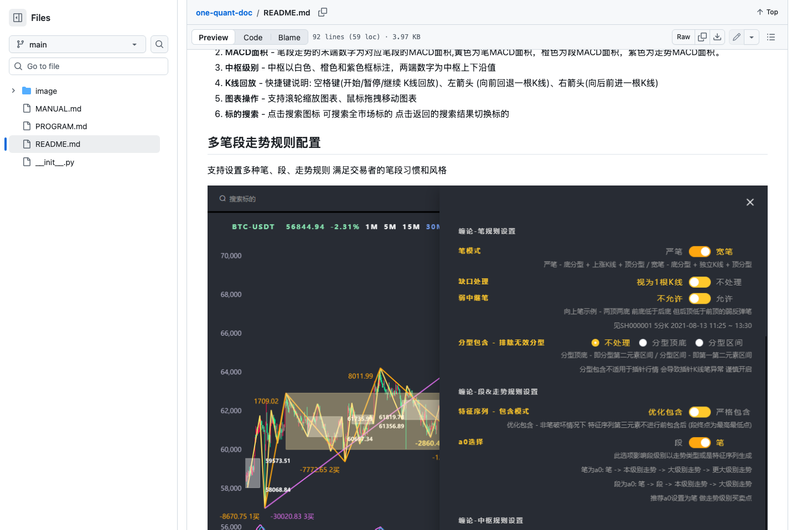 — `04-tool-usage.md.png`
- 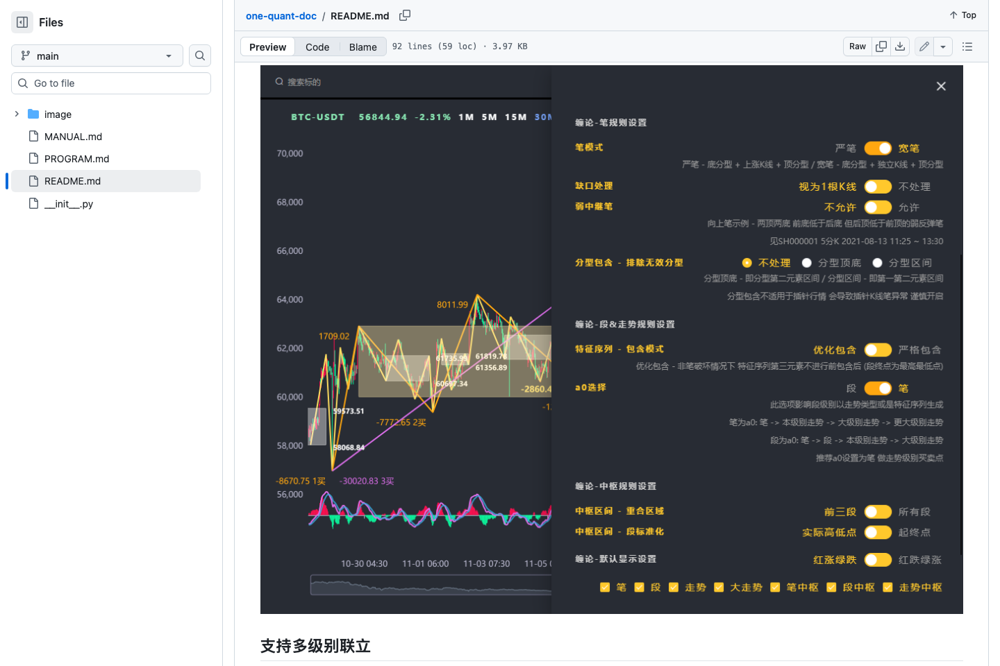 — `05-rule-configuration.png`
- 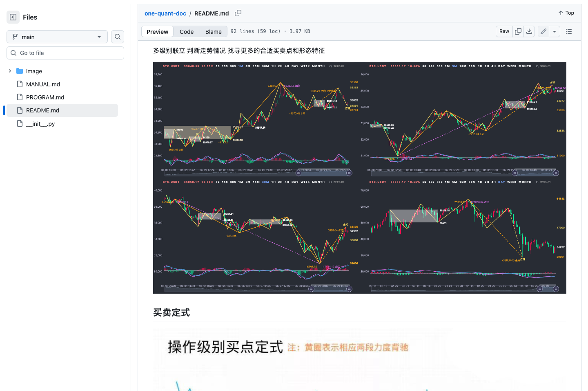 — `06-multi-timeframe-analysis.png`
- 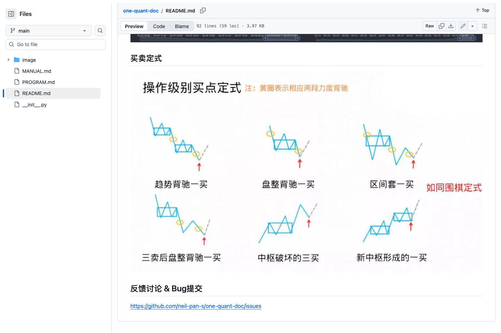 — `07-buy-sell-formulas.png`
- 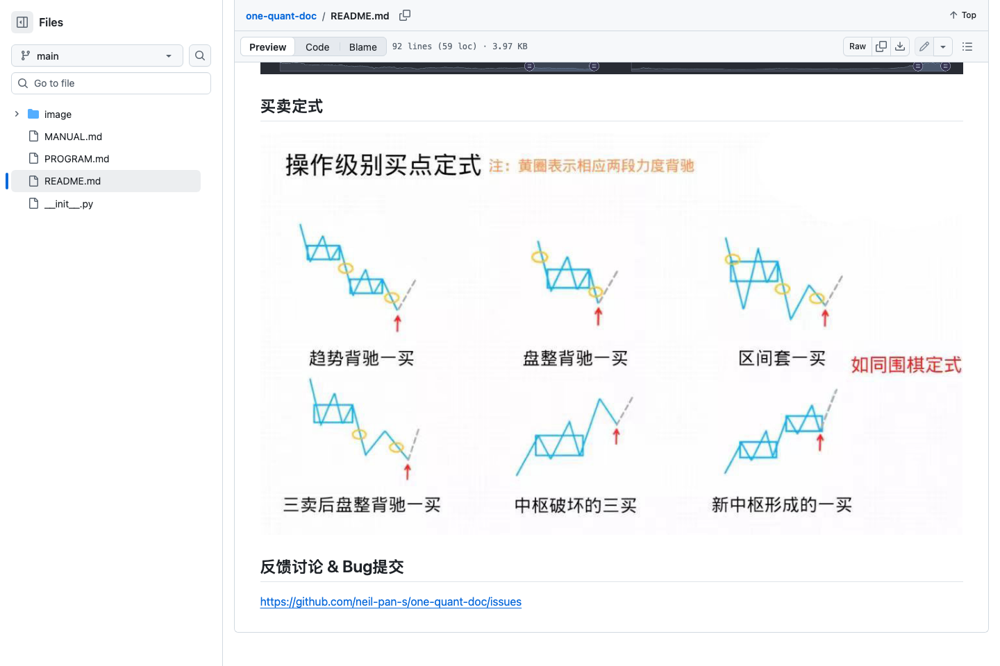 — `08-feedback-and-issues.png`
- 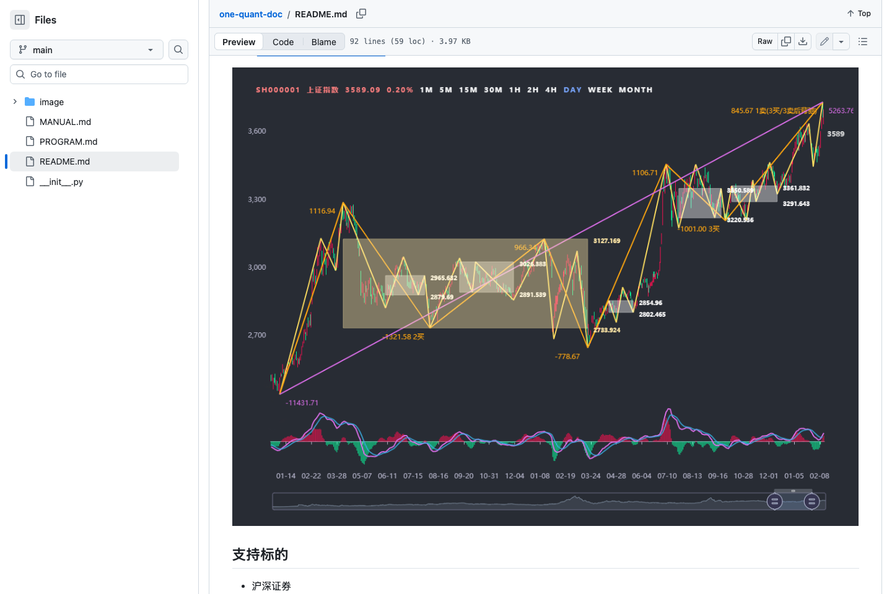 — `09-demo-chart.png`
- 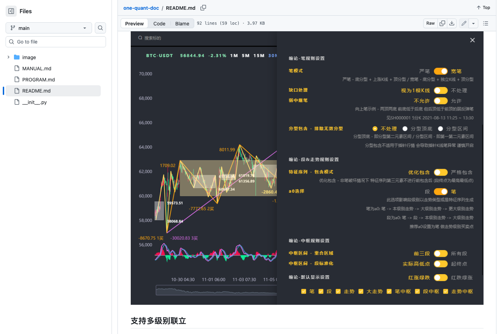 — `10-rule-configuration-image.png`
- 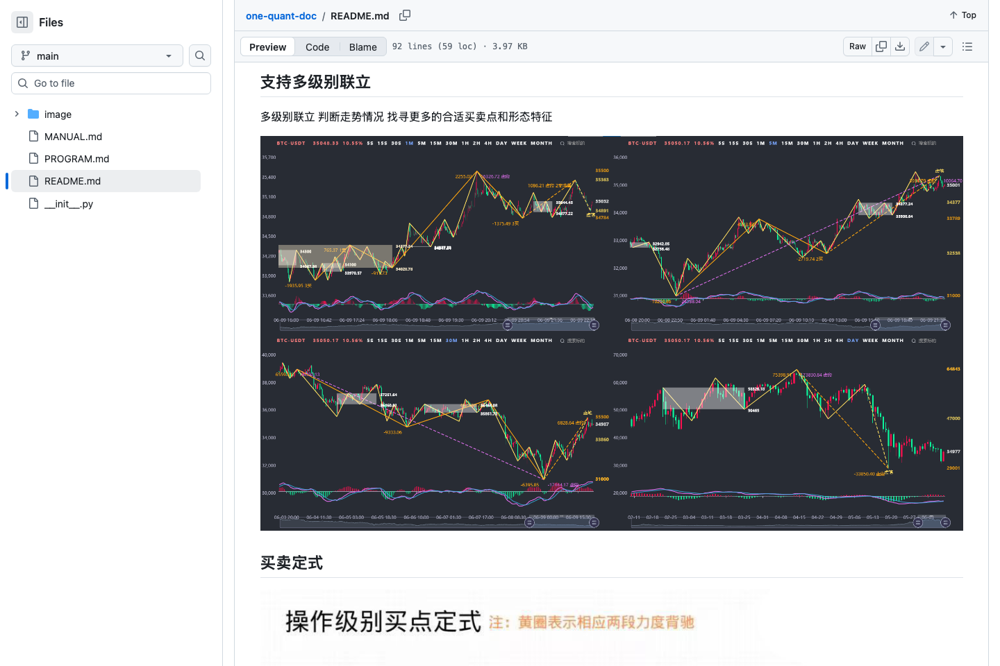 — `11-multi-level-image.png`
- 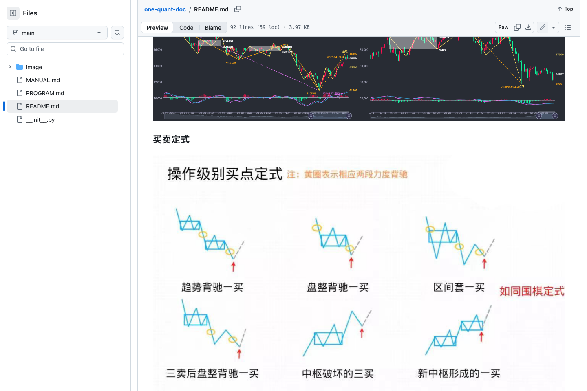 — `12-buy-sell-pattern-image.png`
