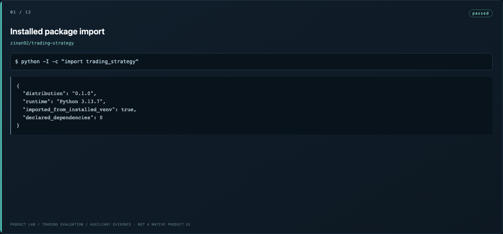
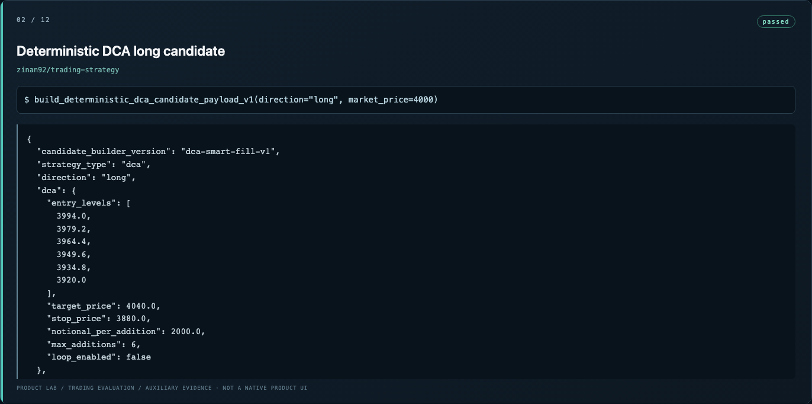
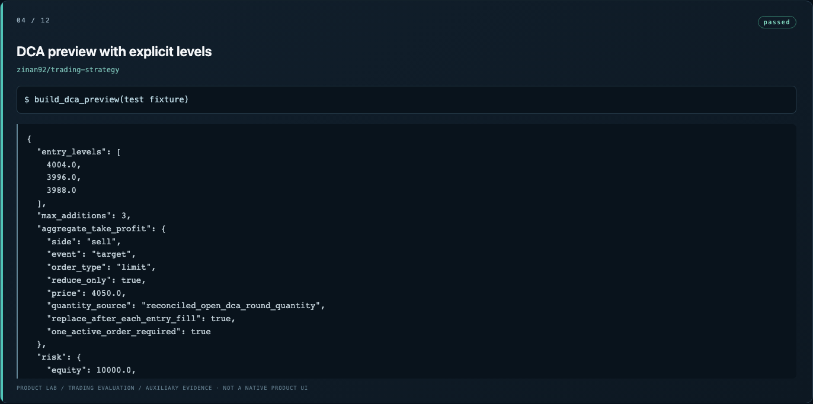
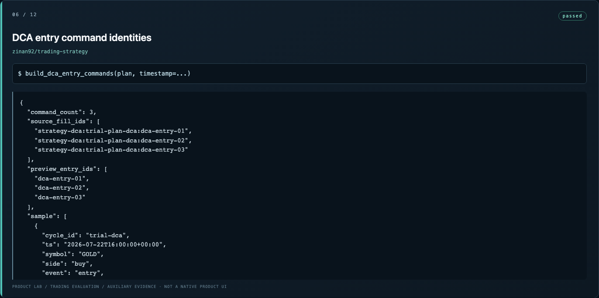
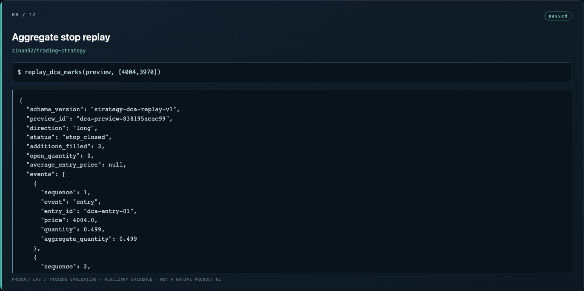
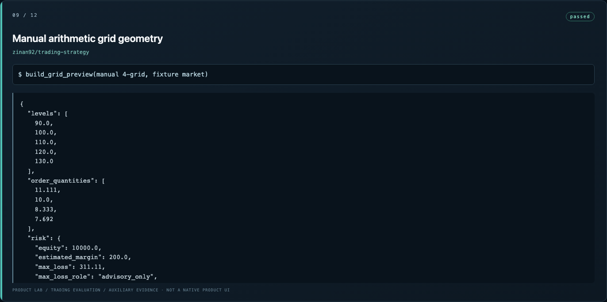
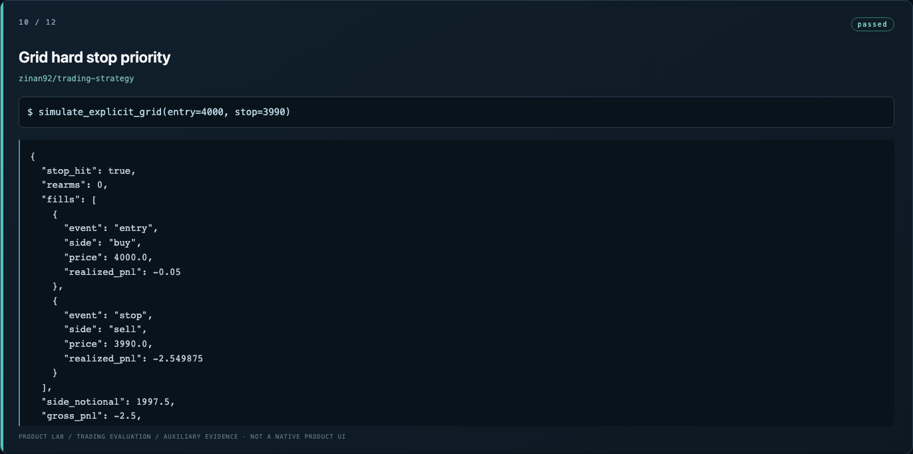
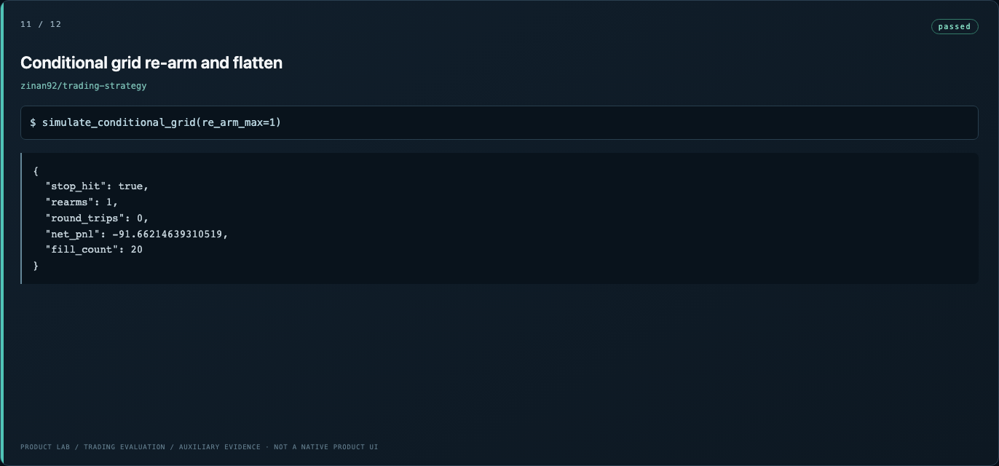
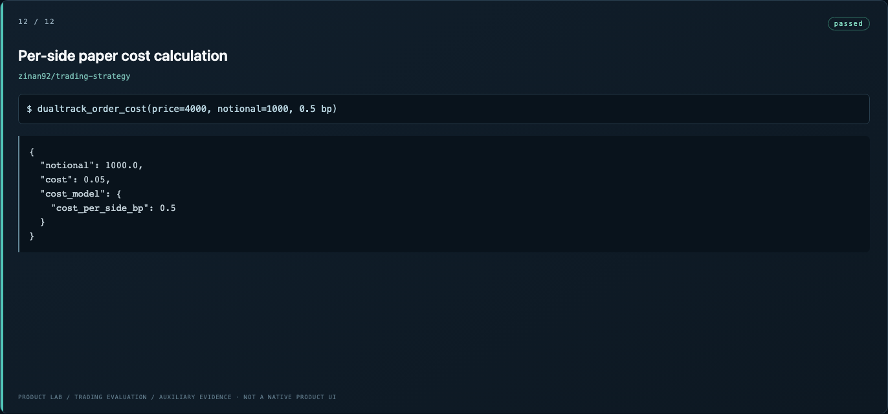

# DCA/Grid strategy package（归档） screenshots

**12 distinct screenshots; 12 unique SHA-256 hashes.** Native product screenshots and auxiliary evaluation displays are identified in each entry.

-  — `01-installed-package-import.png`
-  — `02-deterministic-dca-long-candidate.png`
-  — `03-deterministic-dca-short-candidate.png`
-  — `04-dca-preview-with-explicit-levels.png`
-  — `05-versioned-strategy-plan-projection.png`
-  — `06-dca-entry-command-identities.png`
-  — `07-aggregate-target-replay.png`
-  — `08-aggregate-stop-replay.png`
-  — `09-manual-arithmetic-grid-geometry.png`
-  — `10-grid-hard-stop-priority.png`
-  — `11-conditional-grid-re-arm-and-flatten.png`
-  — `12-per-side-paper-cost-calculation.png`
