# Qlib evidence screenshots

**12 distinct screenshots**, transferred from its Equity Research evaluation because its recommended role is Trading Strategy.

- 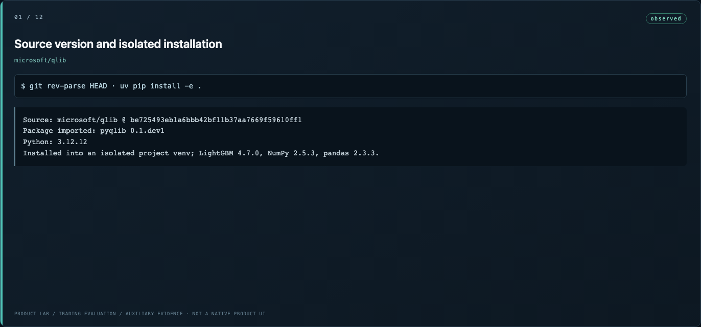 — `01-01-source-version-and-isolated-installation.png`
- 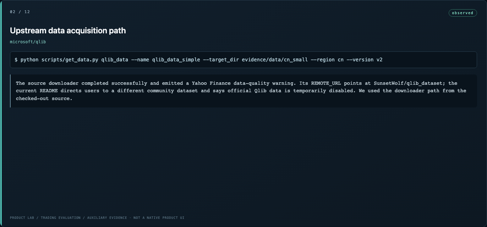 — `02-02-upstream-data-acquisition-path.png`
- 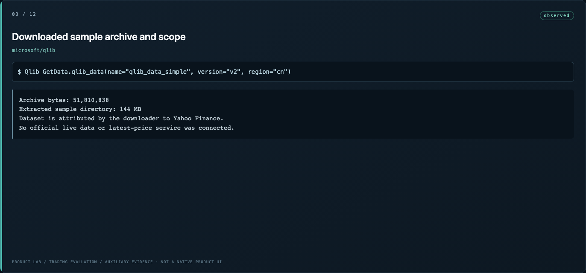 — `03-03-downloaded-sample-archive-and-scope.png`
- 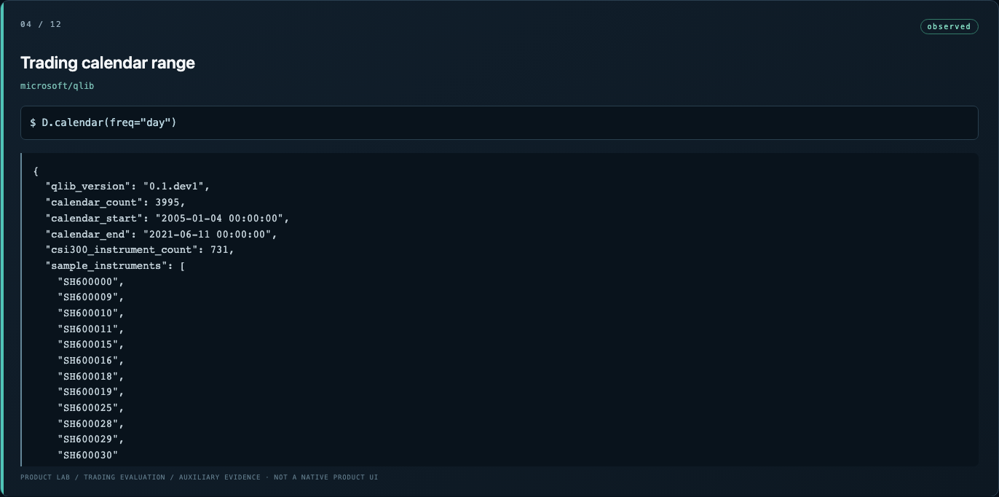 — `04-04-trading-calendar-range.png`
- 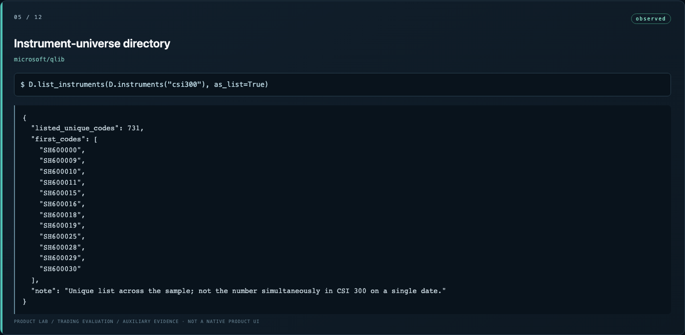 — `05-05-instrument-universe-directory.png`
- 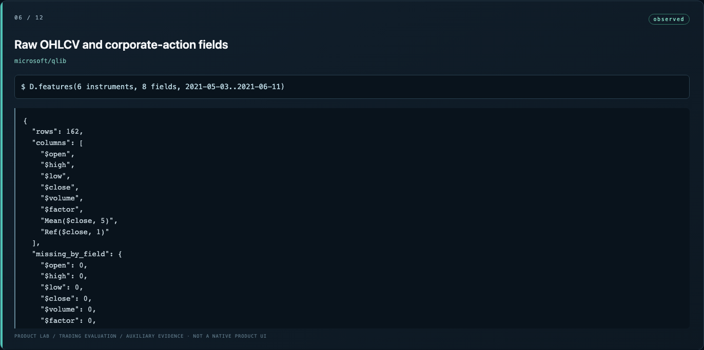 — `06-06-raw-ohlcv-and-corporate-action-fields.png`
- 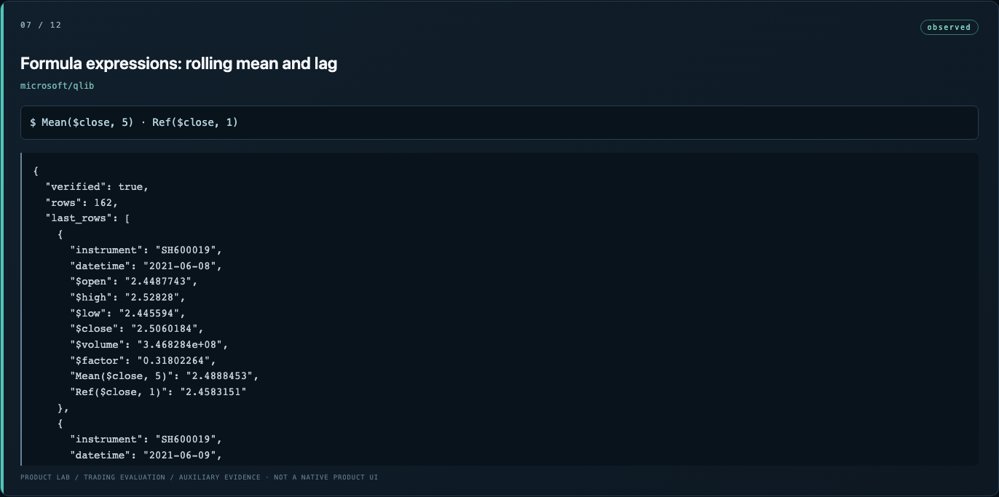 — `07-07-formula-expressions-rolling-mean-and-lag.png`
- 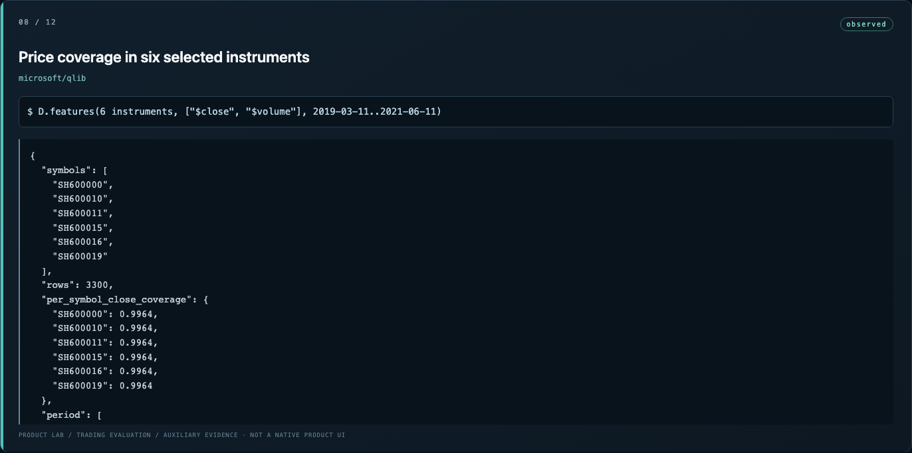 — `08-08-price-coverage-in-six-selected-instruments.png`
- 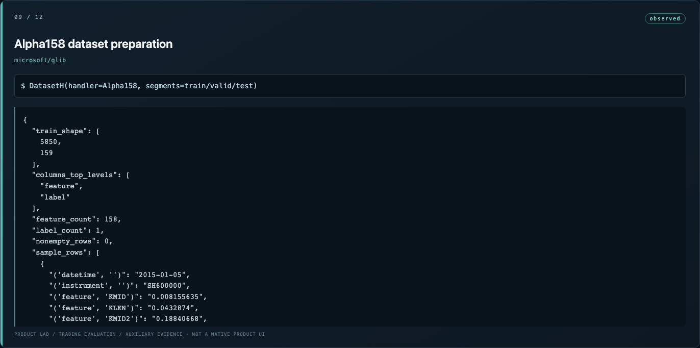 — `09-09-alpha158-dataset-preparation.png`
- 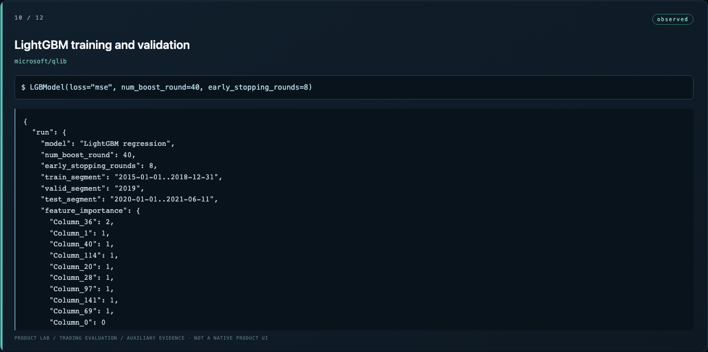 — `10-10-lightgbm-training-and-validation.png`
-  — `11-11-out-of-sample-predictions.png`
- 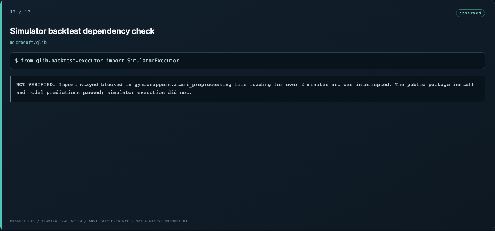 — `12-12-simulator-backtest-dependency-check.png`
