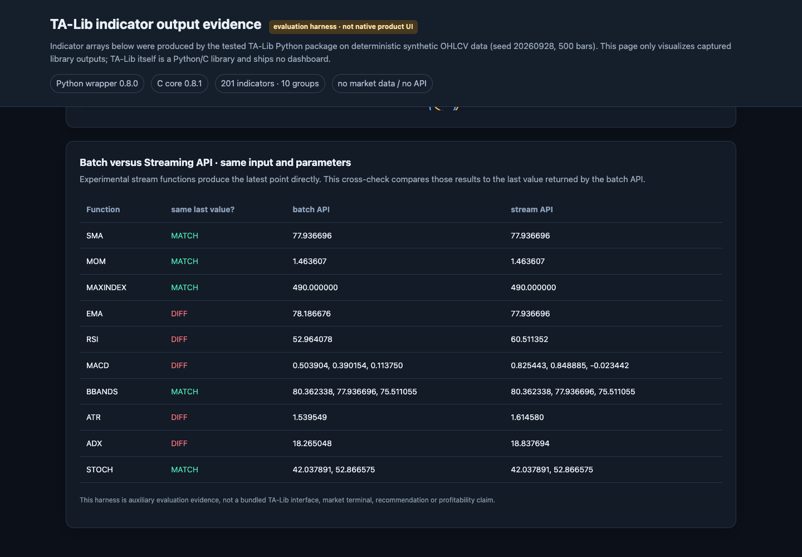
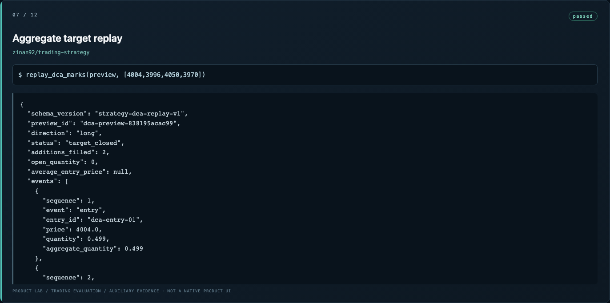
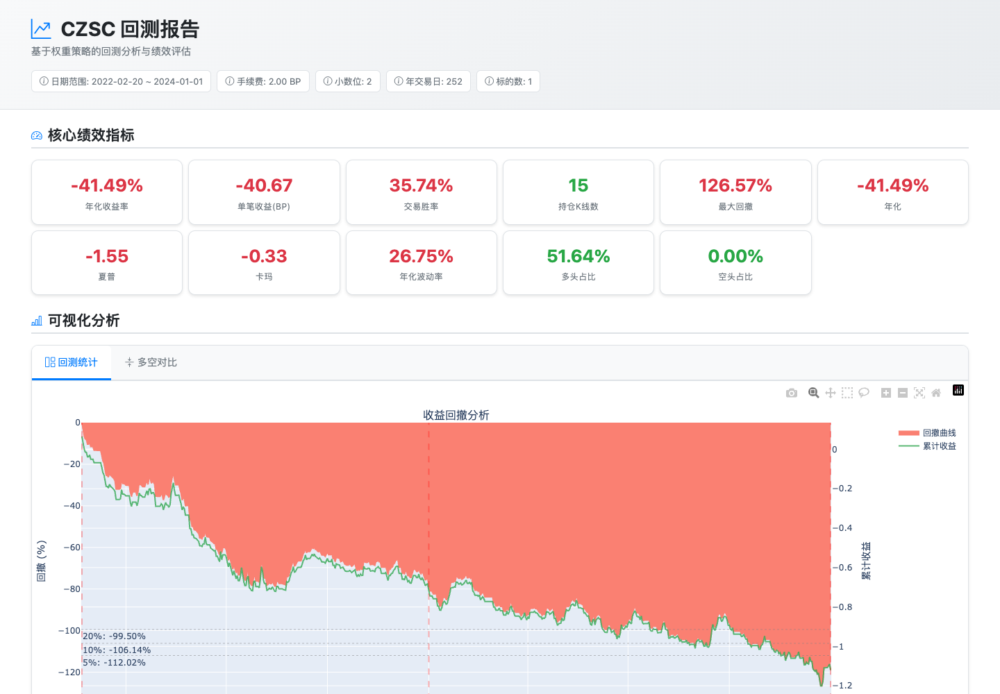
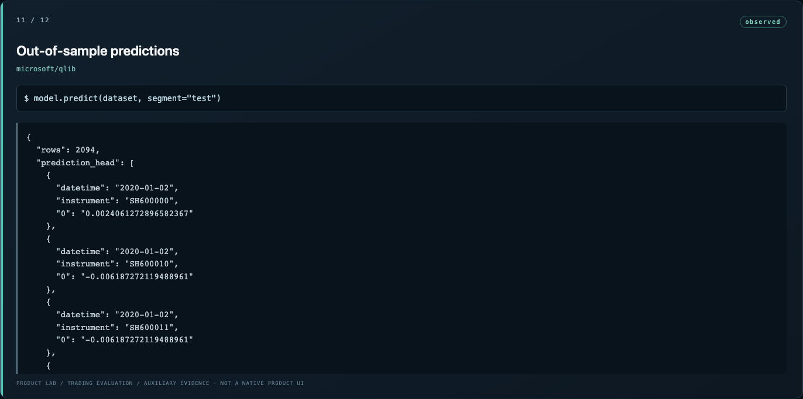
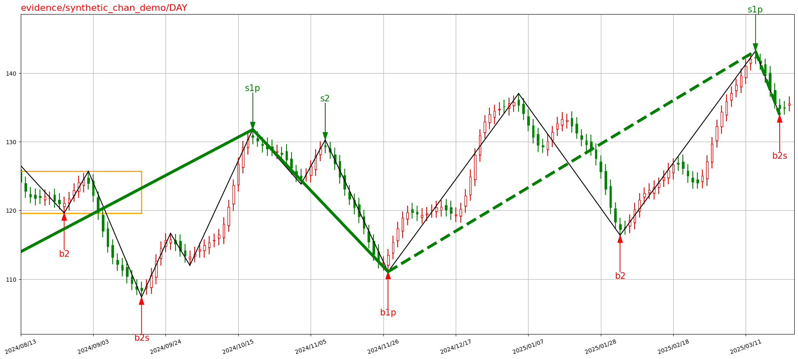
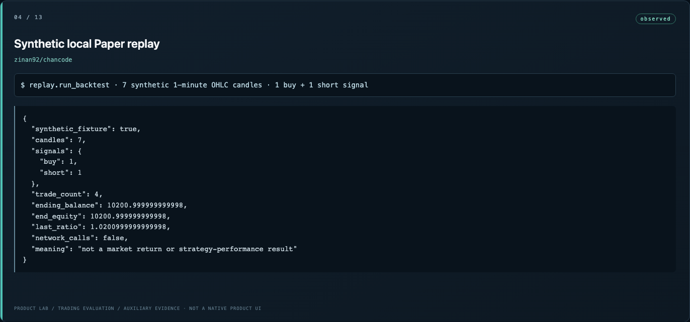
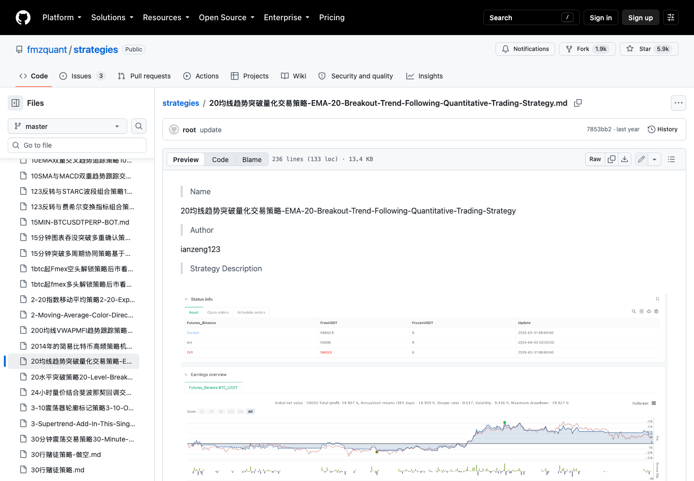
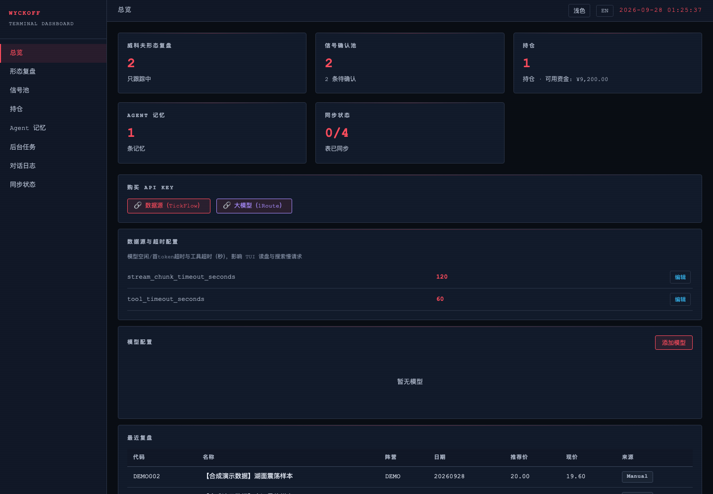
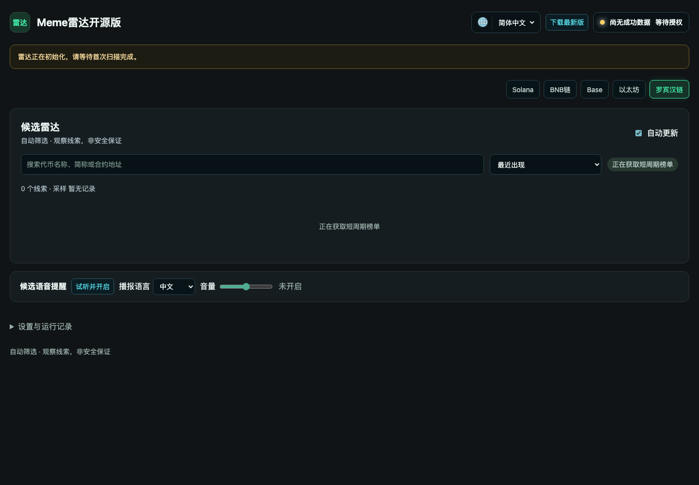

<!-- 本文件由 scripts/render-hub.py 生成，请改 evaluations/assessments/*.json 后重跑 -->
# Trading Strategy · 评测

**目标：** 策略与指标知识库全面（尽量互斥且穷尽）、计算正确、能直接送进回测。

**环节：** 4 指标与特征、5 策略与信号、6 回测

[评测框架](../FRAMEWORK.md) · [Pipeline 总览](../README.md) · [返回目录](../../README.md)

评级：✅ 做到 · 🟡 部分 · ❌ 未做到 · ⬜ 未验证 · — 不适用。分数 = Σ(权重 × 评级值) ÷ Σ适用权重 × 100；已验证 = 做到、部分、未做到三种评级占适用权重的比例。环节：● 实测跑通 · ◐ 源码可见未实测 · ○ 无 · · 不在其角色内。

## 评判标准

| 标准 | 权重 | 怎么判 |
|---|---:|---|
| S1 覆盖 MECE | 25 | 趋势、均值回归、突破、波动率、事件驱动、结构形态（如缠论）、市场状态切换；指标族是否成体系而非零散。 |
| S2 正确 | 25 | 与参考实现或自身基准一致；批量与逐根一致；无未来函数。 |
| S3 可回测接入 | 20 | 能输出标准信号或目标仓位给回测器；或自带回测且结果可导出。 |
| S4 参数化可扩展 | 15 | 参数外置、策略可组合、新增一条策略的成本低。 |
| S5 复现稳定 | 15 | 安装、测试套件、确定性输出。 |

## 排名

| 排名 | 产品 | 分数 | 已验证 | 1 获取 | 2 清洗 | 3 存档 | 4 指标 | 5 策略 | 6 回测 | 7 管理 | 8 风控 | 9 执行 | 10 看板 | 实测 | 卡片 |
|---:|---|---:|---:|:--: | :--: | :--: | :--: | :--: | :--: | :--: | :--: | :--: | :--:|---|---|
| 1 | [TA-Lib](https://github.com/TA-Lib/ta-lib-python) | **80** | 100% | · | · | · | ● | · | · | · | · | · | · | ✅ 锁定提交源码编译成功，80 项测试通过，201 个指标可枚举，500 根合成 OHLCV 上 SMA/RSI/MACD/BBANDS 经 NumPy/Pandas/Polars 三类接口均出值；实验性 stream 的 5 个递归指标与批量结果不一致。 | [卡片](README.md#ta-lib-python) |
| 2 | [trading-strategy](https://github.com/zinan92/trading-strategy) | **70** | 100% | · | · | · | ○ | ● | ● | ◐ | ◐ | · | · | ✅ 隔离安装成功，12 个确定性场景按预期输出：6 级 DCA 入场 3994→3920、目标 4040/止损 3880，网格 90–130 五档与数量，同一根 bar 上硬止损优先于新增档；聚焦测试 38 通过。 | [卡片](README.md#trading-strategy) |
| 3 | [CZSC](https://github.com/waditu/czsc) | **68** | 100% | ◐ | ● | · | ● | ● | ● | · | · | · | · | 🟡 离线链路 mock→质量检查→分析→研究/replay→回测→HTML 图表跑通；但核心 BI 固定基准 3 项失败，1.0.1 wheel 生成 31 笔而仓库基准为 43。 | [卡片](README.md#czsc) |
| 4 | [Qlib](https://github.com/microsoft/qlib) | **57** | 100% | ● | ◐ | ● | ● | ◐ | ◐ | ◐ | · | · | · | 🟡 隔离安装、CN 简版数据、表达式、Alpha158、LightGBM 训练与 2,094 条样本外预测跑通；数据止于 2021-06-11，SimulatorExecutor 导入超 2 分钟未完成，组合回测未验证。 | [卡片](README.md#qlib) |
| 5 | [chan.py](https://github.com/Vespa314/chan.py) | **50** | 100% | ◐ | · | · | ● | ◐ | ○ | · | · | · | · | ✅ 320 根合成日线上批处理与逐根 trigger_step 都得到 276 根合并 K 线、25 笔、7 段、2 个中枢、14 个买卖点并成功绘图；真实行情与策略收益未测。 | [卡片](README.md#chan-py) |
| 6 | [trump-code](https://github.com/sstklen/trump-code) | **50** | 100% | ◐ | ○ | ● | · | ● | ◐ | ◐ | · | · | ● | 🟡 历史 564 条已验证预测中 346 条正确，61.3% 可复算；最新帖停在 2026-03-25 而日报写 09-26，模型榜单为空，文章索引 404。 | [卡片](README.md#trump-code) |
| 7 | [Chancode](https://github.com/zinan92/chancode) | **42** | 100% | ◐ | · | ◐ | ◐ | ● | ● | · | · | ◐ | ◐ | 🟡 7 根合成蜡烛的单次 replay 跑通（账户 10,000→约 10,201），前端 14 路由构建成功；README 的批量回放在干净 clone 因缺 check_out_param 与 D:/ 写死路径不可复现，后端、AI、行情均未运行。 | [卡片](README.md#chancode) |
| 8 | [FMZ strategies](https://github.com/fmzquant/strategies) | **40** | 100% | · | · | · | ◐ | ◐ | ○ | · | · | · | · | 🟡 5,806 篇 Markdown 全部含非空代码块、3 个 FMZ 原页 HTTP 200 可开；但无统一安装、运行器或回测，本地没有执行任何一条策略，Python 抽查 5 篇中 1 篇（R-Breaker）是 Python 2 语法。 | [卡片](README.md#strategies) |

### 证据不足，不排名

| 产品 | 原因 | 卡片 |
|---|---|---|
| [WyckoffTradingAgent](https://github.com/YoungCan-Wang/WyckoffTradingAgent) | 已验证 15%，低于 40%：无 API key 时本地 Dashboard 8 个页面与合成记录 CRUD 可用（DELETE /api/recommendations/DEMO001 返回 200，2 条变 1 条）；Wyckoff 分析、AI 选股、实时行情与云同步未验证。 | [卡片](README.md#wyckofftradingagent) |
| [Meme Radar](https://github.com/nhovongoc0-max/meme-radar) | 已验证 30%，低于 40%：安装、doctor 与 360 项测试通过，本地 UI 在 127.0.0.1:3981 启动；无 AVE key 时 /health 返回 ready=false、AVE_AUTH_REQUIRED，候选数 0，核心扫描未验证。 | [卡片](README.md#meme-radar) |
| [one-quant-doc](https://github.com/neil-pan-s/one-quant-doc) | 已验证 0%，低于 40%：仓库只有文档与空的 __init__.py，无可安装代码；托管站 one-quant.com/#/zen 在 Chromium、Chrome 通道与真实浏览器三种方式下均跳转 /oops 安全拦截，未绕过。 | [卡片](README.md#one-quant-doc) |

## 分类说明

- **trump-code** 目录归 Data，按本类标准评测并参与本类排名。
- **Qlib** 目录归 Equity Research，按本类标准评测并参与本类排名。

## 产品卡片

### 1. TA-Lib · 80/100 · 已验证 100%

| 1 获取 | 2 清洗 | 3 存档 | 4 指标 | 5 策略 | 6 回测 | 7 管理 | 8 风控 | 9 执行 | 10 看板 |
| :--: | :--: | :--: | :--: | :--: | :--: | :--: | :--: | :--: | :--: |
| · | · | · | ● | · | · | · | · | · | · |

**声称：** TA-Lib 的 Python 封装：基于 Cython，用 NumPy/Pandas/Polars 数组计算 150+ 技术指标与蜡烛形态，另有实验性 Streaming API 取最新值。

**实测：** ✅ 锁定提交源码编译成功，80 项测试通过，201 个指标可枚举，500 根合成 OHLCV 上 SMA/RSI/MACD/BBANDS 经 NumPy/Pandas/Polars 三类接口均出值；实验性 stream 的 5 个递归指标与批量结果不一致。

| 标准 | 权重 | 评级 | 证据 |
|---|---:|:--:|---|
| S1 覆盖 MECE | 25 | ✅ | 可枚举 201 个函数、10 个组（Overlap、Momentum、Volatility、Volume、Cycle、Pattern Recognition、Price/Math Transform、Statistic），趋势、动量/均值回归、波动率、量能与蜡烛形态族齐全且按组分类。 [图1](2026-09-28/09-ta-lib/images/07-readme-indicator-catalog.png) [图2](2026-09-28/09-ta-lib/images/19-offline-price.png) |
| S2 正确 | 25 | 🟡 | 同一 500 根输入下 stream 与批量最后值不一致：EMA 78.186676 对 77.936696、RSI 52.964078 对 60.511352、MACD 三项与 ATR、ADX 也不同；SMA/MOM/MAXINDEX/BBANDS/STOCH 一致，80 项仓库测试通过但未覆盖递归指标的 stream 对账。 [图1](2026-09-28/09-ta-lib/images/22-offline-stream.png) [图2](2026-09-28/09-ta-lib/images/14-test-function-api.png) [图3](2026-09-28/09-ta-lib/verification.json) |
| S3 可回测接入 | 20 | ✅ | 输出与输入等长的 NumPy 数组；Pandas Series 保留原索引，Polars DataFrame Abstract API 通过，SMA 首段 NaN 传播与 README 一致，可直接作为回测器的指标列。 [图1](2026-09-28/09-ta-lib/images/20-offline-rsi.png) [图2](2026-09-28/09-ta-lib/images/21-offline-macd.png) [图3](2026-09-28/09-ta-lib/images/05-readme-abstract-api.png) |
| S4 参数化可扩展 | 15 | 🟡 | Function/Abstract API 的 timeperiod、fastperiod 等参数外置，指标可任意组合；但指标集合固定在 C 核心内，新增指标需改 C 代码并重新编译 Cython 绑定。 [图1](2026-09-28/09-ta-lib/images/04-readme-function-api.png) [图2](2026-09-28/09-ta-lib/images/10-abstract-source.png) [图3](2026-09-28/09-ta-lib/images/12-function-bindings.png) |
| S5 复现稳定 | 15 | ✅ | 隔离 Python 3.13 环境从锁定提交源码编译成功，pytest 80 passed（1.29s），seed 20260928 的合成数据输出可复现；前提是本机已有 TA-Lib C 0.8.1 与 Cython。 [图1](2026-09-28/09-ta-lib/images/08-pyproject.png) [图2](2026-09-28/09-ta-lib/images/09-setup.png) [图3](2026-09-28/09-ta-lib/images/03-readme-installation.png) |

**适合：** 作为研究与回测代码里的通用指标计算依赖，批量计算 OHLCV 指标和蜡烛形态。  
**不适合：** 直接用实验性 stream API 取 EMA/RSI/MACD/ATR/ADX 最新值做实时信号；期待它提供行情、策略或回测。

**未验证：** 真实行情上的指标值与其他参考实现交叉核对；无预装 C 核心的干净机器上的源码安装；蜡烛形态识别（Pattern Recognition 组）的输出正确性  
**下一步：** 对 stream EMA/RSI/MACD/ATR/ADX 做同输入批量对账，判定差异来自预热长度还是实现本身。

证据：[22 张截图](2026-09-28/09-ta-lib/screenshots.md) · [实测记录](2026-09-28/09-ta-lib/findings.md) · 实测版本 `fd6089b183fc` · 目录锁 `fd6089b183fc` · Python 库

备注：计算库，无原生界面；截图 19–22 为辅助评测页展示的真实库输出。

### 2. trading-strategy · 70/100 · 已验证 100%

| 1 获取 | 2 清洗 | 3 存档 | 4 指标 | 5 策略 | 6 回测 | 7 管理 | 8 风控 | 9 执行 | 10 看板 |
| :--: | :--: | :--: | :--: | :--: | :--: | :--: | :--: | :--: | :--: |
| · | · | · | ○ | ● | ● | ◐ | ◐ | · | · |

**声称：** 引擎无关的纯 DCA/Grid 策略计划、仓位与离线回放包；README 标注 2026-09-27 归档并迁入 trading-system/packages/trading-strategy。

**实测：** ✅ 隔离安装成功，12 个确定性场景按预期输出：6 级 DCA 入场 3994→3920、目标 4040/止损 3880，网格 90–130 五档与数量，同一根 bar 上硬止损优先于新增档；聚焦测试 38 通过。

| 标准 | 权重 | 评级 | 证据 |
|---|---:|:--:|---|
| S1 覆盖 MECE | 25 | 🟡 | 只覆盖 DCA 与 Grid 两个策略族，但族内完整：多空 DCA、显式/条件网格、re-arm、硬止损、聚合退出单；趋势、突破、事件等类别不在范围内。 [图1](2026-09-28/06-zinan92-trading-strategy/images/02-deterministic-dca-long-candidate.png) [图2](2026-09-28/06-zinan92-trading-strategy/images/09-manual-arithmetic-grid-geometry.png) [图3](2026-09-28/06-zinan92-trading-strategy/images/11-conditional-grid-re-arm-and-flatten.png) |
| S2 正确 | 25 | ✅ | 12 个场景与仓库 golden 夹具一致，聚焦测试 38 passed/0 failed；聚合目标回放 2 次加仓后一次性平 0.999，止损回放 3 次加仓后平 1.5，硬止损与新增档同 bar 时止损优先。 [图1](2026-09-28/06-zinan92-trading-strategy/images/07-aggregate-target-replay.png) [图2](2026-09-28/06-zinan92-trading-strategy/images/08-aggregate-stop-replay.png) [图3](2026-09-28/06-zinan92-trading-strategy/images/10-grid-hard-stop-priority.png) |
| S3 可回测接入 | 20 | 🟡 | 输出 strategy-plan-v1 版本化计划与含 side/price/quantity/sl/source_fill_id 的入场命令，回放给出成交与 net_pnl；但没有绩效报告，文档要求由 Trading System 组合层接入。 [图1](2026-09-28/06-zinan92-trading-strategy/images/05-versioned-strategy-plan-projection.png) [图2](2026-09-28/06-zinan92-trading-strategy/images/06-dca-entry-command-identities.png) |
| S4 参数化可扩展 | 15 | ✅ | 入场档、max_additions、杠杆、re_arm_max、每边成本 bp 等全部外置，计划带 schema 版本与 sha256 摘要，0 个运行时依赖。 [图1](2026-09-28/06-zinan92-trading-strategy/images/04-dca-preview-with-explicit-levels.png) [图2](2026-09-28/06-zinan92-trading-strategy/images/05-versioned-strategy-plan-projection.png) [图3](2026-09-28/06-zinan92-trading-strategy/images/12-per-side-paper-cost-calculation.png) |
| S5 复现稳定 | 15 | 🟡 | uv pip install -e . 成功并可从仓库外导入；聚焦测试 38 通过，但完整 pytest 46 passed/2 failed，失败项依赖维护者本机的 trading-system-testnet checkout。 [图1](2026-09-28/06-zinan92-trading-strategy/images/01-installed-package-import.png) [图2](2026-09-28/06-zinan92-trading-strategy/evidence/test-suite-summary.json) |

**适合：** 在 trading-system 组合层里做 DCA/Grid 计划、仓位尺寸与离线回放计算。  
**不适合：** 当独立应用使用；期待行情、界面、券商适配或收益报告。

**未验证：** 迁移后 trading-system/packages/trading-strategy 是否与本版本一致；真实行情序列上的回放；2 个 provenance 测试在维护者环境的结果  
**下一步：** 在 trading-system/packages/trading-strategy 上重跑同 12 个场景，确认迁移无回归。

证据：[12 张截图](2026-09-28/06-zinan92-trading-strategy/screenshots.md) · [实测记录](2026-09-28/06-zinan92-trading-strategy/findings.md) · 实测版本 `856a80735f40` · 目录锁 `owned source` · Python 库

备注：仓库已于 2026-09-27 归档并迁入 zinan92/trading-system（packages/trading-strategy）；目录锁为 owned source。所有输入是 golden 测试夹具（GOLD、2026 年测试日期），不是行情。

### 3. CZSC · 68/100 · 已验证 100%

| 1 获取 | 2 清洗 | 3 存档 | 4 指标 | 5 策略 | 6 回测 | 7 管理 | 8 风控 | 9 执行 | 10 看板 |
| :--: | :--: | :--: | :--: | :--: | :--: | :--: | :--: | :--: | :--: |
| ◐ | ● | · | ● | ● | ● | · | · | · | · |

**声称：** 缠中说禅技术分析工具：分型/笔/线段/中枢分析、信号函数库、研究与回放、策略回测和 HTML 图表；Python + Rust 核心 + CLI，面向股票与期货量化。

**实测：** 🟡 离线链路 mock→质量检查→分析→研究/replay→回测→HTML 图表跑通；但核心 BI 固定基准 3 项失败，1.0.1 wheel 生成 31 笔而仓库基准为 43。

| 标准 | 权重 | 评级 | 证据 |
|---|---:|:--:|---|
| S1 覆盖 MECE | 25 | 🟡 | 缠论流派要素完整（分型、笔、中枢、CLI 结构图），信号目录可枚举 246 个信号并取 schema；但信号是否覆盖趋势、均值回归、事件、市场状态等其他类别本轮未逐项核对。 [图1](2026-09-28/08-czsc/images/06-readme-signals.png) [图2](2026-09-28/08-czsc/images/15-product-output-chan-structure.png) |
| S2 正确 | 25 | 🟡 | 定向测试 46 passed/3 failed/1 skipped：FX 计数与序列基准通过，行情质量检查识别 1 条注入的负成交量；但 BI 计数 31 对基准 43、方向与长度序列均不符，且因未从锁定 SHA 编译 Rust 扩展无法归因。 [图1](2026-09-28/08-czsc/images/13-core-parity-test.png) [图2](2026-09-28/08-czsc/images/12-cli-tests.png) [图3](2026-09-28/08-czsc/verification.json) |
| S3 可回测接入 | 20 | ✅ | czsc backtest 在 seed=42 合成 30m 数据与一个样例 Position 上写出 JSON 与交互式 HTML 报告（含统计与多空对比页）；research run/replay 在 7,310 根上无警告。 [图1](2026-09-28/08-czsc/images/16-product-output-backtest-statistics.png) [图2](2026-09-28/08-czsc/images/17-product-output-long-short-tab.png) [图3](2026-09-28/08-czsc/images/10-cli-backtest-source.png) |
| S4 参数化可扩展 | 15 | ✅ | CLI schema 可发现 8 组入口，signals list/doc 枚举 246 个信号及参数 schema，research config 与 Position 配置外置。 [图1](2026-09-28/08-czsc/images/08-cli-command-source.png) [图2](2026-09-28/08-czsc/images/06-readme-signals.png) [图3](2026-09-28/08-czsc/images/14-examples-index.png) |
| S5 复现稳定 | 15 | 🟡 | 按 uv.lock 安装 wheel 后 CLI 可用且输出确定；但源码目录直接调用被未编译的 czsc/_native 占位遮蔽（ImportError: CzscSignals），源码安装需 Rust 与 maturin。 [图1](2026-09-28/08-czsc/images/11-rust-workspace.png) [图2](2026-09-28/08-czsc/images/04-readme-installation.png) [图3](2026-09-28/08-czsc/images/12-cli-tests.png) |

**适合：** 用 PyPI wheel 做缠论结构、信号枚举和离线研究回测的 Python 量化研究者。  
**不适合：** 需要从源码构建的环境，或要求笔划分与仓库基准严格一致的生产信号。

**未验证：** 从锁定 SHA 编译 Rust 扩展后的 BI 基准；Tushare/CCXT 真实行情接入；真实数据上的策略收益  
**下一步：** 在有 Rust/maturin 的环境从 701e480 构建 _native，重跑 test_core_parity，判定 31 对 43 笔来自 checkout 还是 wheel。

证据：[18 张截图](2026-09-28/08-czsc/screenshots.md) · [实测记录](2026-09-28/08-czsc/findings.md) · 实测版本 `701e480a5450` · 目录锁 `701e480a5450` · CLI · A股、商品、加密

备注：回测图为合成数据下的负结果（-112.12% 收益、126.54% 最大回撤），只作流程证据。

### 4. Qlib · 57/100 · 已验证 100%

| 1 获取 | 2 清洗 | 3 存档 | 4 指标 | 5 策略 | 6 回测 | 7 管理 | 8 风控 | 9 执行 | 10 看板 |
| :--: | :--: | :--: | :--: | :--: | :--: | :--: | :--: | :--: | :--: |
| ● | ◐ | ● | ● | ◐ | ◐ | ◐ | · | · | · |

**声称：** AI 导向的量化投资平台：数据层、特征表达式、Alpha158 等因子集、多种 ML/RL 模型训练、组合回测，并可接 RD-Agent 自动化研发。

**实测：** 🟡 隔离安装、CN 简版数据、表达式、Alpha158、LightGBM 训练与 2,094 条样本外预测跑通；数据止于 2021-06-11，SimulatorExecutor 导入超 2 分钟未完成，组合回测未验证。

| 标准 | 权重 | 评级 | 证据 |
|---|---:|:--:|---|
| S1 覆盖 MECE | 25 | 🟡 | Alpha158 生成 158 个特征与 1 个标签（K 线形态、ROC、MA、STD、BETA、RSQR 等成体系因子族），表达式引擎可任意组合；但只覆盖横截面 ML 一种范式，趋势/均值回归/事件等规则策略与 TopK 组合策略未运行。 [图1](2026-09-28/10-qlib/images/09-09-alpha158-dataset-preparation.png) [图2](2026-09-28/10-qlib/images/07-07-formula-expressions-rolling-mean-and-lag.png) |
| S2 正确 | 25 | 🟡 | 表达式结果可对回原始数据：SH600019 2021-06-03 的 Ref($close,1)=2.4742162 等于前一日收盘，2021-06-11 的 Mean($close,5)=2.513015 与五日均值一致；但模型 early stopping 在第 1 轮、无参考实现比对，IC 检验未完成。 [图1](2026-09-28/10-qlib/images/07-07-formula-expressions-rolling-mean-and-lag.png) [图2](2026-09-28/10-qlib/images/10-10-lightgbm-training-and-validation.png) [图3](2026-09-28/10-qlib/evidence/records.json) |
| S3 可回测接入 | 20 | 🟡 | 测试段产出 2,094 条样本外预测 DataFrame（datetime×instrument，范围 -0.0767 到 0.0866），可作为回测器输入；但自带 SimulatorExecutor 导入卡在 gym 依赖超 2 分钟被中止，组合回测与交易成本未验证，数据止于 2021-06-11。 [图1](2026-09-28/10-qlib/images/11-11-out-of-sample-predictions.png) [图2](2026-09-28/10-qlib/images/12-12-simulator-backtest-dependency-check.png) |
| S4 参数化可扩展 | 15 | ✅ | 数据集、处理器、模型以配置对象组合：DatasetH(handler=Alpha158, segments=train/valid/test)、LGBModel 超参外置，换模型或特征集不改管线。 [图1](2026-09-28/10-qlib/images/09-09-alpha158-dataset-preparation.png) [图2](2026-09-28/10-qlib/images/10-10-lightgbm-training-and-validation.png) |
| S5 复现稳定 | 15 | 🟡 | uv pip install -e . 成功，样本数据下载 51,810,838 字节，训练与预测可重复；但 SimulatorExecutor 导入挂起，下载器默认地址与 README 指向的社区数据集不一致，未运行测试套件。 [图1](2026-09-28/10-qlib/images/01-01-source-version-and-isolated-installation.png) [图2](2026-09-28/10-qlib/images/02-02-upstream-data-acquisition-path.png) [图3](2026-09-28/10-qlib/images/12-12-simulator-backtest-dependency-check.png) |

**适合：** 能写 Python、自备数据的量化研究者做横截面特征工程与 ML 模型训练。  
**不适合：** 想开箱拿到最新行情，或直接跑组合回测与实盘的人。

**未验证：** SimulatorExecutor 组合回测与交易成本；把数据刷新到当前日期；美股数据；IC/Rank IC 评估；测试套件  
**下一步：** 修好 gym 依赖后跑一次 TopkDropoutStrategy + SimulatorExecutor 组合回测并导出报告。

证据：[12 张截图](2026-09-28/10-qlib/screenshots.md) · [实测记录](2026-09-28/10-qlib/findings.md) · 实测版本 `be725493eb1a` · 目录锁 `79633dd9506e` · Python 库 · A股、美股

目录归 **Equity Research**，按 **Trading Strategy** 标准评测；分类建议不改 canonical 目录。

备注：从 Equity Research 轮次转入；实测提交 be725493 与目录锁 79633dd9 不同。样本数据来自 Yahoo Finance，日历 3,995 个交易日（2005-01-04 至 2021-06-11）。

### 5. chan.py · 50/100 · 已验证 100%

| 1 获取 | 2 清洗 | 3 存档 | 4 指标 | 5 策略 | 6 回测 | 7 管理 | 8 风控 | 9 执行 | 10 看板 |
| :--: | :--: | :--: | :--: | :--: | :--: | :--: | :--: | :--: | :--: |
| ◐ | · | · | ● | ◐ | ○ | · | · | · | · |

**声称：** 开放式缠论 Python 框架：合并 K 线、笔、线段、中枢、买卖点计算，多级别联立、区间套、可视化绘图、多种数据接入与策略开发。

**实测：** ✅ 320 根合成日线上批处理与逐根 trigger_step 都得到 276 根合并 K 线、25 笔、7 段、2 个中枢、14 个买卖点并成功绘图；真实行情与策略收益未测。

| 标准 | 权重 | 评级 | 证据 |
|---|---:|:--:|---|
| S1 覆盖 MECE | 25 | 🟡 | 只覆盖缠论一个流派，但该流派要素齐全：合并 K 线、笔、线段、中枢、1p/2/2s 等买卖点类型与多级别联立均有实现；趋势、均值回归、波动率、事件等其他类别不在其范围内。 [图1](2026-09-28/04-chan-py/images/06-BS_Point.png) [图2](2026-09-28/04-chan-py/images/07-SegListDef.png) [图3](2026-09-28/04-chan-py/images/08-ZS.png) [图4](2026-09-28/04-chan-py/images/synthetic_chan_chart.png) |
| S2 正确 | 25 | 🟡 | 批量与逐根增量两种模式在同一 320 根合成样本上六项元素计数全部一致（增量 320 次更新），无前视差异；但未与参考实现或真实行情基准比对。 [图1](2026-09-28/04-chan-py/images/synthetic_chan_chart.png) [图2](2026-09-28/04-chan-py/evidence/synthetic-workflow.json) |
| S3 可回测接入 | 20 | 🟡 | 买卖点以带类型的对象列表输出，CustomBuySellPoint、ChanModel/Features 与 Debug/strategy_demo 提供接策略的入口；没有内置回测器，也没有标准信号导出格式。 [图1](2026-09-28/04-chan-py/images/11-strategy_demo.png) [图2](2026-09-28/04-chan-py/images/09-Features.png) |
| S4 参数化可扩展 | 15 | 🟡 | Chan.py 与 quick_guide 暴露笔/段/中枢/买卖点算法配置项，CustomBuySellPoint 允许自定义买卖点；本轮只用默认配置跑合成数据，未验证改参效果。 [图1](2026-09-28/04-chan-py/images/02-quick_guide.png) [图2](2026-09-28/04-chan-py/images/03-Chan.png) |
| S5 复现稳定 | 15 | 🟡 | Python 3.13 下直接导入运行，批处理 0.004s、增量 0.039s 结果确定；但根目录没有 pyproject/锁文件，依赖只在 Script/requirements.txt，未见测试套件。 [图1](2026-09-28/04-chan-py/images/01-README.png) [图2](2026-09-28/04-chan-py/images/05-csvAPI.png) |

**适合：** 已掌握缠论定义、想把笔段中枢买卖点变成 Python 对象再自行接策略的开发者。  
**不适合：** 想要成品策略、回测报告或交易连接的普通交易者。

**未验证：** 真实 A 股或加密行情上的结构计算；Baostock/AkShare/Futu 数据接入；买卖点的经济有效性；多级别区间套  
**下一步：** 用一段真实日线与 CZSC 或人工标注比对笔、段、中枢计数。

证据：[13 张截图](2026-09-28/04-chan-py/screenshots.md) · [实测记录](2026-09-28/04-chan-py/findings.md) · 实测版本 `429d6ed3043e` · 目录锁 `429d6ed3043e` · Python 库

备注：README 称公开版不含策略与交易引擎，但源码含 CustomBuySellPoint、Features 与 strategy_demo，范围略宽于 README。

### 6. trump-code · 50/100 · 已验证 100%

| 1 获取 | 2 清洗 | 3 存档 | 4 指标 | 5 策略 | 6 回测 | 7 管理 | 8 风控 | 9 执行 | 10 看板 |
| :--: | :--: | :--: | :--: | :--: | :--: | :--: | :--: | :--: | :--: |
| ◐ | ○ | ● | · | ● | ◐ | ◐ | · | · | ● |

**声称：** AI 解码川普帖文 × 美股：31.5M 模型、61.3% 命中率、开源事件信号研究。

**实测：** 🟡 历史 564 条已验证预测中 346 条正确，61.3% 可复算；最新帖停在 2026-03-25 而日报写 09-26，模型榜单为空，文章索引 404。

| 标准 | 权重 | 评级 | 证据 |
|---|---:|:--:|---|
| S1 覆盖 MECE | 25 | 🟡 | 只覆盖事件驱动一族：3 套 playbook、600 条 surviving rules；无趋势、均值回归、波动率等其他策略族。 [图1](../data/2026-09-27/11-trump-code/images/01-dashboard-hero.png) [图2](../data/2026-09-27/11-trump-code/images/26-evidence-11.png) |
| S2 正确 | 25 | 🟡 | predictions_log.json 566 条中 564 已验证、346 correct，346/564=61.3% 可复算；样本独立性与未来函数未审计，/api/models 返回空 {}，README 仍写 551 rules/566 predictions 而文件为 600 条。 [图1](../data/2026-09-27/11-trump-code/images/31-evidence-16.png) [图2](../data/2026-09-27/11-trump-code/images/23-evidence-08.png) |
| S3 可回测接入 | 20 | 🟡 | /api/signals、/api/data 返回 200 的 JSON 信号与数据目录；但最新帖归档止于 2026-03-25，当日信号链路断裂，无标准信号序列导出。 [图1](../data/2026-09-27/11-trump-code/images/22-evidence-07.png) [图2](../data/2026-09-27/11-trump-code/images/28-evidence-13.png) [图3](../data/2026-09-27/11-trump-code/images/24-evidence-09.png) |
| S4 参数化可扩展 | 15 | 🟡 | 规则外置为 surviving_rules.json（600 条，last_evolution 2026-09-26 新增 48）；但 evolution_log.json 与 opus_briefing.json JSONDecodeError，新增策略成本无法评估。 [图1](../data/2026-09-27/11-trump-code/images/31-evidence-16.png) [图2](../data/2026-09-27/11-trump-code/images/26-evidence-11.png) |
| S5 复现稳定 | 15 | 🟡 | 本机可启动、首页/日报/分析/游戏页 200；health_status 自 2026-04-04 为 degraded，两个数据文件解析失败，日报页索引指向不存在的 04-zh.md 返回 404。 [图1](../data/2026-09-27/11-trump-code/images/20-evidence-05.png) [图2](../data/2026-09-27/11-trump-code/images/29-evidence-14.png) [图3](../data/2026-09-27/11-trump-code/images/11-daily-report.png) |

**适合：** 研究政治发言事件信号的历史命中率与 playbook 设计。  
**不适合：** 作为通用行情数据源或当日可交易的实时信号。

**未验证：** Gemini 聊天与实时监控；预测市场数据的实时更新；模型样本独立性与前瞻收益  
**下一步：** 先修复源帖归档、当日报告和文章索引的一致性，再做新的前瞻验证；建议移到 Trading Strategy / Event Signals。

证据：[30 张截图](../data/2026-09-27/11-trump-code/screenshots.md) · [实测记录](../data/2026-09-27/11-trump-code/trial-findings.md) · 实测版本 `fa132e9251cf` · 目录锁 `296b8e14ee88` · Web 应用 · 美股、新闻/事件

目录归 **Data**，按 **Trading Strategy** 标准评测；分类建议不改 canonical 目录。

备注：目录归 Data，但角色是事件信号研究，本卡按 Trading Strategy 标准 S1–S5 评；截图 16–30 对应 15 条探针，31 为仓库 JSON 复算。实测源码晚于目录锁。

### 7. Chancode · 42/100 · 已验证 100%

| 1 获取 | 2 清洗 | 3 存档 | 4 指标 | 5 策略 | 6 回测 | 7 管理 | 8 风控 | 9 执行 | 10 看板 |
| :--: | :--: | :--: | :--: | :--: | :--: | :--: | :--: | :--: | :--: |
| ◐ | · | ◐ | ◐ | ● | ● | · | · | ◐ | ◐ |

**声称：** Binance K 线 + 缠论信号 + 策略 A Paper + Claude 过滤的策略 B + Supabase 持久化 + Next.js Dashboard 的 Chan 信号交易系统。

**实测：** 🟡 7 根合成蜡烛的单次 replay 跑通（账户 10,000→约 10,201），前端 14 路由构建成功；README 的批量回放在干净 clone 因缺 check_out_param 与 D:/ 写死路径不可复现，后端、AI、行情均未运行。

| 标准 | 权重 | 评级 | 证据 |
|---|---:|:--:|---|
| S1 覆盖 MECE | 25 | 🟡 | 只有缠论一个流派，且仅以 4 个预计算的 BTC 1m 笔段信号 CSV（1,215/1,267/299/384 行，2024-02 至 2026-02）存在，信号生成器本身未在 clone 中运行。 [图1](2026-09-28/07-chancode/images/02-offline-test-data-available-in-clone.png) |
| S2 正确 | 25 | 🟡 | 同一 7 根合成输入下只改随机种子 42/43，开仓价从 99.944 变为 100.185，成交价由 random.uniform(high, low) 抽取；calculate_max_drawdown 把净值打印在 Index 字段。多空各一笔的方向与平仓逻辑正常。 [图1](2026-09-28/07-chancode/images/07-replay-repeatability-under-identical-data.png) [图2](2026-09-28/07-chancode/images/08-drawdown-diagnostic-output.png) [图3](2026-09-28/07-chancode/images/05-long-trade-entry-and-take-profit-close.png) |
| S3 可回测接入 | 20 | 🟡 | replay.run_backtest 输出订单列表与 balance/equity（结束 10,200.99）；但信号 CSV 不含 OHLC，原始行情不在 clone 中，批量回放无法接入。 [图1](2026-09-28/07-chancode/images/04-synthetic-local-paper-replay.png) [图2](2026-09-28/07-chancode/images/06-short-entry-and-cover-close.png) |
| S4 参数化可扩展 | 15 | 🟡 | Binance/Supabase/Anthropic 以环境变量外置；但 replay_multi.py 把行情文件写死为 D:/code/chancode/sfz/... 并导入缺失模块，参数化不完整。 [图1](2026-09-28/07-chancode/images/03-documented-full-replay-entry-import.png) [图2](2026-09-28/07-chancode/images/12-supabase-binance-and-claude-integration-boundary.png) |
| S5 复现稳定 | 15 | ❌ | 干净 clone 运行 replay_multi 报 ModuleNotFoundError: check_out_param；行情路径写死；成交随机不可复现；后端 502 时 /trades、/backtest、/logs 抛 data.map/list.map/logs.map is not a function。 [图1](2026-09-28/07-chancode/images/03-documented-full-replay-entry-import.png) [图2](2026-09-28/07-chancode/images/11-frontend-degradation-on-failed-data-routes.png) [图3](2026-09-28/07-chancode/evidence/replay-multi-import.json) |

**适合：** 作者本人继续开发的 Chan 信号 Paper/AI 系统候选，前端外壳可构建。  
**不适合：** 任何人按 README 在干净 clone 复现回测，或把它当作可用交易系统。

**未验证：** Binance 行情；Supabase 持久化；Claude 过滤策略 B；live 模式；费用后收益；后端运行  
**下一步：** 补齐 check_out_param 并把行情文件路径参数化，让 replay_multi 在干净 clone 跑通并固定随机种子。

证据：[23 张截图](2026-09-28/07-chancode/screenshots.md) · [实测记录](2026-09-28/07-chancode/findings.md) · 实测版本 `d3c21ecacb99` · 目录锁 `owned source` · Web 应用 · 加密

备注：私有仓库，目录锁为 owned source。手续费显式设为 0，合成价格与信号不构成收益证据。

### 8. FMZ strategies · 40/100 · 已验证 100%

| 1 获取 | 2 清洗 | 3 存档 | 4 指标 | 5 策略 | 6 回测 | 7 管理 | 8 风控 | 9 执行 | 10 看板 |
| :--: | :--: | :--: | :--: | :--: | :--: | :--: | :--: | :--: | :--: |
| · | · | · | ◐ | ◐ | ○ | · | · | · | · |

**声称：** FMZ 平台策略源码合集：JavaScript、Python、C++、PineScript、Blockly、麦语言编写的量化策略与说明。

**实测：** 🟡 5,806 篇 Markdown 全部含非空代码块、3 个 FMZ 原页 HTTP 200 可开；但无统一安装、运行器或回测，本地没有执行任何一条策略，Python 抽查 5 篇中 1 篇（R-Breaker）是 Python 2 语法。

| 标准 | 权重 | 评级 | 证据 |
|---|---:|:--:|---|
| S1 覆盖 MECE | 25 | 🟡 | 抽样可见趋势/突破（EMA20 突破、双 EMA、海龟）、均值回归/网格、波动率止损（ATR）、套利（三角对冲、配对）、多周期（PSAR-MACD-RSI）；但 5,806 篇平铺无分类，事件驱动与市场状态类未见，README 4 条外链无本地文件。 [图1](2026-09-28/01-fmzquant-strategies/images/02-20均线趋势突破量化交易策略-EMA-20-Breakout-Trend-Following-Q.png) [图2](2026-09-28/01-fmzquant-strategies/images/05-Python版简单网格策略教学.png) [图3](2026-09-28/01-fmzquant-strategies/images/12-additional-12.png) [图4](2026-09-28/01-fmzquant-strategies/images/15-additional-15.png) [图5](2026-09-28/01-fmzquant-strategies/images/19-additional-19.png) |
| S2 正确 | 25 | 🟡 | 静态抽查：5 篇 Python 中 4 篇通过 Python 3 语法，R-Breaker 因 Python 2 式 except 失败；EMA20 Pine 样例默认 100% 仓位、无止损，胜率计数器控制流静态看无法递增。未在任何运行时执行。 [图1](2026-09-28/01-fmzquant-strategies/images/02-20均线趋势突破量化交易策略-EMA-20-Breakout-Trend-Following-Q.png) [图2](2026-09-28/01-fmzquant-strategies/images/13-additional-13.png) [图3](2026-09-28/01-fmzquant-strategies/evidence/python-syntax-probes.json) [图4](2026-09-28/01-fmzquant-strategies/evidence/sample-code-static-review.json) |
| S3 可回测接入 | 20 | ❌ | 仓库没有包配置、运行器或回测入口，策略依赖 FMZ 平台 API；原页附带的回测曲线未在本轮重跑。 [图1](2026-09-28/01-fmzquant-strategies/images/21-additional-21.png) [图2](2026-09-28/01-fmzquant-strategies/images/08-交易终端插件范例.png) |
| S4 参数化可扩展 | 15 | 🟡 | 每篇策略在各自代码内声明参数（如 Pine input），无统一参数 schema；新增策略只是新增一篇 Markdown，但 README 索引与本地文件存在 4+1 条不对应。 [图1](2026-09-28/01-fmzquant-strategies/images/04-双EMA金叉死叉趋势策略Dual-EMA-Crossover-Trend-Strategy.png) [图2](2026-09-28/01-fmzquant-strategies/evidence/probes.json) |
| S5 复现稳定 | 15 | 🟡 | 语料完整：5,806/5,806 篇代码块非空、0 篇未闭合，3 个外链 200；但无安装、无测试套件、根目录无 LICENSE。 [图1](2026-09-28/01-fmzquant-strategies/images/22-additional-22.png) [图2](2026-09-28/01-fmzquant-strategies/evidence/probes.json) |

**适合：** 查找跨语言（尤其 PineScript/JavaScript）的策略思路与参考源码。  
**不适合：** 直接安装运行、回测或当作经过验证的策略库；商用前需逐篇确认许可。

**未验证：** 任何一条策略在 FMZ 或其他运行时的实际执行与回测；事件驱动与市场状态类策略是否存在；各篇源码的许可  
**下一步：** 挑 3 条 Python 策略在 FMZ 模拟盘或本地 stub 跑通，确认可执行比例。

证据：[20 张截图](2026-09-28/01-fmzquant-strategies/screenshots.md) · [实测记录](2026-09-28/01-fmzquant-strategies/findings.md) · 实测版本 `7853bb2bf262` · 目录锁 `7853bb2bf262` · 源码文档库 · 加密、商品

备注：语言分布：PineScript 5,283、JavaScript 362、Python 131、MyLanguage 27、C++ 3。

### WyckoffTradingAgent · 8/100 · 已验证 15%

| 1 获取 | 2 清洗 | 3 存档 | 4 指标 | 5 策略 | 6 回测 | 7 管理 | 8 风控 | 9 执行 | 10 看板 |
| :--: | :--: | :--: | :--: | :--: | :--: | :--: | :--: | :--: | :--: |
| ◐ | · | · | ◐ | ◐ | ○ | · | · | · | ● |

**声称：** 开源 Wyckoff 交易 Agent 与 AI 选股器：量价分析、A 股筛选、CLI 工作流、MCP 工具与本地 Dashboard。

**实测：** 🟡 无 API key 时本地 Dashboard 8 个页面与合成记录 CRUD 可用（DELETE /api/recommendations/DEMO001 返回 200，2 条变 1 条）；Wyckoff 分析、AI 选股、实时行情与云同步未验证。

| 标准 | 权重 | 评级 | 证据 |
|---|---:|:--:|---|
| S1 覆盖 MECE | 25 | ⬜ | 无模型与行情 key，Wyckoff 阶段/事件识别与选股逻辑未运行；页面上只有明确标为合成的 2 条候选与 2 条信号。 [图1](2026-09-28/02-wyckoff-trading-agent/images/02-recommendations-synthetic-or-empty.png) |
| S2 正确 | 25 | ⬜ | 没有任何真实分析输出可与参考或基准比对。 |
| S3 可回测接入 | 20 | ⬜ | 信号只在本地 SQLite 中作为记录展示，未见导出或回测接口被触发。 [图1](2026-09-28/02-wyckoff-trading-agent/images/03-signals-synthetic-or-empty.png) |
| S4 参数化可扩展 | 15 | ⬜ | /api/config 返回 200 只涉及应用配置，策略参数外置与组合能力未测。 |
| S5 复现稳定 | 15 | 🟡 | locked base runtime 安装成功，wyckoff dashboard --port 8951 启动，26 个本地请求全部 200、无 JS 错误，390px 窄屏可用；未运行项目测试套件。 [图1](2026-09-28/02-wyckoff-trading-agent/images/01-dashboard-overview-synthetic.png) [图2](2026-09-28/02-wyckoff-trading-agent/images/11-overview-mobile-width.png) [图3](2026-09-28/02-wyckoff-trading-agent/evidence/local-write-probe.json) |

**适合：** 想无 key 先体验本地 Wyckoff 工作台外壳与候选/信号/组合记录管理的人。  
**不适合：** 期待本轮证明 Wyckoff 识别或 AI 选股有效的人。

**未验证：** Wyckoff 量价分析；AI 选股；TickFlow 实时行情；云同步；MCP 工具；测试套件  
**下一步：** 配一个 TickFlow key 对 3 只 A 股跑一次 Wyckoff 分析，核对阶段标注与人工判断。

证据：[13 张截图](2026-09-28/02-wyckoff-trading-agent/screenshots.md) · [实测记录](2026-09-28/02-wyckoff-trading-agent/findings.md) · 实测版本 `1819aa74f3e5` · 目录锁 `6bdaf1eb3cff` · Web 应用 · A股

备注：实测提交 1819aa74（0.9.234）与目录锁 6bdaf1eb 不同。入口为 CLI + MCP，本轮评的是 CLI 拉起的本地 Dashboard。portfolio 标识固定显示 USER_LIVE，需结合页面的【合成演示数据】理解。

### Meme Radar · 22/100 · 已验证 30%

| 1 获取 | 2 清洗 | 3 存档 | 4 指标 | 5 策略 | 6 回测 | 7 管理 | 8 风控 | 9 执行 | 10 看板 |
| :--: | :--: | :--: | :--: | :--: | :--: | :--: | :--: | :--: | :--: |
| ◐ | · | · | ◐ | ◐ | ○ | · | · | · | ● |

**声称：** 本地只读的多链 Meme 候选扫描与人工复核工具，核心行情来自 AVE。

**实测：** ⬜ 安装、doctor 与 360 项测试通过，本地 UI 在 127.0.0.1:3981 启动；无 AVE key 时 /health 返回 ready=false、AVE_AUTH_REQUIRED，候选数 0，核心扫描未验证。

| 标准 | 权重 | 评级 | 证据 |
|---|---:|:--:|---|
| S1 覆盖 MECE | 25 | ⬜ | 无 AVE API key，候选发现、风险筛选与 K 线行为过滤都没有运行，5 条链页面均为等待授权空态。 [图1](2026-09-28/03-meme-radar/images/04-chain-sol-no-key.png) |
| S2 正确 | 25 | ⬜ | 没有候选或风险分输出可核对。 |
| S3 可回测接入 | 20 | ⬜ | 无扫描结果，信号导出与影子表现无从验证。 |
| S4 参数化可扩展 | 15 | 🟡 | 5 条链切换、优先筛选器过滤项、AVE 授权与额度设置在 UI 中外置可操作；但过滤参数对结果的影响因无数据未测。 [图1](2026-09-28/03-meme-radar/images/09-priority-screener-filter-no-key.png) [图2](2026-09-28/03-meme-radar/images/02-ave-settings-key-blank.png) |
| S5 复现稳定 | 15 | ✅ | npm run setup/doctor 通过，npm test 360 passed/0 failed；无 key 时 /health 明确 degraded=true 而非静默空表，空白 key 本地返回 400，外部请求 0，页面无错误。 [图1](2026-09-28/03-meme-radar/images/12-connection-diagnostics-no-key.png) [图2](2026-09-28/03-meme-radar/images/03-blank-key-local-validation.png) [图3](2026-09-28/03-meme-radar/evidence/verification.json) |

**适合：** 持有 AVE API key、想在本地只读扫描多链 Meme 候选并人工复核的人。  
**不适合：** 没有 AVE key 的用户；任何下单或执行需求（源码无签名、swap 或下单接口）。

**未验证：** AVE 连接；候选发现；合约/LP 深审；K 线行为过滤；影子表现  
**下一步：** 配 AVE key 跑一轮 SOL 链扫描，核对候选数、风险分与 AVE 原始数据。

证据：[12 张截图](2026-09-28/03-meme-radar/screenshots.md) · [实测记录](2026-09-28/03-meme-radar/findings.md) · 实测版本 `dbe1fa27cb57` · 目录锁 `9c41a444b9bc` · Web 应用 · 加密

备注：实测提交 dbe1fa27（v0.1.10）与目录锁 9c41a444 不同。空列表是缺授权，不是扫描通过。

### one-quant-doc · 0/100 · 已验证 0%

| 1 获取 | 2 清洗 | 3 存档 | 4 指标 | 5 策略 | 6 回测 | 7 管理 | 8 风控 | 9 执行 | 10 看板 |
| :--: | :--: | :--: | :--: | :--: | :--: | :--: | :--: | :--: | :--: |
| · | · | · | ○ | ○ | ○ | · | · | · | · |

**声称：** 壹缠（one-quant）缠论分析产品说明：实时自动笔段画线、中枢标识、递归分析整体走势，附用户手册与策略脚本 API 文档。

**实测：** ⬜ 仓库只有文档与空的 __init__.py，无可安装代码；托管站 one-quant.com/#/zen 在 Chromium、Chrome 通道与真实浏览器三种方式下均跳转 /oops 安全拦截，未绕过。

| 标准 | 权重 | 评级 | 证据 |
|---|---:|:--:|---|
| S1 覆盖 MECE | 25 | ⬜ | 文档描述缠论笔、段、中枢、多级别与买卖点公式，但只覆盖缠论一派且托管应用不可达，无法核对实际覆盖。 [图1](2026-09-28/05-one-quant-doc/images/03-supported-markets.png) [图2](2026-09-28/05-one-quant-doc/images/07-buy-sell-formulas.png) |
| S2 正确 | 25 | ⬜ | 没有可运行的计算或图表输出可比对；README 内嵌图片是静态样例。 |
| S3 可回测接入 | 20 | ⬜ | 策略脚本 API 与信号导出只见于文档，托管站被拦截无法执行。 [图1](2026-09-28/05-one-quant-doc/images/04-tool-usage.md.png) |
| S4 参数化可扩展 | 15 | ⬜ | 文档展示笔段规则配置与多级别设置，但无法实际改参。 [图1](2026-09-28/05-one-quant-doc/images/05-rule-configuration.png) |
| S5 复现稳定 | 15 | ⬜ | 无可安装代码与测试；托管站在三种浏览器方式下均被安全页拦截，属产品阻断。 [图1](2026-09-28/05-one-quant-doc/images/01-live-site-blocked.png) [图2](2026-09-28/05-one-quant-doc/evidence/live-site-access.json) |

**适合：** 了解壹缠产品的笔段规则、多级别分析与脚本 API 说明。  
**不适合：** 想在本地运行缠论计算，或把它当代码库接入的人。

**未验证：** 托管应用的全部功能：live 图表、标的切换、K 线回放、规则配置、脚本执行；沪深/港美/期货/加密的实际覆盖  
**下一步：** 用最新版桌面 Chrome 手动打开 one-quant.com/#/zen，确认是否只是 UA 门槛；可达后按 Dashboard 标准评。

证据：[12 张截图](2026-09-28/05-one-quant-doc/screenshots.md) · [实测记录](2026-09-28/05-one-quant-doc/findings.md) · 实测版本 `7231f5d5353c` · 目录锁 `7231f5d5353c` · 源码文档库 · A股、港股、美股、商品、加密

备注：首轮记 N/A 未排名。仓库本身属产品说明文档；托管产品若可用更适合按 Dashboard 评。

## 原始证据

- [evaluations/data/2026-09-27](../../evaluations/data/2026-09-27/README.md)：该轮的实测记录、截图与首轮人工分，保留供复核。
- [evaluations/trading-strategy/2026-09-28](../../evaluations/trading-strategy/2026-09-28/README.md)：该轮的实测记录、截图与首轮人工分，保留供复核。
